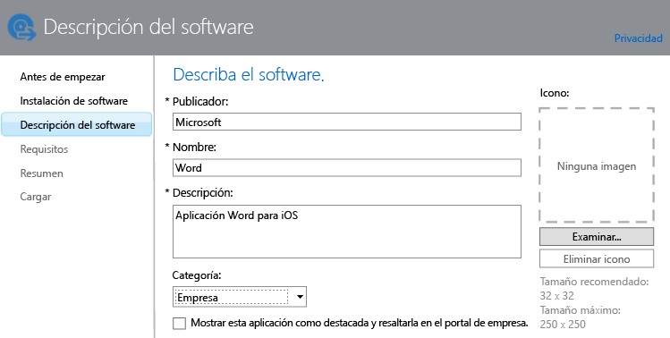

# Agregar aplicaciones a los dispositivos inscritos en Intune

Antes de que pueda implementar o administrar una aplicación, debe agregarla a Microsoft Intune. En este tema se muestra cómo agregar aplicaciones a los dispositivos inscritos.

> [!IMPORTANT]
> La información de este tema le servirá para agregar las aplicaciones que quiere implementar a dispositivos y PC Windows inscritos. Si quiere agregar aplicaciones para equipos PC Windows administrados con el software cliente de Intune, vea [Agregar aplicaciones para PC Windows en Microsoft Intune](add-apps-for-windows-pcs-in-microsoft-intune.md).

## Agregar la aplicación
En el siguiente procedimiento usará el editor de software de Intune para configurar las propiedades de la aplicación y, si procede, cargarla en el espacio de almacenamiento en nube:

1.  En la [consola de administrador de Microsoft Intune](https://manage.microsoft.com), elija **Aplicaciones** &gt; **Agregar aplicaciones** para iniciar el Editor de software de Intune.

    > [!TIP]
    > Deberá escribir su nombre de usuario y contraseña de Intune para que se inicie el editor.

2.  En la página **Instalación de software** del editor de software, elija una de las siguientes opciones en **Seleccione cómo debe ponerse a disposición de los dispositivos este software**:
    - **Instalador de software** para aplicaciones con la extensión **.msi** o **.exe**, especifique:
        - **Seleccione el tipo de archivo instalador de software:** indica el tipo de software que quiere implementar. Por ejemplo, si quiere instalar una aplicación iOS, elija **Paquete de aplicación para iOS (archivo &#42;.ipa)**.
        - **Especificar la ubicación de los archivos de instalación del software:** escriba la ubicación de los archivos de instalación o elija **Examinar** para seleccionar la ubicación en una lista.
        - **Incluir archivos y subcarpetas adicionales de la misma carpeta:** únicamente para el tipo de archivo **Windows Installer**. Cierto software que usa Windows Installer necesita los archivos auxiliares que normalmente se encuentran en la misma carpeta que los archivos de instalación. Seleccione esta opción si también desea implementar estos archivos. Este tipo de instalación usa parte del espacio de almacenamiento en la nube.

  -   **Vínculo externo**, para aplicaciones que quiere crear indicando un vínculo a una tienda de aplicaciones, especifique:

        - **Especifique la dirección URL:** especifique la dirección URL de uno de los siguientes elementos:
            - La dirección URL de la tienda de aplicaciones de la aplicación que quiere implementar. Por ejemplo, si quiere implementar la aplicación Escritorio remoto de Microsoft para Android, especifique **https://play.google.com/store/apps/details?id=com.microsoft.rdc.android**. Para buscar la dirección URL de la aplicación, use un motor de búsqueda para encontrar la página de almacenamiento que contiene la aplicación. Por ejemplo, para encontrar la aplicación Escritorio remoto, podría buscar **Escritorio remoto de Microsoft Android**.
            - Un sitio web. Intune implementará un icono de acceso directo al sitio del dispositivo (conocido como un clip de web).
            - Una aplicación en la web. Intune implementará un icono de acceso directo a la aplicación del dispositivo.
        - **Se necesita Managed Browser para abrir este vínculo (solo iOS y Android)** al implementar un vínculo a un sitio web o aplicación web para los usuarios, estos solo podrán abrirlo en Intune Managed Browser, que debe estar instalado en el dispositivo. Para obtener más detalles sobre el explorador administrado, vea [Administrar el acceso a Internet mediante directivas de explorador administrado con Microsoft Intune](manage-internet-access-using-managed-browser-policies.md). Este tipo de instalación no usa el espacio de almacenamiento en la nube.

  -   **Aplicación iOS administrada de la App Store**, para aplicaciones gratuitas de iTunes Store que quiera administrar con directivas de MAM, especifique:

        - **Especifique la dirección URL:** escriba la dirección URL de la tienda de aplicaciones de la aplicación que quiere implementar. Por ejemplo, si quiere implementar la aplicación Carpetas de trabajo de Microsoft para iOS, especifique **https://itunes.apple.com/us/app/work-folders/id950878067?mt=8**. Este tipo de instalación no usa el espacio de almacenamiento en la nube.

        Por ejemplo, si quiere implementar la aplicación Microsoft Word desde iTunes Store en los dispositivos, la página sería similar a esta:
        
        

3.  En la página **Descripción del software**, configure las siguientes opciones:

    > [!TIP]
    > En función del tipo de instalador que use, algunos de estos valores podrían especificarse automáticamente.

    - **Editor:** escriba el nombre del editor de la aplicación.
    - **Nombre:** escriba el nombre de la aplicación tal como se mostrará en el portal de empresa. Asegúrese de que todos los nombres de aplicación que usa son únicos. Si el mismo nombre de aplicación existe dos veces, solo se mostrará a los usuarios una de las aplicaciones en el portal de empresa.
    - **Descripción:** escriba una descripción de la aplicación. Se mostrará a los usuarios en el portal de empresa.
    - **Dirección URL para información del software:** solo está disponible si seleccionó **Instalador de software**. Opcionalmente, escriba la dirección URL de un sitio web que contenga información sobre esta aplicación. La dirección URL se mostrará a los usuarios en el portal de empresa.
    - **Dirección URL de privacidad:** solo está disponible si seleccionó **Instalador de software**. Opcionalmente, escriba la dirección URL de un sitio web que contenga información de privacidad sobre esta aplicación. La dirección URL se mostrará a los usuarios en el portal de empresa.
    - **Categoría** (opcional): seleccione una de las categorías de aplicaciones integradas. Así les resultará más fácil a los usuarios encontrar la aplicación cuando exploren el portal de empresa.
    - **Mostrar esta aplicación como destacada y resaltarla en el portal de empresa:** la aplicación se muestra de forma destacada en la página principal del portal de empresa cuando los usuarios buscan aplicaciones.
    - **Icono** (opcional): cargue un icono que se asociará con la aplicación. Será el icono que se muestre con la aplicación cuando los usuarios examinen el portal de empresa.

        En este ejemplo, ha configurado una descripción de la aplicación Microsoft Word para iOS:

        

4.  En la página **Requisitos**, seleccione los requisitos que deben cumplirse para que la aplicación pueda empezar a instalarse en un dispositivo. Por ejemplo, en el caso de un paquete de aplicación para iOS, puede seleccionar la versión mínima de iOS necesaria y el tipo de dispositivo que debe ser, como iPhone o iPad.

    > [!TIP]
    > La página **Requisitos** no se muestra para todos los tipos de aplicaciones.

5.  Se mostrarán más páginas del asistente si elige el tipo de archivo **Windows Installer**. Este tipo de archivo se usa al implementar software en equipos que ejecutan Windows 10 o posterior y que están inscritos con Intune.

6.  En la página **Resumen**, revise la información que especificó. Cuando esté listo, elija **Cargar**.

7.  Elija **Cerrar** para finalizar.

La aplicación se muestra en el nodo **Aplicaciones** del área de trabajo **Aplicaciones**.

## Ejemplos

### Implementar aplicaciones MSI en dispositivos de Windows 10
En este vídeo de cuatro minutos, obtendrá información sobre cómo implementar las aplicaciones de Microsoft Installer (msi) en los dispositivos inscritos que ejecutan Windows 10.  

<iframe src="https://channel9.msdn.com/Series/How-to-Control-the-Uncontrolled/6--How-to-Deploy-MSI-Applications-to-Windows-10-Using-Intune-and-Mobile-Device-Management-MDM/player" width="640" height="360" allowFullScreen frameBorder="0"></iframe>

## Pasos siguientes

Tras crear una aplicación, el siguiente paso es implementarla. Para obtener más información, vea [Deploy apps in Microsoft Intune](deploy-apps.md) (Implementar aplicaciones en Microsoft Intune).

<!--HONumber=Jul16_HO3-->

