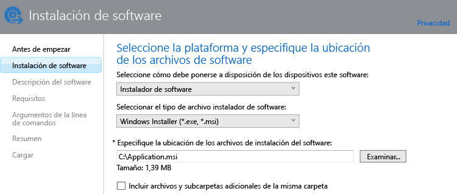

# Agregar aplicaciones para PC Windows en Microsoft Intune

Use la información de este tema para aprender a agregar aplicaciones a Intune antes de implementarlas.

> [!IMPORTANT]
> La información de este tema le servirá para agregar aplicaciones para PC Windows administrados mediante el software cliente de PC de Intune. Si quiere agregar aplicaciones para PC Windows inscritos y otros dispositivos móviles, vea [Agregar aplicaciones para dispositivos móviles en Microsoft Intune](add-apps-for-mobile-devices-in-microsoft-intune.md).

## Agregar la aplicación
En el siguiente procedimiento usará el editor de software de Intune para configurar las propiedades de la aplicación y cargarla en el espacio de almacenamiento en nube:

1.  En la [consola de administrador de Microsoft Intune](https://manage.microsoft.com), elija **Aplicaciones** &gt; **Agregar aplicaciones** para iniciar el Editor de software de Intune.

    > [!TIP]
    > Deberá escribir su nombre de usuario y contraseña de Intune para que se inicie el editor.

2.  En la página **Instalación de software** del editor de software, configure lo siguiente:

    **Seleccione cómo debe ponerse a disposición de los dispositivos este software:** elija **Instalador de software** y especifique:

    - **Seleccione el tipo de archivo instalador de software:** indica el tipo de software que quiere implementar. En el caso de un PC Windows, elija **Windows Installer**.
    - **Especificar la ubicación de los archivos de instalación del software:** escriba la ubicación de los archivos de instalación o elija **Examinar** para seleccionar la ubicación en una lista.
    - **Incluir archivos y subcarpetas adicionales de la misma carpeta:** parte del software que usa Windows Installer necesita los archivos auxiliares que normalmente se encuentran en la misma carpeta que los archivos de instalación. Seleccione esta opción si también desea implementar estos archivos auxiliares.

    Por ejemplo, si quiere publicar una aplicación llamada Application.msi en Intune, la página sería similar a la siguiente: 

   Este tipo de instalación usa parte del espacio de almacenamiento en la nube.

3.  En la página **Descripción del software**, configure las siguientes opciones:

    En función del archivo instalador que use, algunos de estos valores podrían especificarse automáticamente o no aparecer.

    - **Editor:** escriba el nombre del editor de la aplicación.
    - **Nombre:** escriba el nombre de la aplicación tal como se mostrará en el portal de empresa.  Asegúrese de que todos los nombres de aplicación que usa son únicos. Si el mismo nombre de aplicación existe dos veces, solo se mostrará a los usuarios una de las aplicaciones en el portal de empresa.
    - **Descripción:** escriba una descripción de la aplicación. Se mostrará a los usuarios en el portal de empresa.
    - **Dirección URL para información del software**: (opcional) escriba la dirección URL de un sitio web que contenga información sobre esta aplicación. La dirección URL se mostrará a los usuarios en el portal de empresa.
    - **Dirección URL de privacidad** (opcional): escriba la dirección URL de un sitio web que contenga información de privacidad sobre esta aplicación. La dirección URL se mostrará a los usuarios en el portal de empresa.
    - **Categoría** (opcional): seleccione una de las categorías de aplicaciones integradas. Así les resultará más fácil a los usuarios encontrar la aplicación cuando exploren el portal de empresa.
    - **Icono** (opcional): cargue un icono que se asociará con la aplicación. Será el icono que se muestre con la aplicación cuando los usuarios examinen el portal de empresa.

4.  En la página **Requisitos**, seleccione los requisitos que deben cumplirse para que la aplicación pueda empezar a instalarse en un dispositivo. Elija entre: **Arquitectura:** decida si esta aplicación se puede instalar en sistemas operativos de 32 bits, de 64 bits o ambos, o **Sistema operativo:**seleccione el sistema operativo mínimo en el que se puede instalar esta aplicación.

5.  En la página **Reglas de detección** se pueden configurar reglas para detectar si la aplicación que está configurando ya está instalada en un equipo, o bien puede usar las reglas de detección predeterminadas para que las versiones de la aplicación instaladas anteriormente se sobrescriban de manera automática. Esta opción es para Windows Installer (solo archivos .exe).
6.  
    Las reglas que puede configurar son las siguientes:
    - **El archivo ya existe:** especifique la ruta de acceso del archivo que quiere detectar. Puede buscar en **%ProgramFiles%** (se busca en **Archivos de programa**\*&lt;ruta de acceso&gt;* y **Archivos de programa (x86)**\*&lt;ruta de acceso&gt;*) en el equipo o en **%SystemDrive%** (se busca en la unidad raíz, que suele ser C:).
    - **Existe un código de producto MSI:** elija **Examinar** para elegir el archivo de Windows Installer (msi) que quiere detectar. 
    - **Existe la clave del registro:** especifique una clave del Registro que comience por **HKEY_LOCAL_MACHINE\**. Se busca en las rutas de acceso del Registro de 32 bits y 64 bits. Si la clave especificada existe en ambas ubicaciones, se cumple la regla de detección.

    Si la aplicación cumple alguna de las reglas que configuró, no se instalará.

7.  Únicamente para el tipo de archivo **Windows Installer** (msi y exe): en la página **Argumentos de la línea de comandos **, elija si quiere proporcionar argumentos de línea de comandos opcionales para el instalador. Por ejemplo, algunos instaladores podrían admitir el argumento **/q** para realizar una instalación silenciosa sin intervención del usuario.

8.  Únicamente para el tipo de archivo **Windows Installer** (solo exe): en la página **Códigos de retorno** puede agregar nuevos códigos de error que Intune interpretará cuando la aplicación se instale en un equipo Windows administrado.
    Intune usa códigos de retorno estándar de la industria de forma predeterminada para informar de una instalación correcta o incorrecta de un paquete de aplicación: **0:** Correcto o **3010:** Correcto con reinicio. También puede agregar sus propios códigos de retorno a esta lista. Si especifica una lista de códigos de retorno y la instalación de la aplicación devuelve un código que no se encuentra en la lista, se interpreta como un error.

9.  En la página **Resumen**, revise la información que especificó. Cuando esté listo, elija **Cargar**.

10. Elija **Cerrar** para finalizar.

La aplicación se muestra en el nodo **Aplicaciones** del área de trabajo **Aplicaciones**.

## Pasos siguientes

Tras crear una aplicación, el siguiente paso es implementarla. Para obtener más información, vea [Deploy apps in Microsoft Intune](deploy-apps.md) (Implementar aplicaciones en Microsoft Intune).

<!--HONumber=Jun16_HO4-->

