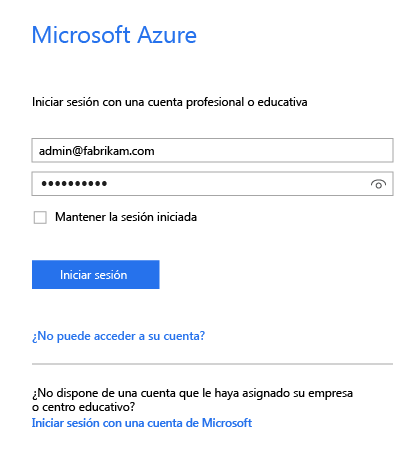
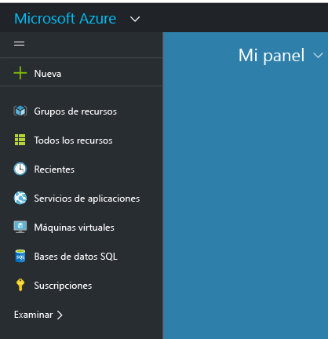
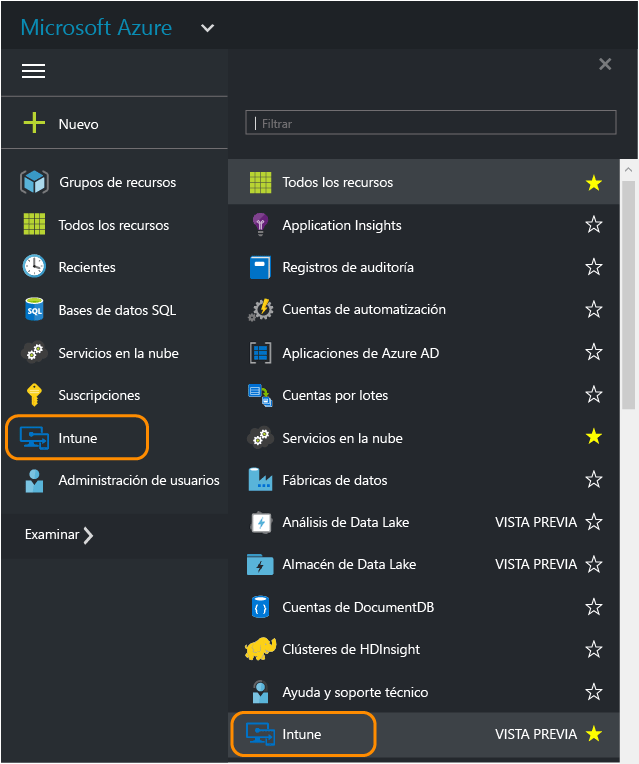
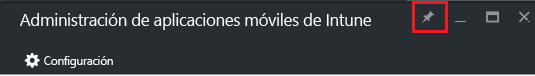
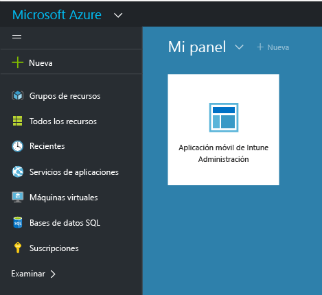

---
# required metadata

title: Portal de Azure para directivas de MAM | Microsoft Intune
description:
keywords:
author: karthikaraman
manager: jeffgilb
ms.date: 04/28/2016
ms.topic: article
ms.prod:
ms.service: microsoft-intune
ms.technology:
ms.assetid: 7d6dae94-a833-40b7-9016-14ea234bb33c

# optional metadata

#ROBOTS:
#audience:
#ms.devlang:
ms.reviewer: joglocke
ms.suite: ems
#ms.tgt_pltfrm:
#ms.custom:

---

# Portal de Azure para directivas de MAM de Microsoft Intune
## Acceso al Portal de Azure
En el **Portal de Azure** se pueden crear y administrar directivas de administración de aplicaciones móviles.

En el Portal de Azure se pueden crear directivas de MAM aplicables a los siguientes elementos:
- Aplicaciones que se ejecutan en dispositivos **inscritos y administrados con Intune**.
- Aplicaciones que se ejecutan en dispositivos **no inscritos** en ninguna solución de MDM
- Aplicaciones que se ejecutan en dispositivos **inscritos en una solución de MDM de terceros**.

Si actualmente usa la **consola de administración de Intune** para administrar sus dispositivos, puede crear una directiva de MAM que admita aplicaciones para los dispositivos inscritos en Intune mediante la [consola de administración de Intune](configure-and-deploy-mobile-application-management-policies-in-the-microsoft-intune-console.md).
>[!IMPORTANT]
> Es posible que no vea todas las configuraciones de directivas de MAM en la consola de administración de Intune. El Portal de Azure es la nueva consola de administración para crear directivas de MAM. Si crea directivas de MAM en la consola de administración de Intune y en el portal de Azure, la directiva del portal de Azure se aplica a las aplicaciones y se implementa para los usuarios.

## Iniciar sesión en el Portal de Azure y personalizar la página de inicio

1.  Vaya al [Portal de Azure](https://portal.azure.com) e inicie sesión con sus credenciales de [!INCLUDE[wit_nextref](../includes/wit_nextref_md.md)].

    

2.  Tras iniciar sesión correctamente, aparecerá el **Panel**. La página **Panel** incluye un conjunto de iconos predeterminados que puede quitar y agregar otros nuevos para personalizar la página.

    

3.  En el menú **Examinar**, busque **Intune**.

4.  Haga clic en **Intune > Administración de aplicaciones móviles de Intune > Configuración**.

    

    > [!TIP]
    > Para anclar una hoja a la página **Inicio** , puede usar la opción **anclar** de la hoja.  Haga clic en el icono del ancla de la **Hoja de administración de aplicaciones móviles de Intune**para anclarlo a la página **Inicio** .

    

    
## Pasos siguientes
[Get ready to configure mobile app management policies (Preparación para configurar directivas de administración de aplicaciones móviles)](get-ready-to-configure-mobile-app-management-policies-with-microsoft-intune.md)

<!--HONumber=Jun16_HO2-->

