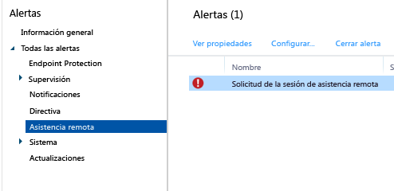

# Tareas comunes de administración de PC Windows con el cliente de equipo de Microsoft Intune
Revise las tareas de este tema para aprender a administrar los equipos que ejecutan el cliente de Intune. Si aún no tiene instalado el cliente en los equipos, vea [Install the Windows PC client with Microsoft Intune](install-the-windows-pc-client-with-microsoft-intune.md) (Instalar el cliente de PC Windows con Microsoft Intune).

## Usar directivas para simplificar la administración de equipos
### Administrar el Firewall de Windows
Las directivas simplifican la administración de la configuración del Firewall de Windows en los equipos administrados. Para más información, vea [Ayudar a proteger los equipos de Windows mediante directivas del Firewall de Windows en Microsoft Intune](help-protect-windows-pcs-using-windows-firewall-policies-in-microsoft-intune.md).

### Administrar Microsoft Intune Center
Con Microsoft Intune Center se puede hacer lo siguiente:

-   Obtener aplicaciones desde el portal de empresa.

-   Comprobar si hay actualizaciones.

-   Administrar Microsoft Intune Endpoint Protection.

<!--- -   Request remote assistance.--->

Microsoft Intune Center se instala en todos los equipos administrados. En una directiva de Intune se pueden establecer las siguientes opciones de configuración, que se mostrarán a los usuarios en Microsoft Intune Center:

|Configuración de directiva|Detalles|
|------------------|--------------------|
|**Nombre**|El nombre del administrador del equipo.  Longitud máxima: 40 caracteres|
|**Número de teléfono**|El número de teléfono del administrador del equipo.  Longitud máxima: 20 caracteres|
|**Dirección de correo electrónico**|La dirección de correo electrónico del administrador del equipo.  Longitud máxima: 40 caracteres|
|**Nombre del sitio web**|El nombre del sitio web de soporte para los usuarios.  Longitud máxima: 40 caracteres|
|**Dirección URL del sitio web**|La dirección URL del sitio web de soporte.  Longitud máxima: 150 caracteres|
|**Notas**|Una nota que se muestra a los usuarios.  Longitud máxima: 120 caracteres|

### Administrar la configuración de actualizaciones de software
Use directivas para establecer la configuración que los equipos administrados utilizan para buscar y descargar actualizaciones de software de Microsoft y de otros fabricantes. Para más información, vea [Mantener los equipos Windows al día con las actualizaciones de software en Microsoft Intune](keep-windows-pcs-up-to-date-with-software-updates-in-microsoft-intune.md).

### Administrar la configuración de Endpoint Protection
Use directivas para establecer la configuración de Endpoint Protection que luego implementará en los equipos administrados. Esto incluye, entre otras cosas, la programación de exámenes y las acciones que hay que realizar cuando se detecta malware. Para más información, vea [Ayudar a proteger los equipos de Windows con Endpoint Protection para Microsoft Intune](help-secure-windows-pcs-with-endpoint-protection-for-microsoft-intune.md).

## Ver el Inventario de hardware y software
Intune recopila información detallada sobre el hardware y el software de los equipos administrados. Use la información de los siguientes procedimientos para aprender a crear:

-   Un informe que muestra información acerca de las capacidades de hardware de los equipos.

-   Un informe que muestra la lista de software instalado en cada equipo.

-   Cómo actualizar un inventario de equipos para asegurarse de que los datos del informe estén al día.

### Para mostrar información acerca de los equipos

1.  En la [consola de administración de Microsoft Intune](https://manage.microsoft.com/), seleccione **Informes** &gt; **Informes de inventario de equipos**.

2.  En la página **Crear nuevo informe** , acepte los valores predeterminados o personalícelos para filtrar los resultados devueltos por el informe. Por ejemplo, puede seleccionar que en el informe sólo se muestren los equipos que ejecutan Windows 8.1.

3.  Elija **Ver informe** para abrir el **Informe de inventario de equipos** en otra ventana.

    Para ordenar el informe por cualquiera de las columnas, seleccione el encabezado de columna correspondiente, como **Nombre**, **Tipo de chasis** o **Fabricante**.

### Para mostrar el software instalado en sus equipos

1.  En la [consola de administración de Microsoft Intune](https://manage.microsoft.com/), seleccione **Informes** &gt; **Informes de software detectado**.

2.  En la página **Crear nuevo informe** , acepte los valores predeterminados o personalícelos para filtrar los resultados devueltos por el informe. Por ejemplo, puede seleccionar que en el informe sólo se muestre el software publicado por Microsoft.

3.  Elija **Ver informe** para abrir el **Informe de software detectado** en otra ventana.

    Para ordenar el informe por cualquiera de las columnas, seleccione el encabezado de columna correspondiente, como **Nombre**, **Editor** o **Categoría**. Puede seleccionar la flecha situada junto al elemento de lista para expandir las actualizaciones de la lista a fin de mostrar más detalles (como los equipos en los que están instaladas).

### Para actualizar el inventario de equipos a fin de asegurarse de que está al día

1.  En la [consola de administración de Microsoft Intune](https://manage.microsoft.com/), seleccione **Grupos** &gt; **Todos los dispositivos ** (u otro grupo que contenga el equipo para el que quiera actualizar el inventario).

2.  Seleccione un equipo o mantenga presionada la tecla **Ctrl** para seleccionar varios equipos.

3.  En la barra de tareas, seleccione **Tareas remotas** &gt; **Actualizar inventario**.

4.  Para ver el estado de la tarea, seleccione **Tareas remotas** en la esquina inferior derecha de la página.

    Se abre el cuadro de diálogo **Estado de la tarea** , que muestra las tareas remotas actuales, el estado de la tarea, el nombre del dispositivo y los errores notificados, y proporciona un vínculo a información de solución de problemas, si es necesario.

## Reiniciar un PC Windows de forma remota

1.  En la [consola de administración de Microsoft Intune](https://manage.microsoft.com/), seleccione **Grupos** &gt; **Todos los dispositivos** (u otro grupo que contenga el equipo que quiera reiniciar).

2.  Seleccione uno o más equipos y, después, seleccione **Tareas remotas** &gt; **Reiniciar el equipo**.

3.  Para ver el estado de la tarea, seleccione **Tareas remotas** en la esquina inferior derecha de la página.

4.  En el cuadro de diálogo **Estado de la tarea** , revise las tareas remotas actuales, el estado de la tarea, el nombre del dispositivo y los errores notificados.

## Retirar un equipo

1.  En la [consola de administración de Microsoft Intune](https://manage.microsoft.com/), seleccione **Grupos** &gt; **Todos los dispositivos** (u otro grupo que contenga el equipo que quiera retirar).

2.  Seleccione los dispositivos que quiera retirar y, después, elija **Retirar/Eliminar datos**.

Para volver a inscribir un equipo en Intune, reinstale el software cliente en el equipo según se indica en el tema [Install the Windows PC client with Microsoft Intune](install-the-windows-pc-client-with-microsoft-intune.md) (Instalar el cliente de PC Windows con Microsoft Intune).

Si un equipo no se puede conectar a Intune, verá un mensaje en el área de trabajo **Panel**.

Cuando retira un equipo:

-   Se quita del inventario de Intune y la licencia asociada al equipo queda disponible para poder reutilizarla.

-   Su estado deja de aparecer en la consola de Intune.

-   Intune quita el software cliente del equipo. Si el equipo no está conectado al servicio de Intune, se quitará el software cliente la próxima vez que se conecte.

-   Microsoft Intune Endpoint Protection se quita del equipo. Si el equipo tiene instalada otra aplicación de extremos que está deshabilitada, esa aplicación se puede volver a habilitar después de quitar Microsoft Intune Endpoint Protection y, así, garantizar la protección del equipo.

-   Se quitan las directivas del equipo y se cambian los valores establecidos por las directivas.

-   El equipo deja de recibir actualizaciones de software o de definiciones de malware procedentes del servicio de Intune.

-   Según como estén configurados, los equipos retirados pueden seguir recibiendo actualizaciones mediante Windows Server Update Services, Windows Update o Microsoft Update.

    > [!IMPORTANT]
    > Si el software cliente se instaló con un objeto de directiva de grupo (GPO), debe quitar dicho objeto para poder quitar el software cliente, a fin de evitar que el software se reinstale.

    Si el cliente no se puede desinstalar, lea [Solucionar problemas de Endpoint Protection en Microsoft Intune](/intune/troubleshoot/troubleshoot-endpoint-protection-in-microsoft-intune) para obtener más ayuda.

## Administrar la vinculación de dispositivos de usuario
Antes de implementar software en un usuario, debe vincular el usuario a un equipo. Puede vincular un usuario a varios equipos, pero cada equipo puede vincularse sólo a un usuario. Los usuarios se vinculan automáticamente a los equipos que tengan inscritos en Intune a través del portal de la empresa.

### Para vincular un usuario a un equipo

1.  En la [consola de administración de Microsoft Intune](https://manage.microsoft.com/), seleccione **Grupos** &gt; **Todos los dispositivos** (u otro grupo que contenga el equipo que quiera vincular a un usuario).

2.  Seleccione el equipo que quiera vincular a un usuario y, después, elija **Vincular usuario**.

    El cuadro de diálogo **Vincular usuario** muestra una lista de usuarios disponibles con su nombre para mostrar, Id. de usuario, y el número de equipos a los que cada usuario que está vinculado. Si un usuario ya está vinculado al equipo seleccionado, el nombre del usuario y su Id. se muestran en **Usuario actual**. Si el equipo no está vinculado a ningún usuario, aparece **Ningún usuario** bajo el **Usuario actual**.

3.  Realice una de las siguientes acciones:

    -   Para dejar el equipo vinculado a su usuario actual (si lo hay), seleccione **Cancelar**.

    -   Para quitar el vínculo al usuario actual (si lo hay), seleccione **Quitar vínculo** &gt; **Aceptar**.

    -   Para vincular el equipo a un usuario nuevo, en la lista **Todos los usuarios** , seleccione un usuario. Confirme que los datos de usuario son correctos y, luego, seleccione **Aceptar**.

> [!TIP]
> Si desea restringir la capacidad de los usuarios finales para vincularse a equipos, habilite la opción **Restringir la capacidad de los usuarios de vincularse a equipos** en la directiva de **Configuración de agente de Microsoft Intune**.

<!--- ## Request and provide remote assistance to Windows PCs that use the Intune client software

> [!IMPORTANT]
> You might not see the options to configure TeamViewer integration for remote assistance in the Intune admin console. This capability is not currently available to all customers, but will be rolling our more widely soon.
     

Microsoft Intune can use the [TeamViewer](https://www.teamviewer.com) software to let users of PCs that run the Intune client software get remote assistance help from you. When a user requests help from the Microsoft Intune Center, you are informed by an alert, can accept the request, and then provide assistance.
This functionality replaces the existing Windows Remote Assistance functionality in Intune.

### Before you start

Before you can begin to establish and respond to remote assistance requests, you must ensure the following prerequisites are in place:

- You must have [signed up for a TeamViewer account](https://login.teamviewer.com/LogOn#register) to log into the TeamViewer website.
- Windows PCs that you want to administer must be [managed by the Windows PC client](manage-windows-pcs-with-microsoft-intune.md)
- All Windows PC operating systems supported by Intune can be administered.

### Configure the TeamViewer Connector

1. In the [Microsoft Intune administration console](https://manage.microsoft.com), choose **Admin**.
2. In the **Admin** workspace, choose **TeamViewer**.
3. On the **TeamViewer** page, under **TeamViewer Connector**, choose **Enable**.
4. In the **Enable TeamViewer** dialog box, view, then **Accept** the license terms. If you don't already own a TeamViewer license, choose **Purchase a TeamViewer license**.
5. After the TeamViewer browser window opens, sign into the site with your TeamViewer credentials.
6. On the TeamViewer site, read, then accept the options to allow Intune to connect with TeamViewer.
7. In the Intune console, verify that the **TeamViewer Connector** item shows as **Enabled**.

### Open a remote assistance request (end user)

1. On a client Windows PC, open the **Microsoft Intune Center**.
2. Under **Remote Assistance**, choose **Request Remote Assistance**.
3. After you approve the request (see below), TeamViewer opens on the client. The user must accept any messages indicating that the web browser is trying to open the TeamViewer application.
4. The user sees a message asking if you can control their PC. They must accept this message to continue.
5. During the remote assistance session, the user sees a window that shows them you are connected. If they close this window, the remote session ends.

### Respond to a remote assistance request

1. When a user submits a remote assistance request, you can view it in the **Alerts** workspace, under **Monitoring** > **Remote Assistance**. For example:
> 

 If a request goes unanswered for more than 4 hours, it is removed.
2. To accept the request, choose **Approve request and launch Remote Assistance**.
3. In the **A New Remote Assistance Request is Pending** dialog box, choose **Accept the remote assistance request**. If it's not already installed, TeamViewer will install any necessary apps on your computer.
4. TeamViewer then notifies the end user that you want to take control of their PC. After the user has accepted the request, the TeamViewer windows opens, and you can control the PC. 
 
While in a remote assistance session, you can use all available TeamViewer commands to control the remote PC. For help with these commands, download the [Manual for remote control](http://www.teamviewer.com/en/support/documents/) from the TeamViewer website.

### Close the remote assistance session

From the **Actions** menu of the **TeamViewer** window, choose **End Session**.--->

<!--HONumber=Jun16_HO4-->

