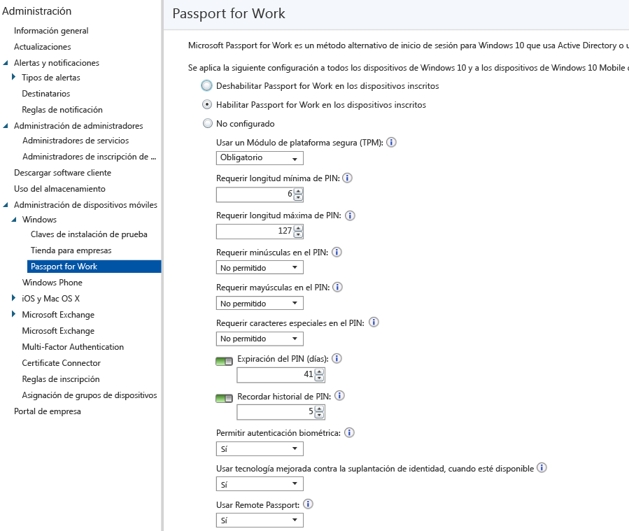

# Controlar la configuración de Windows Hello para empresas en dispositivos con Microsoft Intune
Microsoft Intune se integra con Windows Hello para empresas (anteriormente Microsoft Passport for Work), que es un método alternativo de inicio de sesión que usa Active Directory o una cuenta de Azure Active Directory para reemplazar una contraseña, una tarjeta inteligente o una tarjeta inteligente virtual.

Hello para empresas permite usar un *gesto de usuario* para iniciar sesión, en lugar de una contraseña. Un gesto de usuario podría ser una autenticación biométrica de PIN simple, como Windows Hello, o un dispositivo externo como un lector de huellas digitales.

Intune se integra con Hello para empresas de dos maneras:

-   Puede usar una directiva de Intune para controlar qué gestos pueden usar los usuarios para iniciar sesión.

-   Puede almacenar certificados de autenticación en el proveedor de almacenamiento de claves de Windows Hello para empresas. Para obtener más información, consulte [Proteger el acceso a recursos con perfiles de certificado en Microsoft Intune](secure-resource-access-with-certificate-profiles.md).

## Crear una directiva de Windows Hello para empresas

1.  En la [consola de administración de Microsoft Intune](https://manage.microsoft.com), elija **Administración** &gt; **Administración de dispositivos móviles** &gt; **Windows** &gt; **Windows Hello para empresas** para abrir la página de Windows Hello para empresas.

    

2.  Elija una de las siguientes opciones:
    - **Deshabilitar Windows Hello para empresas en los dispositivos inscritos**. Si no quiere usar Windows Hello para empresas, seleccione esta opción. A partir de ese momento, las demás opciones de la pantalla no estarán disponibles.
    - **Habilitar Windows Hello para empresas en los dispositivos inscritos**. Seleccione esta opción si quiere configurar Windows Hello para empresas.
    - **No configurado**. Seleccione esta opción si no quiere usar Intune para controlar la configuración de Windows Hello para empresas. Las opciones de configuración de Windows Hello para empresas existentes en dispositivos Windows 10 no se cambiarán. Las demás opciones de la pantalla no están disponibles.
3.  Si seleccionó **Habilitar Windows Hello para empresas en los dispositivos inscritos**, configure las opciones necesarias que se aplicarán a todos los dispositivos Windows 10 y Windows 10 Mobile inscritos.
4.  Cuando termine, elija **Guardar**.

## Configuración de la directiva de Windows Hello para empresas

- **Usar un Módulo de plataforma segura (TPM)**. Un chip de TPM ofrece una capa adicional de seguridad de datos. Elija uno de los siguientes valores:
    - **Requerido** (valor predeterminado). Solo los dispositivos con un TPM accesible pueden aprovisionar Windows Hello para empresas.
    - **Preferido**. Los dispositivos intentan primero usar un TPM. Si no está disponible, pueden usar el cifrado de software.
- **Requerir longitud mínima de PIN**/**Requerir longitud máxima de PIN**. Configura los dispositivos para que usen la longitud de PIN mínima y máxima que especifique para ayudar a garantizar un inicio de sesión seguro. La longitud de PIN predeterminada es de 6 caracteres, pero puede aplicar una longitud mínima de 4 caracteres. La longitud de PIN máxima es de 127 caracteres.
- **Requerir minúsculas en el PIN**/**Requerir mayúsculas en el PIN**/**Require special characters in PIN** (Requerir caracteres especiales en el PIN). Puede aplicar un PIN más seguro si requiere el uso de letras mayúsculas, letras minúsculas y caracteres especiales en el PIN. Elija de entre las siguientes opciones:
    - **Permitido**. Los usuarios pueden usar el tipo de carácter en el PIN, pero no es obligatorio.
    - **Obligatorio**. Los usuarios deben incluir al menos uno de los tipos de carácter en el PIN. Por ejemplo, es habitual requerir al menos una letra mayúscula y un carácter especial.
    - **No permitido** (valor predeterminado). Los usuarios no deben usar estos tipos de caracteres en el PIN. (Este también es el comportamiento si no se configura la opción). Entre los caracteres especiales se incluyen: **! " # $ % &amp; ' ( ) &#42; + , - . / : ; &lt; = &gt; ? @ [ \ ] ^ _ &#96; { &#124; } ~**.
- **Expiración del PIN (días)**. Es recomendable especificar un período de expiración para el PIN, después del cual los usuarios deben cambiarlo. El valor predeterminado es 41 días.
- **Recordar historial de PIN**. Restringe la reutilización de los PIN usados anteriormente. De forma predeterminada, no se pueden volver a usar los 5 últimos PIN.
- **Permitir autenticación biométrica**. Habilita la autenticación biométrica, como el reconocimiento facial o la huella digital, como alternativa a un PIN para Windows Hello para empresas. Los usuarios todavía deben configurar un PIN de trabajo por si produce un error en la autenticación biométrica. Elija de entre las siguientes opciones:
    - **Sí**. Windows Hello para empresas permite la autenticación biométrica.
    - **No**. Windows Hello para empresas impide la autenticación biométrica (para todos los tipos de cuenta).
- **Usar tecnología mejorada contra la suplantación de identidad, cuando esté disponible**. Define si se usan las características contra la suplantación de identidad de Windows Hello en los dispositivos que la admiten (por ejemplo, detectando una fotografía de una cara en lugar de una cara real). Si se configura como **Sí**, Windows requiere que todos los usuarios usen la protección contra la suplantación de identidad para las características faciales cuando se admita.
- **Usar inicio de sesión por teléfono**. Si esta opción se configura como **Sí**, los usuarios pueden usar una cuenta de Passport remota para que actúe como dispositivo complementario portátil para la autenticación del equipo de escritorio. El equipo de escritorio debe estar unido a Azure Active Directory y el dispositivo complementario debe configurarse con un PIN de Windows Hello para empresas.

## Más información
Para obtener más información sobre Microsoft Passport, consulte [la guía](https://technet.microsoft.com/library/mt589441.aspx) en la documentación de Windows 10.

<!--HONumber=Sep16_HO1-->

