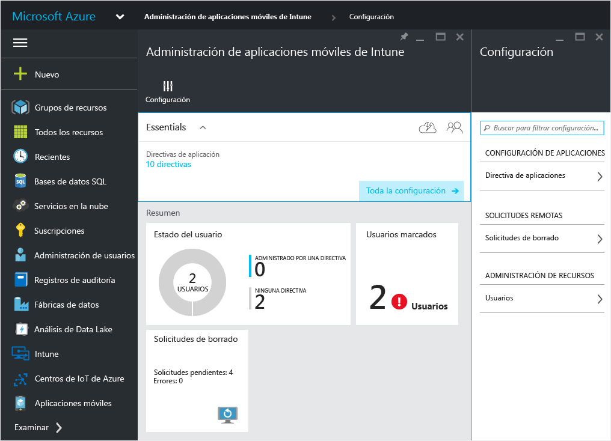

# Crear e implementar directivas de administración de aplicaciones móviles con Microsoft Intune
Las directivas de administración de aplicaciones móviles (MAM) se pueden usar en aplicaciones que se ejecutan en dispositivos administrados o no por Intune. Para ver una descripción más detallada de cómo funcionan las directivas de MAM y los posibles escenarios con directivas de MAM de Intune, lea el tema [Proteger datos de aplicación mediante directivas de administración de aplicaciones móviles con Microsoft Intune](protect-app-data-using-mobile-app-management-policies-with-microsoft-intune.md).

En este tema se describe el proceso de creación de una directiva de MAM en el **Portal de Azure**. El portal de Azure es la nueva consola de administración para crear directivas de MAM y le recomendamos que use este portal para crear directivas de MAM. El portal de Azure admite los siguientes escenarios de MAM:
- Dispositivos inscritos en Intune
- Dispositivos administrados por una solución de MDM de terceros
- Dispositivos que no están administrados por ninguna solución de MDM (BYOD).

>[!IMPORTANT]

> Si actualmente usa la **consola de administración de Intune** para administrar sus dispositivos, puede crear una directiva de MAM que admita aplicaciones para los dispositivos inscritos en Intune mediante la [consola de administración de Intune](configure-and-deploy-mobile-application-management-policies-in-the-microsoft-intune-console.md).
Las directivas de MAM que se han creado en la consola de administración de Intune no pueden importarse en el Portal de Azure.  Las directivas de MAM deben volver a crearse en el Portal de Azure.

> Es posible que no vea todas las configuraciones de directivas de MAM en la consola de administración de Intune. El Portal de Azure es la nueva consola de administración para crear directivas de MAM. Si crea directivas de MAM en la consola de administración de Intune y en el portal de Azure, la directiva del portal de Azure se aplica a las aplicaciones y se implementa para los usuarios.

Para ver una lista de las configuraciones de directiva compatibles en plataformas iOS y Android, seleccione uno de los siguientes:

> [!div class="op_single_selector"]
- [Directivas de iOS](ios-mam-policy-settings.md)
- [Directivas de Android](android-mam-policy-settings.md)

##  Crear una directiva MAM
Antes de crear una directiva de MAM, repase la información sobre [requisitos previos y compatibilidad](get-ready-to-configure-mobile-app-management-policies-with-microsoft-intune.md).
1.  Seleccione **Administración de aplicaciones móviles de Intune &gt; Configuración** para abrir la hoja **Configuración**.

    

    > [!TIP]
    > Si esta es la primera vez que usa el Portal de Azure, lea antes [Azure portal for Microsoft Intune MAM policies](azure-portal-for-microsoft-intune-mam-policies.md) (Portal de Azure para directivas de MAM de Microsoft Intune) para familiarizarse con el Portal.

2.  En la hoja **Configuración**, seleccione **Directiva de aplicaciones**.  De este modo se abrirá la hoja **Directiva de aplicación**, donde podrá crear nuevas directivas y editar las existentes. Elija **Agregar una directiva**.

    

3.  Escriba un nombre para la directiva, agregue una descripción breve y seleccione el tipo de plataforma para crear una directiva para iOS o Android.  Puede crear más de una directiva para cada plataforma.

    

4.  Seleccione **Aplicaciones** para abrir la hoja **Aplicaciones**, donde se muestra una lista de las aplicaciones disponibles. Puede seleccionar una o más aplicaciones de la lista que desea asociar a la directiva que está creando. Una vez seleccionadas las aplicaciones, elija el botón **Seleccionar** situado en la parte inferior de la hoja **Aplicaciones** para guardar la selección.

    > [!IMPORTANT]
    > Debe seleccionar al menos una aplicación para crear una directiva.

5.  En la hoja **Agregar directiva**, elija **Configurar los valores obligatorios** para abrir la hoja de configuración de directivas.

    Existen dos categorías de configuración de directivas: **Reubicación de datos** y **Acceso**.  Las directivas de reubicación de datos son aplicables a la introducción y la extracción de datos de las aplicaciones, mientras que las directivas de acceso determinan el modo en el que el usuario final tiene acceso a las aplicaciones en un contexto de trabajo.
    Para comenzar, la configuración de directiva tiene valores predeterminados.  No es necesario realizar ningún cambio si los valores predeterminados satisfacen sus necesidades.

    > [!TIP]
    > Esta configuración de directiva se aplica solo al usar aplicaciones en el contexto de trabajo.  Cuando el usuario final usa la aplicación para realizar una tarea personal, no se verá afectado por estas directivas.

    

6.  Seleccione **Aceptar** para guardar esta configuración.  Ahora habrá regresado a la hoja **Agregar una directiva** . Seleccione **Crear** para crear la directiva y guardar la configuración.

    

Cuando termine de crear una directiva como se describe en el procedimiento anterior, no se implementará en ningún usuario.  Siga los pasos descritos a continuación para implementar la directiva.

> [!IMPORTANT]
> Si crea una directiva de MAM para una aplicación con la consola de administración de Intune y una directiva de MAM con el Portal de Azure, la directiva creada con el Portal de Azure tiene prioridad. Sin embargo, los informes de la consola de Intune o del Administrador de configuración informarán de la configuración de directiva creada en el Portal de Azure. Por ejemplo:
>
> -   Ha creado una directiva de administración de aplicaciones móviles en la consola de administración de Intune que bloquea la copia desde una aplicación.
> -   Ha creado una directiva de administración de aplicaciones móviles en la consola de Azure que permite la copia desde una aplicación.
> -   Luego asocia ambas directivas a la misma aplicación.
> -   El resultado es que la directiva creada desde la consola de Azure tiene prioridad y se permite la copia.
> -   Sin embargo, el estado y los informes de la consola de Intune indicarán incorrectamente que la copia está bloqueada.

## Implementar una directiva para los usuarios

1.  En la hoja **Directiva**, seleccione **Grupos de usuarios**, que abre la hoja **Grupos de usuarios**. Seleccione **Agregar grupo de usuarios** en la hoja **Grupos de usuarios** para abrir la hoja **Agregar grupo de usuarios**.

    

2.  Se mostrará una lista de grupos de usuarios en la hoja **Agregar grupo de usuarios** . Esta es una lista de todos los grupos de seguridad de su **Azure Active Directory**.  Puede seleccionar los grupos de usuarios a los que quiera aplicar esta directiva y elegir **Seleccionar**. Al ** **hacerlo, la directiva se implementa en los usuarios.

    

    Ahora ha creado una directiva y la ha implementado en los usuarios.

Solo se verán afectados por la directiva los usuarios que tengan asignadas licencias [!INCLUDE[wit_nextref](../includes/wit_nextref_md.md)].  Los usuarios pertenecientes al grupo de seguridad seleccionado que no tengan asignada una licencia [!INCLUDE[wit_nextref](../includes/wit_nextref_md.md)] no se verán afectados.

>[!IMPORTANT]
> Si usa Intune con Administrador de configuración para administrar los dispositivos iOS y Android, la directiva solo se aplica a los usuarios directamente en el grupo seleccionado.  No se verán afectados los miembros de los grupos secundarios anidados en el grupo seleccionado.

Los usuarios finales pueden descargar las aplicaciones del App Store o de Google Play. Para ver un tutorial detallado de cómo MAM protege los datos empresariales en el dispositivo, consulte el tema [Experiencia del usuario final en aplicaciones habilitadas para MAM](end-user-experience-for-mam-enabled-apps-with-microsoft-intune.md).

##  Cambiar las directivas existentes
Puede editar una directiva existente y aplicarla a los usuarios objetivo. Con todo, al cambiar las directivas existentes, los usuarios que ya han iniciado sesión en las aplicaciones no verán los cambios durante un período de 8 horas.

Para ver el efecto de los cambios inmediatamente, el usuario final tendrá que salir de la aplicación y volver a iniciar sesión.

### Para cambiar la lista de aplicaciones asociadas con la directiva

1.  En la hoja **Directiva de aplicaciones**, elija la directiva que quiera cambiar. De este modo se abrirá una hoja específica de la directiva que acaba de seleccionar.

    

2.  En la hoja de la directiva, seleccione **Aplicaciones de destino** para abrir la lista de aplicaciones.

3.  Quite o agregue aplicaciones de la lista y seleccione el icono **Guardar** para guardar los cambios.

### Para cambiar la lista de grupos de usuarios

1.  En la hoja **Directiva de aplicaciones**, elija la directiva que quiera cambiar. De este modo se abrirá la hoja específica de la directiva que ha seleccionado.

2.  En la hoja de la directiva, seleccione **Grupos de usuarios** para abrir la hoja **Grupo de usuarios** en la que se muestra la lista de grupos de usuarios actuales regidos por esta directiva.

3.  Para **agregar un nuevo grupo de usuarios** a la directiva, seleccione **Agregar grupo de usuarios** y seleccione el grupo de usuarios en cuestión. Elija **Seleccionar** para implementar la directiva en el grupo seleccionado.

    

4.  Para **eliminar un grupo de usuarios**, resalte el grupo de usuarios que quiera quitar, seleccione el botón de puntos suspensivos (...) y, después, elija **Eliminar** para eliminarlo.

    

### Para cambiar la configuración de directiva

1.  En la hoja **Directiva de aplicaciones**, elija la directiva que quiera cambiar. De este modo se abrirá una hoja específica de la directiva que acaba de seleccionar.

    

2.  Seleccione **Configuración de directiva** para abrir la hoja **Configuración de directiva**.

3.  Cambie la configuración y seleccione el icono **Guardar** para guardar los cambios.

    

## Configuraciones de directiva
Para ver una lista completa de las configuraciones de directiva para iOS y Android, seleccione uno de los siguientes:

> [!div class="op_single_selector"]
- [Directivas de iOS](ios-mam-policy-settings.md)
- [Directivas de Android](android-mam-policy-settings.md)

## Pasos siguientes
[Supervisar el estado del cumplimiento y del usuario](monitor-mobile-app-management-policies-with-microsoft-intune.md)

### Consulte también
[Experiencia del usuario final en aplicaciones habilitadas para MAM](end-user-experience-for-mam-enabled-apps-with-microsoft-intune.md)

<!--HONumber=Jul16_HO5-->

