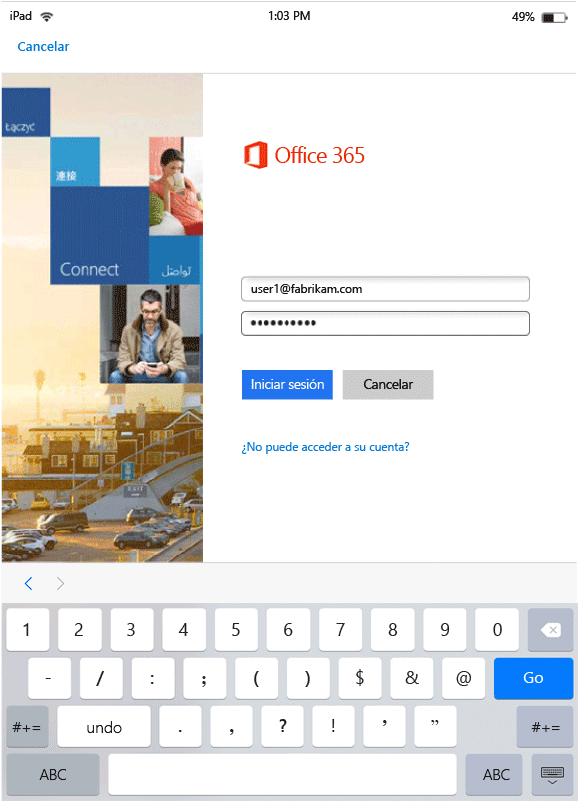
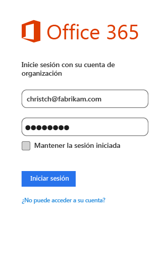

---
# required metadata

title: Experiencia del usuario final en aplicaciones habilitadas para MAM | Microsoft Intune
description:
keywords:
author: karthikaraman
manager: jeffgilb
ms.date: 04/28/2016
ms.topic: article
ms.prod:
ms.service: microsoft-intune
ms.technology:
ms.assetid: b57e6525-b57c-4cb4-a84c-9f70ba1e8e19

# optional metadata

#ROBOTS:
#audience:
#ms.devlang:
ms.reviewer: andcerat
ms.suite: ems
#ms.tgt_pltfrm:
#ms.custom:

---

# Experiencia del usuario final en aplicaciones habilitadas para MAM con Microsoft Intune
Las directivas de administración de aplicaciones móviles (MAM) solo se aplican cuando se usan aplicaciones en el contexto de trabajo.  Eche un vistazo a los siguientes escenarios para saber cómo funcionan las aplicaciones administradas.
##  Acceso a OneDrive en un dispositivo iOS

1.  Inicie la aplicación  **OneDrive** para abrir la página de inicio de sesión.

    

    > [!NOTE]
    > En un dispositivo personal, normalmente el usuario final descargaría la aplicación.  Si el dispositivo está administrado por una solución MDM, puede implementar la aplicación en el dispositivo.

2.  Escriba su nombre de usuario de la cuenta profesional. Se le redirigirá a la página de **Autenticación de O365** para especificar las credenciales de trabajo.

    

3.  Una vez que Azure AD haya autenticado correctamente sus credenciales, se aplicarán las directivas MAM y se le solicitará reiniciar la aplicación **OneDrive** .

    

4.  Cuando vuelva a iniciar la aplicación **OneDrive**, lo hará con las directivas de MAM activadas. Ahora se le solicitará establecer un **PIN** para la aplicación. (si se configuró la directiva para esto).

    

5.  En cuanto establezca el PIN y confirme que es capaz de obtener acceso a los archivos de su **OneDrive para la Empresa**.

    

    > [!NOTE] Al cambiar una directiva implementada, los cambios se aplicarán la próxima vez que abra la aplicación.

##  Acceso a OneDrive en un dispositivo Android

1.  Inicie la aplicación OneDrive para abrir la página de inicio de sesión.

    > [!NOTE]
    > En un dispositivo personal, normalmente el usuario final descargaría la aplicación.  Si el dispositivo está administrado por una solución MDM, puede implementar la aplicación en el dispositivo.

2.  Escriba su nombre de usuario de la cuenta profesional. Se le redirigirá a la página de **Autenticación de O365** para especificar las credenciales de trabajo.

    

3.  Una vez que **Azure AD**autentique correctamente sus credenciales, deberá verse un mensaje con instrucciones para instalar la aplicación del portal de empresa, si no se encuentra ya instalada en el dispositivo.  Puntee en **Obtener la aplicación** para continuar.

>[!NOTE]
>La aplicación de portal de empresa es necesaria en todas las aplicaciones asociadas a directivas de MAM en los dispositivos Android. En el caso de los dispositivos no inscritos en Intune, la aplicación debe estar instalada en el dispositivo, pero no es necesario abrirla ni iniciar sesión en ella.  

  

4.  Ahora accederá a la tienda **Google Play** , donde podrá descargar e instalar la aplicación **Portal de empresa** .

    La aplicación de Portal de empresa ayuda a proteger los datos.

    

5.  Una vez haya completado la instalación, haga clic en **Aceptar** para aceptar los términos.

6.  A continuación, la aplicación **OneDrive** se iniciará automáticamente.

7.  La próxima vez que abra OneDrive, se visualizará el aviso para establecer un **PIN**, siempre que la configuración de las directivas esté establecida para solicitar un PIN para acceder a la aplicación **OneDrive** .

    

8.  Una vez que se establezca y se confirme el PIN, podrá continuar usando **OneDrive**, que ahora estará administrado por directivas de aplicaciones.

##  Uso de aplicaciones con compatibilidad con varias identidades
En este escenario se usa Microsoft Word como ejemplo.

1.  Abra la aplicación **Word** en su dispositivo. Estamos usando un dispositivo iOS para mostrar los pasos.

2.  Puntee **Nuevo** para crear un nuevo documento de Word.

    

3.  Escriba la frase que quiera.  Cuando intente guardar este documento, se mostrarán las ubicaciones tanto personal como profesional como opciones para guardar el documento que acaba de crear.  En este paso, las directivas de aplicación todavía no se han aplicado, ya que todavía no se ha establecido este contexto de trabajo o personal.

4.  Guarde el documento en su OneDrive para la ubicación de la empresa. Esto ahora se etiqueta como datos de la empresa, y se aplicarán las restricciones de las directivas.

    

5.  Abra el documento que se guardó en su ubicación de trabajo.  Copie el texto, abra su cuenta personal de**Facebook** y pruebe a pegar el texto copiado.  Verá que no puede pegar el contenido en la nueva publicación de Facebook. La opción Pegar no está atenuada, pero no ocurre nada al presionar **Pegar**.

    

    

6.  Ahora, repita los pasos 2 y 3 para crear otro documento, escriba la frase que quiera y, en lugar de guardarlo en su ubicación de trabajo, guárdelo en su ubicación personal, como **OneDrive: Personal**.

    

7.  Abra el documento guardado personal.  Copie el texto, abra la aplicación de **Facebook** e intente pegar el texto copiado. Verá que se puede pegar el contenido en una publicación de Facebook.

    

##  Administración de cuentas de usuario

En Intune solo se pueden implementar directivas de MAM en una única cuenta de usuario por dispositivo. Si un dispositivo tiene más de una cuenta profesional, las directivas de MAM solamente administrarán una de ellas.

Dependiendo de la aplicación que use, el segundo usuario puede o no estar bloqueado en el dispositivo. Pero, en todos los casos, solo el primer usuario que obtiene las directivas de MAM se verá afectado por la directiva.

Si un dispositivo tiene varias cuentas de usuario existentes antes de implementar las directivas de MAM, estas directivas de MAM de Intune solo administrarán la primera cuenta en las que se implementen.

**Microsoft Word**, **Excel** y **PowerPoint** no bloquean una segunda cuenta de usuario, pero esa segunda cuenta no se verá afectada por las directivas de MAM.  

En **aplicaciones de OneDrive y Outlook**, solo se puede usar una cuenta profesional.  La adición de varias cuentas profesionales está bloqueada en estas aplicaciones.  Sin embargo, puede quitar un usuario y agregar un usuario diferente en el dispositivo.

Consulte el siguiente escenario de ejemplo para ahondar aún más en cómo se tratan varias cuentas de usuario.

El usuario A trabaja para dos empresas: la **empresa X** y la **empresa Y**. El usuario A tiene una cuenta profesional en cada empresa y en ambas se usa Intune para implementar directivas de MAM. La **empresa X** implementa directivas de MAM **antes** que la **empresa Y**. La cuenta asociada a la **empresa X** obtendrá la directiva de MAM, pero no la cuenta asociada a la empresa Y. Si quiere que la cuenta de usuario asociada a la empresa Y se administre por medio de las directivas de MAM, deberá quitar la cuenta de usuario asociada a la empresa X.
### Agregar una segunda cuenta
#### iOS
Si usa un dispositivo iOS, puede que aparezca un mensaje de bloqueo si intenta agregar una segunda cuenta profesional en el mismo dispositivo.  También verá una opción para quitar la cuenta existente y agregar una nueva. Puede hacerlo haciendo clic en **Sí**.

####  Android
Si usa un dispositivo Android, puede que aparezca un mensaje de bloqueo con instrucciones para quitar la cuenta existente y agregar una nueva.  Para quitar la cuenta existente de un dispositivo Android, vaya a **Configuración &gt;General &gt; Administrador de aplicaciones &gt;Portal de empresa y seleccione "Borrar datos"**.

##  Ver archivos multimedia con la aplicación Rights Management sharing
Para ver archivos de imagen, AV y PDF de la empresa en dispositivos Android, use la [aplicación Microsoft Rights Management sharing (RMS)](https://play.google.com/store/apps/details?id=com.microsoft.ipviewer).

Descargue esta aplicación de Google Play Store.  Cuando la aplicación esté instalada en el dispositivo, iníciela y autentíquese con sus credenciales de la compañía. Ahora debería ver los archivos protegidos y desprotegidos desde otras aplicaciones administradas mediante directiva.

**Dispositivos Android que no están inscritos en Intune**

Para poder usar la aplicación RMS sharing para ver archivos de otras aplicaciones que se administran mediante Intune, inicie la aplicación RMS y autentíquese con su cuenta profesional.  Cuando inicie sesión, verá el siguiente mensaje **solo si no tiene una licencia de RMS**:

**Autenticación correcta: ahora puede ver archivos corporativos, pero su organización no está configurada para permitirle proteger archivos. Para obtener más información, póngase en contacto con su administrador de TI.**

Esto no impide que use la aplicación RMS sharing para ver los archivos de la empresa. Aún puede abrir y ver los archivos de la empresa desde otras aplicaciones administradas por Intune y las directivas de MAM se seguirán aplicando.  En este mensaje se explica que no podrá agregar las capacidades de protección adicional que proporciona la aplicación RMS sharing.  Debe tener una licencia de RMS para agregar protección a los archivos. Para obtener más información sobre las capacidades de protección de archivos de RMS, vea [Protección de un archivo en un dispositivo](https://docs.microsoft.com/en-us/rights-management/rms-client/sharing-app-protect-in-place) y [Proteger un archivo que se comparte por correo electrónico](https://docs.microsoft.com/en-us/rights-management/rms-client/sharing-app-protect-by-email).

### Consulte también
[Crear e implementar directivas de administración de aplicaciones móviles con Microsoft Intune](create-and-deploy-mobile-app-management-policies-with-microsoft-intune.md)

<!--HONumber=Jun16_HO2-->

