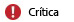

# Recibir notificaciones mediante alertas de Microsoft Intune
Las alertas le mantienen en contacto con lo que sucede en Microsoft Intune.

Por ejemplo, las alertas le pueden notificar sobre los siguientes eventos:

-   Un problema con Exchange Connector que afecta a la administración de dispositivos móviles

-   Se encontró malware en un equipo

-   Se detectó un conflicto entre dos directivas de Intune.

## Funcionamiento de las alertas
Las alertas se generan según los **tipos de alerta**, un conjunto de reglas configuradas previamente e integradas en Intune. Por ejemplo, el tipo de alerta **El almacenamiento en nube tiene un 10% de espacio libre o menos** le avisa cuando se está quedando sin espacio para almacenar sus aplicaciones en la nube. Puede habilitar o deshabilitar, así como configurar las propiedades de cada tipo de alerta. Por ejemplo, con el tipo de alerta anterior, puede configurar:

-   **Estado:** si el tipo de alerta está habilitado o deshabilitado

-   **Gravedad:** ¿es grave esta alerta?

|Gravedad|Detalles|
|--------|-------|
    ||Indica que hay un problema grave que debería investigar lo antes posible, por ejemplo, si se detectó malware en un equipo.|
    ||Indica que hay un problema que actualmente no es grave, pero podría llegar a serlo si no se le presta atención, por ejemplo, cuando las actualizaciones de seguridad están esperando para ser instaladas.|
    ||Indica información que no es crítica para sus operaciones, por ejemplo, cuando hay una nueva versión de Exchange Connector disponible.|

Otros tipos de alerta pueden contener diferentes elementos configurables, como el porcentaje de dispositivos que debe estar afectado por un problema antes de que se genere una alerta.

**Cuando se cumplen los criterios de un tipo de alerta, se genera una alerta y se muestra en la consola de administración de Intune.**

Además, puede configurar Intune para que le envíe una notificación por correo electrónico cuando se genere una alerta.

## Configuración de alertas
En la [consola de administración de Microsoft Intune](https://manage.microsoft.com), elija **Administración** &gt; **Alertas y notificaciones** y, después, elija una de las tareas de configuración siguientes:

|Tarea|Descripción|
|--------|---------------|
|**Tipos de alertas**|Elija el tipo de alerta que desee configurar y, a continuación, realice una de las acciones siguientes:  Elija **Configurar**. En el cuadro de diálogo **Configurar tipo de alerta**, configure las opciones que quiera y, después, elija **Aceptar**.  Para la alerta, elija la opción **Habilitar** o **Deshabilitar**.  Expanda el nodo **Tipos de alerta** y elija una categoría para ver solo los tipos de alerta de esa categoría.|
|**Destinatarios**|Elija **Agregar** para agregar una nueva dirección de correo electrónico en la que quiera recibir las notificaciones de correo electrónico que configure.  También puede **Editar** o **Eliminar** los destinatarios existentes.  Para recibir notificaciones, también debe agregar esta dirección de correo como destinatario en **Reglas de notificación**.|
|**Reglas de notificación**|Configura las reglas que definen a quién se enviará una alerta de correo electrónico. Puede hacer lo siguiente:  **Elegir una regla existente**: elija una regla y luego elija **Seleccionar destinatarios**. Después, puede seleccionar todos los destinatarios que recibirán un correo electrónico cuando se genere una alerta que cumpla esta regla.  **Crear una nueva regla**: escriba un nombre para la regla, seleccione las categorías y la gravedad de alerta que se aplican a las reglas, seleccione los grupos de dispositivos a los que se aplica la regla y seleccione los usuarios que recibirán un mensaje de correo cuando se genera una alerta.  También puede **Habilitar**, **Deshabilitar**, **Editar**o **Eliminar** una regla existente.|

## Trabajo con alertas
Las siguientes opciones le ayudarán a trabajar con alertas desde la consola de administración de Intune.

|Opción|Descripción|
|----------|---------------|
|**Ver alertas activas**|Elija una de las siguientes:  **Ver un resumen de las alertas**: en el área de trabajo **Panel**, los errores principales se muestran en el panel Alertas. Elija el panel para ver información más detallada.  Además, puede ver un resumen de las alertas en la página **General** del área de trabajo **Alertas** .  **Ver todas las alertas**: en el área de trabajo **Alertas**, elija **Todas las alertas**.|
|**Ver avisos**|Elija una de las siguientes:  En el área de trabajo **Panel**, elija **Avisos**.  En el área de trabajo **Alertas**, elija **Todas las alertas** &gt; **Avisos**.|
|**Cerrar una alerta**|En la lista de alertas, elija la alerta que quiera cerrar y, después, elija **Cerrar alerta**.  Las alertas cerradas se eliminan permanentemente después de 90 días.|
|**Reactivar una alerta cerrada**|En la lista de alertas, establezca el valor del menú desplegable **Filtros** en **Cerrado**.  En la lista de alertas cerradas, seleccione la alerta que quiera reactivar y, después, elija **Reactivar alerta**.|
Las alertas de Intune permanecen activas hasta que se produzca lo siguiente:

-   Se resuelve el problema que provocó la alerta

-   La alerta se cierra manualmente

-   Transcurrieron 45 días desde que se generó la alerta

> [!TIP]
> Si varios dispositivos que ejecutan sistemas operativos diferentes generan la misma alerta, es probable que vea varias versiones de la misma alerta en la lista de alertas.

### Consulte también
[Supervisión e informes con Microsoft Intune](monitoring-and-reports-with-microsoft-intune.md)

<!--HONumber=Jul16_HO4-->

