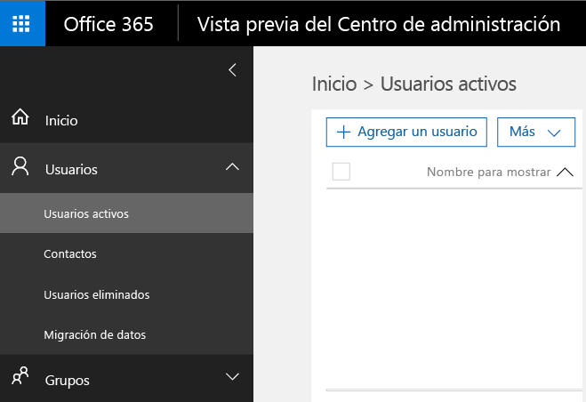
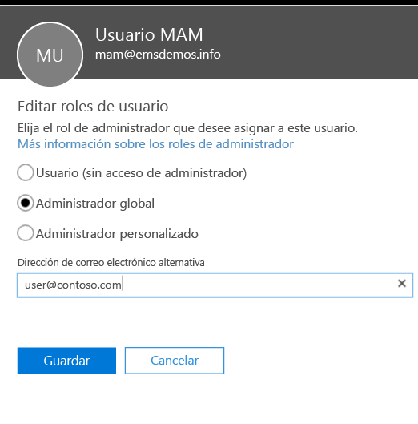
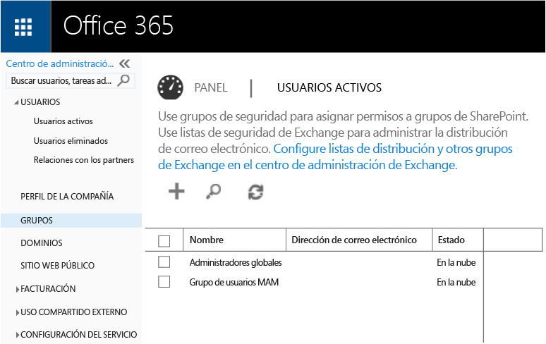
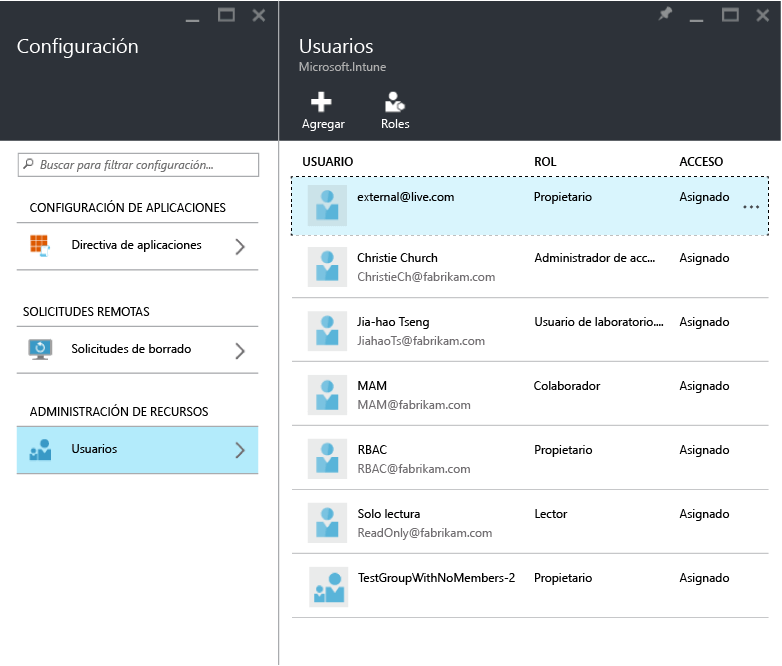
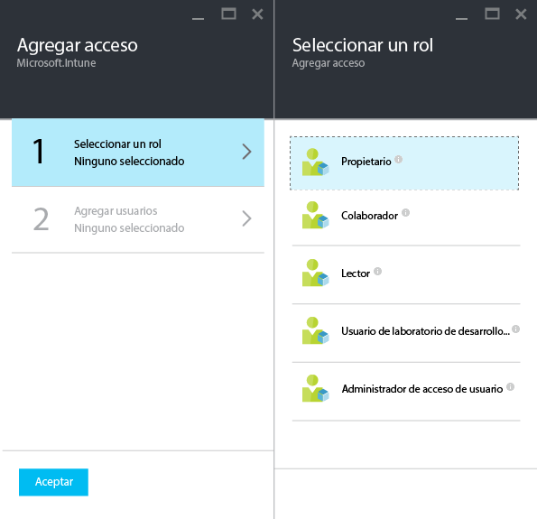
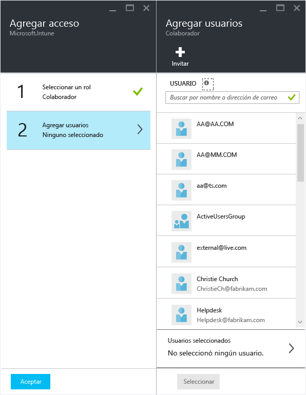

---
# required metadata

title: Get ready to configure mobile app management policies (Preparación para configurar directivas de administración de aplicaciones móviles) | Microsoft Intune
description:
keywords:
author: karthikaraman
manager: jeffgilb
ms.date: 04/28/2016
ms.topic: article
ms.prod:
ms.service: microsoft-intune
ms.technology:
ms.assetid: 7e6a85e7-e007-41b6-9034-64d77f547b87

# optional metadata

#ROBOTS:
#audience:
#ms.devlang:
ms.reviewer: jeffgilb
ms.suite: ems
#ms.tgt_pltfrm:
#ms.custom:

---

# Get ready to configure mobile app management policies with Microsoft Intune (Preparación para configurar directivas de administración de aplicaciones móviles con Microsoft Intune)
En este tema se describe lo que debe hacer antes de crear directivas de administración de aplicaciones móviles (MAM) en el Portal de Azure.
Si actualmente usa la **consola de administración de Intune** para administrar sus dispositivos, puede crear una directiva de MAM que admita aplicaciones para los dispositivos inscritos en Intune mediante la [consola de administración de Intune](configure-and-deploy-mobile-application-management-policies-in-the-microsoft-intune-console.md)..
>[!IMPORTANT]
> Es posible que no vea todas las configuraciones de directivas de MAM en la consola de administración de Intune. El Portal de Azure es la nueva consola de administración para crear directivas de MAM.

##  Plataformas compatibles
- iOS 8.1 o posterior

- Android 4 o posterior

##  Aplicaciones compatibles
Para ver la lista completa de las aplicaciones compatibles, vaya a la [Microsoft Intune mobile application gallery (Galería de aplicaciones móviles de Microsoft Intune)](https://www.microsoft.com/en-us/server-cloud/products/microsoft-intune/partners.aspx) de la página de partners de aplicaciones de Microsoft Intune.
Haga clic en la aplicación para ver los escenarios y las plataformas admitidas y si la aplicación admite o no varias identidades.

**Antes** de que pueda configurar las directivas de MAM, necesitará lo siguiente:

-   **Una suscripción de Microsoft Intune**.    Los usuarios finales necesitan licencias de [!INCLUDE[wit_nextref](../includes/wit_nextref_md.md)] para obtener aplicaciones con la directiva de MAM.

-   Se debe establecer la **entidad de administración de dispositivos móviles** en **Intune** o en **Configuration Manager**, en función de si se usa solo Intune o Configuration Manager integrado con Intune para administrar los dispositivos. Si usa la administración de dispositivos móviles integrada de Office 365, debe adquirir una suscripción de Intune y [establecer la entidad de administración de dispositivos móviles en Intune](get-ready-to-enroll-devices-in-microsoft-intune.md#set-mobile-device-management-authority)..
-   Una suscripción de **Office 365 (O365)** que se necesita para lo siguiente:
  - Para aplicar las directivas de MAM a las aplicaciones que admiten varias identidades.
  - Para crear cuentas profesionales de SharePoint Online y Exchange Online. Exchange local y SharePoint local no se admiten.

- **Azure Active Directory (Azure AD)** para crear usuarios. Azure AD autentica el usuario cuando el usuario final inicia la aplicación y escribe sus credenciales de trabajo.

    > [!NOTE]
    > Si está configurando los usuarios mediante la consola [!INCLUDE[wit_nextref](../includes/wit_nextref_md.md)], tenga en cuenta que la configuración de la directiva de MAM se traslada a partir de ahora al Portal de Azure y, para usar este portal, deberá configurar los grupos de usuarios de Azure AD mediante el Portal de Office 365.

## Crear usuarios y asignar licencias de Microsoft Intune

1. Necesita una suscripción de Intune: ya tiene una suscripción de [!INCLUDE[wit_nextref](../includes/wit_nextref_md.md)] si actualmente está usando [!INCLUDE[wit_nextref](../includes/wit_nextref_md.md)] para administrar sus dispositivos.  También tiene una suscripción de [!INCLUDE[wit_nextref](../includes/wit_nextref_md.md)] si ha adquirido una licencia de EMS. Si está probando [!INCLUDE[wit_nextref](../includes/wit_nextref_md.md)] para comprobar las funciones de MAM, puede obtener una cuenta de prueba [aquí](http://www.microsoft.com/en-us/server-cloud/products/microsoft-intune/)..

    Para comprobar si tiene una suscripción de [!INCLUDE[wit_nextref](../includes/wit_nextref_md.md)], en el Portal de Office, vaya a la página de facturación.  Debería ver [!INCLUDE[wit_nextref](../includes/wit_nextref_md.md)] como **Activo** en las suscripciones.

2.  Inicie sesión en el   [portal de Office](http://portal.office.com) con sus credenciales de administrador.

3.  Vaya a la página **Usuarios activos** para agregar usuarios y asignar licencias de [!INCLUDE[wit_nextref](../includes/wit_nextref_md.md)].

    

4.  Para conceder a un usuario la capacidad de acceder al portal de Office, el Portal de Azure AD y el Portal de Azure, asígnele el **rol de administrador global**.

    

5.  Las directivas MAM se implementan para grupos de usuarios de Azure Active Directory. Para crear grupos de usuarios que quiere usar para sus directivas de MAM, vaya a la página **Grupos** del **Portal de Office** y haga clic en el icono **+** para crear un nuevo grupo de seguridad.  Escriba un nombre y una descripción y haga clic en **Crear**. Cuando se cree el grupo, podrá agregar usuarios al grupo haciendo clic en **Editar miembros** en el grupo de seguridad recién creado. El grupo de seguridad se crea en Azure Active Directory.

    

En la tabla siguiente se enumeran los roles y los permisos que puede asignar a los usuarios de administración.

|||
|--|----|
|**Rol**|**Permisos**|
|Administrador global (portal de O365)|Acceso al Portal de O365 y al Portal de Azure AD  Acceso al Portal de Azure (se pueden realizar las tareas de administración de roles y de administración de aplicaciones móviles).|
|Rol de propietario (Portal de Azure)|Acceso al Portal de Azure (se pueden realizar las tareas de administración de roles y de administración de aplicaciones móviles).|
|Rol de colaborador (Portal de Azure)|Acceso al Portal de Azure (solo se pueden realizar las tareas de administración de aplicaciones móviles).|

## Asignar el rol Colaborador a un usuario

Los**administradores globales** tienen acceso al portal de Azure.  Si quiere que otros usuarios administradores puedan configurar directivas y llevar a cabo otras tareas de administración de aplicaciones móviles, puede asignar el **rol Colaborador** al usuario como se describe a continuación:

1.  En la hoja **Configuración**, en la sección **Administración de recursos**, haga clic en **Usuarios**..

    

2.  Haga clic en **Agregar** para abrir la hoja **Agregar acceso** .

3.  Haga clic en **Seleccionar un rol** y, luego, en **rol Colaborador**..

    

4.  Una vez haya seleccionado el rol, haga clic en **Agregar usuario**y busque el usuario por el nombre de usuario o la dirección de correo electrónico. Los usuarios que ve en esta lista son los 1000 primeros usuarios que creó anteriormente en Azure AD con el portal de Office. Haga clic en **Aceptar** en la hoja **Agregar acceso** para guardar y asignar el rol al usuario.

    

    > [!IMPORTANT]
    > Si selecciona un usuario que no tiene una licencia de [!INCLUDE[wit_nextref](../includes/wit_nextref_md.md)] asignada, ese usuario no tendrá acceso al portal.

## Pasos siguientes
[Crear e implementar directivas de administración de aplicaciones móviles con Microsoft Intune](create-and-deploy-mobile-app-management-policies-with-microsoft-intune.md)

<!--HONumber=May16_HO1-->

