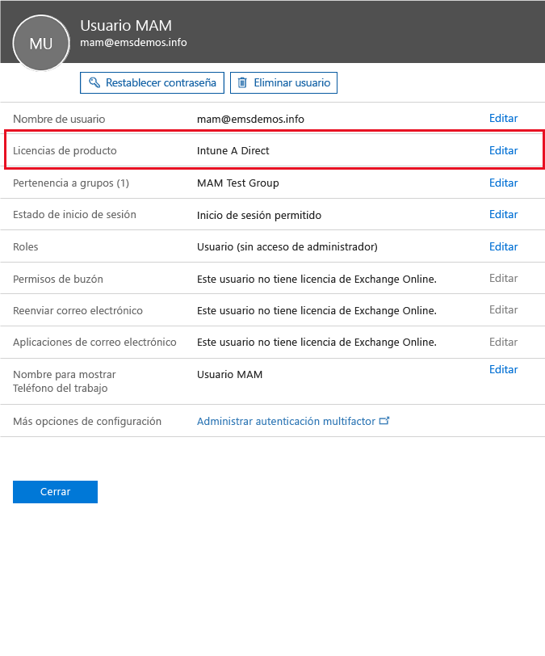

# Get ready to configure mobile app management policies with Microsoft Intune (Preparación para configurar directivas de administración de aplicaciones móviles con Microsoft Intune)
En este tema se describe lo que debe hacer antes de crear directivas de administración de aplicaciones móviles (MAM) en el Portal de Azure.

El Portal de Azure es la nueva consola de administración para crear directivas de MAM. Se recomienda usar este portal para crear directivas MAM. El Portal de Azure admite los siguientes escenarios de MAM:
- Dispositivos móviles inscritos por Intune
- Dispositivos administrados por una solución de MDM de terceros
- Dispositivos que no están administrados por ninguna solución de MDM (BYOD)

Si no está familiarizado con el uso del portal de Azure, lea el tema [Portal de Azure para directivas de MAM de Microsoft Intune](azure-portal-for-microsoft-intune-mam-policies.md) para obtener una introducción rápida.

>[!IMPORTANT]

> Si actualmente usa la consola de administración de Intune para administrar los dispositivos, puede crear directivas MAM que admitan aplicaciones para los dispositivos inscritos en Intune mediante la consola de administración de Intune. Sin embargo, recomendamos usar el Portal de Azure, incluso para los dispositivos que están inscritos en Intune. Para obtener instrucciones sobre cómo crear una directiva de MAM mediante la consola de administración de Intune, consulte [Configure and deploy mobile application management policies in the Microsoft Intune console](configure-and-deploy-mobile-application-management-policies-in-the-microsoft-intune-console.md) (Configurar e implementar directivas de administración de aplicaciones móviles en la consola de Microsoft Intune).

> Es posible que no vea todas las configuraciones de directivas de MAM en la consola de administración de Intune. Si crea directivas de MAM en la consola de administración de Intune y en el Portal de Azure, la directiva del Portal de Azure se aplica a las aplicaciones y se implementa para los usuarios.
> Las directivas de MAM que se hayan creado en la consola de administración de Intune no pueden importarse en el Portal de Azure.  Las directivas de MAM deben volver a crearse en el Portal de Azure.

##  Plataformas compatibles
- iOS 8.1 o posterior

- Android 4 o posterior

Los dispositivos Windows no son compatibles actualmente.
##  Aplicaciones compatibles
* **Aplicaciones de Microsoft:** estas aplicaciones tienen el SDK para aplicaciones de Intune integrado y no requieren ningún procesamiento adicional antes de aplicar las directivas de MAM.
Para ver la lista completa de las aplicaciones de Microsoft compatibles, vaya a [Microsoft Intune mobile application gallery (Galería de aplicaciones móviles de Microsoft Intune)](https://www.microsoft.com/en-us/server-cloud/products/microsoft-intune/partners.aspx) en la página Microsoft Intune application partners (Socios de aplicaciones de Microsoft Intune). Haga clic en una aplicación para ver los escenarios y las plataformas admitidos y si la aplicación admite varias identidades.
* **Aplicaciones de línea de negocio de su organización:** requieren la preparación de la aplicación para incluir el SDK para aplicaciones de Intune para poder aplicar las directivas de MAM.

  * Para dispositivos administrados por Intune, vea [Decide how to prepare apps for MAM](decide-how-to-prepare-apps-for-mobile-application-management-with-microsoft-intune.md) (Decidir cómo preparar las aplicaciones para MAM).
  * Para dispositivos no administrados (como dispositivos propiedad de los empleados) o para dispositivos administrados por una solución de administración de dispositivos móviles de terceros, vea [Proteger aplicaciones y datos de línea de negocio en dispositivos no inscritos en Microsoft Intune](protect-line-of-business-apps-and-data-on-devices-not-enrolled-in-microsoft-intune.md).

*Antes* de que pueda configurar las directivas de MAM, necesitará lo siguiente:

-   Una suscripción de Microsoft Intune.    Los usuarios necesitan licencias de [!INCLUDE[wit_nextref](../includes/wit_nextref_md.md)] para obtener aplicaciones que tienen directivas de MAM.

-   Una suscripción de Office 365, que se necesita para lo siguiente:
  - Para aplicar las directivas de MAM a las aplicaciones que admiten varias identidades.
  - Para crear cuentas profesionales de SharePoint Online y Exchange Online. Exchange local y SharePoint local no se admiten.
-   Configuración de Skype Empresarial Online para la autenticación moderna. Para más información, consulte [Habilitar la autenticación moderna](http://social.technet.microsoft.com/wiki/contents/articles/34339.skype-for-business-online-enable-your-tenant-for-modern-authentication.aspx).

- Azure Active Directory (Azure AD) para crear usuarios. Azure AD autentica a los usuarios cuando estos abre la aplicación y escriban sus credenciales de trabajo.

    > [!NOTE]
    > Si está configurando a los usuarios mediante la consola de [!INCLUDE[wit_nextref](../includes/wit_nextref_md.md)], tenga en cuenta que la configuración de la directiva de MAM se mueve al Portal de Azure. Para utilizar este portal, debe configurar grupos de usuarios de Azure AD mediante el Portal de Office 365.

## Crear usuarios y asignar licencias de Microsoft Intune

1. Asegúrese de que tiene una suscripción de Intune. Ya tiene una suscripción de [!INCLUDE[wit_nextref](../includes/wit_nextref_md.md)] si usa [!INCLUDE[wit_nextref](../includes/wit_nextref_md.md)] actualmente para administrar los dispositivos.  También tiene una suscripción de [!INCLUDE[wit_nextref](../includes/wit_nextref_md.md)] si ha adquirido una licencia de Enterprise Mobility Suite (EMS). Si está probando [!INCLUDE[wit_nextref](../includes/wit_nextref_md.md)] para comprobar las funcionalidades de MAM, puede obtener una cuenta de prueba en la [página web de Microsoft Intune](http://www.microsoft.com/en-us/server-cloud/products/microsoft-intune/).

    Para comprobar si tiene una suscripción de [!INCLUDE[wit_nextref](../includes/wit_nextref_md.md)], en el Portal de Office, vaya a la página de **facturación**.  Debería ver [!INCLUDE[wit_nextref](../includes/wit_nextref_md.md)] como **Activo** en las suscripciones.

2.  Inicie sesión en el [Portal de Office](http://portal.office.com) con sus credenciales de administrador.

3.  Vaya a la página **Usuarios activos** para agregar usuarios y asignar licencias de [!INCLUDE[wit_nextref](../includes/wit_nextref_md.md)].

    

    

4.  Para conceder a un usuario la capacidad de acceder al portal de Office, al Portal de Azure AD y al Portal de Azure, asígnele el **rol de administrador global**.

    

5.  Las directivas MAM se implementan para grupos de usuarios de Azure Active Directory. Para crear grupos de usuarios para sus directivas de MAM, vaya a la página **Grupos** del Portal de Office y elija la opción **Agregar una opción de grupo** en el menú superior para crear un nuevo grupo de seguridad.  Escriba un nombre y una descripción, y luego haga clic en **Crear**. Cuando se cree el grupo, podrá agregar usuarios al grupo haciendo clic en **Editar miembros**. El grupo de seguridad se crea en Azure Active Directory.

    

En la tabla siguiente se enumeran los roles y permisos que puede asignar a los usuarios de administración.

|||
|--|----|
|**Rol**|**Permisos**|
|Administrador global (portal de O365)|Acceso al portal de Office 365 y al portal de Azure AD.  Acceso al Portal de Azure (se pueden realizar las tareas de administración de roles y de administración de aplicaciones móviles).|
|Propietario (Portal de Azure)|Acceso al Portal de Azure (se pueden realizar las tareas de administración de roles y de administración de aplicaciones móviles).|
|Colaborador (Portal de Azure)|Acceso al Portal de Azure (solo se pueden realizar las tareas de administración de aplicaciones móviles).|

## Asignar el rol Colaborador a un usuario

Los administradores globales tienen acceso al [Portal de Azure](https://portal.azure.com).  Si quiere que otros usuarios administradores puedan configurar directivas y llevar a cabo otras tareas de administración de aplicaciones móviles, puede asignar el rol Colaborador a los usuarios:

1.  En la hoja **Configuración**, en la sección **Administración de recursos**, haga clic en **Usuarios**.

    

2.  Haga clic en **Agregar** para abrir la hoja **Agregar acceso** .

3.  Haga clic en **Seleccionar un rol** y luego en **Colaborador**.

    

4.  Haga clic en **Agregar un usuario** y busque el usuario por nombre o dirección de correo. Los usuarios que aparecen en esta lista son los 1.000 primeros usuarios que creó anteriormente en Azure AD con el Portal de Office. Haga clic en **Aceptar** en la hoja **Agregar acceso** para guardar y asignar el rol al usuario.

    

    > [!IMPORTANT]
    > Si selecciona un usuario que no tiene una licencia de [!INCLUDE[wit_nextref](../includes/wit_nextref_md.md)] asignada, ese usuario no tendrá acceso al portal.

## Pasos siguientes
[Crear e implementar directivas de administración de aplicaciones móviles con Microsoft Intune](create-and-deploy-mobile-app-management-policies-with-microsoft-intune.md)

<!--HONumber=Aug16_HO1-->

