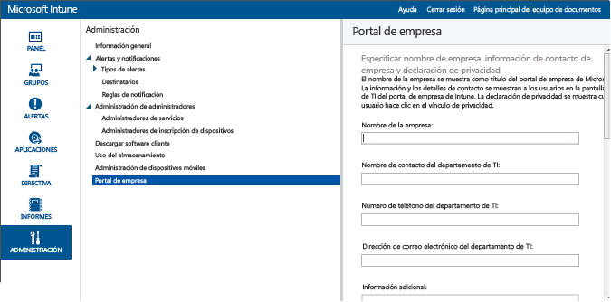

# Preparar la inscripción de dispositivos en Microsoft Intune
Para permitir que los empleados inscriban dispositivos móviles (incluidos [Android](set-up-android-management-with-microsoft-intune.md), [iOS y Mac](set-up-ios-and-mac-management-with-microsoft-intune.md), [Windows Phone](set-up-windows-phone-management-with-microsoft-intune.md) y [equipos Windows](set-up-windows-device-management-with-microsoft-intune.md)) en Intune, o administren dispositivos de la empresa, debe habilitar la inscripción de dispositivos. Para permitir la inscripción, debe establecer una entidad de administración de dispositivos móviles (MDM), configurar el Portal de empresa de Intune, asignar licencias y habilitar la asignación para la plataforma de dispositivos.

## Establecer la entidad de administración de dispositivos móviles
La entidad de MDM define el servicio de administración que tiene permiso para administrar un conjunto de dispositivos. Las opciones para la entidad de MDM incluyen Intune y Configuration Manager con Intune. Si establece Configuration Manager como la entidad de administración, ningún otro servicio podrá usarse para la administración de dispositivos móviles.

>[!IMPORTANT]
> Considere detenidamente si quiere administrar los dispositivos móviles solo mediante Intune (servicio en línea) o mediante System Center Configuration Manager con Intune (solución de software local junto con el servicio en línea). Una vez que establezca la entidad de administración de dispositivos móviles, esta no se puede cambiar.

1.  En la [consola de administración de Microsoft Intune](http://manage.microsoft.com), haga clic en **Administración** &gt; **Administración de dispositivos móviles**.

2.  En la lista **Tareas** , haga clic en **Configurar entidad de administración de dispositivos móviles**. Se abre el cuadro de diálogo **Establecer entidad de administración de dispositivos móviles** .

    

3.  Intune solicita confirmación de que desea que Intune sea su entidad de MDM. Seleccione la casilla y elija **Sí** si quiere usar Microsoft Intune para administrar dispositivos móviles.

## Configurar el portal de empresa de Intune

El portal de empresa de Intune es el lugar donde los usuarios tienen acceso a los datos de la empresa y pueden realizar tareas habituales como, por ejemplo, inscribir dispositivos, instalar aplicaciones y buscar información de ayuda del departamento de TI.

> [!TIP]
> Al personalizar el portal de empresa, los valores de configuración se aplicarán tanto al sitio web como a las aplicaciones del portal de empresa.

Con la personalización del Portal de empresa, es más fácil ofrecer una experiencia conocida y útil a los usuarios finales. Para proceder a la personalización, inicie sesión en la [consola de administración de Microsoft Intune](https://manage.microsoft.com) como administrador de inquilinos o de servicios, elija **Administración** &gt; **Portal de empresa** y configure el Portal de empresa.

### Información de contacto y declaración de privacidad de la empresa

El nombre de la empresa se muestra como título del portal de empresa. La información y los datos de contacto se muestran a los usuarios en la pantalla Contacto de TI del portal de empresa. La declaración de privacidad se muestra cuando el usuario hace clic en el vínculo de privacidad.

|Nombre de campo|Longitud máxima|Más información|
    |----------|------------------------|----------------|
    |Nombre de la empresa|40|Es el nombre que se muestra como título del portal de empresa.|
    |Nombre del contacto del departamento de TI|40|Es el nombre que se muestra en la página **Contacto de TI**.|
    |Número de teléfono del departamento de TI|20|Es el número de contacto que se muestra en la página **Contacto de TI**.|
    |Dirección de correo electrónico del departamento de TI|40|Es la dirección de contacto que se muestra en la página **Contacto de TI**. Debe especificar una dirección de correo electrónico válida en el formato **alias@nombrededominio.com**.|
    |Información adicional|120|Esta información se muestra en la página **Contact IT** (Contacto de TI).|
    |Dirección URL de la declaración de privacidad de la empresa|79|Puede especificar su propia declaración de privacidad de la empresa, que aparece cuando los usuarios hacen clic en los vínculos de privacidad del portal de empresa. Debe escribir una dirección URL válida con el formato https://www.contoso.com.|

### Contactos de soporte técnico
El sitio web de soporte se muestra a los usuarios en el portal de empresa para que puedan tener acceso al soporte en línea.

|Nombre del campo|Longitud máxima|Más información|
    |----------|------------------------|----------------|
    |Dirección URL del sitio web de soporte:|150|Si tiene un sitio web de soporte que desea que utilicen los usuarios finales, especifique la dirección URL aquí. La dirección URL debe tener el formato https://www.contoso.com. Si no especifica una dirección URL, no se mostrará ningún sitio web de soporte en la página **Contacto de TI** del portal de empresa.|
    |Nombre del sitio web|40|Este nombre es el nombre descriptivo que se muestra para la dirección URL del sitio web de soporte. Si solo especifica una dirección URL de sitio web de soporte sin nombre descriptivo, se mostrará **Ir a sitio web de TI** en la página **Contacto de TI** del portal de empresa.|

### Personalización de la marca de empresa

Puede personalizar su Portal de empresa con su logotipo de empresa, nombre de empresa, color de tema y fondo.

|Nombre de campo|Más información|
    |----------|----------------|
    |Color del tema|Seleccione el color del tema que se aplicará al portal de empresa.|
    |Incluir el logotipo de la empresa|Si habilita esta opción, puede cargar el logotipo de su empresa para que se muestre en el portal de empresa. Puede cargar dos logotipos: uno que se mostrará cuando el fondo del portal de empresa sea de color blanco y otro que se mostrará cuando el fondo del portal de empresa use el color de tema seleccionado. El archivo del logotipo debe ser .png o .jpg, con una resolución máxima de 400 x 100 píxeles y un tamaño de 750 KB o menos.|
    |Elegir un fondo para la aplicación de portal de empresa para [!INCLUDE[win8_client_2](../includes/win8_client_2_md.md)]|Esta opción de configuración solo afecta al fondo de la aplicación de portal de empresa de [!INCLUDE[win8_client_2](../includes/win8_client_2_md.md)].|

Después de guardar los cambios, puede usar los vínculos que aparecen en la parte inferior de la página del **Portal de empresa** de la consola de administración para ver el sitio web del Portal de empresa. Estos vínculos no se pueden cambiar. Cuando un usuario inicia sesión, estos vínculos muestran las suscripciones en el portal de empresa.

## Asigne una licencia de usuario de Intune

El **portal de administración de Office 365** se usa para agregar manualmente usuarios basados en la nube y asignar licencias a las cuentas de usuario basadas en la nube y a las cuentas sincronizadas desde Active Directory local con Azure Active Directory (Azure AD).

1.  Inicie sesión en el [portal de administración de Office 365](https://portal.office.com/Admin/Default.aspx) con las credenciales del administrador de inquilinos.

2.  Seleccione la cuenta de usuario a la que quiere asignar una licencia de usuario de Intune y seleccione la casilla **Microsoft Intune** en las propiedades de la cuenta de usuario.

3.  La cuenta de usuario se agregará al grupo de usuarios de Microsoft Intune que concede al usuario permisos para usar el servicio e inscribir sus dispositivos en la administración.

## Configurar la administración de dispositivos
Después de configurar la entidad de MDM, debe configurar la administración de dispositivos para los sistemas operativos que su organización quiere admitir. Los pasos necesarios para configurar la administración de dispositivos varían según el sistema operativo. Por ejemplo, el sistema operativo Android no necesita que haga nada en la consola de administración de Intune. Por otro lado, Windows y iOS necesitan una relación de confianza entre los dispositivos e Intune para permitir la administración.

> [!div class="op_single_selector"]
- [Configurar la administración de Android con Microsoft Intune](set-up-android-management-with-microsoft-intune.md)
- [Set up iOS and Mac management with Microsoft Intune](set-up-ios-and-mac-management-with-microsoft-intune.md)
- [Configurar la administración de Windows Phone con Microsoft Intune](set-up-windows-phone-management-with-microsoft-intune.md)
- [Configurar la administración de dispositivos Windows con Microsoft Intune](set-up-windows-device-management-with-microsoft-intune.md)

También puede llevar a cabo lo siguiente:
 - Usar la [cuenta de administrador de inscripción de dispositivos](enroll-corporate-owned-devices-with-the-device-enrollment-manager-in-microsoft-intune.md) para inscribir muchos dispositivos.
 - [Especificar los dispositivos propiedad de la empresa mediante los números del IMEI](specify-corporate-owned-devices-with-international-mobile-equipment-identity-imei-numbers.md) para ayudar en la inscripción de dispositivos y de la directiva de destino.

<!--HONumber=Aug16_HO1-->

