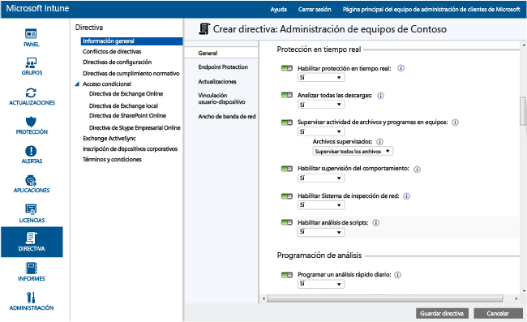
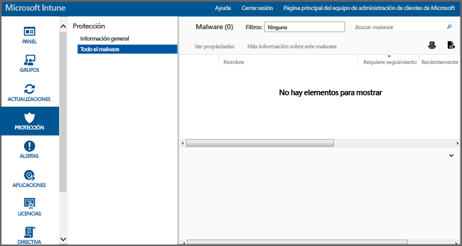

# Ayudar a proteger los equipos de Windows con Endpoint Protection para Microsoft Intune
Microsoft Intune puede ayudarle a proteger los equipos administrados de varias maneras. Una de ellas es Endpoint Protection, que proporciona protección en tiempo real contra amenazas de malware, mantiene las definiciones de malware actualizadas y examina automáticamente los equipos. Endpoint Protection también proporciona herramientas que ayudan a administrar y supervisar los ataques de malware.

Si aún no ha instalado el cliente Intune en sus equipos, vea [Instalar el cliente de equipos Windows con Microsoft Intune](install-the-windows-pc-client-with-microsoft-intune.md).

Use la información de las secciones siguientes como ayuda para configurar, implementar y supervisar Endpoint Protection.

## Elegir cuándo usar Endpoint Protection
Una de las principales prioridades de un administrador de TI es proteger los equipos administrados contra virus y malware. Antes de implementar Intune en los equipos Windows de su organización, debe decidir la manera de proteger los equipos seleccionando una de las siguientes opciones y configurando las opciones de la directiva asociada:

|Deseo:|Configuración de directivas de Endpoint Protection|Más información|
|--------------|---------------------------------------|--------------------|
|Usar Microsoft Intune Endpoint Protection únicamente si no hay ninguna aplicación de protección de extremos de otro fabricante instalada.  Puede usar Microsoft Intune Endpoint Protection en todos los equipos en los que no haya instalada una aplicación de protección de puntos de conexión de terceros.|Instalar Endpoint Protection = **Sí**  Habilitar Endpoint Protection = **Sí**  Instalar Endpoint Protection incluso si hay una aplicación de protección de puntos de conexión de terceros instalada = **No**|Si se detecta una aplicación de protección de puntos de conexión de terceros, Microsoft Intune Endpoint Protection no se instalará o se desinstalará si ya se ha instalado.|
|Usar Microsoft Intune Endpoint Protection incluso si hay una aplicación de protección de extremos de otro fabricante instalada.  Con este enfoque, se ejecutarán simultáneamente Microsoft Intune Endpoint Protection y la aplicación de protección de extremos de otro fabricante. No se recomienda esta configuración porque puede provocar problemas de rendimiento.|Instalar Endpoint Protection = **Sí**  Habilitar Endpoint Protection = **Sí**  Instalar Endpoint Protection incluso si hay una aplicación de protección de puntos de conexión de terceros instalada = **Sí**|Se debe usar cuando:  – Desea pasar a usar Microsoft Intune Endpoint Protection. – Se implementa un cliente nuevo que va a usar Microsoft Intune Endpoint Protection. – Se actualiza un cliente que va a usar Microsoft Intune Endpoint Protection.|
|Usar Intune sin Microsoft Intune Endpoint Protection. En lugar de ello va a utilizar una aplicación de protección de extremos de otro fabricante.|Instalar Endpoint Protection = **No**|Si no utiliza una aplicación de protección de extremos de otro fabricante, no se recomienda esta configuración, ya que podría exponer los equipos de su organización a malware u otros ataques.  Microsoft Intune Endpoint Protection no se instala, o se desinstala si estaba instalado.|
Para cambiar de su aplicación de protección de extremos actual a Microsoft Intune Endpoint Protection, haga lo siguiente:

1.  Deje que su aplicación actual de protección de extremos se siga ejecutando mientras implementa el software cliente de Intune en esos equipos.

2.  Compruebe que Microsoft Intune Endpoint Protection está instalado y ayuda a proteger los equipos cliente.

3.  Quite el software de protección de extremos de un tercero de la manera siguiente:

    -   Utilice la distribución de software de Intune para implementar una herramienta de eliminación de software proporcionada por el fabricante de la otra aplicación de protección de extremos. Para obtener más información, vea [Implementar aplicaciones con Microsoft Intune](deploy-apps.md).

    -   Quitar manualmente la aplicación de protección de extremos de otro fabricante.

> [!NOTE]
> Intune no desinstala automáticamente aplicaciones de protección de extremos de otro fabricante.

## Configuración de Microsoft Intune Endpoint Protection
Siga estos pasos como guía para la configuración de Endpoint Protection para Microsoft Intune.

1.  En la [consola de administración de Microsoft Intune](https://manage.microsoft.com/), haga clic en **Directiva** > **Agregar directiva**.

2.  Expanda **Administración de equipos** y seleccione **Configuración de agente de Microsoft Intune**. Seleccione **Crear e implementar una directiva personalizada** para especificar la directiva de configuración de Endpoint Protection y, después, haga clic en el botón **Crear directiva**. Puede usar la configuración recomendada o personalizar la configuración. Si necesita más información sobre cómo crear e implementar directivas, consulte el tema [Tareas comunes de administración de PC Windows con el cliente de equipo de Microsoft Intune](common-windows-pc-management-tasks-with-the-microsoft-intune-computer-client.md).

  

Puede ver la directiva Endpoint Protection implementada en la página **Todas las directivas** del área de trabajo **Directiva**.

## Configuración del servicio Endpoint Protection

|Configuración de directiva|Detalles|
|------------------|--------------------|
|**Instalar Endpoint Protection**|Debe establecerse en **Sí** para instalar Endpoint Protection en equipos administrados. Si durante la instalación se detecta una aplicación de protección de extremos de terceros, Endpoint Protection no se instalará, a menos que **Instalar Endpoint Protection incluso si hay una aplicación de protección de extremos de otro fabricante instalada** esté establecido en **Sí**. **Nota**: Intune Endpoint Protection se instala de manera predeterminada en equipos administrados. Si no desea que Endpoint Protection se instale en los equipos administrados, debe establecer explícitamente esta directiva en **No**. Si Endpoint Protection se instaló previamente y la directiva se actualiza a **No**, el cliente de Endpoint Protection se desinstalará. Valor recomendado: **Sí**|
|**Instalar Endpoint Protection incluso si hay una aplicación de protección de extremos de otro fabricante instalada**|Debe establecerse en **Sí** para instalar Microsoft Intune Endpoint Protection incluso si se detecta una aplicación de protección de extremos de otro fabricante.  Valor recomendado: **Sí**|
|**Habilitar Endpoint Protection**|Debe establecerse en **Sí** para habilitar Microsoft Intune Endpoint Protection en los equipos que tienen el cliente de Endpoint Protection.  Si se establece en **No** y Microsoft Intune Endpoint Protection está instalado, la interfaz de usuario cliente de Endpoint Protection no se mostrará a los usuarios y se desactivarán todas las características de protección.  Valor recomendado: **Sí**|
|**Deshabilitar UI cliente**|Debe establecerse en **Sí** para ocultar la interfaz de usuario cliente de Microsoft Intune Endpoint Protection a los usuarios (para que surta efecto hay que reiniciar el equipo cliente).  Valor recomendado: **No**|
|**Instalar Endpoint Protection incluso si hay una aplicación de protección de extremos de otro fabricante instalada**|Debe establecerse en **Sí** para forzar la instalación de Microsoft Intune Endpoint Protection incluso si se detecta una aplicación de protección de extremos de otro fabricante.  Valor recomendado: **No**|
|**Crear un punto de restauración del sistema antes de eliminar malware**|Debe establecerse en **Sí** para crear un punto de restauración del sistema de Windows antes de que comience cualquier corrección de software malintencionado.  Valor recomendado: **Sí**|
|**Realizar seguimiento de malware resuelto (días)**|Permite que Endpoint Protection haga un seguimiento de malware resuelto durante un tiempo especificado para que pueda comprobar manualmente los equipos infectados anteriormente.  Puede especificar un valor comprendido entre 0 y 30 días.  Valor recomendado: **7 días**|
Si estableció los valores de directivas de **Instalar Endpoint Protection** y **Habilitar Endpoint Protection** en **Sí**, y de **Instalar Endpoint Protection incluso si hay una aplicación de protección de extremos de otro fabricante instalada** en **No**, Microsoft Intune Endpoint Protection detectará que hay otra aplicación de protección de extremos instalada y no se instalará, o se desinstalará si ya está presente (sin embargo, Microsoft Intune Endpoint Protection informará del estado de la otra aplicación de protección de extremos en Intune).

  Gracias a la protección en tiempo real, Microsoft Security Essentials le avisa si hay amenazas potenciales, como virus y spyware, que intentan instalarse o ejecutarse en su equipo. Si sucede, verá un mensaje en el área de notificación, en el extremo derecho de la barra de tareas.

### Configuración de protección en tiempo real

|Configuración de directiva|Detalles|
|------------------|--------------------|
|**Habilitar protección en tiempo real**|Habilita la supervisión y el examen de todos los archivos y aplicaciones a los que se accede. También bloquea las aplicaciones y los archivos malintencionados antes de que puedan ejecutarse en los equipos.  Valor recomendado: **Sí**|
|**Analizar todas las descargas**|Habilita el examen de todos los archivos y datos adjuntos que se descargan de Internet a los equipos.  Valor recomendado: **Sí**|
|**Supervisar la actividad de archivos y programas en los equipos**|Habilita la supervisión de los archivos entrantes y los archivos salientes, así como la actividad de los programas en los equipos. Con esta opción de configuración, Endpoint Protection puede supervisar cuándo empieza la ejecución de archivos y programas, y le envía alertas sobre las acciones que realizan o las acciones que se realizan con ellos.  Valor recomendado: **Sí**|
|**Archivos supervisados**|Si la opción **Supervisar la actividad de archivos y programas en los equipos** está habilitada, esta opción de configuración permite elegir supervisar sólo los archivos entrantes, sólo los salientes o todos los archivos.  Valor recomendado: **Supervisar todos los archivos**|
|**Habilitar supervisión del comportamiento**|Permite a Microsoft Intune Endpoint Protection buscar ciertos patrones de actividad sospechosa en equipos cliente.  Valor recomendado: **Sí**|
|**Habilitar Sistema de inspección de red**|Habilita el Sistema de inspección de red (NIS) en los equipos cliente. NIS usa firmas de vulnerabilidades conocidas del [Microsoft Malware Protection Center (Centro de protección contra malware de Microsoft)](http://go.microsoft.com/fwlink/?LinkId=234249) para ayudar a detectar y bloquear tráfico de red malintencionado.  Valor recomendado: **Sí**|

  

### Configuración de programación de examen

|Configuración de directiva|Más información|
|------------------|--------------------|
|**Programar un examen rápido diario**|Programa un examen rápido diario de los archivos de uso frecuente y los archivos importantes del sistema en los equipos. Este examen rápido tiene un efecto mínimo sobre el rendimiento.  Valor recomendado: **Sí**|
|**Ejecutar un análisis rápido si no se han ejecutado dos análisis rápidos consecutivos**|Configura Endpoint Protection para que ejecute automáticamente un examen rápido en los equipos en caso de que no se realicen dos exámenes rápidos programados consecutivos.  Valor recomendado: **Sí**|
|**Programar un examen completo**|Configura un examen completo de todos los archivos y recursos de los discos duros locales de los equipos. Este examen puede tardar y puede afectar al rendimiento de los equipos (en función del número de archivos y recursos analizados).  Valor recomendado: **No**|
|**Ejecutar un análisis completo si no se han ejecutado dos análisis completos consecutivos**|Configura Endpoint Protection para que ejecute automáticamente un examen completo en los equipos en caso de que no se realicen dos exámenes completos programados consecutivos.  Valor recomendado: No configurado|

### Configuración de opciones de examen

|Configuración de directiva|Detalles|
|------------------|--------------------|
|**Ejecutar un análisis completo tras la instalación de Endpoint Protection**|Configura Endpoint Protection para que ejecute automáticamente un análisis completo del sistema después de instalarse en los equipos. Este examen se ejecuta únicamente cuando los equipos están inactivos para minimizar así el efecto en la productividad de los usuarios.  Valor recomendado: **Sí**|
|**Ejecutar un examen completo automáticamente cuando es necesario hacer un seguimiento después de quitar malware**|Debe establecerse en **Sí** para permitir a Endpoint Protection ejecutar automáticamente un examen completo del sistema en los equipos tras eliminar malware, para comprobar que no haya otros archivos afectados.  Valor recomendado: **Sí**|
|**Iniciar un examen programado sólo cuando el equipo está inactivo**|Debe establecerse en **Sí** para impedir que se inicien exámenes programados cuando los equipos se están usando a fin de no mermar la productividad de los usuarios.  Valor recomendado: **Sí**|
|**Buscar las últimas definiciones de malware antes de iniciar un examen**|Debe establecerse en **Sí** para permitir que Endpoint Protection compruebe automáticamente las definiciones de malware más recientes antes de empezar a examinar los equipos.  Valor recomendado: **Sí**|
|**Examinar archivos de almacenamiento**|Debe establecerse en **Sí** para configurar Endpoint Protection de forma que examine los archivos de almacenamiento (como los archivos .zip o .cab) de los equipos en busca de malware.  Valor recomendado: **No**|
|**Analizar mensajes de correo electrónico**|Debe establecerse en **Sí** para configurar Endpoint Protection de forma que examine los mensajes entrantes cuando llegan a los equipos.  Valor recomendado: **Sí**|
|**Examinar archivos abiertos desde carpetas compartidas de red**|Debe establecerse en **Sí** para configurar Endpoint Protection de forma que examine los archivos abiertos desde carpetas compartidas en la red. Normalmente se trata de archivos a los que se tiene acceso mediante una ruta de acceso UNC. Si se habilita esta función, los usuarios que tienen acceso de solo lectura pueden tener problemas, ya que no pueden eliminar el malware.  Valor recomendado: **No**|
|**Examinar unidades de red asignadas**|Debe establecerse en **Sí** para que Endpoint Protection analice los archivos ubicados en unidades de red asignadas. Si se habilita esta función, los usuarios que tienen acceso de solo lectura pueden tener problemas, ya que no pueden eliminar el malware.  Valor recomendado: **No**|
|**Analizar unidades extraíbles**|Debe establecerse en **Sí** para configurar Endpoint Protection de forma que examine las unidades extraíbles (como las unidades flash USB) en busca de malware al realizar un examen completo en los equipos.  Valor recomendado: **Sí**|
|**Limitar el uso de la CPU durante un análisis a**|Configura el porcentaje máximo de uso de la CPU que se puede utilizar durante los exámenes programados en los equipos. Puede establecer este valor entre el 1 y el 100 por ciento.  Valor recomendado: **50%**|

### Configuración de acciones predeterminadas

La opción **Elegir cómo actúa Endpoint Protection sobre malware de los siguientes niveles de alerta** especifica la acción predeterminada que efectuará Endpoint Protection si se detecta malware de diversos niveles de alerta. Para cada nivel de la alerta puede quitar el malware, ponerlo en cuarentena o realizar la acción recomendada por Microsoft. Valor recomendado: **Acción recomendada** que permite a Endpoint Protection prescribir la acción.   

### Configuración de archivos y carpetas excluidos

La opción ** 	Archivos y carpetas que se excluirán al ejecutar un examen o al usar la protección en tiempo real** excluye archivos o carpetas específicos cuando se ejecuta un análisis o cuando se usa la protección en tiempo real en los equipos.

### Configuración de procesos excluidos

La opción **Procesos que se excluirán al ejecutar un examen o al usar protección en tiempo real** le permite excluir procesos específicos de la protección en tiempo real o al ejecutar un examen. Solo se pueden excluir los archivos con las siguientes extensiones: **.exe**, **.com** o **.scr**.

### Configuración de tipos de archivo excluidos

La opción ** 	Extensiones de archivos que se excluirán al ejecutar un examen o al usar protección en tiempo real** le permite excluir extensiones de archivo específicas cuando se ejecuta un examen o cuando se utiliza la protección en tiempo real en los equipos.

### Configuración de Microsoft Active Protection Service
Microsoft Active Protection Service es una comunidad en línea que ayuda a decidir cómo responder a amenazas potenciales. La comunidad también ayuda a detener la propagación de nuevas infecciones de malware. Para **Unirse a Microsoft Active Protection Service**, seleccione **Sí** y, después, especifique su **Nivel de pertenencia**:
  - **Básica**: envía a Microsoft información básica sobre el malware detectado. Esta información incluye de dónde procede el software, las acciones que el usuario aplica o que Endpoint Protection aplica automáticamente y si las acciones obtuvieron resultados satisfactorios.
  - **Avanzada**: envía más información a Microsoft acerca de malware, spyware y software potencialmente no deseado. Esta información incluye la ubicación del software, los nombres de archivo, cómo funciona el software y cómo ha afectado al equipo.

También puede **Recibir definiciones dinámicas en función de los informes de Microsoft Active Protection Service**.

## Tareas de administración para Endpoint Protection
Las siguientes tareas ayudan a realizar diversas tareas de administración en equipos administrados que ejecutan Endpoint Protection:
 - Actualizar definiciones de malware
  - Consola de Intune: desde el área de trabajo **Grupos**, seleccione los equipos que desea actualizar. Haga clic en **Tareas remotas** &gt; **Actualizar definiciones de malware**.
  - Equipo administrado: inicie el software cliente de Endpoint Protection desde el área de notificación de Windows. Haga clic en la ficha **Actualizar** y, a continuación, haga clic en **Actualizar**.
 - Ejecutar un examen de malware:
  - Consola de Intune: desde el área de trabajo **Grupos**, seleccione los equipos que desea examinar. Haga clic en **Ejecutar un examen completo de malware** o en **Ejecutar un examen rápido de malware**.
  - Equipo administrado: inicie el software cliente de Endpoint Protection desde el área de notificación de Windows. Seleccione **Rápido**, **Completo**o **Personalizado**y, a continuación, haga clic en **Examinar ahora**.

Para ver el estado de una tarea remota, haga clic en el vínculo **Tareas remotas** situado en la esquina inferior derecha de la consola de Intune. El cuadro de diálogo **Estado de la tarea remota** enumera las tareas remotas actuales, el estado de las tareas, el nombre del dispositivo y los errores notificados, y proporciona un vínculo a información de solución de problemas, si corresponde.

## Supervisar Endpoint Protection
Puede supervisar el estado de infección con malware en sus equipos a través del área de trabajo **Protección** de la [consola de administración de Microsoft Intune](https://manage.microsoft.com/). Esta área de trabajo contiene dos páginas:
 - **Información general de Endpoint Protection**: muestra problemas importantes como vínculos a través de los cuales puede obtener más información. Algunos problemas que podrían aparecer son:
  - **Instancias de malware que requieren seguimiento**: haga clic en el vínculo para ver una lista de problemas de malware y las acciones de seguimiento correspondientes que hay que realizar para solucionar el problema. Puede profundizar en la lista para ver qué equipos están afectados.
  - **Equipos con malware que requieren seguimiento**: haga clic en el vínculo para ver todos los equipos con problemas de malware sin solucionar y las acciones de seguimiento correspondientes que hay que realizar para solucionar el problema.
  - **Dispositivos que no están protegidos**: haga clic en el vínculo para ver los equipos que no están protegidos por ningún software de protección de puntos de conexión, ya sea porque no hay ningún software instalado o porque hay un error. Seleccione un equipo para ver más detalles.
  - **Dispositivos con otra aplicación de Endpoint Protection en ejecución**: haga clic en el vínculo para ver los equipos que ejecutan una aplicación de protección de puntos de conexión de terceros.
 - **Todo el malware**: muestra una lista de todo el malware activo en los equipos. Puede profundizar en la para ver todos los equipos afectados por un elemento de malware determinado o puede seleccionar una de las siguientes tareas:
  - **Ver propiedades**: abre una página con más información sobre el malware seleccionado.
  - **Más información sobre este malware**: abre un tema desde el Centro de protección contra malware de Microsoft con más información sobre el malware.

> [!IMPORTANT]
> El área de trabajo **Protección** solo se muestra en la consola de administrador si el cliente está instalado y se está administrando correctamente al menos un equipo cliente.

  

### Cómo ver las rutas de acceso de detección recientes de malware en equipos
Intune puede mostrar las 10 instancias de malware detectadas más recientemente en un dispositivo. La opción **Rutas de acceso de detección recientes** está deshabilitada de forma predeterminada. Para habilitar esta vista:

1.  En la [consola de administración de Microsoft Intune](https://manage.microsoft.com/), vaya a **Grupos** > **Todos los dispositivos**. **Malware**.

2.  Haga clic con el botón derecho en un encabezado de columna. Aparece una lista de las columnas disponibles.

3.  Marque la casilla **Rutas de acceso de detección recientes** en la lista. La columna **Rutas de acceso de detección recientes** aparece y muestra hasta las 10 instancias de malware más recientes que se han supervisado en el dispositivo.

## Ejecutar un examen de malware o actualizar las definiciones de malware en un equipo
Intune puede ejecutar un examen rápido o completo de malware mediante Endpoint Protection o Windows Defender en un equipo PC administrado remoto que está instalado con el cliente de Intune.

1. En la [consola de administración de Microsoft Intune](https://manage.microsoft.com/) vaya a **Grupos** > **Información general** > **Todos los dispositivos** > **Todos los equipos** y seleccione el equipo de destino.

2. Haga clic en la lista desplegable **Tareas remotas** y, después, seleccione la tarea. La tarea que se va a ejecutar en el equipo remoto.

## ¿Necesita más ayuda?
Para obtener más ayuda y soporte técnico, vea [Solucionar problemas de Endpoint Protection en Microsoft Intune](/intune/troubleshoot/troubleshoot-endpoint-protection-in-microsoft-intune).

### Véase también
[Directivas para proteger equipos de Windows](policies-to-protect-windows-pcs-in-microsoft-intune.md)

<!--HONumber=Jul16_HO4-->

