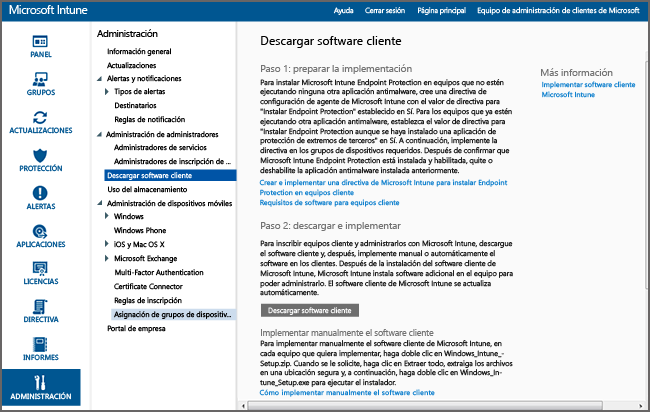

---
# required metadata

title: Instalar al cliente de equipos Windows con Microsoft Intune | Microsoft Intune
description:
keywords:
author: NathBarn
manager: jeffgilb
ms.date: 04/28/2016
ms.topic: article
ms.prod:
ms.service: microsoft-intune
ms.technology:
ms.assetid: 64c11e53-8d64-41b9-9550-4b4e395e8c52

# optional metadata

#ROBOTS:
#audience:
#ms.devlang:
ms.reviewer: jeffgilb
ms.suite: ems
#ms.tgt_pltfrm:
#ms.custom:

---

# Instalar al cliente de equipos Windows con Microsoft Intune
Siga esta guía para administrar sus equipos Windows con el software cliente de Microsoft Intune.

## Antes de empezar
Antes de empezar a instalar el software cliente de Intune, lea el tema [Resolver conflictos de directivas de Microsoft Intune y GPO](resolve-gpo-and-microsoft-intune-policy-conflicts.md) para comprender los preparativos que debe realizar para instalar el cliente correctamente. Después vuelva a estas instrucciones.

## Instalar el cliente
Siga estos pasos para instalar el cliente:

-   [Para descargar el software cliente](#to-download-the-client-software)

A continuación, use uno o varios de los métodos siguientes para instalar el cliente:

-   [Para implementar manualmente el software cliente](#to-manually-deploy-the-client-software)

-   [Para implementar automáticamente el software cliente mediante la directiva de grupo](#to-automatically-deploy-the-client-software-by-using-group-policy)

-   [Qué deben hacer los usuarios para inscribir automáticamente sus equipos](#how-users-can-self-enroll-their-computers)

-   [Instalar el software cliente de Microsoft Intune como parte de una imagen](#install-the-microsoft-intune-client-software-as-part-of-an-image)

Si ya no tiene que administrar un equipo con Intune, puede retirar el equipo, lo que también implica quitar el software cliente del equipo. Para obtener más información, consulte [Tareas comunes de administración de PC Windows con el cliente de equipo de Microsoft Intune](common-windows-pc-management-tasks-with-the-microsoft-intune-computer-client.md)..

### Para descargar el software cliente

1.  En la [consola de administración de Microsoft Intune](https://manage.microsoft.com/), haga clic en **Administración** &gt; **Descarga de software cliente**.

  

2.  En la página **Descargar software cliente**, haga clic en **Descargar software cliente** y guarde el paquete **Microsoft_Intune_Setup.zip** que contiene el software en una ubicación segura de la red.

    > [!NOTE]
    > El paquete de instalación del software cliente de Intune contiene información sobre su cuenta. Si usuarios no autorizados obtienen acceso al paquete de instalación, pueden inscribir los equipos en la cuenta representada por el certificado incrustado.

3.  Extraiga el contenido del paquete de instalación en la ubicación segura de la red.

    > [!IMPORTANT]
    > No cambie de nombre ni quite el archivo **ACCOUNTCERT** extraído; de lo contrario, la instalación del software cliente no funcionará.

### Para implementar manualmente el software cliente

1.  En un equipo, vaya a la carpeta donde están ubicados los archivos de instalación del software cliente y ejecute **Microsoft_Intune_Setup.exe** para instalar el software cliente.

    > [!NOTE]
    > El estado de la instalación se muestra al colocar el puntero sobre el icono de la barra de tareas en el equipo cliente.

### Para implementar automáticamente el software cliente mediante la directiva de grupo

1.  En la carpeta que contiene los archivos **Microsoft_Intune_Setup.exe** y **MicrosoftIntune.accountcert**, ejecute el siguiente comando para extraer los programas de instalación basados en Windows Installer para equipos de 32 bits y 64 bits:

    ```
    Microsoft_Intune_Setup.exe/Extract <destination folder>
    ```

2.  Copie los archivos **Microsoft_Intune_x86.msi**, **Microsoft_Intune_x64.msi** y **MicrosoftIntune.accountcert** en una ubicación de red a la que tengan acceso todos los equipos en los que se va a instalar el software cliente.

    > [!IMPORTANT]
    > No separe los archivos ni cambie sus nombres; de lo contrario, se producirá un error en la instalación del software cliente.

3.  Use la directiva de grupo para implementar el software en los equipos de la red.

    Para obtener más información acerca de cómo utilizar la directiva de grupo para implementar software automáticamente, consulte la documentación de Windows Server.

### Qué deben hacer los usuarios para inscribir automáticamente sus equipos
Los usuarios finales pueden inscribir por sí mismos cada uno de sus equipos a través del Portal de empresa de Intune. Cada equipo inscrito está vinculado a la cuenta de usuario que se utilizó para instalar el software cliente.

> [!NOTE]
> -   Para poder instalar el software cliente, el usuario debe ser administrador del equipo.
> -   La inscripción automática requiere que esté instalado Internet Explorer en el equipo cliente.
> -   Cada vez que un usuario inscribe automáticamente un equipo, usa una licencia de Intune.
> -   Debe usar una cuenta profesional o educativa para inscribir automáticamente un equipo. No se puede inscribir automáticamente un equipo con una cuenta Microsoft.
> -   Si el software cliente ya está instalado en un equipo, el usuario final verá un error.

### Para inscribir automáticamente un equipo (información para usuarios finales)

1.  Inicie sesión en el portal de empresa desde el equipo que desea inscribir.

2.  Haga clic en **Agregar dispositivo**..

3.  Haga clic en **Descargar software** y, después, en **Ejecutar**..

4.  Haga clic en **Siguiente** para iniciar el Asistente para la instalación de Microsoft Intune.

5.  Cuando haya finalizado el asistente para la instalación, haga clic en **Finalizar**..

### Instalar el software cliente de Microsoft Intune como parte de una imagen
El software cliente de Intune se pueden implementar en equipos como parte de una imagen de sistema operativo. Para ello, puede usar como base el siguiente procedimiento de ejemplo:

1.  Copie los archivos de instalación del cliente, **Microsoft_Intune_Setup.exe** y **MicrosoftIntune.accountcert**, en la carpeta **%Systemdrive%\Temp\Microsoft_Intune_Setup** del equipo de referencia.

2.  Cree la entrada **WindowsIntuneEnrollPending** en el Registro agregando el siguiente comando al script **SetupComplete.cmd** :

    ```
    %windir%\system32\reg.exe add HKEY_LOCAL_MACHINE\Software\Microsoft\Onlinemanagement\Deployment /v
    WindowsIntuneEnrollPending /t REG_DWORD /d 1
    ```

3.  Agregue el siguiente comando a **setupcomplete.cmd** para ejecutar el paquete de inscripción con el argumento de línea de comandos /PrepareEnroll:

    ```
    %systemdrive%\temp\Microsoft_Intune_Setup\Microsoft_Intune_Setup.exe /PrepareEnroll
    ```
    > [!TIP]
    > El script **SetupComplete.cmd** permite que el programa de instalación de Windows realice modificaciones en el sistema antes de que un usuario inicie sesión. El argumento de línea de comandos **/PrepareEnroll** prepara un equipo de destino para inscribirse automáticamente en Intune cuando haya finalizado la instalación de Windows.

4.  Coloque **SetupComplete.cmd** en la carpeta **%Windir%\Setup\Scripts** del equipo de referencia.

5.  Capture una imagen del equipo de referencia y, a continuación, impleméntela en los equipos de destino.

Cuando se reinicie el equipo de destino al finalizar la instalación de Windows, se creará la clave **WindowsIntuneEnrollPending** en el Registro. El paquete de inscripción comprueba si el equipo está inscrito. Si el equipo está inscrito, no se realiza ninguna otra acción. Si el equipo no está inscrito, el paquete de inscripción crea una tarea de inscripción automática de Microsoft Intune.

Cuando se ejecuta la tarea de inscripción automática a la siguiente hora programada, se comprueba la existencia del valor **WindowsIntuneEnrollPending** en el Registro y se intenta inscribir el equipo de destino en Intune. Si por algún motivo se produjera un error en la inscripción, se reintentará la inscripción la próxima vez que se ejecute la tarea. Los reintentos continuarán durante un mes.

La tarea de inscripción automática de Intune, el valor **WindowsIntuneEnrollPending** del Registro y el certificado de cuenta se eliminarán del equipo de destino cuando se haya inscrito correctamente o al cabo de un mes.

## Supervisión y validación de una implementación correcta del cliente
Use uno de los procedimientos siguientes como ayuda para supervisar y validar una implementación correcta del cliente.

### Para comprobar la instalación del software cliente mediante la consola de administrador de Microsoft Intune

1.  En la [consola de administración de Microsoft Intune](https://manage.microsoft.com/), haga clic en **Grupos** &gt; **Todos los dispositivos** &gt; **Todos los equipos**..

2.  Desplácese hacia abajo en la lista de equipos y busque los equipos administrados que se estén comunicando con Intune o busque un equipo administrado específico escribiendo el nombre o una parte del nombre del equipo en el cuadro **Buscar dispositivos**.

3.  Examine el estado del equipo en el panel inferior de la consola y resuelva los errores.

### Para crear un informe de inventario de equipo que muestre todos los equipos inscritos

1.  En la [consola de administración de Microsoft Intune](https://manage.microsoft.com/), haga clic en **Informes** &gt; **Informes de inventario de equipos**..

2.  En la página **Crear nuevo informe**, deje los valores predeterminados en todos los campos (a menos que desee aplicar filtros) y haga clic en **Ver informe**..

3.  Se abre la página de **Informe de inventario de equipos** en una nueva ventana que muestra todos los equipos que están inscritos correctamente en Intune.

    > [!TIP]
    > Para ordenar la lista del informe por el contenido de una columna, haga clic en el encabezado de esa columna.


### Véase también
[Administrar equipos Windows con Microsoft Intune](manage-windows-pcs-with-microsoft-intune.md)


<!--HONumber=May16_HO1-->


