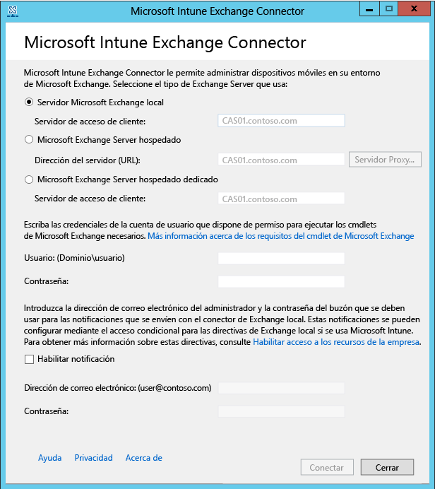

# Instalar Intune On-Premises Exchange Connector

Para configurar una conexión que permita que Microsoft Intune se comunique con el servidor Exchange que hospeda los buzones de los dispositivos móviles, se debe descargar y configurar la herramienta On-Premises Connector desde la consola de administrador de Intune. Intune solo admite una conexión de Exchange Connector de cualquier tipo por suscripción.

## Requisitos para On-Premises Connector
En la siguiente tabla se indican los requisitos del equipo en el que se instala On-Premises Exchange Connector.

|Requisito|Más información|
|---------------|--------------------|
|Sistemas operativos|Intune admite On-Premises Exchange Connector en equipos que ejecuten las ediciones Windows Server 2008 SP2 de 64 bits, Windows Server 2008 R2, Windows Server 2012 o Windows Server 2012 R2.  El conector no es compatible con instalaciones de Server Core.|
|Versión de Microsoft Exchange|On-Premises Connector requiere Microsoft Exchange 2010 SP1 o una versión posterior o Exchange Online dedicado heredado. Para determinar si la configuración de su entorno Exchange Online dedicado es **nueva** o **heredada**, póngase en contacto con su administrador de cuentas.|
|Entidad de administración de dispositivos móviles| [Establecer la entidad de administración de dispositivos móviles en Intune](get-ready-to-enroll-devices-in-microsoft-intune.md#set-mobile-device-management-authority).|
|Hardware|El equipo donde se instala el conector debe cumplir como mínimo los requisitos de hardware siguientes: CPU de 1,6 GHz con 2 GB de RAM y 10 GB de espacio libre en disco.|
|Sincronización de Active Directory|Para poder usar cualquiera de estos conectores para conectar Intune a su servidor Exchange Server, debe [configurar la sincronización de Active Directory](/intune/get-started/start-with-a-paid-subscription-to-microsoft-intune-step-3) de forma que los usuarios locales y los grupos de seguridad estén sincronizados con su instancia de Azure Active Directory.|
|Software adicional|El equipo que hospede el conector debe tener una instalación completa de Microsoft .NET Framework 4 y Windows PowerShell 2.0.|
|Red|El equipo en el que se instala el conector debe estar en un dominio que tenga una relación de confianza con el dominio que hospeda Exchange Server.  El equipo requiere configuraciones que le permitan obtener acceso al servicio de Intune a través de firewalls y servidores proxy mediante los puertos 80 y 443. Entre los dominios usados por Intune están manage.microsoft.com, &#42;manage.microsoft.com y &#42;.manage.microsoft.com.|
|Hosted Exchange configurado y en ejecución|Consulte [Exchange Server 2016](https://technet.microsoft.com/library/mt170645.aspx) para obtener más información. |

### Requisitos del cmdlet de Exchange

Debe crear una cuenta de usuario de Active Directory que sea utilizada por Intune Exchange Connector. La cuenta debe tener permiso para ejecutar los siguientes cmdlets de Windows PowerShell Exchange necesarios:

 -   Get-ActiveSyncOrganizationSettings, Set-ActiveSyncOrganizationSettings
 -   Get-CasMailbox, Set-CasMailbox
 -   Get-ActiveSyncMailboxPolicy, Set-ActiveSyncMailboxPolicy, New-ActiveSyncMailboxPolicy, Remove-ActiveSyncMailboxPolicy
 -   Get-ActiveSyncDeviceAccessRule, Set-ActiveSyncDeviceAccessRule, New-ActiveSyncDeviceAccessRule, Remove-ActiveSyncDeviceAccessRule
 -   Get-ActiveSyncDeviceStatistics
 -   Get-ActiveSyncDevice
 -   Get-ExchangeServer
 -   Get-ActiveSyncDeviceClass
 -   Get-Recipient
 -   Clear-ActiveSyncDevice, Remove-ActiveSyncDevice
 -   Set-ADServerSettings
 -   Get-Command

## Descargar el paquete de instalación de software de On-Premises Exchange Connector

1. En un sistema operativo Windows Server compatible con On-Premises Exchange Connector, abra la [consola de administración de Microsoft Intune](http://manage.microsoft.com) (http://manage.microsoft.com) con una cuenta de administrador en el inquilino de Exchange que tenga una licencia para usar Exchange Server.

2.  En el panel de accesos directos del área de trabajo, elija **Administración**, vaya a **Administración de dispositivos móviles** > **Microsoft Exchange** y luego elija **Configurar conexión de Exchange**.

3.  En la página **Configurar conexión de Exchange**, haga clic en **Descargar On-Premises Connector**.

4.  On-Premises Exchange Connector se encuentra en una carpeta comprimida (.zip) que se puede abrir o guardar. En el cuadro de diálogo **Descarga de archivos**, haga clic en **Guardar** para almacenar la carpeta comprimida en una ubicación segura.

> [!IMPORTANT]
> No cambie el nombre ni mueva los archivos de la carpeta On-Premises Exchange Connector. Si lo hace, se interrumpirá la instalación.

## Instalar y configurar Intune On-Premises Exchange Connector
Siga estos pasos para instalar Intune On-Premises Exchange Connector. On-Premises Exchange Connector solo puede instalarse una vez y en un solo equipo por cada suscripción de Intune. Si intenta configurar otro On-Premises Exchange Connector, se reemplazará la conexión original con la nueva.

1.  En un sistema operativo compatible con On-Premises Connector, extraiga los archivos de **Exchange_Connector_Setup.zip** en una ubicación segura.

2.  Una vez extraídos los archivos, abra la carpeta extraída y haga doble clic en **Exchange_Connector_Setup.exe** para instalar On-Premises Exchange Connector.

    > [!IMPORTANT]
    > Si la carpeta de destino no es una ubicación segura, debe eliminar el archivo de certificado **WindowsIntune.accountcert** después de instalar On-Premises Connector.

3.  En el campo **Exchange Server**, seleccione su tipo de entorno de Exchange Server, bien **On-premises Microsoft Exchange Server (Microsoft Exchange Server local)** o **Microsoft Exchange Server hospedado**.

  

  Para un servidor Exchange local, proporcione el nombre del servidor o el nombre de dominio completo del servidor Exchange que hospeda el rol de **servidor de acceso de cliente**.

  Para un servidor de Exchange hospedado, proporcione la dirección del servidor Exchange. Para buscar la dirección URL del servidor Exchange hospedado:

      1.  Abra Outlook Web App para Office 365.

      2.  Elija el "?" en la parte superior izquierda y seleccione **Acerca de**.

      3.  Busque el valor **Servidor externo POP** .

      4.  Elija **Servidor proxy** para especificar la configuración del servidor proxy para el servidor Exchange hospedado.
        1.  Seleccione **Usar un servidor proxy al sincronizar información de dispositivos móviles**.

        2.  Escriba el **nombre del servidor proxy** y el **número de puerto** que se utilizará para tener acceso al servidor.

        3.  Si es necesario proporcionar las credenciales de usuario para acceder al servidor proxy, seleccione Usar credenciales para conectarse al servidor proxy, y escriba el **dominio\usuario** y la **contraseña**.

        4.  Elija **Aceptar**.

5.  Proporcione las credenciales **Usuario (Dominio\Usuario)** y **Contraseña** necesarias para conectarse al servidor Exchange.

6.  Proporcione las credenciales administrativas necesarias para enviar notificaciones al buzón de Exchange de un usuario. Estas notificaciones se pueden configurar a través de directivas de acceso condicional mediante Intune.

    Asegúrese de que el servicio de detección automática y servicios Web Exchange están configurados en el servidor de acceso de cliente de Exchange. Para obtener más información al respecto, consulte [Servidor de acceso de cliente](https://technet.microsoft.com/library/dd298114.aspx).

7.  En el campo **Contraseña**, indique la contraseña de la cuenta para permitir que Intune obtenga acceso al servidor Exchange.

8. Elija **Conectar**.

    La configuración de la conexión puede tardar unos minutos.

Durante la configuración, Exchange Connector guarda la configuración de proxy para permitir el acceso a Internet. Si cambia la configuración de proxy, tendrá que volver a configurar Exchange Connector para aplicarle la configuración de proxy actualizada.

Después de que Exchange Connector configure la conexión, los dispositivos móviles asociados a los usuarios administrados en Exchange Connector se sincronizan automáticamente y se agregan a la Exchange Connector. Esta sincronización puede tardar algún tiempo en completarse.

> [!NOTE]
> Si ha instalado On-Premises Exchange Connector y en algún punto elimina la conexión de Exchange, deberá desinstalar On-Premises Exchange Connector del equipo en el que se instaló.

## Validar la conexión de Exchange

Después de haber configurado correctamente Exchange Connector, puede ver el estado de la conexión y la última sincronización correcta. En la [consola de administración de Microsoft Intune](http://manage.microsoft.com), seleccione el área de trabajo **Administración** y, en **Administración de dispositivos móviles**, seleccione **Microsoft Exchange** y compruebe que los detalles que ha facilitado aparecen en **Información de conexión de Exchange**.

También puede comprobar la fecha y la hora del último intento de sincronización correcto.

<!--HONumber=Jul16_HO5-->

