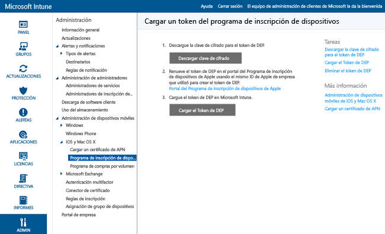

---
# required metadata

title: Administración de DEP de Apple para dispositivos iOS con Microsoft Intune | Microsoft Intune
description:
keywords:
author: NathBarn
manager: jeffgilb
ms.date: 04/28/2016
ms.topic: article
ms.prod:
ms.service: microsoft-intune
ms.technology:
ms.assetid: 8ff9d9e7-eed8-416c-8508-efc20fca8578

# optional metadata

#ROBOTS:
#audience:
#ms.devlang:
ms.reviewer: jeffgilb
ms.suite: ems
#ms.tgt_pltfrm:
#ms.custom:

---

# Inscribir dispositivos iOS de la empresa mediante el Programa de inscripción de dispositivos
Microsoft Intune puede implementar un perfil de inscripción “de forma inalámbrica” para los dispositivos iOS adquiridos a través del programa de inscripción de dispositivos de Apple (DEP). El paquete de inscripción puede incluir opciones de asistente de instalación para el dispositivo. Los usuarios no pueden anular la inscripción de dispositivos inscritos a través de DEP.

## Administración de DEP de Apple para dispositivos iOS con Microsoft Intune
Para administrar dispositivos iOS de empresa con el programa de inscripción de dispositivos (DEP) de Apple, la organización debe unirse a DEP de Apple y adquirir dispositivos a través de ese programa. Puede consultar los detalles de este proceso en:  [https://deploy.apple.com](https://deploy.apple.com). Las ventajas del programa incluyen dispositivos configurados con manos libres sin necesidad de conectar cada dispositivo mediante USB a un equipo.

Para poder inscribir dispositivos iOS de empresa con DEP, necesita un token de DEP de Apple. Este token permite a Intune sincronizar información sobre dispositivos propiedad de la empresa que participan en DEP. También permite a Intune realizar cargas de perfiles de inscripción a Apple y asignar dispositivos a esos perfiles.

1.  **Empezar a administrar dispositivos iOS con Microsoft Intune**
    Para poder inscribir dispositivos del programa de inscripción de dispositivos (DEP) iOS, debe habilitar la opción de administación iOS para Intune.

2.  **Obtener una clave de cifrado**
    Como usuario administrativo, abra la [consola de administración de Microsoft Intune](http://manage.microsoft.com), vaya a **Administrador** &gt; **Administración de dispositivos móviles** &gt; **iOS** &gt; **Programa de inscripción de dispositivos** y haga clic en **Descargar clave de cifrado**. Guarde el archivo de clave de cifrado (.pem) localmente. El archivo .pem se usa para solicitar un certificado de relación de confianza en el portal del Programa de Inscripción de Dispositivos de Apple.

      

3.  **Obtener un token del programa de inscripción de dispositivos**
    Vaya al [portal del Programa de inscripción de dispositivos](https://deploy.apple.com) (https://deploy.apple.com) e inicie sesión con su identificador de Apple de empresa. Este identificador de Apple debe usarse posteriormente para renovar el token de DEP.

    1.  En el [Portal del Programa de inscripción de dispositivos](https://deploy.apple.com), vaya a **Programa de inscripción de dispositivos** &gt; **Administrar servidores** y, después, haga clic en **Add MDM Server** (Agregar servidor MDM)..

    2.  Escriba el **nombre del servidor MDM** y, a continuación, haga clic en **Siguiente**. El nombre del servidor es su referencia para identificar el servidor MDM. No es el nombre o la dirección URL del servidor de Microsoft Intune.

    3.  Se abre el cuadro de diálogo **Agregar &lt;NombreDeServidor&gt;**. Haga clic en **Elegir archivo...** para cargar el archivo .pem y, después, haga clic en **Siguiente**..

    4.  En el cuadro de diálogo **Agregar &lt;NombreDeServidor&gt;** muestra el vínculo **Your Server Token** (Su token de servidor). Descargue el archivo de token de servidor (.p7m) en el equipo y, después, haga clic en **Listo**..

    Este archivo de certificado (.p7m) se usa para establecer una relación de confianza entre los servidores de Intune y los del Programa de Inscripción de Dispositivos de Apple.

4.  **Agregar el token de DEP a Intune**
    En la [consola de administración de Microsoft Intune](http://manage.microsoft.com), vaya a **Administrador** &gt; **Administración de dispositivos móviles** &gt; **iOS** &gt; **Programa de inscripción de dispositivos** y haga clic en **Cargar el token de DEP**. **Busque** el archivo de certificado (.p7m), escriba su **ID de Apple** y haga clic en **Cargar**.

5.  **Agregar la directiva de inscripción de dispositivos corporativos**
    En la [consola de administración de Microsoft Intune](http://manage.microsoft.com), vaya a **Directiva** &gt; **Inscripción de dispositivos corporativos** y haga clic en **Agregar**. Proporcione los detalles de **General** , incluidos los de **Nombre** y **Descripción**, especifique si los dispositivos asignados al perfil tienen afinidad de usuario o pertenecen a un grupo y, después, habilite la opción **Configure los ajustes del Programa de inscripción de dispositivos para esta directiva** para permitir el uso de DEP. Los **paneles de Asistente para la instalación** definen la configuración de dispositivos iOS que se definió durante la instalación.

      

6.  **Asignar dispositivos DEP para la administración**
    Vaya al [portal del Programa de inscripción de dispositivos](https://deploy.apple.com) (https://deploy.apple.com) e inicie sesión con su identificador de Apple de empresa. Vaya a **Programa de implementación** &gt; **Programa de inscripción de dispositivos** &gt; **Administrar dispositivos**. Especifique cómo va a **elegir los dispositivos**, proporcione información del dispositivo y especifique los detalles de cada dispositivo, como **Número de serie**y **Número de pedido**, o seleccione **Cargar archivo CSV**. A continuación, seleccione **Asignar al servidor**, seleccione el &lt;NombreDeServidor&gt; especificado para Microsoft Intune y, después, haga clic en **Aceptar**..

7.  **Sincronizar dispositivos administrados por DEP**
    Como usuario administrativo, abra la [consola de administración de Microsoft Intune](http://manage.microsoft.com), vaya a **Administrador** &gt; **Administración de dispositivos móviles** &gt; **iOS** &gt; **Programa de inscripción de dispositivos** y haga clic en **Sincronizar ahora**. Se envía una solicitud de sincronización a Apple. Para ver los dispositivos administrados mediante DEP después de la sincronización, en la [consola de administración de Microsoft Intune](http://manage.microsoft.com) vaya a **Grupos** &gt; **Todos los dispositivos corporativos**. En el área de trabajo **Dispositivos corporativos**, el **Estado** de los dispositivos administrados es "No contactado" hasta que el dispositivo se encienda y ejecute el Asistente de configuración para inscribir el dispositivo.

    Para cumplir con las condiciones de Apple relativas a un tráfico DEP aceptable, Intune impone las restricciones siguientes:
     -  Una sincronización completa de DEP no se puede ejecutar más de una vez cada 7 días. Durante una sincronización completa, Intune actualiza todos los números de serie que Apple asignó a Intune, independientemente de si el número de serie se ha sincronizado previamente o no. Si se intenta efectuar una sincronización completa sin que hayan pasado 7 días desde la última sincronización completa, Intune solo actualizará los números de serie que aún no aparezcan en Intune.
     -  Las solicitudes de sincronización tardan 10 minutos en completarse. Durante este tiempo, o hasta que la solicitud finalice correctamente, el botón de sincronización está deshabilitado.

8.  **Distribuir los dispositivos a los usuarios**
    Los dispositivos corporativos ahora pueden distribuirse a los usuarios. Los dispositivos iOS quedan inscritos para su administración mediante Intune al activarlos.

### Consulte también
[Preparar la inscripción de dispositivos](get-ready-to-enroll-devices-in-microsoft-intune.md)

<!--HONumber=May16_HO1-->

