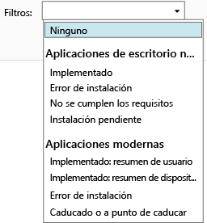

# Supervisar la implementación de aplicaciones en Microsoft Intune

## Supervisar la implementación de una aplicación
En la consola de administración de Intune puede ver las aplicaciones que administra y el estado de las implementaciones.

### Para ver las aplicaciones que administra y su estado
En el área de trabajo **Aplicaciones**, haga clic en el nodo **Aplicaciones** y otra vez en **Aplicaciones**.

Se mostrará la lista de las aplicaciones que administra. Puede hacer clic en cualquier aplicación para ver el estado de la instalación en el panel inferior de las ventanas de la consola. Haga clic en este estado para ver más detalles. Por ejemplo, si se muestra el estado **1 usuario tiene este software disponible**, puede hacer clic en el mensaje para ver el nombre del usuario.

> [!TIP]
> Puede usar la lista desplegable **Filtros** para mostrar solo las aplicaciones que cumplen los criterios que especifique, como las aplicaciones que no se pudieron instalar o las aplicaciones que se implementaron correctamente.
> 
> 

Además, el área de trabajo **Panel** muestra información general sobre el estado de las aplicaciones. Si hace clic en cualquier parte de la información general, accederá a la lista de aplicaciones.

## Para ver información más detallada sobre una aplicación
En la lista de aplicaciones, seleccione cualquier aplicación y haga clic en **Ver propiedades**.

En la página **Propiedades del software** de la aplicación, haga clic en una de estas pestañas: **General**, para ver información general sobre la aplicación y su estado de instalación; **Dispositivos**, para ver los dispositivos que instalaron correctamente una implementación dirigida de la aplicación; **Usuarios**, para ver los usuarios en cuyos dispositivos se instaló correctamente una implementación dirigida de la aplicación.

Al igual que antes, puede usar la lista desplegable **Filtros** para configurar los valores mostrados en cada una de las pestañas.

<!--HONumber=Jun16_HO4-->

