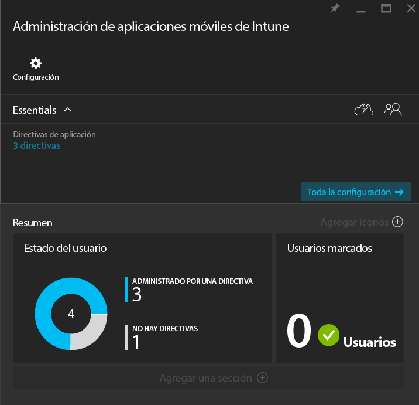
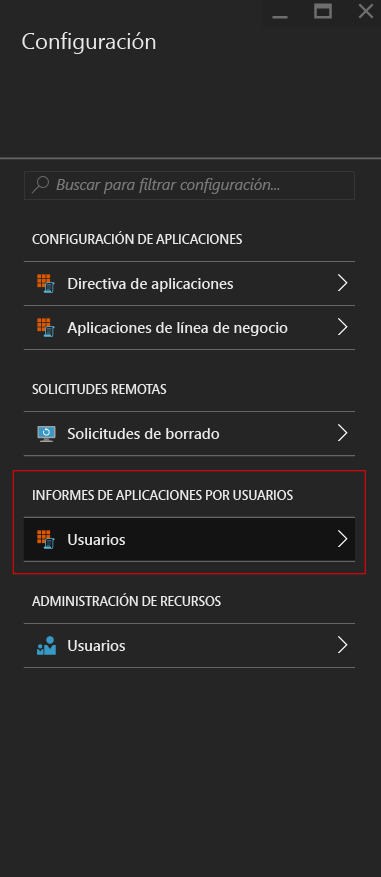
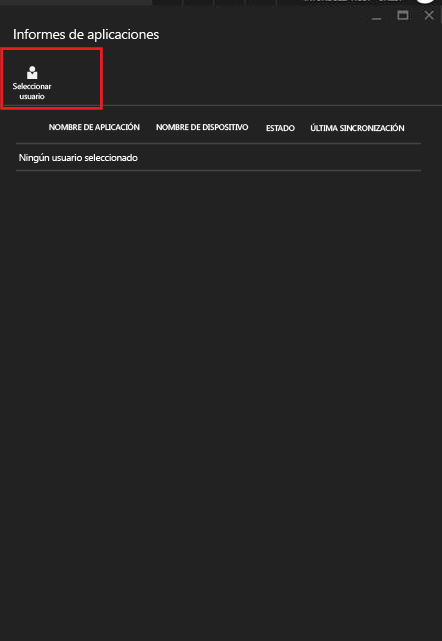
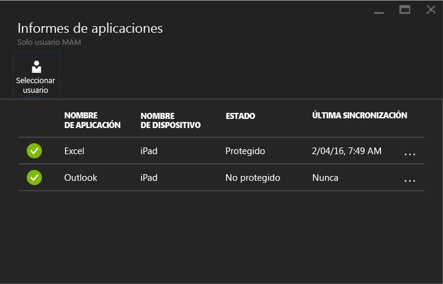

---
# required metadata

title: Supervisión de directivas de administración de aplicaciones móviles con Microsoft Intune | Microsoft Intune
description:
keywords:
author: karthikaraman
manager: jeffgilb
ms.date: 04/28/2016
ms.topic: article
ms.prod:
ms.service: microsoft-intune
ms.technology:
ms.assetid: d3aa6c74-6b5d-4b50-aa66-a040ec44393e

# optional metadata

#ROBOTS:
#audience:
#ms.devlang:
ms.reviewer: jeffgilb
ms.suite: ems
#ms.tgt_pltfrm:
#ms.custom:

---

# Supervisión de directivas de administración de aplicaciones móviles con Microsoft Intune
Después de configurar una directiva MAM y aplicarla a los usuarios, puede supervisar el estado de cumplimiento en el portal de Azure. El portal de Azure incluye información sobre los usuarios afectados por la directiva, el estado de cumplimiento y cualquier problema que puedan estar experimentando los usuarios finales.
## Vista Resumen
La hoja **Administración de aplicaciones móviles de Intune** muestra un resumen del estado de cumplimiento, tal como se describe a continuación:

-   **USUARIOS:** número total de usuarios de la empresa que usan las aplicaciones que están asociadas a la directiva.

-   **ADMINISTRADO POR UNA DIRECTIVA:** número de usuarios que han usado al menos una de las aplicaciones en un contexto de trabajo.

-   **NINGUNA DIRECTIVA:** número de usuarios que usan las aplicaciones asociadas a la directiva, pero a los que no se les aplica la directiva.  Puede agregar estos usuarios a la directiva.

- **Usuarios marcados:** número de usuarios que experimentan problemas. Actualmente, solo los usuarios con dispositivos descodificados aparecen como **Usuarios marcados**..

## Vista detallada
Puede ver la vista detallada del resumen haciendo clic en las ventanas **Estado del usuario** y **Usuarios marcados**.

### Estado del usuario
Puede buscar un solo usuario y examinar su estado de cumplimiento. La hoja **Informes de aplicaciones** muestra la siguiente información sobre el usuario seleccionado:
- Dispositivos que están asociados a la cuenta de usuario
- Aplicaciones con la directiva MAM instaurada en el dispositivo
- Estado:

  **Protegido:** significa que la directiva se implementó para el usuario y que la aplicación se usó al menos una vez en el contexto de trabajo.

  **No protegido:** significa que la directiva se implementó para el usuario, pero la aplicación no se ha usado desde entonces en el contexto de trabajo.

Para ver los informes sobre un usuario, siga estos pasos:

**Paso 1:** para seleccionar un usuario, haga clic en la ventana Resumen o seleccione la opción **INFORMES DE APLICACIONES POR USUARIOS** en la hoja **Configuración**, tal como se muestra a continuación:

**Paso 2:** se abrirá la hoja **Informes de aplicaciones**. Elija **Seleccionar usuario** para buscar un usuario de Azure Active Directory.

**Paso 3:** después de seleccionar el usuario de la lista, verá los detalles del estado de cumplimiento correspondientes a ese usuario.

### Usuarios marcados
La vista detallada muestra el mensaje de error, la aplicación usada cuando se produjo el error, la plataforma del dispositivo y una marca de tiempo.  

### Consulte también
[Administrar la transferencia de datos entre aplicaciones iOS](manage-data-transfer-between-ios-apps-with-microsoft-intune.md)

[Experiencia del usuario final en aplicaciones habilitadas para MAM](end-user-experience-for-mam-enabled-apps-with-microsoft-intune.md)

<!--HONumber=May16_HO1-->

