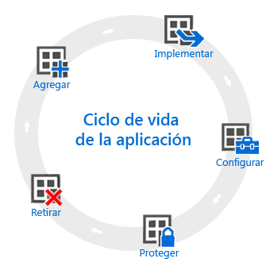

# Información general sobre el ciclo de vida de la aplicación

El ciclo de vida de la aplicación de Intune empieza cuando se agrega una aplicación, se extiende a través de otras fases y termina cuando se quita.

## Agregar

El primer paso en la implementación de la aplicación es agregar a Intune las aplicaciones que quiere administrar e implementar. Aunque hay muchos tipos diferentes de aplicaciones con las que puede trabajar, los procedimientos básicos son los mismos. Con Intune, puede agregar aplicaciones para [dispositivos inscritos](add-apps-for-mobile-devices-in-microsoft-intune.md) y para [equipos con Windows administrados con el software cliente de Intune](add-apps-for-windows-pcs-in-microsoft-intune.md).

## Implementar

Después de agregar la aplicación a Intune, puede [implementarla en los dispositivos que administre](deploy-apps.md). Intune facilita este proceso. Después de implementar la aplicación, puede [supervisar el éxito](monitor-apps-in-microsoft-intune.md) de la implementación desde la consola de administración de Intune. Además, en algunas tiendas de aplicaciones, como las de [Apple](manage-ios-apps-you-purchased-through-a-volume-purchase-program-with-microsoft-intune.md) y [Windows](manage-apps-you-purchased-from-the-windows-store-for-business-with-microsoft-intune.md), puede comprar licencias de aplicación en masa para la empresa. Intune puede sincronizar datos con estas tiendas para permitirle implementar y realizar un seguimiento del uso de licencias de estos tipos de aplicaciones directamente desde la consola de administración de Intune.

## Configurar

Como parte del ciclo de vida de la aplicación, periódicamente se publican nuevas versiones de aplicaciones. Intune proporciona herramientas para [actualizar aplicaciones](update-apps-using-microsoft-intune.md) que haya implementado en una versión más reciente con facilidad. Además, puede configurar funcionalidad adicional para algunas aplicaciones, como:
- Las [directivas de configuración de aplicaciones iOS](configure-ios-apps-with-mobile-app-configuration-policies-in-microsoft-intune.md) proporcionan valores para aplicaciones iOS compatibles que se usan cuando se ejecuta la aplicación. Por ejemplo, es posible que una aplicación necesite una configuración de marca concreta o el nombre de un servidor al que conectarse.
- Las [directivas de explorador administrado](manage-internet-access-using-managed-browser-policies.md) ayudan a configurar los valores del explorador administrado de Intune que reemplaza al explorador de dispositivos predeterminado y que permite restringir los sitios web que pueden visitar los usuarios.

## Proteger

Intune ofrece muchas maneras de ayudar a proteger los datos de las aplicaciones. Los métodos principales son:
- El [acceso condicional](restrict-access-to-email-and-o365-services-with-microsoft-intune.md) controla el acceso al correo electrónico y otros servicios en función de las condiciones especificadas. Dichas condiciones incluyen tipos de dispositivos o el cumplimiento de una [directiva de cumplimiento de dispositivos](introduction-to-device-compliance-policies-in-microsoft-intune.md) que haya implementado.
- La [administración de aplicaciones móviles (MAM)](protect-app-data-using-mobile-app-management-policies-with-microsoft-intune.md) funciona con aplicaciones individuales para ayudar a proteger los datos empresariales que usan. Por ejemplo, puede restringir la copia de datos entre las aplicaciones no administradas y las aplicaciones que administre o evitar que las aplicaciones se ejecuten en dispositivos con jailbreak o rooting.

## Retirar

Por último, es probable que las aplicaciones que haya implementado queden obsoletas y tengan que quitarse. Intune facilita la [retirada de aplicaciones del servicio](retire-apps-using-microsoft-intune.md).

<!--HONumber=Oct16_HO4-->

