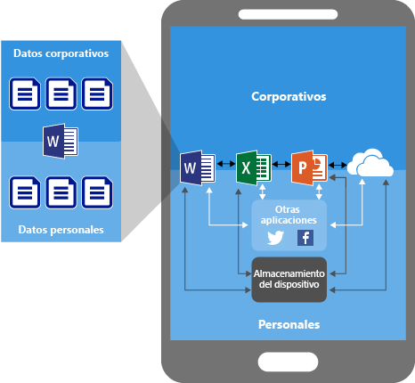
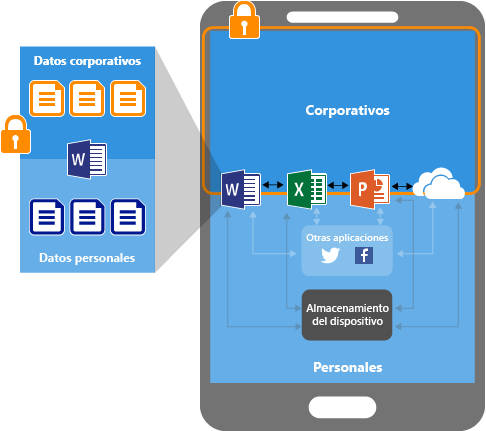
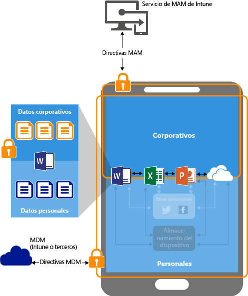
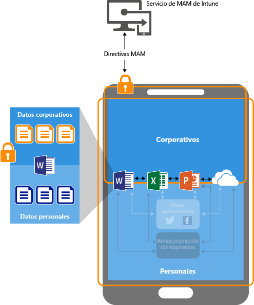

# Proteger datos de aplicación mediante directivas de administración de aplicaciones móviles con Microsoft Intune

## Cómo puede proteger los datos de la aplicación
Los empleados usan dispositivos móviles para tareas personales y de trabajo.  Mientras se asegura de que los empleados pueden ser productivos, también puede evitar la pérdida de datos, ya sea intencional o involuntaria.  Además, quiere tener la capacidad de proteger los datos de la empresa a los que se accede mediante dispositivos (incluso aquellos datos que usted no administre).

Puede usar directivas de administración de aplicaciones móviles (MAM) de Intune para ayudar a proteger los datos de la empresa. Dado que las directivas de MAM de Intune se pueden usar **independientemente de cualquier solución de administración de dispositivos móviles (MDM)**, puede usarlas para proteger los datos de la empresa con o sin inscripción de los dispositivos en una solución de administración de dispositivos. Mediante la implementación de **directivas de nivel de aplicación**, puede restringir el acceso a los recursos de la empresa y mantener los datos dentro del ámbito del departamento de TI.

Se pueden configurar directivas MAM para aplicaciones que se ejecutan en dispositivos que están:

- **Inscritos en Microsoft Intune:** los dispositivos de esta categoría son normalmente dispositivos corporativos.

-   **Inscritos en una solución de administración de dispositivos móviles (MDM) de otro fabricante:** los dispositivos de esta categoría son normalmente dispositivos corporativos.

  > [!NOTE]
  > Las directivas de administración de la aplicaciones móviles no deben usarse con soluciones de contenedor seguro ni de administración de aplicaciones móviles de terceros.

-   **No inscritos en ninguna solución de administración de dispositivos móviles:** los dispositivos de esta categoría normalmente son dispositivos de empleados no administrados ni inscritos en Intune ni en ninguna otra solución MDM.

> [!IMPORTANT]
> Puede crear directivas de administración de aplicaciones móviles para aplicaciones móviles de Office que se conectan a servicios de Office 365. Las directivas de MAM no son compatibles con las aplicaciones que se conectan a los servicios locales de Exchange, SharePoint o Skype Empresarial.

**Las ventajas principales del uso de directivas de MAM son:**

-   Protección de datos de su compañía a nivel de aplicación.  Puesto que la administración de aplicaciones móviles no requiere la administración de dispositivos, puede proteger los datos de la empresa en dispositivos administrados y no administrados. La administración se centra en la identidad del usuario, lo que elimina la necesidad de administrar dispositivos.

-   La productividad del usuario final no se ve afectada y no se aplican las directivas cuando se usa la aplicación en un contexto personal.  Las directivas se aplican solo en un contexto de trabajo, lo cual le ofrece la capacidad de proteger los datos de la compañía sin tocar los datos personales.

Hay otras ventajas derivadas del uso de MDM con directivas de MAM, y las empresas pueden usar MAM con y sin MDM al mismo tiempo. Por ejemplo, un empleado puede usar un teléfono de la compañía, así como una tableta personal.  En este caso, el teléfono de la compañía está inscrito en MDM y protegido por las directivas de MAM y el dispositivo personal está protegido únicamente por las directivas de MAM.

- **MDM garantiza que el dispositivo esté protegido**.  Por ejemplo, puede solicitar un PIN para acceder al dispositivo o puede implementar aplicaciones administradas en el dispositivo. También puede implementar aplicaciones en dispositivos a través de la solución MDM para proporcionarle más control sobre la administración de aplicaciones.

- **Las directivas MAM garantizan que las protecciones de la capa de aplicaciones estén establecidas**. Por ejemplo, puede solicitar un PIN para abrir una aplicación en un contexto de trabajo, o si se pueden compartidos datos entre aplicaciones, o evitar el almacenamiento de datos de aplicaciones de la compañía en una ubicación de almacenamiento personal.

### Actualmente las directivas de MAM se admiten en:
-   iOS 8.1 o posterior

-   Android 4 o posterior

Los dispositivos Windows no son compatibles actualmente.
##  Cómo protegen las directivas de MAM los datos de las aplicaciones

####  Aplicaciones sin directivas de MAM:

Cuando se usan aplicaciones sin restricciones, se pueden entremezclar los datos empresariales y personales.  Los datos de la compañía podrían acabar en ubicaciones como el almacenamiento personal o transferidas a aplicaciones fuera de su ámbito, lo cual provocaría una pérdida de datos. Las flechas del diagrama muestran el movimiento sin restricciones de los datos entre aplicaciones (personales y corporativas) y hacia ubicaciones de almacenamiento.

### Protección de datos con directivas de MAM:

Puede usar directivas de MAM para evitar que los datos de la empresa se guarden en el almacenamiento local del dispositivo y para restringir el movimiento de datos a otras aplicaciones que no estén protegidas por directivas de MAM. La configuración de las directivas de MAM incluye:
- Directivas de reubicación de datos como **Impedir "Guardar como"**, **Restringir cortar, copiar y pegar**.
- Opciones de directivas de acceso como **Requerir PIN sencillo para el acceso**, **Bloquear las aplicaciones administradas para que no se ejecuten en dispositivos con jailbreak o rooting**.

### Protección de datos con directivas de MAM en dispositivos administrados por una solución MDM:

**En dispositivos inscritos en una solución MDM**-

En la ilustración anterior se muestran las capas de protección que ofrecen las directivas de MAM y MDM juntas.

La solución MDM:

-   Inscribe el dispositivo.

-   Implementa las aplicaciones en el dispositivo

-   Proporciona administración y conformidad continua de los dispositivos

**Las directivas de MAM agregan valor de los siguientes modos:**

-   Ayudando a evitar la fuga de datos de la compañía a aplicaciones y servicios de consumidor

-   Aplicando restricciones (Guardar como, Portapapeles, PIN, etc.) a las aplicaciones móviles

-   Borrar datos de compañía de las aplicaciones sin borrar esas aplicaciones del dispositivo

### Protección de datos con directivas de MAM para dispositivos sin inscripción

En el diagrama anterior se muestra cómo funcionan las directivas de protección de datos en el nivel de aplicación sin MDM.

En los dispositivos BYOD no inscritos en ninguna solución MDM, las directivas de MAM pueden ayudar a proteger los datos de la compañía a nivel de aplicación.
Sin embargo, existen algunas limitaciones que se deben tener en cuenta, como:

-   No se puede implementar aplicaciones en el dispositivo.  El usuario final debe obtener las aplicaciones del almacén.

-   No se puede proporcionar perfiles de certificados en estos dispositivos.

-   No se puede proporcionar configuraciones de Wi-Fi y VPN de compañía en estos dispositivos.

## Varias identidades

Las aplicaciones que admiten varias identidades ofrecen la posibilidad de usar diferentes cuentas (profesional y personal) para acceder a las mismas aplicaciones mientras se apliquen directivas de MAM siempre que se usen en el contexto laboral.  

Por ejemplo, cuando el usuario final inicia la aplicación OneDrive con su cuenta profesional, no puede mover los archivos a una ubicación de almacenamiento personal. Sin embargo, cuando usa OneDrive con su cuenta personal, puede copiar y mover los datos de su OneDrive personal sin restricciones.  

Para obtener una explicación detallada de la experiencia de uso de aplicaciones asociadas con las directivas de MAM y cómo las aplicaciones con compatibilidad con varias identidades permiten aplicar directivas de MAM solo en el contexto laboral, consulte [Using apps with multi-identity support](end-user-experience-for-mam-enabled-apps-with-microsoft-intune.md#using-apps-with-multi-identity-support) (Uso de aplicaciones con compatibilidad con varias identidades).

Todas las aplicaciones móviles de Office admiten varias identidades.

##  Pasos siguientes
[Get ready to configure mobile app management policies (Preparación para configurar directivas de administración de aplicaciones móviles)](get-ready-to-configure-mobile-app-management-policies-with-microsoft-intune.md)

[Crear e implementar directivas de administración de aplicaciones móviles con Microsoft Intune](create-and-deploy-mobile-app-management-policies-with-microsoft-intune.md)

<!--HONumber=Jul16_HO4-->

