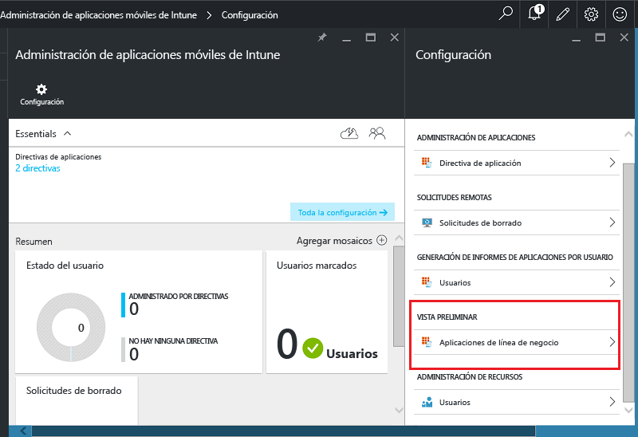
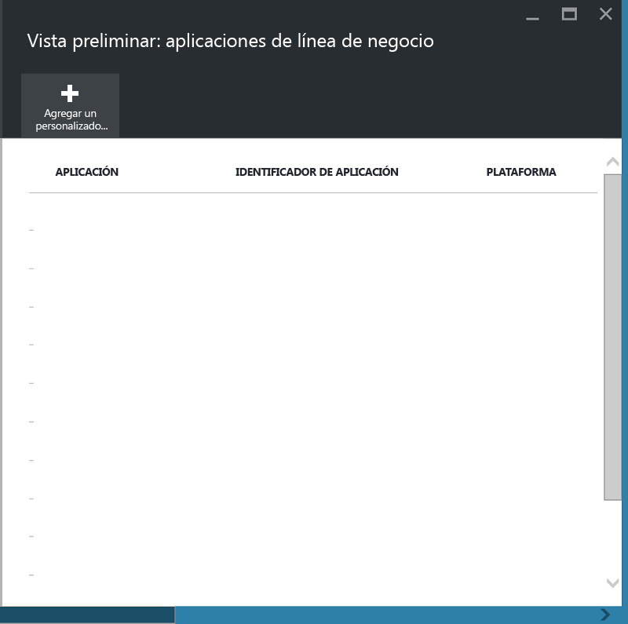
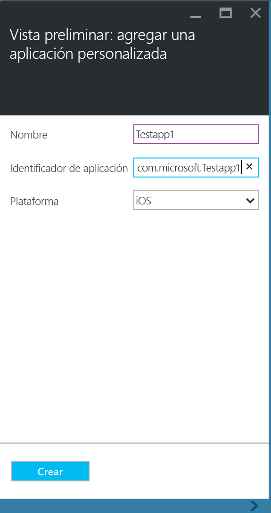
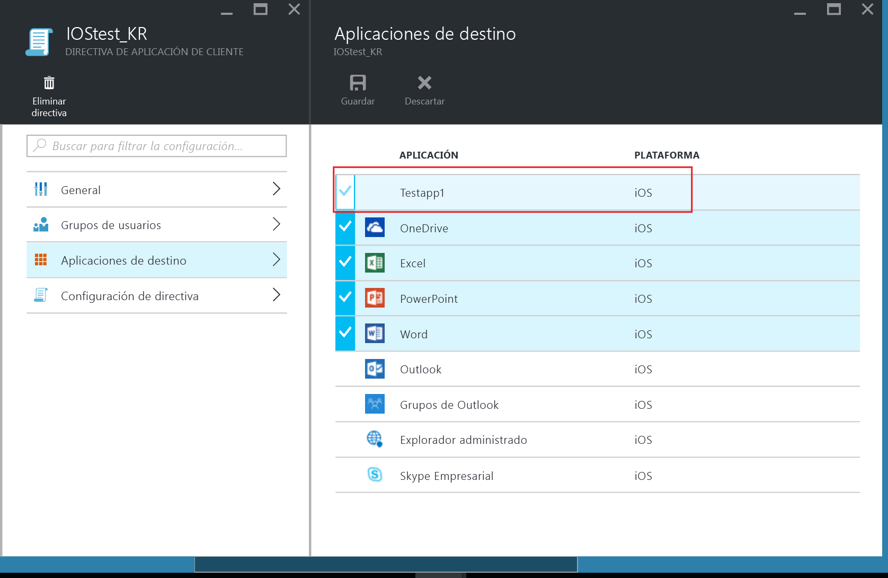
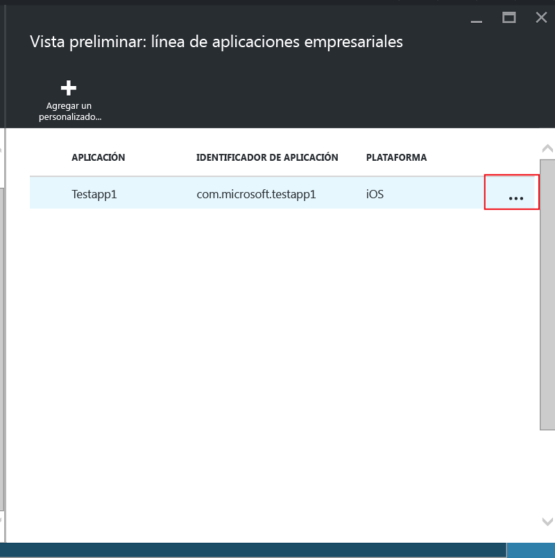

---
# required metadata

title: [Proteger aplicaciones y datos de línea de negocio en dispositivos no inscritos | Microsoft Intune]
description:
keywords:
author: [karthikaraman]
manager: [jeffgilb]
ms.date: 04/28/2016
ms.topic: article
ms.prod:
ms.service:
ms.technology:
ms.assetid: [00219467-a62e-43b6-954b-3084f54c45ba]

# optional metadata

#ROBOTS:
#audience:
#ms.devlang:
#ms.reviewer: [joglocke]
#ms.suite: ems
#ms.tgt_pltfrm:
#ms.custom:

---

# Proteger aplicaciones y datos de línea de negocio en dispositivos no inscritos en Microsoft Intune

Las directivas de administración de aplicaciones móviles (MAM) ayudan a proteger los datos de la empresa al restringir el movimiento de estos, por ejemplo, la copia y el pegado, o al evitar que los usuarios guarden documentos de la empresa en una ubicación personal.   Para aplicar directivas MAM a aplicaciones iOS y Android de línea de negocio, primero tiene que ajustar la aplicación con la herramienta de ajuste de aplicaciones de Microsoft Intune.  El ajuste de aplicaciones es el proceso de aplicar una capa de administración a una aplicación móvil sin necesidad de realizar cambios en la aplicación subyacente.  Una vez que la aplicación está ajustada, puede aplicarle directivas MAM y distribuirla a los usuarios finales.  

En este tema se explican los pasos necesarios para aplicar directivas MAM a las aplicaciones a las que se accede en **dispositivos no administrados propiedad de los empleados** y en dispositivos administrados por una **solución de administración de dispositivos móviles (MDM) de terceros**.  Para preparar las aplicaciones de línea de negocio que se ejecutan en **dispositivos inscritos en Intune**, consulte [Decide how to prepare apps for mobile application management with Microsoft Intune (Decidir cómo preparar las aplicaciones para la administración de aplicaciones móviles mediante Microsoft Intune)](decide-how-to-prepare-apps-for-mobile-application-management-with-microsoft-intune.md).
##  Paso 1: preparar la aplicación
Antes de aplicar directivas MAM a una aplicación, tiene que ajustarla con la herramienta de ajuste de aplicaciones de Microsoft Intune.  Las instrucciones para instalar y usar la herramienta de ajuste de aplicaciones están incluidas en la descarga.  
>[!IMPORTANT]  
>Esta versión de la herramienta de ajuste de aplicaciones, que es compatible con dispositivos no inscritos en Intune, estará disponible en vista previa privada en las próximas semanas. Si quiere participar, envíe un correo electrónico a msintuneappsdk@microsoft.com para obtener más información.

## Paso 2: agregar la aplicación

Para asociar la aplicación de línea de negocio a las directivas MAM, debe agregar los detalles de la aplicación a la suscripción o al inquilino de Intune mediante estos pasos:

1. En el [portal de Azure](https://portal.azure.com/), vaya a **Administración de aplicaciones móviles de Intune > Configuración** y seleccione **Aplicaciones de línea de negocio**.

  

2. En la hoja **Aplicaciones de línea de negocio**, seleccione **Agregar una aplicación personalizada**.

  
3.  Proporcione un nombre para la aplicación, el identificador de la agrupación de trabajos en el campo Identificador de la aplicación y la plataforma (iOS o Android).

   Este paso ayuda a crear una descripción exclusiva de la aplicación.  La aplicación también se mostrará en la lista Aplicaciones de destino de una directiva MAM del inquilino, como se explica en el paso siguiente.

## Paso 3: aplicar directivas MAM
Una vez que los metadatos de la aplicación se han cargado en el servicio, la aplicación se mostrará en la lista de aplicaciones.  Ya puede [crear una nueva directiva o una directiva existente](create-and-deploy-mobile-app-management-policies-with-microsoft-intune.md) y aplicarla a la aplicación de línea de negocio que agregó en el paso 2.
  
## Paso 4: distribuir la aplicación
Puede implementar aplicaciones para los usuarios finales de las maneras siguientes:
* En el caso de los dispositivos inscritos en una solución MDM de terceros, puede distribuir las aplicaciones a través de la solución MDM.
* En el caso de los dispositivos no administrados por ninguna solución MDM, necesitará una solución personalizada. Los usuarios finales deben descargar e instalar la aplicación en sus dispositivos.

## Modificación de los metadatos
Si necesita cambiar detalles de la aplicación como su nombre o el identificador de la agrupación de trabajos, tiene que [quitar la aplicación](#remove-apps) y [agregarla](#add-the-app) con los nuevos metadatos.

##  Quitar aplicaciones
Puede quitar una aplicación de línea de negocio de la lista de aplicaciones.  Con esto se quitará la aplicación de la lista y también la asociación con las directivas MAM, pero no se quitará ni desinstalará la aplicación del dispositivo del usuario final.  

1.  En el [portal de Azure](https://portal.azure.com/), vaya a **Administración de aplicaciones móviles de Intune > Configuración**.  En la hoja **Configuración**, seleccione **Línea de negocio** para abrir la lista de aplicaciones existentes.  
2.  Seleccione la aplicación que quiere quitar y, luego, el menú **(...) contexto**.

  
3.  Seleccione **Eliminar aplicación** para eliminar la aplicación.

  

  Esto quitará las aplicaciones de la lista de aplicaciones de línea de negocio y de la lista Aplicaciones de destino de la directiva MAM.

<!--HONumber=May16_HO3-->

