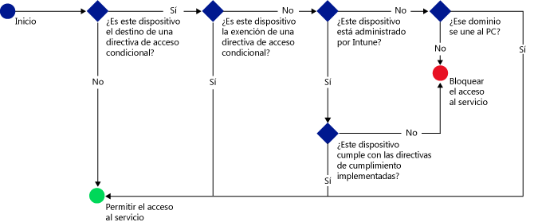

# Restringir el acceso al correo electrónico, a O365 y a otros servicios con Microsoft Intune
Puede restringir el acceso al correo electrónico de la empresa y a los servicios de O365 con el acceso condicional de Intune. Con las funciones de acceso condicional de Intune, se asegura de que el acceso al correo electrónico de la empresa y a los servicios de O365 está restringido a los dispositivos compatibles con las reglas establecidas.
## ¿Cómo funciona el acceso condicional?
La configuración de la directiva de cumplimiento se usa para evaluar el cumplimiento del dispositivo. La directiva de acceso condicional usa la evaluación para restringir o permitir el acceso a un servicio específico. Cuando se usa una directiva de acceso condicional en combinación con una directiva de cumplimiento, solo podrán tener acceso al servicio los dispositivos conformes.

Tenga en cuenta que el usuario que usa el dispositivo también debe tener implementada una directiva de cumplimiento para que se pueda evaluar el cumplimiento del dispositivo.
Si no se implementa ninguna directiva de cumplimiento en el usuario, el dispositivo se considera conforme y no se aplicarán restricciones de acceso.

Cuando los dispositivos no cumplen las condiciones establecidas en las directivas, se indica al usuario final el proceso que debe seguir para inscribir el dispositivo y corregir el problema que impide que cumpla los requisitos.

Flujo típico de acceso condicional:

## ¿Cómo se configura el acceso condicional?
Use el acceso condicional para administrar el acceso a Microsoft **Exchange local**, **Exchange Online**, **Exchange Online dedicado**, **SharePoint Online** y **Skype Empresarial Online**.

Para configurar el acceso condicional, configure una directiva de cumplimiento del dispositivo y una directiva de acceso condicional.

La directiva de cumplimiento incluye opciones como el código de acceso, el cifrado y si el dispositivo está liberado o no. El dispositivo debe cumplir estas reglas para que se considere conforme.

Puede establecer una directiva de acceso condicional para restringir el acceso en función de lo siguiente:
- El estado de cumplimiento del dispositivo.
- La plataforma en la que se ejecuta el dispositivo.
- El tipo de aplicaciones que se usan para tener acceso a los servicios.

A diferencia de otras directivas de Intune, no se implementan directivas de acceso condicional. En su lugar, después de configurar la directiva y seleccionar los usuarios que deben tenerla, la directiva se aplica a todos los usuarios de destino. Cuando un usuario es destinatario de una directiva, cada dispositivo que use debe ser conforme con el fin de obtener acceso a los recursos.

## Pasos siguientes
1. [Obtener información sobre la directiva de cumplimiento del dispositivo y su funcionamiento ](introduction-to-device-compliance-policies-in-microsoft-intune.md)

2. [Crear una directiva de cumplimiento](create-a-device-compliance-policy-in-microsoft-intune.md)

2.  Crear una directiva de acceso condicional para uno de los siguientes:
> [!div class="op_single_selector"]
  - [Crear una directiva de acceso condicional para Exchange Online](restrict-access-to-exchange-online-with-microsoft-intune.md)
  - [Crear una directiva de acceso condicional para Exchange local](restrict-access-to-exchange-onpremises-with-microsoft-intune.md)
  - [Crear una directiva de acceso condicional para el nuevo entorno de Exchange Online dedicado](restrict-access-to-exchange-online-with-microsoft-intune.md)
  - [Crear una directiva de acceso condicional para Exchange Online dedicado heredado](restrict-access-to-exchange-onpremises-with-microsoft-intune.md)
  - [Crear una directiva de acceso condicional para SharePoint Online](restrict-access-to-sharepoint-online-with-microsoft-intune.md)
  - [Crear una directiva de acceso condicional para Skype Empresarial Online](restrict-access-to-skype-for-business-online-with-microsoft-intune.md)
  - [Crear una directiva de acceso condicional para Dynamics CRM Online](restrict-access-to-dynamics-crm-online-with-microsoft-intune.md)

<!--HONumber=Jun16_HO3-->

