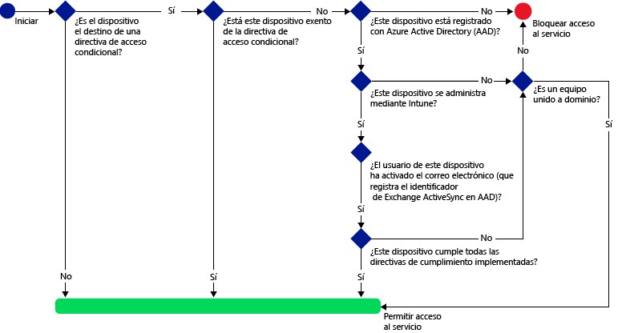
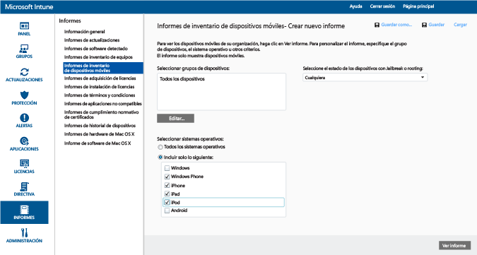
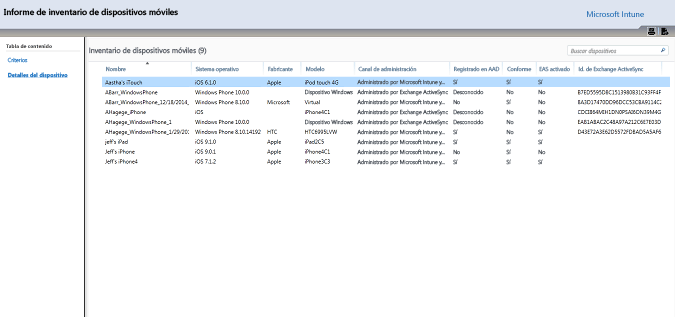
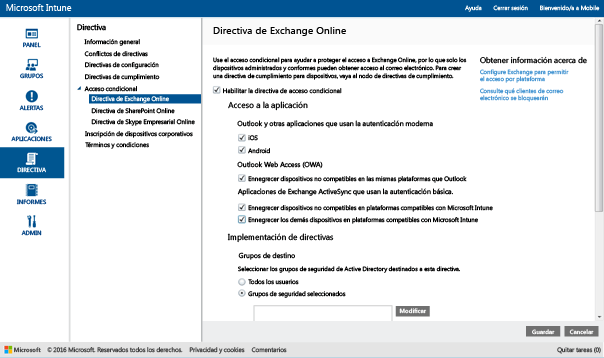
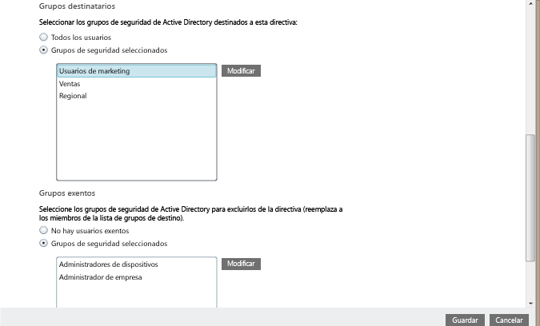
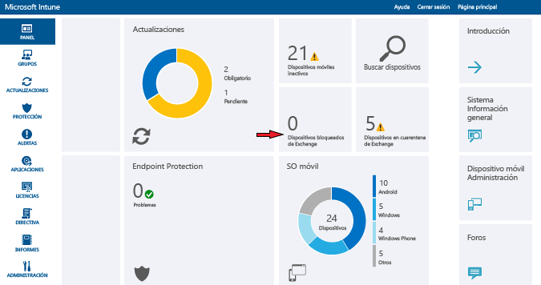

# Restringir el acceso de correo electrónico a Exchange Online y nuevo Exchange Online dedicado

Si tiene un entorno de Exchange Online dedicado y necesita averiguar si es la configuración nueva o heredada, póngase en contacto con su administrador de cuentas.

Para controlar el acceso de correo electrónico a Exchange Online o a su nuevo entorno de Exchange Online dedicado, configure el acceso condicional para Exchange Online en Intune.
Para obtener más información sobre cómo funciona el acceso condicional, lea el artículo [Restrict access to email, O365, and other services (Restringir el acceso al correo electrónico, a O365 y a otros servicios)](restrict-access-to-email-and-o365-services-with-microsoft-intune.md).

**Antes** de configurar el acceso condicional, debe:

-   Tener una **suscripción de Office 365 que incluya Exchange Online (por ejemplo, E3)** y los usuarios deben tener licencia para Exchange Online.

- Tener una **suscripción de Enterprise Mobility + Security o de Azure Active Directory Premium** y los usuarios deben tener la licencia de EMS o Azure AD. Para obtener más detalles, vea la [página de precios de Enterprise Mobility](https://www.microsoft.com/en-us/cloud-platform/enterprise-mobility-pricing) o la [página de precios de Azure Active Directory](https://azure.microsoft.com/en-us/pricing/details/active-directory/).

-  Considerar la posibilidad de configurar el **conector de servicio a servicio de Microsoft Intune** opcional, que conecta [!INCLUDE[wit_nextref](../includes/wit_nextref_md.md)] a Microsoft Exchange Online y hace que sea más fácil administrar información de dispositivos a través de la consola de [!INCLUDE[wit_nextref](../includes/wit_nextref_md.md)]. No necesita usar el conector para usar directivas de cumplimiento o de acceso condicional, pero sí para ejecutar informes que ayuden a evaluar el impacto del acceso condicional.

   > [!NOTE]
   > No configure el conector de servicio a servicio si piensa usar el acceso condicional para Exchange Online y Exchange local.

   Para obtener instrucciones sobre cómo configurar el conector, vea [Intune service-to-service connector](intune-service-to-service-exchange-connector.md) (Conector de servicio a servicio de Intune).

Cuando se configuran directivas de acceso condicional y se aplican a un usuario, el **dispositivo** debe cumplir las condiciones siguientes para que los usuarios puedan conectarse al correo electrónico:

-   Debe estar **inscrito** con [!INCLUDE[wit_nextref](../includes/wit_nextref_md.md)] o ser un equipo unido a un dominio.

-  Debe estar **registrado en Azure Active Directory**. Esto sucede automáticamente cuando el dispositivo se inscribe con [!INCLUDE[wit_nextref](../includes/wit_nextref_md.md)]. Además, el identificador de Exchange ActiveSync del cliente debe registrarse con Azure Active Directory.

  AAD DRS se activará automáticamente para los clientes de Intune y Office 365. Los clientes que ya hayan implementado el servicio de registro de dispositivos de ADFS no podrán ver los dispositivos registrados en la instancia local de Active Directory.

-   Debe ser **compatible** con todas las directivas de cumplimiento de [!INCLUDE[wit_nextref](../includes/wit_nextref_md.md)] implementadas en el dispositivo, o bien debe estar unido a un dominio local.

Si no se cumple una directiva de acceso condicional, el usuario recibirá uno de los mensajes siguientes cuando inicie sesión:

- Si el dispositivo no está inscrito con [!INCLUDE[wit_nextref](../includes/wit_nextref_md.md)], o si no está registrado en Azure Active Directory, se muestra un mensaje con instrucciones sobre cómo instalar la aplicación de portal de empresa, inscribir el dispositivo y activar el correo electrónico. Este proceso también asocia el identificador de Exchange ActiveSync del dispositivo con el registro en Azure Active Directory.

-   Si se considera que el dispositivo no es conforme con las reglas de la directiva de cumplimiento, se dirige al usuario al sitio web del portal de empresa de [!INCLUDE[wit_nextref](../includes/wit_nextref_md.md)] o a la aplicación de portal de empresa, donde encontrará información sobre el problema y sobre cómo resolverlo.

En el diagrama siguiente se muestra el flujo que usan las directivas de acceso condicional para Exchange Online.

## Compatibilidad con dispositivos móviles
Puede restringir el acceso al correo electrónico de Exchange Online desde **Outlook** y otras **aplicaciones que usan la autenticación moderna**:

- Android 4.0 y versiones posteriores, Samsung Knox Standard 4.0 y versiones posteriores, y Android for Work
- iOS 8.0 y versiones posteriores
- Windows Phone 8.1 y versiones posteriores

La **autenticación moderna** proporciona el inicio de sesión basado en la biblioteca de autenticación de Active Directory (ADAL) a los clientes de Microsoft Office.

-   La autenticación basada en ADAL permite a los clientes de Office realizar la autenticación basada en explorador (también conocida como autenticación pasiva).  Para realizar la autenticación, se envía al usuario a una página web de inicio de sesión. Este nuevo método de inicio de sesión permite mejorar la seguridad como la **autenticación multifactor** y la **autenticación basada en certificados**.
Este [artículo](https://support.office.com/en-US/article/How-modern-authentication-works-for-Office-2013-and-Office-2016-client-apps-e4c45989-4b1a-462e-a81b-2a13191cf517) contiene información más detallada sobre cómo funciona la autenticación moderna.
Configure reglas de notificaciones de ADFS para bloquear protocolos de autenticación no moderna. Se proporcionan instrucciones detalladas en el Escenario 3: [Bloquear todo el acceso externo a O365 excepto las aplicaciones basadas en explorador](https://technet.microsoft.com/library/dn592182.aspx).

Puede restringir el acceso a **Outlook Web Access (OWA)** en Exchange Online al tener acceso desde un explorador en dispositivos **iOS** y **Android**.  Solo se permitirá el acceso desde exploradores compatibles de dispositivos que también lo sean:

* Safari (iOS)
* Chrome (Android)
* Managed Browser (iOS y Android)

**Los exploradores no compatibles serán bloqueados**.

**La aplicación OWA para iOS y Android puede modificarse de modo que no use la autenticación moderna y no se admite.  El acceso desde la aplicación OWA se debe bloquear mediante reglas de notificaciones de ADFS.**

Puede restringir el acceso al correo electrónico de Exchange desde el **cliente de correo electrónico de Exchange ActiveSync** integrado en las siguientes plataformas:

- Android 4.0 y versiones posterior, Samsung Knox Standard 4.0 y versiones posteriores

- iOS 8.0 y versiones posteriores

- Windows Phone 8.1 y versiones posteriores

## Compatibilidad para equipos

Puede configurar el acceso condicional para equipos que ejecutan aplicaciones de escritorio de Office, para que tengan acceso a **Exchange Online** y **SharePoint Online** en los equipos que cumplen los requisitos siguientes:

-   El equipo debe ejecutar Windows 7.0, Windows 8.1 o Windows 10.

  >[!NOTE]
  > Para usar el acceso condicional con equipos Windows 10, debe actualizarlos con la Actualización de aniversario de Windows 10.

  El equipo debe estar unido a un dominio o cumplir las reglas de la directiva de cumplimiento.

  Para que se considere compatible, el equipo debe estar inscrito en [!INCLUDE[wit_nextref](../includes/wit_nextref_md.md)] y cumplir las directivas.

  Los equipos unidos a un dominio deben configurarse para [registrar automáticamente el dispositivo.](https://azure.microsoft.com/documentation/articles/active-directory-conditional-access-automatic-device-registration/) con Azure Active Directory.

  >[!NOTE]
    >No se admite el acceso condicional en los equipos que ejecutan el cliente del equipo de Intune.

-   [La autenticación moderna de Office 365 debe estar habilitada](https://support.office.com/en-US/article/Using-Office-365-modern-authentication-with-Office-clients-776c0036-66fd-41cb-8928-5495c0f9168a) y tener las últimas actualizaciones de Office.

    La autenticación moderna aporta inicio de sesión basado en la biblioteca de autenticación de Active Directory (ADAL) para los clientes de Windows en Office 2013 y habilita una mejor seguridad como la **autenticación multifactor** y la **autenticación basada en certificados**.

-   Configure reglas de notificaciones de ADFS para bloquear protocolos de autenticación no moderna. Se proporcionan instrucciones detalladas en el Escenario 3: [Bloquear todo el acceso externo a O365 excepto las aplicaciones basadas en explorador](https://technet.microsoft.com/library/dn592182.aspx).

## Configurar el acceso condicional
### Paso 1: configurar e implementar una directiva de cumplimiento
Asegúrese de [crear](create-a-device-compliance-policy-in-microsoft-intune.md) e [implementar](deploy-and-monitor-a-device-compliance-policy-in-microsoft-intune.md) una directiva de cumplimiento para los grupos de usuarios que también obtendrán la directiva de acceso condicional.

> [!IMPORTANT]
> Si no ha implementado una directiva de cumplimiento, los dispositivos se considerarán compatibles y se les permitirá el acceso a Exchange.

### Paso 2: evaluar el impacto de la directiva de acceso condicional
Puede usar los **Informes de inventario de dispositivos móviles** para identificar los dispositivos a los que se les podría bloquear el acceso a Exchange después de configurar la directiva de acceso condicional.

Para ello, configure una conexión entre [!INCLUDE[wit_nextref](../includes/wit_nextref_md.md)] y Exchange mediante el [conector de servicio a servicio de Microsoft Intune](intune-service-to-service-exchange-connector.md).
1.  Vaya a **Informes -> Informes de inventario de dispositivos móviles**.

2.  En los parámetros del informe, seleccione el grupo de [!INCLUDE[wit_nextref](../includes/wit_nextref_md.md)] que desea evaluar y, si es necesario, las plataformas de dispositivos a las que se aplicará la directiva.
3.  Una vez que haya seleccionado los criterios que satisfagan las necesidades de la organización, elija **Ver informe**.
El Visor de informes se abrirá en una nueva ventana.

Después de ejecutar el informe, examine estas cuatro columnas para determinar si un usuario se bloqueará:

-   **Canal de administración** : indica si Intune, Exchange ActiveSync o ambas aplicaciones administran el dispositivo.

-   **Registrado en AAD** : indica si el dispositivo está registrado con Azure Active Directory (lo que se conoce como unión al "área de trabajo").

-   **Conforme** : indica si el dispositivo cumple con las directivas de cumplimiento que se han implementado.

-   **Id. de Exchange ActiveSync** : los dispositivos iOS y Android deben tener su id. de Exchange ActiveSync asociado al registro de registro del dispositivo en Azure Active Directory. Esto sucede cuando el usuario hace clic en **Activar correo electrónico** en el mensaje de correo en cuarentena.

    > [!NOTE]
    > Los dispositivos Windows Phone siempre muestran un valor en esta columna.

Los dispositivos que forman parte de un grupo de destino tendrán bloqueado el acceso a Exchange, a menos que los valores de la columna coincidan con los de la tabla siguiente:

--------------------------
|Canal de administración|Registrado en AAD|Conforme|Id. de Exchange ActiveSync|Acción resultante|
|----------------------|------------------|-------------|--------------------------|--------------------|
|**Administrado por Microsoft Intune y Exchange ActiveSync**|Sí|Sí|Se muestra un valor|Acceso a correo electrónico concedido|
|Cualquier otro valor|No|No|No se muestra ningún valor|Acceso a correo electrónico bloqueado|
----------------------
Puede exportar el contenido del informe y usar la columna **Dirección de correo electrónico** para informar a los usuarios de que se les va a bloquear.

### Paso 3: configurar grupos de usuarios para la directiva de acceso condicional
Las directivas de acceso condicional se aplican a diferentes grupos de seguridad de usuarios de Azure Active Directory. También puede excluir determinados grupos de usuarios de esta directiva.  Cuando un usuario es destinatario de una directiva, cada dispositivo que use debe ser conforme con el fin de obtener acceso al correo electrónico.

Estos grupos se pueden configurar en el **Centro de administración de Office 365**o el **portal de cuentas de Intune**.

Se pueden especificar dos tipos de grupo en cada directiva:

-   **Grupos de destino**: grupos de usuarios a los que se aplica la directiva.

-   **Grupos exentos** : grupos de usuarios que están exentos de la directiva (opcional)

Si un usuario pertenece a ambos grupos, estará exento de la directiva.

Solo se evalúan los grupos a los que se aplica la directiva de acceso condicional.

### Paso 4: configurar la directiva de acceso condicional

>[!NOTE]
> También puede crear la directiva de acceso condicional en la consola de administración de Azure AD. La consola de administración de Azure AD le permite crear la directiva de acceso condicional de dispositivos de Intune (denominada **directiva de acceso condicional basada en dispositivos** en Azure AD), además de otras directivas de acceso condicional, como la autenticación multifactor.  También puede configurar directivas de acceso condicional para aplicaciones empresariales de terceros, como Salesforce y Box, compatibles con Azure AD. Para obtener más información, consulte [Establecimiento de una directiva de acceso condicional basado en dispositivos de Azure Active Directory para el control de acceso a aplicaciones conectadas a Azure Active Directory](https://azure.microsoft.com/en-us/documentation/articles/active-directory-conditional-access-policy-connected-applications/).

1.  En la [consola de administración de Microsoft Intune](https://manage.microsoft.com), elija **Directiva** > **Acceso condicional** > **Directiva de Exchange Online**.

2.  En la página **Directivas de Exchange Online** , seleccione **Habilitar directiva de acceso condicional para Exchange Online**.

    > [!NOTE]
    > Si no ha implementado una directiva de cumplimiento, los dispositivos se consideran no conformes.
    >
    > Independientemente del estado de cumplimiento, todos los usuarios a los que se aplique la directiva deberán inscribir sus dispositivos en [!INCLUDE[wit_nextref](../includes/wit_nextref_md.md)].

3.  En **Acceso a la aplicación**, en el caso de las aplicaciones que usan la autenticación moderna, tiene dos maneras de elegir qué plataformas debe aplicar la directiva. Las plataformas compatibles incluyen Android, iOS, Windows y Windows Phone.

    -   **Todas las plataformas**

        Esto requerirá inscribir en Itune cualquier dispositivo que se use para acceder a **Exchange Online** y que sea compatible con las directivas.  Toda aplicación cliente que use la **autenticación moderna** está sujeta a la directiva de acceso condicional y si la plataforma no es compatible actualmente con Intune, se bloqueará el acceso a **Exchange Online**.

        Seleccionar la opción **Todas las plataformas** significa que Azure Active Directory aplicará esta directiva a todas las solicitudes de autenticación, independientemente de la plataforma notificada por la aplicación cliente.  Todas las plataformas tendrán que inscribirse y ser compatibles, excepto:
        *   Los dispositivos Windows tendrán que estar inscritos y ser compatibles, estar unidos a dominio con Active Directory local, o ambos.
        * Plataformas no compatibles como Mac OS.  Por el contrario, las aplicaciones que usan autenticación moderna y proceden de estas plataformas seguirán bloqueándose.

    -   **Plataformas específicas**

         La directiva de acceso condicional se aplicará a cualquier aplicación cliente que use la **autenticación moderna** en las plataformas de dispositivo que especifique.

4. En **Outlook Web Access (OWA)**, puede permitir el acceso a Exchange Online solo a través de los exploradores admitidos: Safari (iOS) y Chrome (Android). Se bloqueará el acceso desde otros exploradores. Las mismas restricciones de plataforma que ha seleccionado para el acceso a la aplicación de Outlook también se aplican aquí.

  En los dispositivos **Android**, los usuarios deben habilitar el acceso al explorador.  Para ello, el usuario final debe habilitar la opción "Habilitar acceso al explorador" en el dispositivo inscrito de este modo:
  1.    Inicie la **aplicación de portal de empresa**.
  2.    Vaya a la página **Configuración** desde los tres puntos (...) o desde el botón del menú de hardware.
  3.    Pulse el botón **Habilitar acceso al explorador**.
  4.    En el explorador Chrome, cierre la sesión de Office 365 y reinicie Chrome.

  En las plataformas **iOS y Android**, para identificar el dispositivo que se usa para acceder al servicio, Azure Active Directory emitirá un certificado de seguridad de la capa de transporte (TLS) para el dispositivo.  El dispositivo muestra el certificado en una petición para que el usuario final lo seleccione, como se muestra en las capturas de pantalla siguientes. El usuario final debe seleccionar este certificado para poder seguir usando el explorador.

  **iOS**

  

  **Android**

  

5.  En **Aplicaciones de Exchange ActiveSync**, puede elegir bloquear el acceso a Exchange Online de dispositivos no conformes. También puede seleccionar si quiere permitir o bloquear el acceso al correo cuando el dispositivo no ejecuta una plataforma compatible. Las plataformas compatibles incluyen Android, iOS, Windows y Windows Phone.

 Dispositivos **Android for Work** de aplicaciones de Exchange Active Sync:
 -  Solo se admiten las aplicaciones **Gmail** y **Nine Work** en el **perfil de trabajo** en los dispositivos Android for Work. Para que el acceso condicional funcione en dispositivos Android for Work, debe implementar un perfil de correo electrónico para la aplicación Gmail o Nine Work y también implementarla como una instalación **requerida**. 

6.  En **Grupos de destino**, seleccione los grupos de seguridad de Active Directory a los que se aplicará la directiva. Puede elegir como destino todos los usuarios o puede seleccionar una lista de grupos de usuarios.

    > [!NOTE]
    > En el caso de los usuarios que se encuentren en los **grupos de destino**, las directivas de Intune reemplazarán las directivas y reglas de Exchange.
    >
    > Exchange solo aplicará sus directivas y sus reglas de permiso, bloqueo y cuarentena si:
    >
    > -   El usuario no tiene licencia para Intune.
    > -   El usuario tiene licencia para Intune pero no pertenece a ningún grupo de seguridad de destino de la directiva de acceso condicional.

6.  En **Grupos exentos**, seleccione los grupos de seguridad de Active Directory que se van a excluir de la directiva. Si un usuario está incluido tanto los grupos de destino como en los grupos exentos, estará exento de la directiva.

7.  Cuando termine, elija **Guardar**.

-   No es necesario implementar la directiva de acceso condicional, ya que surte efecto inmediatamente.

-   Cuando un usuario crea una cuenta de correo electrónico, el dispositivo se bloquea inmediatamente.

-   Si un usuario bloqueado inscribe el dispositivo con [!INCLUDE[wit_nextref](../includes/wit_nextref_md.md)] y corrige los problemas de no conformidad, el acceso al correo electrónico se desbloquea en dos minutos.

-   Si el usuario anular la inscripción de su dispositivo, el correo se bloquea después de aproximadamente 6 horas.

**Para ver algunos escenarios de ejemplo sobre la configuración de la directiva de acceso condicional para restringir el acceso a los dispositivos, consulte [Restrict email access example scenarios (Escenarios de ejemplo sobre cómo restringir el acceso de correo electrónico)](restrict-email-access-example-scenarios.md).**

## Supervisar el cumplimiento y las directivas de acceso condicional

#### Para ver los dispositivos que tienen bloqueado el acceso a Exchange

En el panel de [!INCLUDE[wit_nextref](../includes/wit_nextref_md.md)], elija el icono **Dispositivos bloqueados de Exchange** para que se muestren el número de dispositivos bloqueados y los vínculos para más información.

## Pasos siguientes
[Restringir el acceso a SharePoint Online](restrict-access-to-sharepoint-online-with-microsoft-intune.md)

[Restringir el acceso a Skype Empresarial Online](restrict-access-to-skype-for-business-online-with-microsoft-intune.md)

<!--HONumber=Oct16_HO3-->

