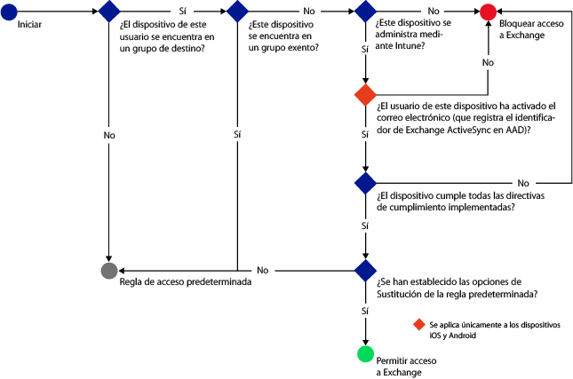
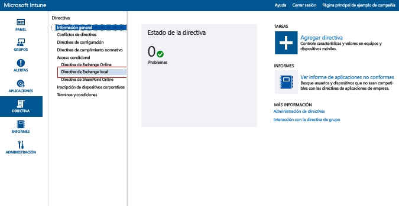
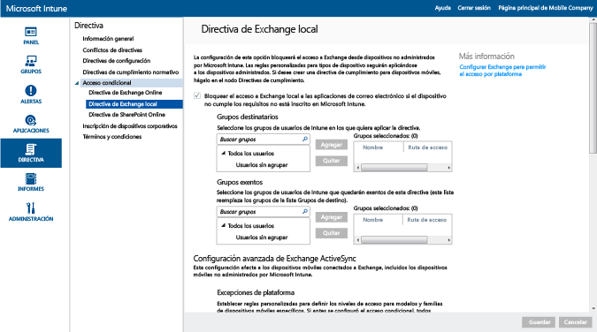

---
# required metadata

title: Restringir el acceso de correo electrónico a Exchange local y Exchange Online dedicado heredado | Microsoft Intune
description:
keywords:
author: karthikaraman
manager: jeffgilb
ms.date: 04/28/2016
ms.topic: article
ms.prod:
ms.service: microsoft-intune
ms.technology:
ms.assetid: a55071f5-101e-4829-908d-07d3414011fc

# optional metadata

#ROBOTS:
#audience:
#ms.devlang:
ms.reviewer: chrisgre
ms.suite: ems
#ms.tgt_pltfrm:
#ms.custom:

---

# Restringir el acceso de correo electrónico a Exchange local y Exchange Online dedicado heredado con Intune

Si tiene un entorno de Exchange Online dedicado y necesita averiguar si es la configuración nueva o heredada, póngase en contacto con su administrador de cuentas.

Para controlar el acceso de correo electrónico a Exchange local o a al entorno de Exchange Online dedicado heredado, configure el acceso condicional para Exchange local en Intune.
Para más información sobre cómo funciona el acceso condicional, vea el artículo [Restrict access to email and O365 services]( restrict-access-to-email-and-o365-services-with-microsoft-intune.md) (Restringir el acceso al correo electrónico y servicios de O365).

**Antes** de configurar el acceso condicional, debe comprobar lo siguiente:

-   Su versión de Exchange debe ser **Exchange 2010 o posterior**. Se admite la matriz del servidor de acceso de cliente (CAS) del servidor de Exchange.

-   Debe usar la versión de **Exchange Connector local** que conecta [!INCLUDE[wit_nextref](../includes/wit_nextref_md.md)] a Microsoft Exchange local. Esto le permite administrar dispositivos a través de la consola de [!INCLUDE[wit_nextref](../includes/wit_nextref_md.md)]. Para obtener detalles sobre Connector, consulte [Intune on-premises Exchange connector (Intune Exchange Connector local)](intune-on-premises-exchange-connector.md).

    -   La versión de Exchange Connector local que tiene disponible en la consola de Intune es específica de su inquilino de Intune y no puede usarla con otro inquilino. También debe asegurarse de que la versión de Exchange Connector del inquilino esté instalada **en un solo equipo**.

        Este conector debe descargarse desde la consola de administración de Intune.  Para ver un tutorial sobre cómo configurar Exchange Connector local, consulte [Configure Exchange on-premises connector for on-premises or hosted Exchange (Configurar Exchange Connector local para Exchange local u hospedado)](intune-on-premises-exchange-connector.md).

    -   El conector puede instalarse en cualquier máquina, siempre que esta pueda comunicarse con el servidor Exchange.

    -   El conector es compatible con el **entorno de CAS de Exchange**. Si le interesa, el conector se puede instalar técnicamente en el servidor CAS de Exchange directamente, pero no se recomienda porque aumenta la carga en el servidor.
    Al configurar el conector, debe permitir que se comunique con uno de los servidores CAS de Exchange.

-   **Exchange ActiveSync** se debe configurar con autenticación basada en certificados o con la entrada de credenciales de usuario.

Cuando se configuran directivas de acceso condicional y se aplican a un usuario, el **dispositivo** debe cumplir las condiciones siguientes para que los usuarios puedan conectarse al correo electrónico:

-  Debe estar **inscrito** con [!INCLUDE[wit_nextref](../includes/wit_nextref_md.md)] o ser un equipo unido a un dominio.

-  Debe estar **registrado en Azure Active Directory**. Además, el identificador de Exchange ActiveSync del cliente debe registrarse con Azure Active Directory.

  AAD DRS se activará automáticamente para los clientes de Intune y Office 365. Los clientes que ya hayan implementado el servicio de registro de dispositivos de ADFS no podrán ver los dispositivos registrados en la instancia local de Active Directory. **Esto no se aplica a equipos de Windows ni a dispositivos Windows Phone.**

-   Debe **cumplir** todas las directivas de cumplimiento de [!INCLUDE[wit_nextref](../includes/wit_nextref_md.md)] implementadas en el dispositivo.

En el diagrama siguiente se muestra el flujo que usan las directivas de acceso condicional de Exchange local para evaluar si se permitirá o se bloqueará el acceso a los dispositivos.

 Si no se cumple una directiva de acceso condicional, el usuario recibirá uno de los mensajes siguientes cuando inicie sesión:

- Si el dispositivo no está inscrito con [!INCLUDE[wit_nextref](../includes/wit_nextref_md.md)], o si no está registrado en Azure Active Directory, se muestra un mensaje con instrucciones sobre cómo instalar la aplicación de portal de empresa, inscribir el dispositivo y activar el correo electrónico. Este proceso también asocia el identificador de Exchange ActiveSync del dispositivo con el registro del dispositivo en Azure Active Directory.

-   Si el dispositivo no es conforme, se muestra un mensaje que dirige al usuario a la aplicación de portal de empresa o al sitio web del portal de empresa de [!INCLUDE[wit_nextref](../includes/wit_nextref_md.md)], donde puede encontrar información sobre el problema y sobre cómo resolverlo.

## Compatibilidad con dispositivos móviles
-   Windows Phone 8 y versiones posteriores

-   Aplicación de correo electrónico nativo de iOS.

-   Aplicación de correo electrónico nativo de Android 4 o posterior
> [!NOTE] La aplicación Microsoft Outlook para iOS y Android no es compatible.

## Compatibilidad para equipos

La aplicación **Correo** en Windows 8 y posterior (cuando se inscribe con [!INCLUDE[wit_nextref](../includes/wit_nextref_md.md)])

##  Configurar una directiva de acceso condicional

1.  En la [consola de administración de Microsoft Intune](https://manage.microsoft.com), seleccione **Directiva** > **Acceso condicional** > **Directiva de Exchange local**.

2.  Configure la directiva con la configuración que necesite: 

  - **Bloquear el acceso a Exchange local a las aplicaciones de correo electrónico si el dispositivo no cumple los requisitos no está inscrito en Microsoft Intune:** al seleccionar esta opción, se bloqueará el acceso a los servicios de Exchange a los dispositivos que no están administrados por [!INCLUDE[wit_nextref](../includes/wit_nextref_md.md)] o que no son compatibles con una directiva de cumplimiento.

  - **Sustitución de la regla predeterminada. Permitir siempre que los dispositivos inscritos y compatibles accedan a Exchange:** cuando se selecciona esta opción, los dispositivos inscritos en Intune y que cumplen con las directivas establecidas pueden tener acceso a Exchange.  
  Esta regla invalida la **Regla predeterminada**, lo que significa que aunque configure la **Regla predeterminada** para poner el acceso en cuarentena o bloquearlo, los dispositivos inscritos y compatibles podrán acceder a Exchange.

  - **Grupos de destino:** seleccione los grupos de usuarios de [!INCLUDE[wit_nextref](../includes/wit_nextref_md.md)] que deben inscribir su dispositivo con [!INCLUDE[wit_nextref](../includes/wit_nextref_md.md)] para poder acceder a Exchange.

  - **Grupos exentos:** seleccione los grupos de usuarios de [!INCLUDE[wit_nextref](../includes/wit_nextref_md.md)] exentos de la directiva de acceso condicional. Los usuarios de esta lista estarán exentos incluso aunque estén incluidos en la lista de **Grupos de destino**.

  - **Excepciones de plataforma:** elija **Agregar regla** para configurar una regla que defina los niveles de acceso para las familias y los modelos de dispositivos móviles especificados. Dado que estos dispositivos pueden ser de cualquier tipo,puede configurar tipos de dispositivo que no sean compatibles con [!INCLUDE[wit_nextref](../includes/wit_nextref_md.md)].

  - **Regla predeterminada:** en el caso de un dispositivo no cubierto por ninguna de las otras reglas, puede permitirle el acceso a Exchange, bloquearlo o ponerlo en cuarentena. Al establecer la regla para permitir el acceso a los dispositivos que están inscritos y que cumplen con las directivas, se concede acceso automático al correo electrónico a los dispositivos iOS, Windows y Samsung KNOX. El usuario final no tiene que realizar ningún proceso para acceder a su correo electrónico.  En los dispositivos Android que no ejecutan Samsung KNOX, los usuarios finales recibirán un correo electrónico de cuarentena con un tutorial detallado que les ayudará a comprobar la inscripción y el cumplimiento para poder tener acceso al correo electrónico. Si establece la regla para bloquear el acceso o establecer una cuarentena, todos los dispositivos se bloquean al obtener acceso a Exchange, independientemente de si están ya inscritos en Intune o no. Para evitar que los dispositivos inscritos y conformes a las directivas se vean afectados por esta regla, active la casilla **Invalidación de regla predeterminada**.
>[!TIP]
>Si se pretende bloquear todos los dispositivos antes de conceder acceso al correo electrónico, elija las opciones de bloqueo de acceso o la regla de cuarentena. La regla predeterminada se aplicará a todos los tipos de dispositivo, por lo que los tipos de dispositivo que configure como excepciones de la plataforma y que no sean compatibles con [!INCLUDE[wit_nextref](../includes/wit_nextref_md.md)] también se verán afectados.

  - **Notificación de usuario:** además del correo electrónico de notificación enviado desde Exchange, Intune envía un correo electrónico que incluye los pasos necesarios para desbloquear el dispositivo. Puede editar el mensaje predeterminado para personalizarlo según sus necesidades. Como el correo de notificación de Intune con las instrucciones de corrección se envía al buzón de Exchange del usuario, si el dispositivo del usuario se bloquea antes de recibir el mensaje de correo, puede usar un dispositivo desbloqueado u otro método para acceder a Exchange y ver el mensaje. Esta situación se da concretamente cuando la **regla predeterminada** está establecida para bloquear o para poner en cuarentena los dispositivos.  En este caso, el usuario final tendrá que ir a su tienda de aplicaciones, descargar la aplicación de portal de empresa de Microsoft e inscribir su dispositivo. Esto es aplicable a dispositivos iOS, Windows y Samsung KONX.  En el caso de los dispositivos que no ejecutan Samsung KNOX, tendrá que enviar el correo electrónico de cuarentena a una cuenta de correo electrónico alternativa. Después, el usuario final debe copiar ese correo de cuarentena en su dispositivo bloqueado para completar el proceso de inscripción y de cumplimiento de directivas.
  > [!NOTE] Para que Exchange pueda enviar el correo electrónico de notificación, debe especificar la cuenta que se usará para enviarlo.
  >
  > Para obtener detalles, consulte [Configure Exchange on-premises connector for on-premises or hosted Exchange (Configurar Exchange Connector local para Exchange local u hospedado)](intune-on-premises-exchange-connector.md).

3.  Cuando termine, elija **Guardar**.

-   No es necesario implementar la directiva de acceso condicional, ya que surte efecto inmediatamente.

-   Después de que un usuario configure un perfil de Exchange ActiveSync, puede tardar de 1 a 3 horas en bloquear el dispositivo (si no está administrado por [!INCLUDE[wit_nextref](../includes/wit_nextref_md.md)]).

-   Si un usuario bloqueado luego inscribe el dispositivo con [!INCLUDE[wit_nextref](../includes/wit_nextref_md.md)] y corrige la no conformidad, el acceso al correo electrónico se desbloqueará en dos minutos.

-   Si el usuario anula la inscripción de [!INCLUDE[wit_nextref](../includes/wit_nextref_md.md)], puede tardar de 1 a 3 horas en desbloquear el dispositivo.

**Para ver algunos escenarios de ejemplo sobre la configuración de la directiva de acceso condicional para restringir el acceso a los dispositivos, consulte [Restrict email access example scenarios (Escenarios de ejemplo sobre cómo restringir el acceso de correo electrónico)](restrict-email-access-example-scenarios.md).**

## Pasos siguientes
[Restringir el acceso a SharePoint Online](restrict-access-to-sharepoint-online-with-microsoft-intune.md)

[Restringir el acceso a Skype Empresarial Online](restrict-access-to-skype-for-business-online-with-microsoft-intune.md)

<!--HONumber=Jun16_HO2-->

