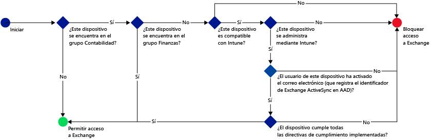
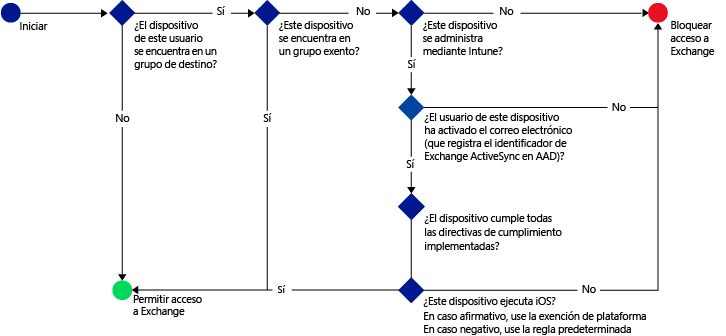

# Restringir el acceso al correo electrónico con Microsoft Intune: escenarios de ejemplo

## Impida que los usuarios usen dispositivos no conformes para tener acceso a Exchange Online.
### Requisitos del escenario
- Todos los usuarios del grupo de seguridad **Contabilidad** de Active Directory deben tener bloqueado el acceso a Exchange Online si su dispositivo no cumple con una directiva de cumplimiento implementada.
- Si existe algún usuario en este grupo cuyos dispositivos no son compatibles con [!INCLUDE[wit_nextref](../includes/wit_nextref_md.md)], se deberá bloquear su acceso a Exchange Online en ese dispositivo.
- Los usuarios que se encuentren en el grupo de seguridad **Finanzas** de Active Directory deben estar exentos de la aplicación de la directiva, aunque también estén incluidos en el grupo de seguridad **Contabilidad**.

Para ello, configure una directiva de acceso condicional para Exchange Online con las siguientes opciones:

-   Seleccione **Habilitar la directiva de acceso condicional**.

- Seleccione las plataformas a las que quiere permitir el acceso desde aplicaciones con autenticación moderna.
- Para las aplicaciones de Exchange ActiveSync, seleccione **Bloquear los dispositivos no compatibles de las plataformas que admite Microsoft Intune** y **Bloquear todos los otros dispositivos de las plataformas que no admite Microsoft Intune**.
-   En la sección **Grupo de destino**, en **Grupos de seguridad seleccionados** elija el grupo de usuarios **Contabilidad**.

-   En la sección **Grupo exento**, en **Grupos de seguridad seleccionados** elija el grupo de usuarios **Finanzas**.

El siguiente flujo se usa para decidir los dispositivos que pueden tener acceso a Exchange Online:

## Todos los dispositivos iOS que tienen acceso a Exchange local deben administrarse mediante Intune
### Requisitos del escenario
- Solo debe permitirse el acceso a Exchange local a los dispositivos que ejecutan iOS.
- Los dispositivos deben inscribirse en Intune y cumplir las reglas de directivas de cumplimiento para que se puedan usar para tener acceso a Exchange.

Para ello, configure la siguiente directiva de acceso condicional para Exchange local con las siguientes opciones:

-   Seleccione la opción **Bloquear el acceso a Exchange local a las aplicaciones de correo electrónico si el dispositivo no cumple los requisitos no está inscrito en Microsoft Intune**. Si selecciona esta opción se habilita la directiva de acceso condicional, que requiere que todos los dispositivos se inscriban en Microsoft Intune y cumplan las reglas de la directiva de cumplimiento para poder tener acceso a Exchange.

-   Para la configuración avanzada de Exchange Active Sync, cree:

  -   Una excepción de plataforma que permite que los dispositivos que ejecutan iOS tengan acceso a Exchange.   

  -   Una regla predeterminada que especifica que, si un dispositivo no está cubierto por la regla de excepción de plataforma, se debe bloquear su acceso a Exchange. Esta regla garantiza que se bloquee el acceso a Exchange de los dispositivos que no ejecutan iOS.

El siguiente flujo se utiliza para decidir los dispositivos que pueden tener acceso a Exchange:

## Ningún dispositivo Android puede acceder a Exchange local.
### Requisitos del escenario
- Debe bloquearse el acceso a Exchange de todos los dispositivos Android.
- Los demás dispositivos compatibles pueden tener acceso a Exchange, siempre que estén administrados por [!INCLUDE[wit_nextref](../includes/wit_nextref_md.md)].

Para ello, configure una directiva de acceso condicional para Exchange local con las siguientes opciones:

-   Seleccione la opción **Bloquear el acceso a Exchange local a las aplicaciones de correo electrónico si el dispositivo no cumple los requisitos no está inscrito en Microsoft Intune**. Si selecciona esta opción, se requiere que todos los dispositivos se inscriban en Intune y cumplan las reglas de directivas de cumplimiento.

- Para la configuración avanzada de Exchange Active Sync, cree:
  -   Una excepción de plataforma que impide que los dispositivos que ejecutan Android tengan acceso a Exchange. Esta regla garantiza que no se puedan usar dispositivos Android para tener acceso a Exchange.

  -   Una regla predeterminada que especifica que, si un dispositivo no está cubierto por otras reglas, debe permitirse su acceso a Exchange. Esta regla predeterminada garantiza que los dispositivos que ejecutan plataformas diferentes de Android pero compatibles con Microsoft Intune puedan usarse para tener acceso a Exchange. Pero deben inscribirse en Intune y cumplir las reglas de directivas de cumplimiento.

El siguiente flujo se utiliza para decidir los dispositivos que pueden tener acceso a Exchange:

<!--HONumber=Oct16_HO4-->

