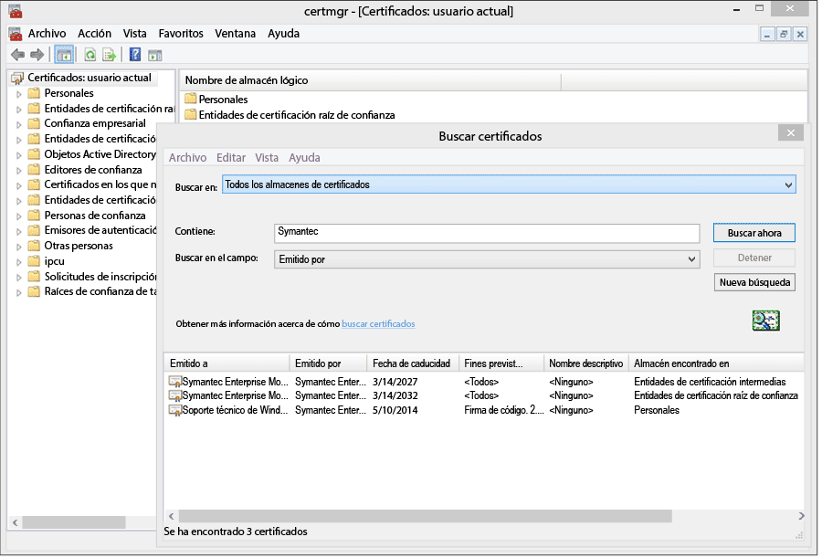
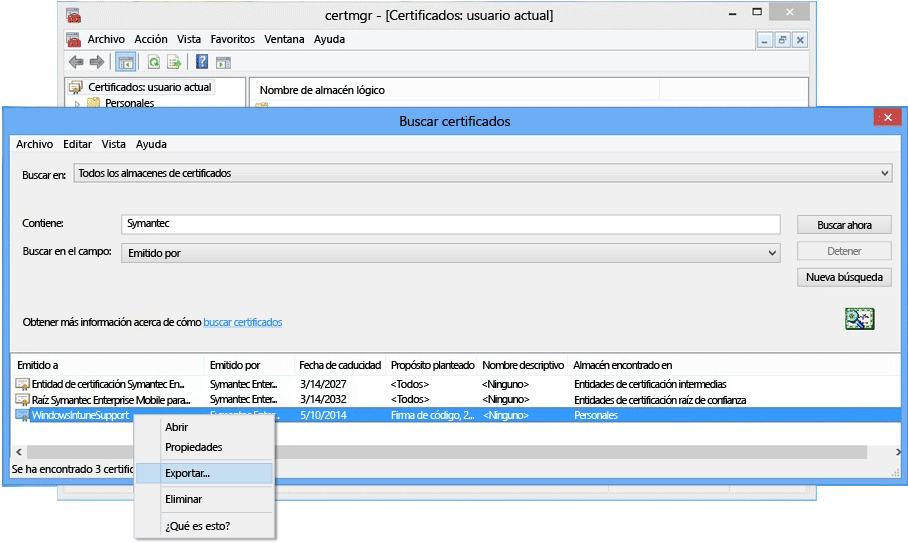

# Configurar la administración de dispositivos para Windows Phone 8.0

Windows Phone 8.0 exige un certificado de Symantec para instalar la aplicación de portal de empresa de Intune y para permitir la administración de dispositivos. También es necesario un certificado para firmar aplicaciones de línea de negocio. El siguiente tema solo se aplica a Windows Phone 8.0. Para administrar Windows Phone 8.1 o posterior, incluido Windows 10 Mobile, consulte [Set up Windows Phone enrollment (Configurar la inscripción de Windows Phone)](set-up-windows-phone-management-with-microsoft-intune.md).

> [!IMPORTANT]
> A partir de septiembre de 2016, la aplicación del portal de empresa para Windows 8.0 y Windows Phone 8.0 ya no estará disponible para descargar.

-   **Windows Phone 8**: se exige certificado
-   **Windows Phone 8.1 y Windows 10 Mobile** piden un certificado solo si:

    -   Quiere implementar la aplicación de portal de empresa mediante Intune.

    -   Va a implementar aplicaciones de línea de negocio (también denominadas "de instalación de prueba").


  > [!IMPORTANT]
  > [Debe renovar periódicamente](renew-a-symantec-code-signing-certificate.md) el certificado de Symantec que se usa para administrar determinados dispositivos móviles Windows y Windows Phone.

Los requisitos de instalación para la administración de dispositivos móviles de Windows Phone dependen de cómo se administrarán los dispositivos.  Si se establecen dos CNAME en el registro DNS de la empresa, se facilita la inscripción para los usuarios. Si los usuarios van a descargar la aplicación de Portal de empresa desde la Tienda, una vez configure los ajustes de DNS, solo deberá configurar el Portal de empresa e informar a los usuarios sobre cómo inscribirse.  Para Windows Phone 8.0 o Windows Phone 8.1, donde va a implementar el portal de empresa, necesitará un certificado de Symantec para firmar el código de la aplicación.

## Configurar requisitos de configuración para habilitar la administración de Windows Phone
1.  **Configurar Intune** Si aún no lo ha hecho, prepare la administración de dispositivos móviles. Para ello, [defina la entidad de administración de dispositivos móviles](get-ready-to-enroll-devices-in-microsoft-intune.md#set-mobile-device-management-authority) como **Microsoft Intune** y configure MDM.

2.  **Establecer un alias DNS para la dirección del servidor de inscripción** (opcional)

    Un alias DNS (tipo de registro CNAME) facilita a los usuarios la inscripción de sus dispositivos, ya que rellena automáticamente el nombre del servidor durante la inscripción.

    1.  En la [consola de administración de Intune](http://manage.microsoft.com), haga clic en **Administración** &gt; **Administración de dispositivos móviles** &gt; **Windows Phone**.

    2.  Escriba la dirección URL del dominio verificado del sitio web de empresa en el cuadro **Especificar un nombre de dominio verificado** y luego haga clic en **Probar detección automática**.

    3.  Debe crear registros de recursos DNS **CNAME** para el dominio de su empresa. Los registros de recursos CNAME deben contener la siguiente información:

        |Nombre de host|Apunta a|TTL|
        |-------------|-------------|-------|
        |enterpriseenrollment.company_domain.com|enterpriseenrollment-s.manage.microsoft.com |1 hora|
        |enterpriseregistration.company_domain.com|enterpriseregistration.windows.net|1 hora|
        Por ejemplo, si el sitio web de la empresa es contoso.com, debe crear un CNAME en DNS que redirija EnterpriseEnrollment.contoso.com a manage.microsoft.com. Si hay más de un dominio comprobado, debe crear un registro CNAME para cada dominio.

        -   `enterpriseenrollment-s.manage.microsoft.com` – Admite un redireccionamiento al servicio Intune con reconocimiento de dominio del nombre de dominio del correo electrónico.

        -   `enterpriseregistration.windows.net` – Admite la unión al área de trabajo para dispositivos móviles. También admite el acceso condicional para Windows 8.1.

    

3.  **Administración de certificados para admitir la firma de aplicaciones** [Requerido para dispositivos Windows Phone 8.0 y Windows Phone 8.1 que no acceden a la Tienda de Windows Phone o que necesitan aplicaciones de línea de negocio].

    Para admitir la aplicación Portal de empresa para Windows Phone 8.0 e implementar aplicaciones de empresa en Windows Phone 8.1, debe obtener un **certificado de firma de código móvil empresarial de Symantec**. No puede utilizar un certificado emitido por su propia entidad emisora de certificados porque el certificado de Symantec es el único que es de confianza para los dispositivos Windows Phone. Este certificado se requiere para:

    -   Firmar la aplicación de portal de empresa para su implementación en [!INCLUDE[winphone8_client_1](../includes/winphone8_client_1_md.md)] para la administración de inscripciones y teléfonos

    -   Firmar aplicaciones de línea de negocio de empresa para que [!INCLUDE[wit_nextref](../includes/wit_nextref_md.md)] pueda implementarlas en dispositivos Windows Phone

    Los pasos que figuran a continuación le ayudarán a obtener los certificados necesarios y a firmar la aplicación de portal de empresa. Necesitará una cuenta del Centro de desarrollo de Windows Phone y, a continuación, deberá adquirir un certificado de Symantec.

    1.  **Unirse al Centro de desarrollo de Windows Phone** Únase al [Centro de desarrollo de Windows Phone](http://go.microsoft.com/fwlink/?LinkId=268442) con la información de cuenta corporativa al iniciar sesión para comprar la cuenta de la compañía. Esta solicitud deberá estar autorizada por un oficial de la empresa antes de recibir un certificado de firma de código.

    2.  **Obtener un certificado de empresa de Symantec** Adquiera un certificado en el [sitio web de Symantec](http://go.microsoft.com/fwlink/?LinkId=268441) mediante el identificador de Symantec. Después de adquirir el certificado, el aprobador corporativo que designase en su cuenta del Centro de desarrollo de Windows Phone recibirá un mensaje correo electrónico en el que se pide la aprobación de la solicitud de certificado. Para más información sobre el requisito de certificado de Symantec, vea [Why Windows Phone requires a Symantec certificate?](https://technet.microsoft.com/en-us/library/dn764959.aspx#BKMK_Symantec) (¿Por qué Windows Phone pide un certificado de Symantec?). Preguntas más frecuentes sobre la inscripción de dispositivos Windows.

    3.  **Importar certificados** Una vez que se apruebe la solicitud, recibirá un mensaje de correo electrónico con instrucciones para la importación de certificados. Siga las instrucciones indicadas en el correo electrónico para importar los certificados.

    4.  **Comprobar los certificados importados** Para comprobar que los certificados se importaron correctamente, vaya al complemento **Certificados**, haga clic con el botón derecho en **Certificados** y seleccione **Buscar certificados**. En el campo **Contiene** , escriba "Symantec" y haga clic en **Buscar ahora**. Los certificados que haya importado deberían aparecer en los resultados.

        

    5.  **Exportar un certificado de firma** Después de comprobar que los certificados están presentes, puede exportar el archivo .pfx para firmar el portal de empresa. Seleccione el certificado de Symantec con la "firma de código" **Propósito planteado**. Haga clic con el botón derecho en el certificado de firma de código y seleccione **Exportar**.

        

        En el **Asistente para exportar certificado**, seleccione **Sí, exportar la clave privada** y, a continuación, haga clic en **Siguiente**. Seleccione **Intercambio de información personal: PKCS #12 (.PFX) ** y active **Si es posible, incluir todos los certificados en la ruta de acceso de certificación**. Complete el asistente. Para obtener más información, consulte [Exportar un certificado con la clave privada](http://go.microsoft.com/fwlink/?LinkID=203031).

    6.  **Descargar y firmar la aplicación Portal de empresa**

        La compatibilidad para la inscripción de Windows Phone requiere que la aplicación Portal de empresa de Windows Phone 8.0 esté firmada y cargada en Intune.

        1.  **Descargar el portal de empresa** Descargue la aplicación [Portal de empresa de Intune para Windows Phone](http://go.microsoft.com/fwlink/?LinkId=268440) desde el Centro de descarga. La ubicación de instalación predeterminada es `C:\Program Files (x86)\Microsoft Corporation\Windows Intune Company Portal for Windows Phone`.

        2.  **Descargar el SDK de Windows Phone 8.0** Descargue el [SDK de Windows Phone](http://go.microsoft.com/fwlink/?LinkId=615570).

        3.  **Firmar el código de la aplicación de portal de empresa** Use la aplicación XAPSignTool descargada con el SDK para firmar el portal de empresa con el archivo .pfx creado a partir del certificado de Symantec. Para obtener más información, consulte [Cómo firmar una aplicación de la compañía mediante XapSignTool](http://go.microsoft.com/fwlink/?LinkID=280195).

    7.  **Cargar la aplicación de portal de empresa en Intune** Cargue el archivo de la aplicación de portal de empresa firmado y el certificado de firma de código para que la aplicación esté disponible para los usuarios finales.

        1.  En la [consola de administración de Intune](http://manage.microsoft.com), haga clic en **Administración** &gt; **Windows Phone**.

        2.  Haga clic en **Cargar archivo de aplicación firmado** e inicie sesión con su identificador de administrador de Intune.

        3.  En la página de **Instalación de software** para **Especifique la ubicación de los archivos de instalación del software**, vaya a la ubicación de la aplicación de portal de empresa (.xap para Windows Phone 8.0 o .appx para Windows Phone 8.1) con firma de código.

            Si está evaluando Intune y cargando un archivo de aplicación con código firmado en una cuenta de Intune de evaluación, desactive la casilla **Use the Company Portal App file signed by the sample Symantec code-signed certificate** (Usar el archivo de aplicación de portal de empresa firmado por el certificado de firma de código Symantec de muestra).

        4.  Agregue el archivo de certificado (.pfx) que ha exportado a **Certificado de firma de código** y cree una contraseña para el certificado.

        5.  En la página **Descripción del software** , complete los campos teniendo en cuenta que los usuarios ven esta información en sus dispositivos cuando consultan los detalles en el Portal de empresa.

        6.  Complete el asistente. Los usuarios que inscriben un dispositivo Windows Phone 8.0 ahora obtendrán la aplicación Portal de empresa en sus dispositivos durante la inscripción. Los usuarios de Windows Phone 8.1 pueden instalar la aplicación Portal de empresa desde la versión de la Tienda de Portal de empresa.  Si los dispositivos Windows Phone 8.1 están bloqueados en la Tienda de Windows Phone o desea implementar la aplicación Portal de empresa mediante Intune, debe descargar y firmar la aplicación Portal de empresa de Windows Phone 8.1 (SSP.appx).

4.  **Indicar a los usuarios cómo acceder a los recursos de empresa con el portal de empresa** Los usuarios necesitan saber cómo inscribir sus dispositivos y qué esperar una vez que se incorporan a la administración. [Qué decirles a los usuarios finales sobre el uso de Microsoft Intune](what-to-tell-your-end-users-about-using-microsoft-intune.md)

## Implementar la aplicación Portal de empresa de Windows Phone 8.1
Puede implementar la aplicación de portal de empresa en dispositivos Windows Phone 8.1 con Intune en lugar de instalarla desde la Tienda de Windows Phone. Debe habilitar la inscripción de dispositivos de Windows Phone con los pasos anteriores usando el certificado de Symantec. A continuación, debe descargar la aplicación Portal de empresa de Windows Phone 8.1 y firmarla con el certificado de Symantec.  Esto solo es necesario si los usuarios no usan la Tienda de empresa y desea implementar el Portal de empresa en dispositivos Windows Phone 8.1.


1.  **Descargar Portal de empresa**

    Descargue la [aplicación de portal de empresa de Microsoft Intune para Windows Phone 8.1](http://go.microsoft.com/fwlink/?LinkId=615799) del Centro de descarga y ejecute el archivo autoextraíble (.exe). Este archivo contiene dos archivos:

    -   CompanyPortal.appx: aplicación de instalación de Portal de empresa para Windows Phone 8.1

    -   WinPhoneCompanyPortal.ps1: script de PowerShell que se puede usar para firmar el archivo de aplicación de Portal de empresa para que se pueda implementar en dispositivos Windows Phone 8.1

2.  **Descargar el SDK de Windows Phone** Descargue el [SDK de Windows Phone 8.0](http://go.microsoft.com/fwlink/?LinkId=615570) (http://go.microsoft.com/fwlink/?LinkId=268439) e instálelo en el equipo. Este SDK es necesario para generar un token de inscripción de aplicaciones.

3.  **Generar un archivo AETX** Genere un archivo de token de inscripción de aplicaciones (.aetx) a partir del archivo PFX de Symantec con AETGenerator.exe, parte del SDK de Windows Phone 8.0. Para obtener instrucciones sobre cómo crear un archivo AETX, consulte [Cómo generar un token de inscripción de aplicaciones para Windows Phone](https://msdn.microsoft.com/library/windows/apps/jj735576.aspx).

4.  **Descargar Windows SDK para Windows 8.1** Descargue e instale el [SDK de Windows Phone](http://go.microsoft.com/fwlink/?LinkId=613525) (http://go.microsoft.com/fwlink/?LinkId=613525). Tenga en cuenta que el script de PowerShell incluido con la aplicación Portal de empresa usa la ubicación de instalación predeterminada, `${env:ProgramFiles(x86)}\Windows Kits\8.1`. Si lo instala en otra ubicación, deberá incluir dicha ubicación en un parámetro de cmdlet.

5.  **Firmar el código de la aplicación mediante PowerShell** Como administrador, abra **Windows PowerShell** en el equipo host donde están instalados Windows SDK y el certificado de firma de código móvil empresarial de Symantec, vaya al archivo Sign-WinPhoneCompanyPortal.ps1 y ejecute el script.

    **Ejemplo 1**

    ```
    .\Sign-WinPhoneCompanyPortal.ps1 -InputAppx 'C:\temp\CompanyPortal.appx' -OutputAppx 'C:\temp\CompanyPortalEnterpriseSigned.appx' -PfxFilePath 'C:\signing\cert.pfx' -PfxPassword '1234' -AetxPath 'C:\signing\cert.aetx'
    ```
    Este ejemplo firma el archivo CompanyPortal.appx en C:\temp\ y genera el archivo CompanyPortalEnterpriseSigned.appx. Usaría la contraseña de PFX 1234 y leería el identificador del editor del archivo PFX. También leería el identificador de la empresa del archivo cert.aetx.

    **Ejemplo 2**

    ```
    .\Sign-WinPhoneCompanyPortal.ps1 -InputAppx 'C:\temp\CompanyPortal.appx' -OutputAppx 'C:\temp\CompanyPortalEnterpriseSigned.appx' -PfxFilePath 'C:\signing\cert.pfx' -PfxPassword '1234' -PublisherId 'OID.0.9.2342.19200300.100.1.1=1000000001, CN="Test, Inc.", OU=Test 1' -EnterpriseId 1000000001
    ```
    Este ejemplo firma el archivo CompanyPortal.appx en C:\temp\ y genera el archivo CompanyPortalEnterpriseSigned.appx. Usaría la contraseña de PFX 1234 y el identificador del editor especificado.

    **Parámetros:**

    -   `-InputAppx` – Ruta de acceso local al archivo CompanyPortal.appx entre comillas simples. Por ejemplo, 'C:\temp\CompanyPortal.appx'

    -   `-OutputAppx` – Ruta de acceso local y nombre de archivo de la aplicación de portal de empresa firmada entre comillas simples. Por ejemplo, 'C:\temp\CompanyPortalEnterpriseSigned.appx'

    -   `-PfxFilePath` – Ruta de acceso local y nombre del archivo PFX exportado del certificado de Symantec. Por ejemplo, 'C:\signing\cert.pfx'

    -   `-PfxPassword` – Contraseña usada para firmar el archivo PFX entre comillas simples. Por ejemplo, '1234'

    -   `-AetxPath` – Ruta de acceso local al archivo .aetx que se usa para leer el identificador de empresa si el argumento 'EnterpriseId' no está definido. Debe proporcionar este argumento o el identificador de la empresa. Por ejemplo, 'C:\signing\cert.aetx'

    -   `-PublisherId` – Identificador del publicador de la empresa. Si está ausente, se usa el campo 'Asunto' del certificado de firma de código móvil empresarial de Symantec. Por ejemplo, 'OID.0.9.2342.19200300.100.1.1=1000000001, CN="Test, Inc.", OU=Test 1'

    -   `-SdkPath` – Ruta de acceso a la carpeta raíz del SDK de Windows para Windows 8.1. Este argumento es opcional y está establecido de forma predeterminada en ${env:ProgramFiles(x86)}\Windows Kits\8.1.

    -   `-EnterpriseId` – Identificador de la empresa. Debe proporcionar este argumento o 'AetxPath'. Si no se proporciona este argumento, el identificador de la empresa se lee del archivo AETX. Por ejemplo, 1000000001

6.  Implemente la aplicación Portal de empresa de Windows Phone 8.1 (SSP.appx).

    > [!IMPORTANT]
    > Tanto el ssp.xap y como el Portal de empresa desde la tienda pueden instalarse al mismo tiempo, lo que puede resultar confuso para los usuarios. Para que todos los usuarios usen ssp.xap, cree una aplicación bloqueada para la versión de la tienda del Portal de empresa. Para que todos los dispositivos Windows Phone 8.1 usen solo la versión de la tienda del Portal de empresa, tiene tres opciones:
    >
    > -   Si no desea realizar una instalación de prueba de las aplicaciones y no necesita admitir Windows Phone 8.0, no cargue el ssp.xap firmado.
    > -   Si se necesitan aplicaciones con instalación de prueba y si no se está inscribiendo ningún dispositivo Windows Phone 8, cambie la implementación de ssp.xap creada automáticamente de "disponible" a "desinstalar".
    > -   Si es necesario instalar aplicaciones con instalación de prueba y se deben inscribir dispositivos Windows Phone 8.0, que deben recibir el ssp.xap, cree una nueva implementación de software del ssp.xap e impleméntela con la acción **desinstalar** . Los dispositivos Windows Phone 8.0 no admiten la instalación o desinstalación forzada de aplicaciones, por lo que ignorarán la implementación. Los dispositivos Windows Phone 8.1 admiten la acción desinstalar y quitarán el ssp.xap.


<!--HONumber=Jul16_HO4-->


