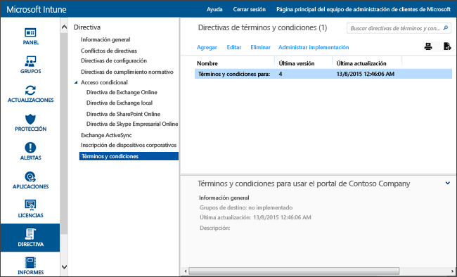

# Configuración de la directiva de términos y condiciones en Microsoft Intune
Puede implementar los términos y condiciones de Intune en los grupos de usuarios para explicar en qué afecta la inscripción, el acceso a los recursos de trabajo y el uso del portal de empresa a los dispositivos y los usuarios. Los usuarios deben aceptar los términos y las condiciones para poder usar el portal de empresa a fin de inscribirse y obtener acceso a su trabajo.

Puede crear e implementar varias directivas que contienen diferentes términos y condiciones. También puede generar versiones de los mismos términos y condiciones en distintos idiomas e implementarlas en los grupos correspondientes.

## Crear una directiva de términos y condiciones

1.  En la [consola de administración de Microsoft Intune](http://manage.microsoft.com), haga clic en **Directiva** &gt; **Términos y condiciones**.

    

2.  Haga clic en **Agregar** para crear una nueva directiva de términos y condiciones.

    También puede **Editar** o **Eliminar** una directiva existente.

3.  En la página **Crear términos y condiciones**, especifique la siguiente información:

    -   **Nombre**: nombre de directiva único que aparece en la consola de Intune.

    -   **Descripción**: detalles que le ayudan a identificar la directiva en la consola de Intune.

    -   **Título**: título que se muestra a los usuarios en el portal de empresa.

    -   **Texto para explicar qué significa la aceptación del usuario**: etiqueta que ven los usuarios en relación con la aceptación. **Ejemplo**: "Acepto los términos y condiciones".

4.  Cuando termine, haga clic en **Guardar**. La nueva directiva se muestra en el nodo **Términos y condiciones** del área de trabajo **Directiva**.

## Implementar una directiva de términos y condiciones

1.  En la [consola de administración de Microsoft Intune](http://manage.microsoft.com), haga clic en **Directiva** &gt; **Términos y condiciones**.

2.  En la lista **Directivas de términos y condiciones**, seleccione la directiva que desea implementar y, luego, haga clic en **Administrar implementación**.

3.  En el cuadro de diálogo **Administrar implementación**, seleccione los grupos de usuarios en los que desee implementar la directiva y haga clic en **Aceptar**.

    Cuando los usuarios de destino tienen acceso al portal de la empresa, Intune muestra los términos y las condiciones que implementó. Los usuarios deben aceptar estos términos para tener acceso a los recursos de la empresa.

## Supervisar una directiva de términos y condiciones

1.  En la [consola de administración de Microsoft Intune](http://manage.microsoft.com), haga clic en **Directiva** &gt; **Términos y condiciones**.

2.  En la ventana **Crear nuevo informe**, haga clic en **Ver informe**. El informe se abrirá e indicará los usuarios que aceptaron los términos y las condiciones que implementó.

### Actualizaciones y control de versiones de los términos y condiciones
Al editar una directiva existente de términos y condiciones, puede elegir el comportamiento al implementar la directiva. Use el procedimiento siguiente, que lo ayudará a actualizar las directivas existentes de términos y condiciones.

## Cómo trabajar con varias versiones de los términos y las condiciones

1.  En la [consola de administración de Microsoft Intune](http://manage.microsoft.com), haga clic en **Directiva** &gt; **Términos y condiciones**.

2.  Seleccione la directiva de términos y condiciones que desea modificar y luego haga clic en **Editar**.

3.  En la página **Editar términos y condiciones**, realice las modificaciones necesarias y luego especifique si esta nueva versión requiere que todos los usuarios acepten los términos y las condiciones, o si solo los usuarios nuevos verán la versión nueva.

    Se recomienda aumentar el número de versión y requerir aceptación cada vez que realice cambios importantes en la directiva de términos y condiciones. Si va a corregir errores tipográficos o cambiar el formato, por ejemplo, mantenga el número de versión actual.

### Consulte también
[Administrar la configuración y las características de los dispositivos con directivas de Microsoft Intune](manage-settings-and-features-on-your-devices-with-microsoft-intune-policies.md)

<!--HONumber=Jun16_HO4-->

