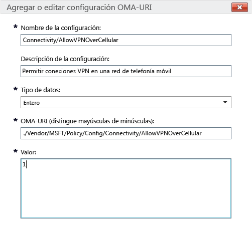

# Configuración de directivas de Intune para dispositivos Windows 10 en Microsoft Intune

Este tema contiene información que le ayudará a entender la configuración de directivas de Intune que puede usar para administrar dispositivos Windows 10. Lea este tema, además de los procedimientos de [Administrar la configuración y las características de los dispositivos con directivas de Microsoft Intune](manage-settings-and-features-on-your-devices-with-microsoft-intune-policies) para configurar opciones integradas y personalizadas para el escritorio de Windows 10 inscrito y los dispositivos Windows 10 Mobile. No puede usar estas directivas con equipos que ejecutan el [software cliente de PC de Intune](/intune/get-started/windows-pc-management-capabilities-in-microsoft-intune).

Puede elegir entre dos tipos de directivas:

- **Directiva personalizada**: use la **directiva personalizada** de Microsoft Intune para Windows 10 y Windows 10 Mobile para implementar la configuración de OMA-URI (identificador uniforme de recursos de Open Mobile Alliance), que se puede usar para controlar las características en los dispositivos. Windows 10 ofrece muchas opciones de configuración mediante el [proveedor de servicios de configuración de directivas](https://technet.microsoft.com/itpro/windows/manage/how-it-pros-can-use-configuration-service-providers).
- **Directiva de configuración general**: use este tipo de directiva si quiere seleccionar una configuración de la lista integrada que se proporciona con Microsoft Intune.

## Configuración de directivas personalizadas

Proporcione las siguientes opciones en una directiva personalizada:

## &nbsp;&nbsp;&nbsp;General

Escriba un nombre y, si lo desea, una descripción para esta directiva que le ayude a identificarla en la consola de Intune.

## &nbsp;&nbsp;&nbsp;Configuración de OMA-URI

Para cada configuración de OMA-URI que quiera agregar, escriba la siguiente información. Use la [referencia de configuración de URI de Windows 10](/intune/deploy-use/windows-10-policy-settings-in-microsoft-intune#Windows-10-URI-settings) de este tema para obtener información sobre la configuración que puede usar: 

- **Nombre de la configuración**: escriba un nombre único para la configuración de OMA-URI que le ayude a identificarla en la lista de valores de configuración.
- **Descripción de la configuración**: si lo desea, escriba una descripción para la configuración.
- **Tipo de datos**: elija una de estas opciones:
    - **String**
    - **Cadena (XML)**
    - **Fecha y hora**
    - **Integer**
    - **Punto flotante**
    - **Boolean**
- **OMA-URI (distingue mayúsculas de minúsculas)**: especifique el OMA-URI para el que quiere proporcionar un valor de configuración.
- **Valor**: especifique el valor que quiere asociar al OMA-URI especificado.

### Ejemplo
En la siguiente captura de pantalla, se ha habilitado el valor **Connectivity/AllowVPNOverCellular**. De esta forma, un dispositivo Windows 10 puede abrir una conexión VPN cuando se encuentra en una red de telefonía móvil.

> 

## - Configuración de URI de Windows 10
Use esta sección para obtener información sobre la configuración de OMA-URI que puede configurar con una **directiva personalizada de Windows 10**.

## &nbsp;&nbsp;&nbsp;Directiva

|Nombre y URI de la directiva|Detalles|
|---------------|------------|-----------|
|**Permitir la actualización automática** ./Vendor/MSFT/Policy/Config/Update/AllowAutoUpdate|Solo escritorio **Tipo de datos:** entero **Valores:** **0** - **5** (valor predeterminado: **1**)|
|**Programa el día de la instalación** ./Vendor/MSFT/Policy/Config/Update/ScheduledInstallDay|Solo Mobile **Tipo de datos:** entero **Values:** **0**: todos los días (valor predeterminado) **1**: domingo **2**: lunes **3**: martes **4**: miércoles **5**: jueves **6**: viernes **7**: sábado|
|**Programar la hora de la instalación** ./Vendor/MSFT/Policy/Config/Update/ScheduledInstallTime|Escritorio y Mobile **Tipo de datos:** entero **Valores:** **0**: **23** horas (**0** es medianoche) (valor predeterminado: **3**)|
|**DeviceLock/AllowIdleReturnWithoutPassword** ./Vendor/MSFT/Policy/Config/DeviceLock/AllowIdleReturnWithoutPassword|Solo Mobile **Tipo de datos:** entero **Values:** **0**: el usuario no puede establecer el temporizador de período de gracia de la contraseña y el valor se establece como "siempre" **1**: el usuario puede establecer el temporizador de período de gracia de la contraseña (valor predeterminado)|
|**WiFi/AllowWiFi** ./Vendor/MSFT/Policy/Config/WiFi/AllowWiFi|Solo Mobile **Tipo de datos:** entero **Values:** **0**: no se permite **usar la conexión Wi-Fi**. **1**: **se permite usar la conexión Wi-Fi** (valor predeterminado)|
|**Wi-Fi/AllowInternetSharing** ./Vendor/MSFT/Policy/Config/WiFi/AllowInternetSharing|Escritorio y Mobile **Tipo de datos:** entero **Valores:** **0**: No permitir el uso compartido de Internet; **1**: Permitir compartir Internet (valor predeterminado)|
|**Wi-Fi/AllowAutoConnectToWiFiSenseHotspots** ./Vendor/MSFT/Policy/Config/WiFi/AllowAutoConnectToWiFiSenseHotspots|Escritorio y Mobile **Tipo de datos:** entero **Valores:** **0**: no permitido; **1**: permitido (valor predeterminado)|
|**Wi-Fi/AllowManualWiFiConfiguration** ./Vendor/MSFT/Policy/Config/WiFi/AllowManualWiFiConfiguration|Solo Mobile **Tipo de datos:** entero **Values:** **0**: no se permite la conexión Wi-Fi fuera de la MDM aprovisionada. **1**: se permite agregar nuevos SSID de red más allá de los de la MDM aprovisionada (valor predeterminado).|
|**System/AllowLocation** ./Vendor/MSFT/Policy/Config/System/AllowLocation|Escritorio y Mobile **Tipo de datos:** entero **Valores:** **0**: no permitido; **1**: permitido (valor predeterminado)|
|**System/AllowTelemetry** ./Vendor/MSFT/Policy/Config/System/AllowTelemetry|Escritorio y Mobile **Tipo de datos:** entero **Values:** **0** : no permitido (valor de Enterprise solo) **1** : limitado **2**: completo (valor predeterminado) **3**: completo e información de diagnóstico|
|**Sistema/AllowExperimentation** ./Vendor/MSFT/Policy/Config/System/AllowExperimentation|Escritorio y Mobile **Tipo de datos:** entero **Values:** **0** : no permitido **1**: solo configuración (valor predeterminado) **2**: configuración y experimentación|
|**Security/AntiTheftMode** ./Vendor/MSFT/Policy/Config/Security/AntiTheftMode|Solo Mobile **Tipo de datos:** entero **Values:** **0**: no permitir el modo antirrobo **1**: preferencia del usuario (valor predeterminado)|
|**Connectivity/AllowUSBConnection** ./Vendor/MSFT/Policy/Config/Connectivity/AllowUSBConnection|Solo Mobile **Tipo de datos:** entero **Valores:** **0**: no permitido; **1**: permitido (valor predeterminado)|
|**System/AllowUserToResetPhone** ./Vendor/MSFT/Policy/Config/System/AllowUserToResetPhone|Solo Mobile **Tipo de datos:** entero **Valores:** **0**: no permitido; **1**: permitido (valor predeterminado)|
|**Connectivity/AllowCellularDataRoaming** ./Vendor/MSFT/Policy/Config/Connectivity/AllowCellularDataRoaming|Escritorio y Mobile **Tipo de datos:** entero **Valores:** **0**: no permitido; **1**: permitido (valor predeterminado)|
|**Connectivity/AllowVPNOverCellular** ./Vendor/MSFT/Policy/Config/Connectivity/AllowVPNOverCellular|Escritorio y Mobile **Tipo de datos:** entero **Values:** **0**: no se permite la VPN a través de la red de telefonía móvil **1**: la VPN puede usar cualquier conexión, incluida la de la red de telefonía móvil (valor predeterminado)|
|**Connectivity/AllowVPNRoamingOverCellular** ./Vendor/MSFT/Policy/Config/Connectivity/AllowVPNRoamingOverCellular|Solo Mobile **Tipo de datos:** entero **Valores:** **0**: no permitido; **1**: permitido (valor predeterminado)|
|**Connectivity/AllowVPNRoamingOverCellular** ./Vendor/MSFT/Policy/Config/Connectivity/AllowVPNRoamingOverCellular|Solo Mobile **Tipo de datos:** entero **Valores:** **0**: no permitido; **1**: permitido (valor predeterminado)|
|**Connectivity/AllowBluetooth** ./Vendor/MSFT/Policy/Config/Connectivity/AllowBluetooth|Escritorio y Mobile **Tipo de datos:** entero **Values:** **0**: no se permite al usuario activar el Bluetooth. **1**: reservado. El usuario puede activar y configurar el Bluetooth (no admitido en Windows Phone 8.1 para MDM, EAS, Windows 10 Escritorio o Windows 10 Mobile) **2**: permitido El usuario puede activar y configurar el Bluetooth (valor predeterminado)|
|**Experience/AllowScreenCapture** ./Vendor/MSFT/Policy/Config/Experience/AllowScreenCapture|Solo Mobile **Tipo de datos:** entero **Valores:** **0**: no permitido; **1**: permitido (valor predeterminado)|
|**Experience/AllowTaskSwitcher** ./Vendor/MSFT/Policy/Config/Experience/AllowTaskSwitcher|Solo Mobile **Tipo de datos:** entero **Valores:** **0**: no permitido; **1**: permitido (valor predeterminado)|
|**Experience/AllowVoiceRecording** ./Vendor/MSFT/Policy/Config/Experience/AllowVoiceRecording|Solo Mobile **Tipo de datos:** entero **Valores:** **0**: no permitido; **1**: permitido (valor predeterminado)|
|**Experience/AllowSyncMySettings** ./Vendor/MSFT/Policy/Config/Experience/AllowSyncMySettings|Solo Mobile **Tipo de datos:** entero **Valores:** **0**: No permitir itinerancia; **1**: Permitir itinerancia (valor predeterminado)|
|**Experience/AllowManualMDMUnenrollment** ./Vendor/MSFT/Policy/Config/Experience/AllowManualMDMUnenrollment|Escritorio y Mobile **Tipo de datos:** entero **Valores:** **0**: no permitido; **1**: permitido (valor predeterminado)|
|**Accounts/AllowMicrosoftAccountConnection** ./Vendor/MSFT/Policy/Config/Accounts/AllowMicrosoftAccountConnection|Escritorio y Mobile **Tipo de datos:** entero **Valores:** **0**: no permitido; **1**: permitido (valor predeterminado)|
|**Accounts/AllowAddingNonMicrosoftAccountsManually** ./Vendor/MSFT/Policy/Config/Accounts/AllowAddingNonMicrosoftAccountsManually|Escritorio y Mobile **Tipo de datos:** entero **Valores:** **0**: no permitido; **1**: permitido (valor predeterminado)|
|**Security/AllowManualRootCertificateInstallation** ./Vendor/MSFT/Policy/Config/Security/AllowManualRootCertificateInstallation|Solo Mobile **Tipo de datos:** entero **Valores:** **0**: no permitido; **1**: permitido (valor predeterminado)|
|**Security/AllowAddProvisioningPackages** ./Vendor/MSFT/Policy/Config/Security/AllowAddProvisioningPackages|Escritorio y Mobile **Tipo de datos:** entero **Valores:** **0**: no permitido; **1**: permitido (valor predeterminado)|
|**Search/DisableBackoff** ./Vendor/MSFT/Policy/Config/Search/DisableBackoff|Escritorio y Mobile **Tipo de datos:** entero **Valores:** **0** (valor predeterminado), **1**|
|**Search/PreventRemoteQueries** ./Vendor/MSFT/Policy/Config/Search/PreventRemoteQueries|Escritorio y Mobile **Tipo de datos:** entero **Valores:** **0**, **1** (valor predeterminado)|
|**Search/AllowUsingDiacritics** ./Vendor/MSFT/Policy/Config/Search/AllowUsingDiacritics|Escritorio y Mobile **Tipo de datos:** entero **Valores:** **0** (valor predeterminado), **1**|
|**Search/AlwaysUseAutoLangDetection** ./Vendor/MSFT/Policy/Config/Search/AlwaysUseAutoLangDetection|Escritorio y Mobile **Tipo de datos:** entero **Valores:** **0** (valor predeterminado), **1**|
|**Search/DisableRemovableDriveIndexing** ./Vendor/MSFT/Policy/Config/Search/DisableRemovableDriveIndexing|Escritorio y Mobile **Tipo de datos:** entero **Valores:** **0** (valor predeterminado), **1**|
|**Search/PreventIndexingLowDiskSpaceMB** ./Vendor/MSFT/Policy/Config/Search/PreventIndexingLowDiskSpaceMB|Escritorio y Mobile **Tipo de datos:** entero **Valores:** **0**, **1** (valor predeterminado)|
|**Search/AllowIndexingEncryptedStoresOrItems** ./Vendor/MSFT/Policy/Config/Search/AllowIndexingEncryptedStoresOrItems|Escritorio y Mobile **Tipo de datos:** entero **Valores:** **0** (valor predeterminado), **1**|
|**Security/AllowRemoveProvisioningPackage** ./Vendor/MSFT/Policy/Config/Security/AllowRemoveProvisioningPackage|Escritorio y Mobile **Tipo de datos:** entero **Valores:** **0**: no permitido; **1**: permitido (valor predeterminado)|
|**Security/RequireProvisioningPackageSignature** ./Vendor/MSFT/Policy/Config/Security/RequireProvisioningPackageSignature|Escritorio y Mobile **Tipo de datos:** entero **Valores:** **0** (valor predeterminado), **1**|
|**AboveLock/AllowActionCenterNotifications** ./Vendor/MSFT/Policy/Config/AboveLock/AllowActionCenterNotifications|Escritorio y Mobile **Tipo de datos:** entero **Valores:** **0**: no permitido; **1**: permitido (valor predeterminado)|
|**TextInput/AllowIMENetworkAccess** ./Vendor/MSFT/Policy/Config/TextInput/AllowIMENetworkAccess|Solo escritorio **Tipo de datos:** entero **Values:** **0** : no permitir El diccionario extendido abierto está desactivado. Un usuario no puede: - Agregar un nuevo diccionario extendido abierto - Agregar un nuevo archivo de configuración de integración de búsqueda - Usar la característica de candidato en la nube - Enviar la palabra registrada del usuario. **1**: permitir El diccionario extendido abierto se puede agregar y usar de forma predeterminada. La función de integración de búsqueda también se puede usar de forma predeterminada. Un usuario puede: Usar la característica de candidato en la nube.|
|**TextInput/AllowIMELogging** ./Vendor/MSFT/Policy/Config/TextInput/AllowIMELogging|Solo escritorio **Tipo de datos:** entero **Values:** **0**: el registro de conversión incorrecta está desactivado. **1**: el registro de conversión incorrecta está activado (valor predeterminado).|
|**TextInput/AllowJapaneseNonPublishingStandardGlyph** ./Vendor/MSFT/Policy/Config/TextInput/AllowJapaneseNonPublishingStandardGlyph|Solo escritorio **Tipo de datos:** entero **Valores:** **0**: no permitido; **1**: permitido (valor predeterminado)|
|**TextInput/AllowJapaneseIVSCharacters** ./Vendor/MSFT/Policy/Config/TextInput/AllowJapaneseIVSCharacters|Solo escritorio **Tipo de datos:** entero **Valores:** **0**: no permitido; **1**: permitido (valor predeterminado)|
|**TextInput/AllowJapaneseUserDictionary** ./Vendor/MSFT/Policy/Config/TextInput/AllowJapaneseUserDictionary|Solo escritorio **Tipo de datos:** entero **Valores:** **0**: no permitido; **1**: permitido (valor predeterminado)|
|**TextInput/AllowJapaneseIMESurrogatePairCharacters** ./Vendor/MSFT/Policy/Config/TextInput/AllowJapaneseIMESurrogatePairCharacters|Solo escritorio **Tipo de datos:** entero **Valores:** **0**: no permitido; **1**: permitido (valor predeterminado)|
|**TextInput/ExcludeJapaneseIMEExceptShiftJIS** ./Vendor/MSFT/Policy/Config/TextInput/ExcludeJapaneseIMEExceptShiftJIS|Solo escritorio **Tipo de datos:** entero **Values:** **0**: no se filtra ningún carácter (valor predeterminado). **1**: se filtra todo excepto los caracteres Shift JIS.|
|**TextInput/ExcludeJapaneseIMEExceptJIS0208** ./Vendor/MSFT/Policy/Config/TextInput/ExcludeJapaneseIMEExceptJIS0208|Solo escritorio **Tipo de datos:** entero **Values:** **0**: no se filtra ningún carácter (valor predeterminado). **1**: se filtra todo excepto los caracteres JIS0208.|
|**TextInput/ExcludeJapaneseIMEExceptJIS0208andEUDC** ./Vendor/MSFT/Policy/Config/TextInput/ExcludeJapaneseIMEExceptJIS0208andEUDC|Solo escritorio **Tipo de datos:** entero **Values:** **0**: no se filtra ningún carácter (valor predeterminado). **1**: se filtra todo excepto los caracteres JIS0208 o EUDC.|
|**TextInput/AllowInputPanel** ./Vendor/MSFT/Policy/Config/TextInput/AllowInputPanel|Solo escritorio **Tipo de datos:** entero **Valores:** **0**: no permitido; **1**: permitido (valor predeterminado)|
|**Bluetooth/AllowDiscoverableMode** ./Vendor/MSFT/Policy/Config/Bluetooth/AllowDiscoverableMode|Escritorio y Mobile **Tipo de datos:** entero **Valores:** **0**: no permitido; **1**: permitido (valor predeterminado)|
|**Bluetooth/AllowAdvertising** ./Vendor/MSFT/Policy/Config/Bluetooth/AllowAdvertising|Escritorio y Mobile **Tipo de datos:** entero **Valores:** **0**: no permitido; **1**: permitido (valor predeterminado)|
|**Settings/AllowDataSense** ./Vendor/MSFT/Policy/Config/Settings/AllowDataSense|Escritorio y Mobile **Tipo de datos:** entero **Valores:** **0**: no permitido; **1**: permitido (valor predeterminado)|
|**Settings/AllowVPN** ./Vendor/MSFT/Policy/Config/Settings/AllowVPN|Escritorio y Mobile **Tipo de datos:** entero **Valores:** **0**: no permitido; **1**: permitido (valor predeterminado)|
|**Settings/AllowWorkplace** ./Vendor/MSFT/Policy/Config/Settings/AllowWorkplace|Solo escritorio **Tipo de datos:** entero **Valores:** **0**: no permitido; **1**: permitido (valor predeterminado)|
|**Settings/AllowDateTime** ./Vendor/MSFT/Policy/Config/Settings/AllowDateTime|Escritorio y Mobile **Tipo de datos:** entero **Valores:** **0**: no permitido; **1**: permitido (valor predeterminado)|
|**Settings/AllowLanguage** ./Vendor/MSFT/Policy/Config/Settings/AllowLanguage|Solo escritorio **Tipo de datos:** entero **Valores:** **0**: no permitido; **1**: permitido (valor predeterminado)|
|**Settings/AllowRegion** ./Vendor/MSFT/Policy/Config/Settings/AllowRegion|Solo escritorio **Tipo de datos:** entero **Valores:** **0**: no permitido; **1**: permitido (valor predeterminado)|
|**Settings/AllowSignInOptions** ./Vendor/MSFT/Policy/Config/Settings/AllowSignInOptions|Solo escritorio **Tipo de datos:** entero **Valores:** **0**: no permitido; **1**: permitido (valor predeterminado)|
|**Settings/AllowYourAccount** ./Vendor/MSFT/Policy/Config/Settings/AllowYourAccount|Escritorio y Mobile **Tipo de datos:** entero **Valores:** **0**: no permitido; **1**: permitido (valor predeterminado)|
|**Settings/AllowPowerSleep** ./Vendor/MSFT/Policy/Config/Settings/AllowPowerSleep|Solo escritorio **Tipo de datos:** entero **Valores:** **0**: no permitido; **1**: permitido (valor predeterminado)|
|**Settings/AllowAutoPlay** ./Vendor/MSFT/Policy/Config/Settings/AllowAutoPlay|Solo escritorio **Tipo de datos:** entero **Valores:** **0**: no permitido; **1**: permitido (valor predeterminado)|
|**Experience/AllowCortana** ./Vendor/MSFT/Policy/Config/Experience/AllowCortana|Escritorio y Mobile **Tipo de datos:** entero **Valores:** **0**: no permitido; **1**: permitido (valor predeterminado)|
|**Search/SafeSearchPermissions** ./Vendor/MSFT/Policy/Config/Search/SafeSearchPermissions|Solo Mobile **Tipo de datos:** entero **Values:** **0** : filtrado estricto más alto del contenido para adultos **1**: filtrado moderado del contenido para adultos (no se filtrarán los resultados de búsqueda válidos, valor predeterminado)|
|**Experience/AllowCopyPaste** ./Vendor/MSFT/Policy/Config/Experience/AllowCopyPaste|Solo escritorio **Tipo de datos:** entero **Valores:** **0**: no permitido; **1**: permitido (valor predeterminado)|
|**Forzar tamaño inicial** ./Vendor/MSFT/Policy/Config/Start/ForceStartSize|Solo Mobile **Tipo de datos:** entero **Values:** **0**: permitir al usuario cambiar el tamaño (valor predeterminado) **1**: forzar la pantalla no completa **2**: forzar la pantalla completa|
|**Update/RequireDeferUpgrade** ./Vendor/MSFT/Policy/Config/Update/RequireDeferUpgrade|Escritorio y Mobile **Tipo de datos:** entero **Values:** **0**: no aplazar la actualización (permanecer en la rama actual, CB, valor predeterminado) **1**: habilitar que las actualizaciones se aplacen (el dispositivo sigue la rama actual para negocios, CBB y reglas) Si desea obtener información detallada, consulte: [Introducción al mantenimiento de Windows 10](https://technet.microsoft.com/library/mt598226.aspx) [Plan de implementación de Windows 10](https://technet.microsoft.com/library/mt574241.aspx)|
|**Update/DeferUpdatePeriod** ./Vendor/MSFT/Policy/Config/Update/DeferUpdatePeriod|Escritorio y Mobile **Descripción:** directiva para aplazar actualizaciones de software durante un máximo de 4 semanas **Tipo de datos:** entero **Values:**  **0**: aplicar actualizaciones inmediatamente (valor predeterminado) **1**-**4**: número de semanas durante las que aplazar las actualizaciones de software. Si desea obtener información detallada, consulte: [Introducción al mantenimiento de Windows 10](https://technet.microsoft.com/library/mt598226.aspx) [Plan de implementación de Windows 10](https://technet.microsoft.com/library/mt574241.aspx)|
|**Update/DeferUpgradePeriod** ./Vendor/MSFT/Policy/Config/Update/DeferUpgradePeriod|Escritorio y Mobile **Descripción:** directiva para aplazar actualizaciones de funciones durante un máximo de 8 meses **Tipo de datos:** entero **Values:** **0**: aplicar actualizaciones inmediatamente (valor predeterminado) **1**-**8**: número de meses durante los que aplazar actualizaciones de características. Si desea obtener información detallada, consulte: [Introducción al mantenimiento de Windows 10](https://technet.microsoft.com/library/mt598226.aspx) [Plan de implementación de Windows 10](https://technet.microsoft.com/library/mt574241.aspx)|
|**Update/PauseDeferrals** ./Vendor/MSFT/Policy/Config/Update/PauseDeferrals|Escritorio y Mobile **Descripción:** permite que un dispositivo deje de recibir actualizaciones durante 5 semanas. **Tipo de datos:** entero **Values:** **0**: aplicar actualizaciones inmediatamente (valor predeterminado) **1**: pausar las actualizaciones (expira transcurridas 5 semanas)|

## &nbsp;&nbsp;&nbsp;Windows Defender

|Nombre y URI de la directiva|Detalles|
|---------------|-----------|
|**AllowRealtimeMonitoring** ./Vendor/MSFT/Policy/Config/Defender/AllowRealtimeMonitoring|Solo escritorio **Tipo de datos:** entero **Valores:** **0**: no permitido; **1**: permitido (valor predeterminado)|
|**AllowBehaviorMonitoring** ./Vendor/MSFT/Policy/Config/Defender/AllowBehaviorMonitoring|Solo escritorio **Tipo de datos:** entero **Valores:** **0**: no permitido; **1**: permitido (valor predeterminado)|
|**AllowIntrusionPreventionSystem** ./Vendor/MSFT/Policy/Config/Defender/AllowIntrusionPreventionSystem|Solo escritorio **Tipo de datos:** entero **Valores:** **0**: no permitido; **1**: permitido (valor predeterminado)|
|**AllowIOAVProtection** ./Vendor/MSFT/Policy/Config/Defender/AllowIOAVProtection|Solo escritorio **Tipo de datos:** entero **Valores:** **0**: no permitido; **1**: permitido (valor predeterminado)|
|**AllowScriptScanning** ./Vendor/MSFT/Policy/Config/Defender/AllowScriptScanning|Solo escritorio **Tipo de datos:** entero **Valores:** **0**: no permitido; **1**: permitido (valor predeterminado)|
|**AllowOnAccessProtection** ./Vendor/MSFT/Policy/Config/Defender/AllowOnAccessProtection|Solo escritorio **Tipo de datos:** entero **Valores:** **0**: no permitido; **1**: permitido (valor predeterminado)|
|**RealTimeScanDirection** ./Vendor/MSFT/Policy/Config/Defender/RealTimeScanDirection|Solo escritorio **Tipo de datos:** entero **Values:** **0**: supervisar todos los archivos (valor predeterminado) **1** : supervisar los archivos entrantes **2** : supervisar los archivos salientes|
|**DaysToRetainCleanedMalware** ./Vendor/MSFT/Policy/Config/Defender/DaysToRetainCleanedMalware|Solo escritorio **Tipo de datos:** entero **Values:** **0** - **90**: representa la cantidad de tiempo que se conservará el malware. **Valor predeterminado:** **0**: se guarda en la carpeta de cuarentena para siempre y no se quita automáticamente|
|**AllowUserUIAccess** ./Vendor/MSFT/Policy/Config/Defender/AllowUserUIAccess|Solo escritorio **Tipo de datos:** entero **Valores:** **0**: no permitido; **1**: permitido (valor predeterminado)|
|**ScanParameter** ./Vendor/MSFT/Policy/Config/Defender/ScanParameter|Solo escritorio **Tipo de datos:** entero **Values:** **1**: examen rápido (valor predeterminado) **2**: examen completo|
|**ScheduleScanDay** ./Vendor/MSFT/Policy/Config/Defender/ScheduleScanDay|Solo escritorio **Tipo de datos:** entero **Values:** **0** -todos los días (valor predeterminado) **1**: lunes **2**: martes **3**: miércoles **4**: jueves **5**: viernes **6**: sábado **7**: domingo **8** : ningún examen programado|
|**ScheduleScanTime** ./Vendor/MSFT/Policy/Config/Defender/ScheduleScanTime|Solo escritorio **Tipo de datos:** entero **Values:** **0**: 12:00 **60** : 1:00 **120**: 2:00 (valor predeterminado) **180** : 3:00 **240** : 4:00 **300** : 5:00 **360** : 6:00 **420** : 7:00 **480** : 8:00 **540** : 9:00 **600** : 10:00 **660** : 11:00 **720** : 12:00 **780** : 13:00 **840** : 14:00 **900** : 15:00 **960** : 16:00 **1020** : 17:00 **1080** : 18:00 **1140** : 19:00 **1200** : 20:00 **1260** : 21:00 **1320** : 22:00 **1381** : ventana de mantenimiento|
|**ScheduleQuickScanTime** ./Vendor/MSFT/Policy/Config/Defender/ScheduleQuickScanTime|Solo escritorio **Tipo de datos:** entero **Values:** **0**: 12:00 **60** : 1:00 **120**: 2:00 (valor predeterminado) **180** : 3:00 **240** : 4:00 **300** : 5:00 **360** : 6:00 **420** : 7:00 **480** : 8:00 **540** : 9:00 **600** : 10:00 **660** : 11:00 **720** : 12:00 **780** : 13:00 **840** : 14:00 **900** : 15:00 **960** : 16:00 **1020** : 17:00 **1080** : 18:00 **1140** : 19:00 **1200** : 20:00 **1260** : 21:00 **1320** : 22:00 **1380** : 23:00|
|**AVGCPULoadFactor** ./Vendor/MSFT/Policy/Config/Defender/AVGCPULoadFactor|Solo escritorio **Tipo de datos:** entero **Valores:** **0** - **100** (valor predeterminado: **50**)|
|**AllowArchiveScanning** ./Vendor/MSFT/Policy/Config/Defender/AllowArchiveScanning|Solo escritorio **Tipo de datos:** entero **Valores:** **0**: no permitido; **1**: permitido (valor predeterminado)|
|**AllowEmailScanning** ./Vendor/MSFT/Policy/Config/Defender/AllowEmailScanning|Solo escritorio **Tipo de datos:** entero **Valores:** **0**: no permitido (valor predeterminado); **1**: permitido|
|**AllowFullScanRemovableDriveScanning** ./Vendor/MSFT/Policy/Config/Defender/AllowFullScanRemovableDriveScanning|Solo escritorio **Tipo de datos:** entero **Valores:** **0**: no permitido (valor predeterminado); **1**: permitido|
|**AllowFullScanOnMappedNetworkDrives** ./Vendor/MSFT/Policy/Config/Defender/AllowFullScanOnMappedNetworkDrives|Solo escritorio **Tipo de datos:** entero **Valores:** **0**: no permitido; **1**: permitido (valor predeterminado)|
|**AllowScanningNetworkFiles** ./Vendor/MSFT/Policy/Config/Defender/AllowScanningNetworkFiles|Solo escritorio **Tipo de datos:** entero **Valores:** **0**: no permitido; **1**: permitido (valor predeterminado). También se ejecuta cuando RTP está activado y se establece como permitido|
|**SignatureUpdateInterval** ./Vendor/MSFT/Policy/Config/Defender/SignatureUpdateInterval|Solo escritorio **Tipo de datos:** entero **Values:** **0**: no comprobar las firmas en un intervalo **1**: comprobar las firmas cada hora **2**: comprobar las firmas cada 2 horas, etc. **24**: comprobar las firmas cada día **Valor predeterminado:** 8: comprobar las firmas cada 8 horas|
|**AllowCloudProtection** ./Vendor/MSFT/Policy/Config/Defender/AllowCloudProtection|Solo escritorio **Tipo de datos:** entero **Valores:** **0**: no permitido; **1**: permitido (valor predeterminado)|
|**SubmitSamplesConsent** ./Vendor/MSFT/Policy/Config/Defender/SubmitSamplesConsent|Solo escritorio **Tipo de datos:** entero **Values:** **0**: preguntar siempre (valor predeterminado) **1** : enviar muestras seguras automáticamente **2** : no enviar nunca **3** : enviar todas las muestras automáticamente|
|**ExcludedExtensions** ./Vendor/MSFT/Policy/Config/Defender/ExcludedExtensions|Solo escritorio **Tipo de datos:** cadena **Values:** *&lt;lista de extensiones separadas por punto y coma&gt;* p. ej. **obj;lib** **Valor predeterminado**: no se excluye ninguna extensión|
|**ExcludedPaths** ./Vendor/MSFT/Policy/Config/Defender/ExcludedPaths|Solo escritorio **Tipo de datos:** cadena **Values:** *&lt;lista de rutas de acceso separadas por punto y coma&gt;* Ejemplo: **c:\test;c:\test1.exe** **Valor predeterminado:** no se excluye ninguna ruta de acceso|
|**ExcludedProcesses** ./Vendor/MSFT/Policy/Config/Defender/ExcludedProcesses|Solo escritorio **Tipo de datos:** cadena **Values:** *&lt;lista de rutas de acceso separadas por punto y coma&gt;* Ejemplo: **c:\test.exe;c:\test1.exe** **Valor predeterminado:** no se excluye ningún proceso|

## &nbsp;&nbsp;&nbsp;Explorador Edge

|Nombre y URI de la directiva|Detalles|
|---------------|------------|-----------|
|**Permitir explorador** ./Vendor/MSFT/Policy/Config/Browser/AllowBrowser|Solo Mobile **Tipo de datos:** entero **Valores:** **0**: exploración desactivada; **1**: exploración activada (valor predeterminado)|
|**AllowSearchSuggestionsinAddressBar** ./Vendor/MSFT/Policy/Config/Browser/AllowSearchSuggestionsinAddressBar|Escritorio y Mobile **Tipo de datos:** entero **Valores:** **0**: no mostrar sugerencias; **1**: mostrar sugerencias (valor predeterminado)|
|**SendIntranetTraffictoInternetExplorer** ./Vendor/MSFT/Policy/Config/Browser/SendIntranetTraffictoInternetExplorer|Solo escritorio **Tipo de datos:** entero **Values:** **0**: deshabilitado (abrir sitios de intranet en el explorador Edge, valor predeterminado). **1**: habilitado (abrir sitios de intranet en Internet Explorer).|
|**Permitir No realizar seguimiento** ./Vendor/MSFT/Policy/Config/Browser/AllowDoNotTrack|Escritorio y Mobile **Tipo de datos:** entero **Valores:** **0**: deshabilitado (DNT no enviado; valor predeterminado); **1**: habilitado (enviar DNT)|
|**Configurar SmartScreen** ./Vendor/MSFT/Policy/Config/Browser/AllowSmartScreen|Escritorio y Mobile **Tipo de datos:** entero **Valores:** **0**: no permitir; **1**: permitir (valor predeterminado)|
|**Permitir elementos emergentes** ./Vendor/MSFT/Policy/Config/Browser/AllowPopups|Solo escritorio **Tipo de datos:** entero **Valores:** **0**: bloquear elementos emergentes (valor predeterminado); **1**: permitir elementos emergentes|
|**Permitir cookies** ./Vendor/MSFT/Policy/Config/Browser/AllowCookies|Escritorio y Mobile **Tipo de datos:** entero **Values:** **0**: permitir cookies de todos los sitios web (valor predeterminado) **1**: bloquear solo cookies de terceros **2**: bloquear todas las cookies|
|**Permitir guardar contraseña** ./Vendor/MSFT/Policy/Config/Browser/AllowPasswordManager|Escritorio y Mobile **Tipo de datos:** entero **Values:** **0**: el administrador de contraseñas está deshabilitado  **1**: el administrador de contraseñas está habilitado (valor predeterminado)|
|**Permitir autorrellenar** ./Vendor/MSFT/Policy/Config/Browser/AllowAutofill|Solo escritorio **Tipo de datos:** entero **Valores:** **0**: deshabilitado (valor predeterminado); **1**: habilitado|
|**Configurar la lista de sitios de empresa** ./Vendor/MSFT/Policy/Config/Browser/EnterpriseModeSiteList|Solo escritorio **Tipo de datos:** cadena **Valores: **0**: no configurado;  **1**: usar la lista de sitios del modo de empresa de IE si está configurado (valor predeterminado);  **2**: especificar la ubicación de la lista de sitios de empresa|

## Configuración general de directivas

Use la **directiva de configuración general** de Microsoft Intune para Windows 10 para configurar las opciones integradas de los dispositivos Windows 10 Escritorio y Windows 10 Mobile inscritos. 

## &nbsp;&nbsp;&nbsp;Contraseña

|Nombre de la configuración|Información adicional (si es necesario)|
|----------------|----------------------|
|**Requerir contraseña para desbloquear dispositivos**|-|
|**Tipo de contraseña obligatoria**|Especifica si la contraseña debe ser solo numérica o alfanumérica|
|**Tipo de contraseña requerida** - **Número mínimo de conjuntos de caracteres**|Hay cuatro conjuntos de caracteres: letras minúsculas, letras mayúsculas, símbolos y números. Esta configuración especifica cuántos de estos conjuntos deben incluirse en la contraseña.|
|**Longitud mínima de la contraseña**|Solo se aplica a Windows 10 Mobile|
|**Número de errores de inicio de sesión repetidos que se permiten antes de que se borre el dispositivo**|Para los dispositivos que ejecutan Windows 10: si el dispositivo tiene habilitado BitLocker, se pondrá en el modo de recuperación de BitLocker si el inicio de sesión falla el número de veces especificado. Si el dispositivo no tiene habilitado BitLocker, no se aplicará esta configuración. Para los dispositivos que ejecutan Windows 10 Mobile: si el inicio de sesión falla el número de veces especificado, el dispositivo se borrará.|
|**Minutos de inactividad antes de que se apague la pantalla**|Especifica el tiempo durante el que un dispositivo debe estar inactivo antes de que se bloquee la pantalla.|
|**Caducidad de contraseña (días)**|Especifica el período de tiempo tras el que debe cambiarse la contraseña del dispositivo.|
|**Recordar el historial de contraseñas**|Especifica si quiere impedir que el usuario final cree contraseñas usadas anteriormente.|
|**Recordar historial de contraseñas** - **Impedir la reutilización de contraseñas anteriores**|Especifica el número de contraseñas usadas que el dispositivo recuerda.|
|**Requerir una contraseña cuando el dispositivo vuelva de un estado de inactividad**|Si está habilitado, el usuario debe escribir una contraseña para desbloquear el dispositivo. (Windows 10 Mobile solo)|

## &nbsp;&nbsp;&nbsp;Cifrado

|Nombre de la configuración|Información adicional (si es necesario)|
|----------------|----------------------|
|**Requerir cifrado en dispositivo móvil**|Habilita el cifrado en dispositivos de destino (Windows 10 Mobile solo)|

## &nbsp;&nbsp;&nbsp;System (Sistema)

|Nombre de la configuración|Información adicional (si es necesario)|
|----------------|----------------------|
|**Permitir captura de pantalla**|Permite al usuario capturar la pantalla del dispositivo como una imagen. (Windows 10 Mobile solo)|
|**Permitir cancelar suscripción manualmente**|Permite al usuario eliminar manualmente la cuenta del área de trabajo desde el dispositivo.|
|**Permitir la instalación de certificado raíz manualmente**|Se aplica a Windows 10 Mobile|
|**Permitir que datos de diagnóstico y uso se envíen a Microsoft**|Los valores posibles son:  **No**: no se envían datos a Microsoft. **Básico**: se envía información limitada a Microsoft **Mejorado**: se envían datos de diagnóstico mejorados a Microsoft **Completo (recomendado)**: envía los mismos datos que **Mejorado**, además de datos adicionales sobre el estado del dispositivo.|

## &nbsp;&nbsp;&nbsp;Cuenta y sincronización

|Nombre de la configuración|Información adicional (si es necesario)|
|----------------|----------------------|---------------------|
|**Permitir cuenta de Microsoft**|Permite al usuario asociar una cuenta de Microsoft con el dispositivo.|
|**Permitir añadir cuentas que no son de Microsoft de forma manual**|Permite al usuario agregar al dispositivo cuentas de correo electrónico que no estén asociadas a una cuenta de Microsoft.|
|**Permitir la sincronización de la configuración de las cuentas de Microsoft**|Permite que la configuración de dispositivo y aplicación asociada a una cuenta de Microsoft se sincronice entre los dispositivos.|

## &nbsp;&nbsp;&nbsp;Microsoft Edge

|Nombre de la configuración|Información adicional (si es necesario)|
|----------------|----------------------|
|**Permitir explorador web**|Permite el uso del explorador web de Edge en el dispositivo. (Windows 10 Mobile solo)|
|**Permitir sugerencias de búsqueda en la barra de direcciones**|Permite que el motor de búsqueda sugiera sitios a medida que se escriben las frases de búsqueda.|
|**Permitir enviar tráfico de intranet a Internet Explorer**|Permite a los usuarios abrir sitios web de intranet en Internet Explorer. (Windows 10 Escritorio solo)|
|**Permitir no rastrear**|Configura el explorador Edge para que envíe encabezados Do Not Track a los sitios web que visitan los usuarios.|
|**Habilitar SmartScreen**|-|
|**Permitir Active scripting**|Permite que se ejecuten en el explorador Edge scripts como JavaScript.|
|**Permitir elementos emergentes**|Solo se aplica a Windows 10 Escritorio|
|**Permitir cookies**|-|
|**Permitir autorrellenar**|Permite a los usuarios cambiar la configuración de Autocompletar en el explorador. (Windows 10 Escritorio solo)|
|**Permitir administrador de contraseñas**|Habilita o deshabilita la característica Administrador de contraseñas de Edge.|
|**Ubicación de la lista de sitios de Modo de empresa**|Especifica dónde se encuentra la lista de sitios web que se abrirá en modo de empresa. Los usuarios no pueden editar esta lista. (Windows 10 Escritorio solo)|

## &nbsp;&nbsp;&nbsp;Aplicaciones

|Nombre de la configuración|Información adicional (si es necesario)|
|----------------|----------------------|---------------------|
|**Permitir almacén de aplicaciones**|Solo se aplica a Windows 10 Mobile|

## &nbsp;&nbsp;&nbsp;Móvil

|Nombre de la configuración|Información adicional (si es necesario)|
|----------------|----------------------|---------------------|
|**Permitir itinerancia de datos**|Permite movilidad entre redes al obtener acceso a datos.|
|**Permitir VPN sobre móvil**|Controla si el dispositivo puede tener acceso a las conexiones VPN cuando se conecta a una red móvil.|
|**Permitir itinerancia de VPN sobre móvil**|Controla si el dispositivo puede tener acceso a las conexiones VPN cuando hay itinerancia a una red móvil.|

## &nbsp;&nbsp;&nbsp;Hardware

|Nombre de la configuración|Información adicional (si es necesario)|
|----------------|----------------------|
|**Permitir cámara**|-|
|**Permitir almacenamiento extraíble**|Especifica si se pueden usar dispositivos de almacenamiento externo, como una tarjeta SD, con el dispositivo.|
|**Permitir Wi-Fi**|Solo se aplica a Windows 10 Mobile|
|**Permitir compartir Internet**|Permite el uso compartido de una conexión de Internet en el dispositivo.|
|**Permitir la configuración Wi-Fi manual**|Controla si el usuario puede configurar sus propias conexiones Wi-Fi o si solo puede usar conexiones configuradas mediante un perfil Wi-Fi. (Windows 10 Mobile solo)|
|**Permitir la conexión automática a zonas Wi-Fi gratuitas**|Permite que el dispositivo se conecte automáticamente a zonas Wi-Fi gratuitas y acepte automáticamente los términos y condiciones para la conexión.|
|**Permitir geolocalización**|Especifica si el dispositivo puede usar información de servicios de ubicación.|
|**Permitir NFC**|Permite que el dispositivo use las funcionalidades de transmisión de datos en proximidad.|
|**Permitir Bluetooth**|-|
|**Permitir modo visible de Bluetooth **|Permite que otros dispositivos habilitados para Bluetooth detecten este dispositivo.|
|**Permitir anuncios de Bluetooth**|Permite que los dispositivos reciban anuncios a través de Bluetooth.|
|**Permitir restablecer teléfono**|Controla si el usuario puede restablecer su dispositivo a la configuración de fábrica.|
|**Permitir conexión USB**|Controla si los dispositivos pueden tener acceso a dispositivos de almacenamiento externo a través de una conexión USB.|
|**Permitir modo antirrobo**|Permite habilitar el modo antirrobo de Windows.|

## &nbsp;&nbsp;&nbsp;Funciones

|Nombre de la configuración|Información adicional (si es necesario)|
|----------------|----------------------|---------------------|
|**Permitir copiar y pegar**|Solo se aplica a Windows 10 Mobile|
|**Permitir grabación de voz**|Solo se aplica a Windows 10 Mobile|
|**Permitir a Cortana**|Habilita o deshabilita el asistente de voz de Cortana.|
|**Permitir notificaciones del centro de actividades**|Habilita o deshabilita notificaciones del centro de actividades en la pantalla de bloqueo del dispositivo. (Windows 10 Mobile solo)|

## &nbsp;&nbsp;&nbsp;Windows Defender

Todos los valores son solo válidos para Windows 10 Escritorio.

|Nombre de la configuración|Información adicional (si es necesario)|
|-|-|
|**Permitir supervisión en tiempo real**|Habilita el análisis en tiempo real de malware, spyware y otro software no deseado.|
|**Permitir supervisión del comportamiento**|Permite a Defender comprobar determinados patrones conocidos de actividad sospechosa en los dispositivos.|
|**Habilitar Sistema de inspección de red**|El Sistema de inspección de red (NIS) ayuda a proteger los dispositivos contra ataques basados en red mediante el uso de firmas de vulnerabilidades conocidas de Microsoft Endpoint Protection Center para detectar y bloquear el tráfico malintencionado.|
|**Analizar todas las descargas**|Controla si Defender analiza todos los archivos descargados de Internet.|
|**Permitir análisis de scripts**|Permite que Defender examine scripts que se usan en Internet Explorer.|
|**Supervisar actividad de archivos y programas**|Habilite esta opción para permitir que Defender supervise la actividad de archivos y programas en los dispositivos.|
|**Días que hay que hacer seguimiento de malware resuelto**|Permite que Defender continúe realizando el seguimiento de malware resuelto durante el número de días especificado para que pueda comprobar de forma manual los dispositivos previamente afectados. Si establece el número de días en **0**, el malware permanece en la carpeta de cuarentena y no se quita automáticamente. |
|**Permitir acceso a la interfaz de usuario de cliente**|Controla si la interfaz de usuario de Windows Defender se oculta a los usuarios finales. Cuando se cambia esta configuración, surtirá efecto la próxima vez que se reinicie el equipo del usuario final.|
|**Programar un examen rápido diario**|Permite programar un examen rápido que se lleva a cabo diariamente a la hora que seleccione.|
|**Programar un examen del sistema**|Permite programar un examen completo o rápido del sistema que se lleva a cabo periódicamente en el día y la hora seleccionados.|
|**Limitar el uso de la CPU durante un análisis a**|Permite limitar la cantidad de CPU que pueden usar los exámenes (de **1** a **100**)|
|**Examinar archivos de almacenamiento**|Permite que Defender examine archivos almacenados, como archivos Zip o Cab.|
|**Analizar mensajes de correo electrónico**|Permite que Defender analice los mensajes de correo electrónico cuando llegan al dispositivo.|
|**Analizar unidades extraíbles**|Permite que Defender analice unidades extraíbles, como sticks USB.|
|**Examinar unidades de red asignadas**|Permite que Defender examine archivos en unidades de red asignadas. Si los archivos de la unidad son de solo lectura, Defender no podrá quitar el malware que se encuentre en ellos.|
|**Examinar archivos abiertos desde carpetas compartidas de red**|Permite que Defender examine archivos en unidades de red compartidas (por ejemplo, aquellas a las que se tiene acceso desde una ruta de acceso UNC). Si los archivos de la unidad son de solo lectura, Defender no podrá quitar el malware que se encuentre en ellos.|
|**Intervalo de actualización de firma**|Especifica el intervalo en el que Defender buscará nuevos archivos de firma.|
|**Permitir la protección en la nube**|Permite o bloquea la recepción por parte de Microsoft Active Protection Service de información sobre la actividad de malware de los dispositivos que administra. Esta información se usa para mejorar el servicio en el futuro.|
|**Pedir a los usuarios el envío de muestras**|Controla si los archivos que podrían requerir un análisis posterior por parte de Microsoft para determinar si son malintencionados se envían automáticamente a Microsoft.|
|**Detección de aplicaciones potencialmente no deseadas**|Esta configuración se puede usar para proteger los dispositivos de escritorio de Windows inscritos frente a la ejecución de software que Windows Defender ha clasificado como potencialmente no deseado. Puede protegerse contra la ejecución de estas aplicaciones o puede usar el modo auditoría para informar cuando se instale una aplicación potencialmente no deseada.|
|**Archivos y carpetas que se van a excluir al ejecutar un análisis o al usar la protección en tiempo real**|Agrega uno o varios archivos y carpetas como **C:\Path** o **%ProgramFiles%\Path\filename.exe** a la lista de exclusiones. Estos archivos y carpetas no se incluirán en los análisis en tiempo real ni programados.|
|**Extensiones de archivo que se deben excluir al ejecutar un análisis o al utilizar protección en tiempo real**|Agrega una o varias extensiones de archivo como **jpg** o **txt** a la lista de exclusiones. Los archivos con estas extensiones no se incluirán en los análisis en tiempo real ni programados.|
|**Procesos que se deben excluir al ejecutar un análisis o al utilizar protección en tiempo real**|Agrega uno o varios procesos del tipo **.exe**, **.com** o **.scr** a la lista de exclusiones. Estos procesos no se incluirán en los análisis en tiempo real ni programados.| 

## &nbsp;&nbsp;&nbsp;Updates

|Nombre de la configuración|Información adicional (si es necesario)|
|----------------|---------------|
|**Permitir actualizaciones automáticas**|Habilite esta configuración para permitir las actualizaciones automáticas. Luego, configure una de las opciones siguientes para controlar el comportamiento de las actualizaciones: **Notificar descarga** **Instalar automáticamente en tiempo de mantenimiento** **Instalar y reiniciar automáticamente en tiempo de mantenimiento** **Instalar y reiniciar automáticamente a la hora programada** **Nota:** cuando esta opción está seleccionada, también puede configurar los valores siguientes: **Eliminar la notificación para el usuario final** y **Definir el día de instalación para las actualizaciones programadas**. (Windows 10 Escritorio solo)|
|**Permitir características de evaluación**|Permite a Microsoft implementar características y configuraciones de la versión preliminar en dispositivos Windows 10. Puede seleccionar permitir que se instale únicamente la configuración o todas las configuraciones y características de la versión preliminar.|

### Consulte también
[Administrar la configuración y las características de los dispositivos con directivas de Microsoft Intune](manage-settings-and-features-on-your-devices-with-microsoft-intune-policies.md)

<!--HONumber=Oct16_HO1-->

