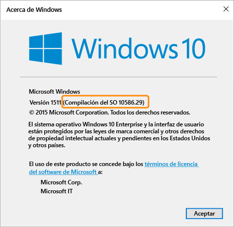

# Configuración de directivas de cumplimiento para dispositivos Windows en Microsoft Intune

La configuración de directiva que se describe en este tema se aplica a los dispositivos que ejecuten el sistema operativo Windows. La versión específica de Windows que se admite se indica en las secciones siguientes.

Si quiere información sobre otras plataformas, seleccione uno de los siguientes temas:
> [!div class="op_single_selector"]
- [Configuración de directivas de cumplimiento normativo para dispositivos iOS](ios-compliance-policy-settings-in-microsoft-intune.md)
- [Configuración de directivas de cumplimiento para dispositivos Android](android-compliance-policy-settings-in-microsoft-intune.md)
- [Configuración de directivas de cumplimiento para Android for Work](afw-compliance-policy-settings-in-microsoft-intune)

## Configuración de directivas de cumplimiento para dispositivos Windows Phone
La configuración que se indica en esta sección se admite en Windows Phone 8.1 y versiones posteriores.

## Configuración de seguridad del sistema
### Contraseña
- **Requerir una contraseña para desbloquear dispositivos móviles:** establezca esta opción en **Sí** para exigir que los usuarios escriban una contraseña antes de poder tener acceso a sus dispositivos.

- **Permitir contraseñas sencillas:** establezca esta opción en **Sí** para permitir a los usuarios crear contraseñas sencillas como "**1234**" o "**1111**".

-  **Longitud mínima de la contraseña:** especifique el número mínimo de dígitos o caracteres que debe contener la contraseña del usuario.
- **Tipo de contraseña obligatoria:** Especifique si los usuarios deben crear una contraseña **Alfanumérica** o **Numérica**.

  En los dispositivos a los que se obtiene acceso con una cuenta de Microsoft y que ejecutan Windows, la directiva de cumplimiento no podrá evaluarse correctamente si la longitud mínima de la contraseña es superior a 8 caracteres o si el número mínimo de conjuntos de caracteres es superior a 2.

- **Número mínimo de conjuntos de caracteres:** si la opción **Tipo de contraseña requerida** está establecida en **Alfanumérica**, esta configuración especifica el número mínimo de caracteres que debe contener la contraseña. Los conjuntos de cuatro caracteres son los siguientes:
  -   Letras minúsculas
  -   Letras mayúsculas
  -   Símbolos
  -   Números

  Si se establece un número superior para este valor de configuración, los usuarios deberán crear contraseñas más complejas. En los dispositivos a los que se obtiene acceso con una cuenta de Microsoft y que ejecutan Windows, la directiva de cumplimiento no podrá evaluarse correctamente si la longitud mínima de la contraseña es superior a 8 caracteres o si el número mínimo de conjuntos de caracteres es superior a 2.
- **Minutos de inactividad antes de que se requiera la contraseña:** especifica el tiempo de inactividad que transcurre antes de que el usuario deba volver a escribir su contraseña.

- **Caducidad de contraseña (días):** seleccione el número de días que faltan para que la contraseña caduque y durante los cuales deben crear una nueva.

- **Recordar historial de contraseñas:** use esta opción junto con **Impedir la reutilización de contraseñas anteriores** para impedir que el usuario cree contraseñas que se han usado anteriormente.

- **Impedir la reutilización de contraseñas anteriores:** si la opción **Recordar historial de contraseñas** está seleccionada, especifique el número de contraseñas usadas previamente que no se pueden volver a usar.
- **Requerir una contraseña cuando el dispositivo vuelva de un estado de inactividad:** este valor debe usarse junto con el de la opción **Minutos de inactividad antes de que sea necesaria la contraseña**. Se pedirá a los usuarios que escriban una contraseña para acceder a un dispositivo que haya estado inactivo durante el tiempo especificado en la opción **Minutos de inactividad antes de que sea necesaria la contraseña**.

  **Esta configuración solo se aplica a dispositivos Windows 10 Mobile.**
### Cifrado
- **Requerir cifrado en el dispositivo móvil:** establezca esta opción en **Sí** para requerir que el dispositivo esté cifrado para poder conectarse a los recursos.

## Configuración de estado del dispositivo
- **Requerir que se informe del mantenimiento correcto de los dispositivos:** puede establecer una regla para requerir que se informe del mantenimiento correcto de los dispositivos con **Windows 10 Mobile** en las directivas de cumplimiento nuevas o existentes.  Si se habilita esta opción de configuración, se evaluarán los puntos de datos siguientes de los dispositivos con Windows 10 a través del servicio de atestación de estado (HAS):
  -  **BitLocker is enabled** (BitLocker está habilitado): cuando Bitlocker está activado, el dispositivo puede proteger los datos almacenados en la unidad del acceso no autorizado cuando el sistema está apagado o entra en estado de hibernación. La característica Cifrado de unidad BitLocker de Windows cifra todos los datos almacenados en el volumen del sistema operativo Windows. BitLocker usa TPM para ayudar a proteger el sistema operativo Windows y los datos de usuario, y contribuye a evitar la manipulación de un equipo, incluso si se deja desatendido, se pierde o lo roban. Si el equipo incluye un TPM compatible, BitLocker lo usa para bloquear las claves de cifrado que protegen los datos. Como resultado, las claves no son accesibles hasta que TPM termina la comprobación del estado del equipo.
  -  **Code integrity is enabled** (La integridad de código está habilitada): la integridad de código es una característica que valida la integridad de un archivo del sistema o controlador cada vez que se carga en la memoria. Integridad de código detecta si se está cargando un archivo del sistema o controlador sin firmar en el kernel, o si software malintencionado que se ejecuta mediante una cuenta de usuario con privilegios de administrador ha modificado un archivo del sistema.
  - **Secure Boot is enabled** (El arranque seguro está habilitado): si el arranque seguro está habilitado, el sistema debe arrancar en un estado de confianza de fábrica. Además, si el arranque seguro está habilitado, los componentes principales que se usan para arrancar el equipo deben tener las firmas de cifrado correctas que son de confianza para la organización que fabricó el dispositivo. El firmware UEFI lo comprueba antes de permitir iniciar el equipo. Si los archivos se han manipulado e interrumpido su firma, el sistema no arrancará.

  Para obtener información sobre cómo funciona el servicio HAS, consulte [HealthAttestation CSP](https://msdn.microsoft.com/library/dn934876.aspx).
##  Configuración de propiedades de dispositivo
- **SO mínimo requerido:** cuando un dispositivo no cumpla el requisito de versión de SO mínima, se notificará como no compatible.
    Además, se mostrará un vínculo con información sobre cómo actualizar el sistema. El usuario final puede optar por actualizar el dispositivo, tras lo cual podrá tener acceso a los recursos de la empresa.

- **Versión de SO máxima permitida:** cuando un dispositivo usa una versión de SO posterior a la especificada en la regla, se bloquea el acceso a los recursos de la empresa y se solicita al usuario que se ponga en contacto con el administrador de TI. Mientras no se cambie la regla para permitir la versión de SO, este dispositivo no podrá usarse para acceder a los recursos de la empresa.

## Configuración de directivas de cumplimiento para equipos Windows
La configuración indicada en esta sección se admite en equipos Windows.
## Configuración de seguridad del sistema
### Contraseña
- **Longitud mínima de la contraseña:** se admite en Windows 8.1.

  Especifique el número mínimo de dígitos o caracteres que debe contener la contraseña del usuario.

  En los dispositivos a los que se obtiene acceso con una cuenta de Microsoft, la directiva de cumplimiento no podrá evaluarse correctamente si el valor de **Longitud mínima de la contraseña** es superior a 8 caracteres o el de **Número mínimo de conjuntos de caracteres** es superior a 2.

- **Tipo de contraseña requerida:** se admite en Windows RT, Windows RT 8.1 y Windows 8.1.

  Especifique si los usuarios deben crear una contraseña **Alfanumérica** o **Numérica**.

- **Número mínimo de conjuntos de caracteres:** se admite en Windows RT, Windows RT 8.1 y Windows 8.1. Si la opción **Tipo de contraseña requerida** está establecida en **Alfanumérica**, esta configuración especifica el número mínimo de caracteres que debe contener la contraseña. Los conjuntos de cuatro caracteres son los siguientes:
  -   Letras minúsculas
  -   Letras mayúsculas
  -   Símbolos
  -   Números: si se establece un número superior para este valor de configuración, los usuarios deberán crear contraseñas más complejas.

  En los dispositivos a los que se obtiene acceso con una cuenta de Microsoft, la directiva de cumplimiento no podrá evaluarse correctamente si el valor de **Longitud mínima de la contraseña** es superior a 8 caracteres o el de **Número mínimo de conjuntos de caracteres** es superior a 2.
- **Minutos de inactividad antes de que sea necesaria la contraseña:** se admite en Windows RT, Windows RT 8.1 y Windows 8.1.

  Especifique el tiempo de inactividad antes de que el usuario deba volver a escribir la contraseña.

- **Expiración de la contraseña:** se admite en Windows RT, Windows RT 8.1 y Windows 8.1.

  Seleccione el número de días que faltan para que la contraseña caduque y durante los cuales deben crear una nueva.

- **Recordar historial de contraseñas:** se admite en Windows RT, Windows RT 8.1 y Windows 8.1.

  Use esta opción junto con **Impedir la reutilización de contraseñas anteriores** para impedir que el usuario cree contraseñas que se han usado anteriormente.
- **Impedir la reutilización de contraseñas anteriores:** se admite en Windows RT, Windows RT 8.1 y Windows 8.1.

  Si la opción **Recordar historial de contraseñas** está seleccionada, especifique el número de contraseñas usadas previamente que no se pueden volver a usar.

## Configuración de estado del dispositivo
- **Requerir que se informe del mantenimiento correcto de los dispositivos:** se admite en dispositivos Windows 10.
Puede establecer una regla para requerir que se informe del mantenimiento correcto de los dispositivos con Windows 10 en las directivas de cumplimiento nuevas o existentes.  Si se habilita esta opción de configuración, se evaluarán los puntos de datos siguientes de los dispositivos con Windows 10 a través del servicio de atestación de estado (HAS):
  -  **BitLocker is enabled** (BitLocker está habilitado): cuando Bitlocker está activado, el dispositivo puede proteger los datos almacenados en la unidad del acceso no autorizado cuando el sistema está apagado o entra en estado de hibernación. La característica Cifrado de unidad BitLocker de Windows cifra todos los datos almacenados en el volumen del sistema operativo Windows. BitLocker usa TPM para ayudar a proteger el sistema operativo Windows y los datos de usuario, y contribuye a evitar la manipulación de un equipo, incluso si se deja desatendido, se pierde o lo roban. Si el equipo incluye un TPM compatible, BitLocker lo usa para bloquear las claves de cifrado que protegen los datos. Como resultado, las claves no son accesibles hasta que TPM termina la comprobación del estado del equipo.
  -  **Code integrity is enabled** (La integridad de código está habilitada): la integridad de código es una característica que valida la integridad de un archivo del sistema o controlador cada vez que se carga en la memoria. Integridad de código detecta si se está cargando un archivo del sistema o controlador sin firmar en el kernel, o si software malintencionado que se ejecuta mediante una cuenta de usuario con privilegios de administrador ha modificado un archivo del sistema.
  - **Secure Boot is enabled** (El arranque seguro está habilitado): si el arranque seguro está habilitado, el sistema debe arrancar en un estado de confianza de fábrica. Además, si el arranque seguro está habilitado, los componentes principales que se usan para arrancar el equipo deben tener las firmas de cifrado correctas que son de confianza para la organización que fabricó el dispositivo. El firmware UEFI lo comprueba antes de permitir iniciar el equipo. Si los archivos se han manipulado e interrumpido su firma, el sistema no arrancará.
  - **Early-launch antimalware is enabled** (El antimalware de inicio temprano está habilitado): el antimalware de inicio temprano (ELAM) proporciona protección para los equipos de la red cuando se inician y antes de que se inicialicen los controladores de terceros.

  Para obtener información sobre cómo funciona el servicio HAS, consulte [HealthAttestation CSP](https://msdn.microsoft.com/library/dn934876.aspx).

## Configuración de propiedades de dispositivo
- **Minimum OS required:** (Versión mínima de sistema operativo): se admite en Windows 8.1 y Windows 10.

  Especifique aquí el número de major.minor.build. El número de versión debe coincidir con la versión devuelta por el comando winver.

  Cuando un dispositivo tiene una versión anterior a la versión de sistema operativo especificada, se notifica como no conforme. Además, se mostrará un vínculo con información sobre cómo actualizar el sistema. El usuario final puede optar por actualizar el dispositivo, tras lo cual podrá tener acceso a los recursos de la empresa.

- **Maximum OS version allowed** (Versión máxima de sistema operativo permitida): se admite en Windows 8.1 y Windows 10.

  Cuando un dispositivo usa una versión de SO posterior a la especificada en la regla, se bloquea el acceso a los recursos de la empresa y se solicita al usuario que se ponga en contacto con el administrador de TI. Mientras no se cambie la regla para permitir la versión de SO, este dispositivo no podrá usarse para acceder a los recursos de la empresa.

Para buscar la versión de sistema operativo que se usará para las opciones **Minimum OS required** (Versión mínima de sistema operativo) y **Maximum OS version allowed** (Versión máxima de sistema operativo permitida), ejecute el comando **winver** desde el símbolo del sistema. El comando winver devuelve la versión de sistema operativo notificada.
- Los equipos con Windows 8.1 devuelven la versión **6.3**.    Si la regla de la versión de sistema operativo se establece en Windows 8.1 para Windows, el dispositivo se notificará como no conforme aunque tenga Windows 8.1.
- En los equipos que ejecutan Windows 10, la versión debe establecerse en "10.0" + el número de compilación del sistema operativo devuelto por el comando winver. Por ejemplo, podría ser similar a 10.0.10586.
> 

<!--HONumber=Nov16_HO2-->

