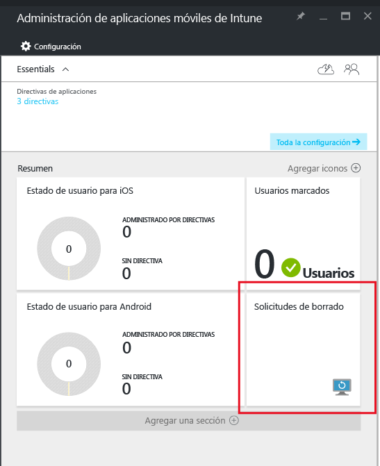

# Borrar los datos administrados de la aplicación de la empresa con Microsoft Intune
Cuando un dispositivo se pierde o lo roban, o cuando un empleado deja la empresa, le interesa asegurarse de que se eliminan del dispositivo los datos de la aplicación de empresa. Sin embargo, es posible que no quiera quitar del dispositivo los datos personales, sobre todo si se trata de un dispositivo propiedad de un empleado.

Para quitar de forma selectiva los datos de la aplicación de empresa, cree una solicitud de borrado siguiendo los pasos descritos en la sección **Crear una solicitud de borrado** de este tema.  Una vez realizada la solicitud, la próxima vez que la aplicación se ejecute en el dispositivo, los datos de la empresa se quitarán de la aplicación.
>[!NOTE]
> Se quitan los contactos de la aplicación sincronizados directamente con la libreta de direcciones nativa. No se pueden borrar los contactos de la libreta de direcciones nativa sincronizados con otro origen externo. Actualmente esto se aplica únicamente a Microsoft Outlook.

## Crear una solicitud de borrado

1.  En la hoja **Administración de aplicaciones móviles de Intune**, elija el icono **Solicitudes de borrado**.

    

2.  Elija **Nueva solicitud de borrado**.

    

3.  En la hoja **Nueva solicitud de borrado**, elija **Usuario** para abrir la hoja **Usuario** y seleccione el usuario cuyos datos de aplicación quiera borrar.

4.  Elija **Dispositivo**.  Se abrirá la hoja **Dispositivo** que enumera todos los dispositivos asociados con el usuario seleccionado.  Seleccione el dispositivo que desea borrar.

5.  Ahora está de nuevo en la hoja **Nueva solicitud de borrado**. Seleccione **Aceptar** para realizar una solicitud de borrado. El servicio crea y realiza el seguimiento de una solicitud de borrado de datos independiente para cada aplicación protegida en el dispositivo.

## Supervisar las solicitudes de borrado de datos
En la hoja **Administración de aplicaciones móviles de Intune** , encontrará un informe resumido en el icono **Borrar solicitudes** .  Esta opción muestra el estado general e incluye el número de solicitudes pendientes y de errores. Para obtener más detalles, siga los pasos descritos a continuación:

1.  En la hoja **Administración de aplicaciones móviles de Intune**, seleccione el icono **Solicitudes de borrado** para abrir la hoja **Solicitud de borrado**.

2.  En la hoja **Solicitud de borrado** , puede ver la lista de solicitudes agrupadas según usuarios.  Debido a que el sistema crea una solicitud de borrado para cada aplicación protegida que se ejecuta en el dispositivo, puede que vea varias solicitudes para un mismo usuario.  Este estado indica si una solicitud de borrado está **pendiente**, ha provocado un **error**o si es **correcta**.

El usuario debe abrir la aplicación de la que se vaya a realizar el borrado, que puede tardar hasta 30 minutos después de efectuar la solicitud. 

Los borrados con estado pendiente se muestran hasta que se eliminen manualmente.  Para eliminar manualmente una solicitud de borrado, haga clic derecho y seleccione Eliminar.

### Consulte también
[Proteger datos mediante las directivas de administración de aplicaciones móviles con Microsoft Intune](protect-app-data-using-mobile-app-management-policies-with-microsoft-intune.md)

[Usar Azure Portal](azure-portal-for-microsoft-intune-mam-policies.md)

<!--HONumber=Nov16_HO2-->

