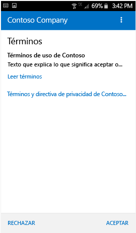

# Inscriba el dispositivo Android en Intune

Si su empresa o centro educativo usa Microsoft Intune, puede inscribir un dispositivo Android para obtener acceso al correo electrónico, a los archivos y a otros recursos de la empresa. Cuando los dispositivos se inscriben, el departamento de TI puede administrar esos recursos profesionales o educativos y mantenerlos protegidos, al tiempo que los usuarios pueden usar el dispositivo que elijan libremente para realizar su trabajo. Para más información sobre la inscripción, vea [What happens when I install the Company Portal app and enroll my device?](what-happens-if-you-install-the-Company-Portal-app-and-enroll-your-device-in-intune-android.md) (¿Qué ocurre cuando se instala la aplicación de portal de empresa y se inscribe el dispositivo?).

Estas instrucciones de inscripción son adecuadas para dispositivos Android de Samsung Knox y dispositivos Android "nativos" (distintos a Samsung Knox). Para saber si tiene un dispositivo Samsung Knox, vaya a **Configuración** &gt; **Acerca del dispositivo**. Si no ve "Versión KNOX" en la lista, significa que el suyo es un dispositivo Android nativo.

Antes o después de la inscripción, se le pedirá que elija una categoría que describa de la mejor forma posible cómo usar el dispositivo. El administrador de TI usa esta categoría para ayudar a determinar a qué aplicaciones tiene acceso.

Si recibe un error al intentar inscribir el dispositivo en Intune, puede [enviar errores de inscripción a su administrador de TI](send-enrollment-errors-to-your-it-administrator-android.md).

**Para inscribir su dispositivo Android:**

1.  Instale la aplicación gratuita de portal de empresa de Intune desde [Google Play](http://play.google.com/store/apps/details?id=com.microsoft.windowsintune.companyportal).

2.  Abra la aplicación de portal de empresa de Microsoft Intune.

3.  En la pantalla de **inicio de sesión** del Portal de empresa, pulse **Iniciar sesión** y luego inicie sesión con su cuenta profesional o educativa.

       

4.  Si el administrador de TI configuró los términos y condiciones, pulse **ACEPTAR** para aceptar los términos.

    

5.  Inicie sesión en la aplicación de portal de empresa con su cuenta profesional o educativa y contraseña correspondiente y, luego, pulse en **Iniciar sesión**.

    

6.  En la pantalla **Configuración de acceso a la empresa**, pulse **COMENZAR**.

    

7.  En la pantalla **¿Por qué inscribir el dispositivo?**, lea lo que puede hacer si inscribe el dispositivo y, luego, pulse en **Continuar**.

    

8.  Revise una lista sobre lo que el administrador de TI puede y no puede ver en el dispositivo y pulse en **CONTINUAR**.

    

9.  En la pantalla **Lo que viene después**, lea lo que sucede durante la inscripción y después pulse **INSCRIBIR**.

    

10.  Si usa Android 6.0 o posterior, realice este paso. De lo contrario, vaya al próximo paso.

    Si el administrador de TI ha configurado algunas directivas, puede que aparezcan los siguientes mensajes:
    -   **¿Permitir que Portal de empresa realice y administre llamadas telefónicas?**

    

    Si ve este mensaje, pulse en **PERMITIR**. Pulsar en PERMITIR no entraña riesgos, puesto que **Microsoft nunca realiza ni controla sus llamadas de teléfono**. Google es responsable del texto del mensaje, que Microsoft no puede modificar. Al permitir el acceso, lo único que está haciendo es dejar que el dispositivo escriba registros de datos en su tarjeta SD, lo que, a cambio, permite mover esos registros usando un cable USB.

    Si se deniega el acceso, el mensaje aparecerá de nuevo la próxima vez que inicie sesión en el Portal de empresa, pero puede desactivar los mensajes futuros si pulsa en la casilla **No volver a preguntar**.  Si más adelante decide permitir el acceso, vaya a **Configuración** &gt; **Aplicaciones** &gt; **Portal de empresa** &gt; **Permisos** &gt; **Teléfono**y active el permiso.

    -   **Allow Company Portal to access your contacts? (¿Permitir que el portal de empresa tenga acceso a los contactos?)**

    

    Si ve este mensaje, pulse en **PERMITIR**. Pulsar en PERMITIR no entraña riesgos, puesto que **Microsoft nunca tiene acceso a sus contactos**. Google es responsable del texto del mensaje, que Microsoft no puede modificar. Cuando permite el acceso, solo permite que la aplicación del Portal de empresa cree, use y administre su cuenta profesional.

    Si se deniega el acceso, el mensaje aparecerá de nuevo la próxima vez que pulse **Enviar datos**, pero puede desactivar los mensajes futuros si pulsa en la casilla **No volver a preguntar**. Si más adelante decide permitir el acceso, vaya a **Configuración** &gt; **Aplicaciones** &gt; **Portal de empresa** &gt; **Permisos** &gt; **Almacenamiento**y active el permiso.

11.  En la pantalla **Activar administrador del dispositivo**, pulse **Activar**.

    

12.  Siga las instrucciones para escribir un PIN o contraseña. Si ya ha configurado un PIN o una contraseña en este dispositivo, no verá esta pantalla y no deberá escribir un PIN o contraseña nueva.

    

13.  Siga las instrucciones correspondientes al tipo de dispositivo que use (Android nativo o Samsung Knox). Para saber si tiene un dispositivo Samsung Knox, vaya a **Configuración** &gt; **Acerca del dispositivo**. Si no ve "Versión KNOX" en la lista, significa que el suyo es un dispositivo Android nativo.

    -   Dispositivo nativo (distinto de Samsung Knox): en la pantalla **Nombre del certificado**, pulse en **Aceptar** para aceptar el certificado predeterminado.

    

    -   Dispositivo Samsung Knox: acepte la política de privacidad de Samsung Knox y pulse en **CONFIRMAR**.

    

    Aparecerá el siguiente mensaje en la pantalla mientras Intune inscribe el dispositivo.

    

14. Cuando aparezca la pantalla **Configuración de acceso de la compañía**, pulse **CONTINUAR**. Si ve un mensaje que indica que el dispositivo es incompatible, siga las instrucciones para solucionar el problema y luego pulse **CONTINUAR**.

      

11. En la pantalla **Configuración de acceso de la compañía completada**, pulse **LISTO**. El dispositivo ya está inscrito.

    

Antes de intentar instalar aplicaciones de empresa, vaya a **Configuración** &gt; **Seguridad** y active **Orígenes desconocidos**. Si no activa esta opción antes de intentar instalar aplicaciones, verá el mensaje "Instalación bloqueada." Por motivos de seguridad, el dispositivo está configurado para bloquear las instalaciones de aplicaciones procedentes de orígenes desconocidos". Puede pulsar **Configuración** en el cuadro de diálogo del error para ir a la opción **Orígenes desconocidos**.

¿Sigue necesitando ayuda? Póngase en contacto con el administrador de TI (consulte el [sitio web del Portal de empresa](http://portal.manage.microsoft.com) para obtener información de contacto) o escriba al equipo de Microsoft Android en wintunedroidfbk@microsoft.com.

### Consulte también
[Uso de un dispositivo Android con Intune](using-your-android-device-with-intune.md)

<!--HONumber=Jul16_HO4-->

