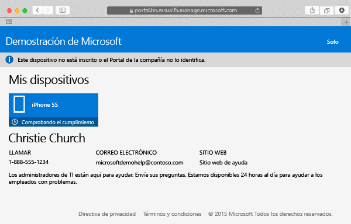

# Inscribir el dispositivo Mac OS X en Intune

Si inscribe el dispositivo Mac OS X en Intune, podrá obtener acceso a la red de la empresa, al correo electrónico y a los archivos del trabajo y, además, podrá conseguir aplicaciones de empresa. Para más información sobre lo que ocurre cuando un dispositivo se inscribe, vea [What happens if you install the Company Portal app and enroll your device in Intune?](what-happens-if-you-install-the-company-portal-app-and-enroll-your-device-in-intune-ios.md) (¿Qué ocurre cuando se instala la aplicación de portal de empresa y se inscribe el dispositivo en Intune?).

Si lo que quiere es inscribir un dispositivo iOS, vea [Enroll your iOS device in Intune](enroll-your-device-in-intune-ios.md) (Inscribir el dispositivo iOS en Intune).

Para inscribir el dispositivo Mac OS X:

1.  Con un explorador Safari, abra el [Sitio web del Portal de empresa](https://portal.manage.microsoft.com) y pulse en la barra de notificación.

2.  Pulse en **Este dispositivo no está inscrito o el Portal de empresa no lo identifica**.

    

3.  Puntee en **Instalar** para iniciar la inscripción del dispositivo.

    

4.  En el diálogo **Instalar el perfil de administración**, pulse **Instalar**. Si se abre un cuadro de diálogo que le pide que escriba sus credenciales, escriba el nombre de usuario y la contraseña y, luego, pulse en **Continuar** &gt; **Instalar**.

    

    Cuando termine la inscripción, verá una página de perfil de administración en la que se muestra que se ha verificado el perfil.

    

¿Sigue necesitando ayuda? Póngase en contacto con el administrador de TI. Para averiguar su información de contacto, vaya al [sitio web del portal de empresa](http://portal.manage.microsoft.com).

### Consulte también
[Using your iOS or Mac OS X device with Intune](using-your-ios-or-mac-os-x-device-with-intune.md)

<!--HONumber=Jul16_HO4-->

