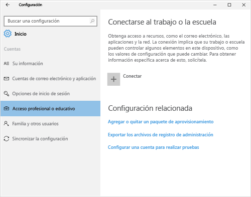
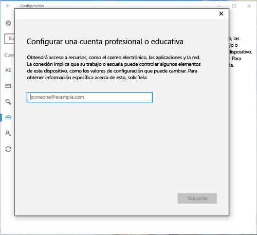
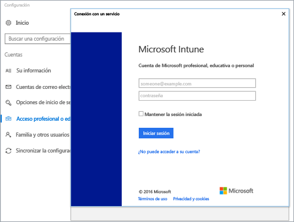
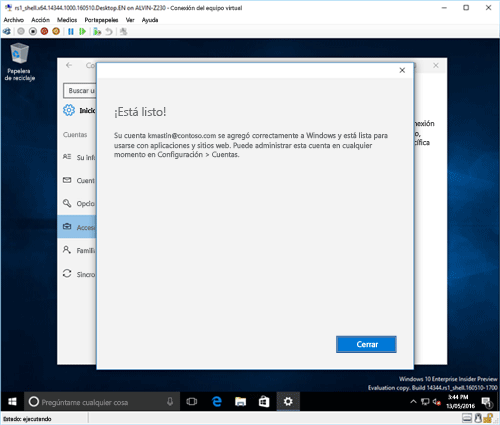
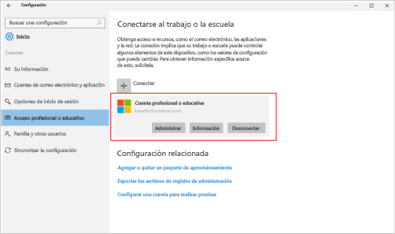

# Inscribir un dispositivo Windows 10 en Intune

<iframe src="https://channel9.msdn.com/Series/IntuneEnrollment/Windows-Enrollment/player" width="960" height="540" allowFullScreen frameBorder="0"></iframe>

1.  Pulse **Obtener acceso a trabajo o escuela** y, después, pulse **Conectar**.

    

2.  Escriba su dirección de correo electrónico profesional o educativo y pulse **Siguiente**.

    

3. Inicie sesión en Intune con su cuenta profesional o educativa.

    

    Verá un mensaje que indica que su empresa o escuela están registradas en el dispositivo.

4. Cuando las vea, significa que se ha**completado el proceso** pulse **Cerrar**. Ya ha terminado.

  

5. Si quiere comprobar de nuevo que la conexión es correcta, vuelva a **Configuración**, donde debería ver que aparece su cuenta profesional o educativa.

    

Si después de seguir los pasos anteriores, no consigue tener acceso a la cuenta de correo electrónico profesional o educativo y a los archivos, siga los pasos de [Pasos de solución de problemas a seguir si ve acceso profesional o educativo](troubleshoot-your-windows-10-device-windows.md#troubleshooting-steps-to-follow-if-you-see-access-work-or-school).

<!--HONumber=Dec16_HO2-->

