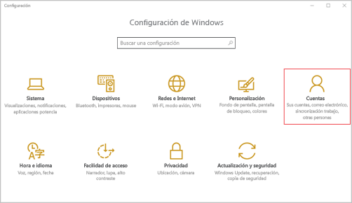

# Inscribir un dispositivo Windows 10 Mobile o Windows 10 Escritorio en Intune

Si su empresa o centro educativo usa Microsoft Intune, puede inscribir los dispositivos para obtener acceso al correo electrónico, a los archivos y a otros recursos de la empresa. Cuando los dispositivos están inscritos, la organización puede tener protegidos los datos corporativos. Para más información sobre la inscripción, vea [What happens if you install the Company Portal app and enroll your device in Intune?](what-happens-if-you-install-the-company-portal-app-and-enroll-your-device-in-intune-windows.md) (¿Qué ocurre cuando se instala la aplicación de portal de empresa y se inscribe el dispositivo en Intune?) y [What your IT administrator can and can't see on your device](what-can-your-it-administrator-see-when-you-enroll-your-device-in-intune-windows.md) (¿Qué puede ver y no ver el administrador de TI en el dispositivo?).

Para inscribir un dispositivo Windows 10 Mobile o Windows 10 Escritorio:

1.  Vaya a la opción **Configuración** de Windows y pulse **Cuentas**.

    

2.  Examine las dos pantallas siguientes y encuentre la que sea similar a lo que ve en el dispositivo. Siga los pasos que tienen que ver con la pantalla que verá en el dispositivo.

    Si aparece esta pantalla, siga los pasos de [Pasos a seguir si ve acceso profesional o educativo](#steps-to-follow-if-you-see-access-work-or-school).

    

    Si aparece esta pantalla, siga los pasos de [Pasos a seguir si ve su cuenta](#steps-to-follow-if-you-see-your-account).

    

## Pasos a seguir si ve acceso profesional o educativo

1.  Seleccione **Acceso profesional o educativo**.

    

2.  Escriba su correo electrónico profesional o educativo y seleccione **Siguiente**.

    

3. Inicie sesión en Intune con su cuenta profesional o educativa.

    

    Verá un mensaje que indica que su empresa o escuela están registradas en el dispositivo.

4. Cuando las vea, significa que se ha**completado el proceso** página, seleccione **Cerrar**. Ya ha terminado.

  

5. Si desea comprobar nuevamente que la conexión es correcta, vuelva a **Configuración**, y podrá ver ahora que aparece la cuenta profesional o educativa.

    

Si después de seguir los pasos anteriores, no consigue tener acceso a los archivos y al correo electrónico profesional o educativo, siga los pasos en [Pasos de solución de problemas a seguir si ve acceso profesional o educativo](troubleshoot-your-windows-10-device-windows.md#troubleshooting-steps-to-follow-if-you-see-access-work-or-school).

## Pasos a seguir si ve su cuenta

1.  Vaya a la opción **Configuración** de Windows y pulse **Cuentas**.

    

2.  Pulse en **Su cuenta**.

    

3.  Puntee en **Agregar una cuenta de trabajo o escuela**.

    

4.  Inicie sesión con las credenciales de su trabajo o escuela.

    

Si después de seguir los pasos anteriores, no consigue tener acceso al correo electrónico profesional o educativo, a los archivos y a otros datos, siga los pasos de solución de problemas en [Pasos de solución de problemas a seguir si ve su cuenta](troubleshoot-your-windows-10-device-windows.md#troubleshooting-steps-to-follow-if-you-see-your-account).

También se recomienda instalar la aplicación Portal de empresa, que le permitirá identificar fácilmente y obtener las aplicaciones de la empresa que son relevantes para usted y su rol. Según la forma en que su empresa configuró Intune, la aplicación Portal de empresa se pudo haber instalado como parte del proceso de inscripción. Para comprobar si tiene la aplicación, busque **Portal de empresa** en la lista de aplicaciones. Si no ve el Portal de empresa en su lista de aplicaciones, siga estos pasos para instalarlo.

1.  Pulse en **Inicio** &gt; **Tienda**.

2.  Pulse en **Buscar** y escriba **portal de empresa**.

3.  En la lista de resultados, pulse en **Portal de empresa** &gt; **Instalar**.

4.  Pulse en **Instalar** o **Gratis**. La opción que se muestra dependerá de cómo la empresa haya configurado la aplicación.

¿Sigue necesitando ayuda? Póngase en contacto con el administrador de TI. Para averiguar su información de contacto, vaya al [sitio web del portal de empresa](http://portal.manage.microsoft.com).

### Consulte también
[Usar un dispositivo Windows con Intune](using-your-windows-device-with-intune.md)

<!--HONumber=Aug16_HO3-->

