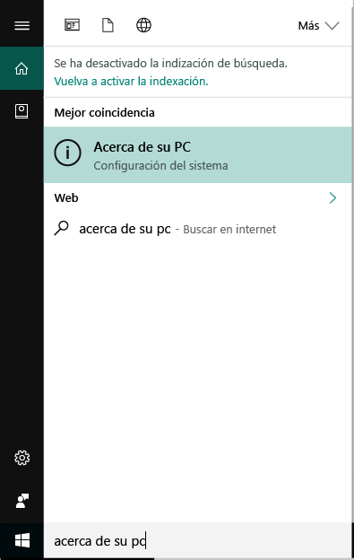

# Inscribir dispositivos Windows 10 en Intune

La inscripción de dispositivos en Microsoft Intune permite que los dispositivos Windows 10 tengan acceso a datos seguros de la organización, incluidos el correo electrónico, los archivos y otros recursos. Esto se aplica tanto a dispositivos Windows 10 Escritorio como a dispositivos Windows 10 Mobile. La inscripción de dispositivos ayuda a proteger este acceso para el usuario y la organización, y permite mantener separados los datos profesionales de los datos personales.

¿Quiere obtener más información? Averigüe lo que sucede al [inscribir el dispositivo en Intune](what-happens-if-you-install-the-company-portal-app-and-enroll-your-device-in-intune-windows.md) y lo que conlleva para la [información que contiene el dispositivo](what-can-your-it-administrator-see-when-you-enroll-your-device-in-intune-windows.md).

## Dispositivos Windows 10 Escritorio
1.  Vaya a __Inicio__.

 .

2. Escriba la frase "acerca de tu PC" en la __barra de búsqueda__ y, después, seleccione __Acerca de tu PC__.

 

2.  En __Configuración__, verá una lista con información sobre la versión de Windows 10 instalada en el equipo. En esta lista, busque la __versión__.

 

3.  Si su versión es __1607__, continúe con [estos pasos](enroll-your-w10-device-access-work-or-school.md). Si su versión es __1511__, continúe con [estos pasos](enroll-your-w10-device-your-account.md).

## Dispositivos Windows 10 Mobile

1.  En __Inicio__, deslice el dedo hasta la lista __Todas las aplicaciones__ y seleccione la aplicación __Configuración__.
2.  Pulse __Sistema__ y, después, __Acerca de__.
3.  En __Información del dispositivo__, pulse __Más información__. Verá una lista con información sobre el dispositivo. En esta lista, busque la __versión__.
4.  Si su versión es __1607__, continúe con [estos pasos](enroll-your-w10-device-access-work-or-school.md). Si su versión es __1511__, continúe con [estos pasos](enroll-your-w10-device-your-account.md).

¿Sigue necesitando ayuda? Póngase en contacto con el administrador de TI. Para averiguar su información de contacto, vaya al [sitio web del portal de empresa](http://portal.manage.microsoft.com).

<!--HONumber=Dec16_HO2-->

