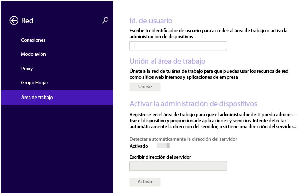
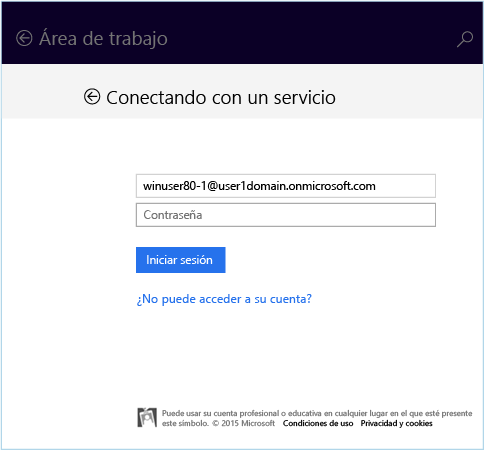
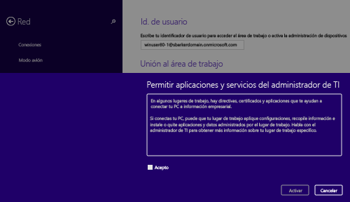

---
# required metadata

title: Inscribir el dispositivo Windows 8.1 o Windows RT 8.1 en Intune | Microsoft Intune
description:
keywords:
author: Staciebarker
manager: jeffgilb
ms.date: 04/28/2016
ms.topic: article
ms.prod:
ms.service: microsoft-intune
ms.technology:
ms.assetid: 28984f26-1070-4f7a-877c-669a59375c0c

# optional metadata

#ROBOTS:
#audience:
#ms.devlang:
ms.reviewer: priyar
ms.suite: ems
#ms.tgt_pltfrm:
#ms.custom:

---

# Inscribir el dispositivo Windows 8.1 o Windows RT 8.1 en Intune

Si su empresa o centro educativo usa Microsoft Intune, puede inscribir los dispositivos para obtener acceso al correo electrónico, a los archivos y a otros recursos de la empresa. Cuando los dispositivos están inscritos, la organización puede tener protegidos los datos corporativos. Para más información sobre la inscripción, vea [What happens if you install the Company Portal app and enroll your device in Intune?](what-happens-if-you-install-the-company-portal-app-and-enroll-your-device-in-intune-windows.md) (¿Qué ocurre cuando se instala la aplicación de portal de empresa y se inscribe el dispositivo en Intune?) y [What your IT administrator can and can't see on your device](what-can-your-it-administrator-see-when-you-enroll-your-device-in-intune-windows.md) (¿Qué puede ver y no ver el administrador de TI en el dispositivo?).

Para inscribir el dispositivo Windows 8.1 o Windows RT 8.1:

1.  En el dispositivo, pulse en **Configuración** &gt; **Configuración de PC** &gt; **Red** &gt; **Área de trabajo**.

    

2.  Escriba una dirección de correo laboral educativa para el identificador de usuario y pulse en **Unirse**.

    Si el identificador de usuario no es necesario, entonces se usará la dirección de correo electrónico que especificó al iniciar sesión en este dispositivo.

3.  Escriba la contraseña del correo electrónico de su empresa o centro educativo.

    

4.  En **Activar la Administración de dispositivos**, pulse en **Activar**.

    

5.  En el cuadro de diálogo **Permitir aplicaciones y servicios del administrador de TI**, active la casilla **Acepto** y luego pulse en **Activar**.

    

    Cuando se haya registrado correctamente, verá la siguiente pantalla.

    

También se recomienda instalar la aplicación Portal de empresa, que le permitirá identificar fácilmente y obtener las aplicaciones de la empresa que son relevantes para usted y su rol. Según la forma en que su empresa configuró Intune, la aplicación Portal de empresa se pudo haber instalado como parte del proceso de inscripción. Para comprobar si tiene la aplicación, busque **Portal de empresa** en la lista de aplicaciones. Si no ve el Portal de empresa en su lista de aplicaciones, siga estos pasos para instalarlo.

1.  Pulse en **Inicio** &gt; **Tienda**.

2.  Pulse en **Buscar** y escriba **portal de empresa**.

3.  En la lista de resultados, pulse en **Portal de empresa**.

4.  Pulse en **Instalar** o **Gratis**. La opción que se muestra dependerá de cómo la empresa haya configurado la aplicación.

¿Sigue necesitando ayuda? Póngase en contacto con el administrador de TI. Para averiguar su información de contacto, vaya al [sitio web del portal de empresa](http://portal.manage.microsoft.com).

### Consulte también
[Inscriba el dispositivo Windows en Intune](enroll-your-device-in-intune-windows.md) 
[Usar un dispositivo Windows con Intune](using-your-windows-device-with-intune.md)

<!--HONumber=Jun16_HO2-->

