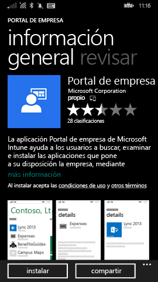
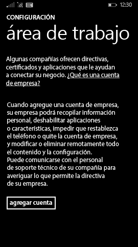

# Inscribir el dispositivo Windows Phone 8.1 en Intune

Si su empresa o centro educativo usa Microsoft Intune, puede inscribir los dispositivos para obtener acceso al correo electrónico, a los archivos y a otros recursos de la empresa. Cuando los dispositivos están inscritos, la organización puede tener protegidos los datos corporativos. Para más información sobre la inscripción, vea [What happens if you install the Company Portal app and enroll your device in Intune?](what-happens-if-you-install-the-company-portal-app-and-enroll-your-device-in-intune-windows.md) (¿Qué ocurre cuando se instala la aplicación de portal de empresa y se inscribe el dispositivo en Intune?) y [What your IT administrator can and can't see on your device](what-can-your-it-administrator-see-when-you-enroll-your-device-in-intune-windows.md) (¿Qué puede ver y no ver el administrador de TI en el dispositivo?).

Para inscribir el dispositivo Phone 8.1 en Intune, siga las instrucciones que se ajusten a su empresa:

-   [Si su empresa le permite usar el Portal de empresa desde la Tienda Windows](#if-your-company-lets-you-use-the-company-portal-from-the-windows-store)

-   [Si no está autorizado para tener acceso a la Tienda Windows desde su Windows Phone o no tiene una cuenta Microsoft](#if-you-are-not-allowed-to-access-the-windows-store-from-your-windows-phone-or-if-you-do-not-have-a-microsoft-account)

## Si su empresa le permite usar el Portal de empresa desde la Tienda Windows
Instale la aplicación del Portal de empresa en su dispositivo:

1.  Pulse en **Inicio** &gt; **Tienda**.

2.  Pulse en **Buscar** y escriba **portal de empresa**.

3.  En la lista de resultados, pulse en **Portal de empresa**.

    

4.  Pulse en **Portal de empresa ** &gt; **Instalar**.

    

Inscriba su dispositivo:

1.  En el dispositivo, abra la aplicación **Portal de empresa de Microsoft Intune**.

2.  Proporcione sus credenciales. Se le pedirá que acepte los términos y condiciones de su empresa, si es necesario.

3.  Deslice rápidamente hasta **Mis dispositivos**.

4.  Pulse en **Pulse para inscribir o identificar el dispositivo**.

    

5.  Pulse en **Inscribir un dispositivo**.

    

6.  Pulse en **Agregar cuenta**.

    

7.  Escriba información adicional cuando se le solicite y luego pulse en **Iniciar sesión** para completar la inscripción. Ahora debería aparecer su cuenta de área de trabajo en la página **Configuración** &gt; **Área de trabajo**.

    

## Si no está autorizado para tener acceso a la Tienda Windows desde su Windows Phone o no tiene una cuenta Microsoft

1.  Pulse en **Configuración** &gt; **Área de trabajo**.

2.  Pulse en **Agregar cuenta** y luego inicie sesión con su cuenta laboral.

3.  Escriba información adicional cuando se le solicite y luego pulse en **Iniciar sesión** para completar la inscripción.

4.  Si se le pide que instale la aplicación de empresa o un concentrador, asegúrese de que esté activada la casilla correspondiente y pulse en **Listo**.

Si su administrador de TI configuró el Portal de empresa para que se instale durante la inscripción, lo verá en la lista de aplicaciones.

¿Sigue necesitando ayuda? Póngase en contacto con el administrador de TI. Para averiguar su información de contacto, vaya al [sitio web del portal de empresa](http://portal.manage.microsoft.com).

### Consulte también
[Inscriba el dispositivo Windows en Intune](enroll-your-device-in-intune-windows.md) 
[Usar un dispositivo Windows con Intune](using-your-windows-device-with-intune.md)

<!--HONumber=Aug16_HO1-->

