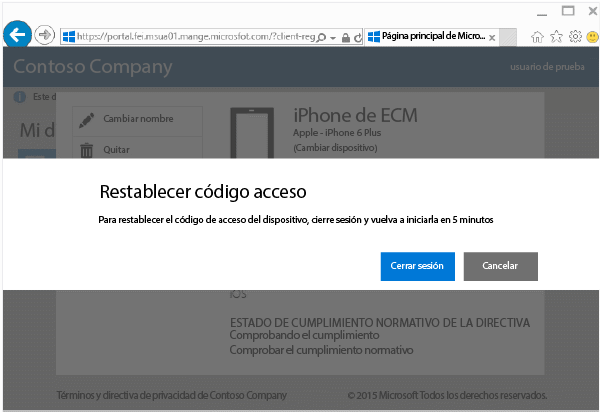

# Restablecer el código de acceso de un dispositivo desde el sitio web del portal de empresa

Si pierde el PIN o la contraseña de un dispositivo inscrito en Intune, puede usar el [sitio web del portal de empresa](http://portal.manage.microsoft.com) para restablecerlos. Puede usar el sitio web del Portal de empresa para administrar equipos y dispositivos que haya inscrito en Intune y para realizar la mayoría de las tareas que se pueden hacer con la aplicación Portal de empresa.

> [!NOTE]
> Es posible que no vea el botón **Restablecer contraseña** en el sitio web de Portal de empresa. Si no lo hace, tendrá que ponerse en contacto con el administrador de TI para obtener soporte técnico en el sitio web de Portal de empresa.

Para restablecer el código de acceso:

1.  Abra el [sitio web del Portal de empresa](http://portal.manage.microsoft.com) y elija el dispositivo cuyo código de acceso quiere restablecer.

2.  Elija **Restablecer código de acceso**.

    

3.  Elija **Cerrar sesión** y vuelva a iniciar sesión con las credenciales de su cuenta profesional o educativa. Tendrá que volver a iniciar sesión en un plazo de cinco minutos.

    

4.  Elija **Restablecer código de acceso**.

    

    Consulte la tabla para ver cómo funciona **Restablecer código de acceso** en su dispositivo.

    |Tipo de dispositivo|¿Qué ocurre al restablecer?|
    |------------|-----------|
    |Android|Quita el código de acceso existente y crea un código de acceso temporal con letras y números|
    |iOS|Quita el código de acceso existente y no crea un código de acceso temporal. Si utiliza el escáner de huellas dactilares Touch ID para abrir el dispositivo o realizar compras, deberá configurarlo de nuevo.|
    |Windows 10 Mobile|Quita el código de acceso existente y crea un código de acceso temporal con letras y números. Si utiliza el reconocimiento facial de Windows Hello para iniciar sesión, seguirá siendo compatible.|
    |Windows Phone 8,1|Quita el código de acceso existente y crea un código de acceso temporal con números.|

    5.  Desbloquee el dispositivo y establezca un código de acceso nuevo, o bien cambie el código de acceso temporal en **Configuración** en el dispositivo.

    Para ver una notificación que confirme que la contraseña se restableció correctamente, haga clic en la marca de notificación en la parte superior derecha del sitio del portal de empresa.

¿Sigue necesitando ayuda? Póngase en contacto con el administrador de TI. Para averiguar su información de contacto, vaya al [sitio web del portal de empresa](http://portal.manage.microsoft.com).

<!--HONumber=Jan17_HO4-->

