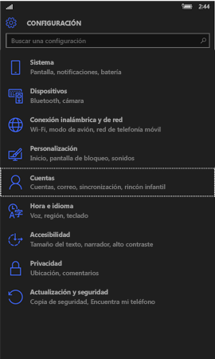
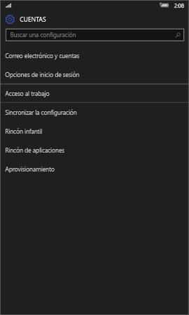
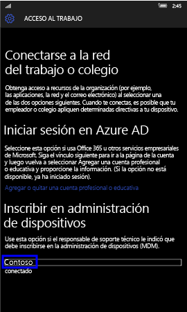
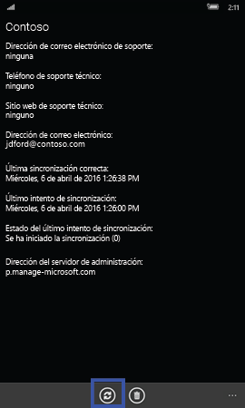
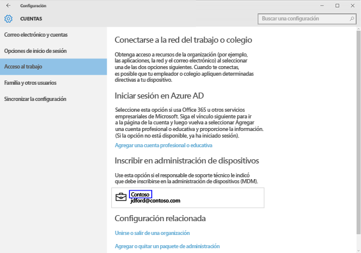
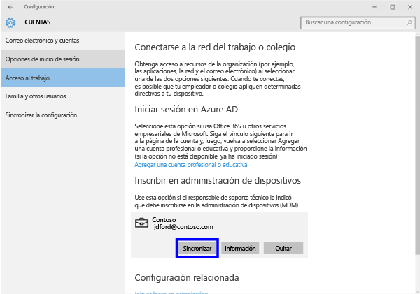
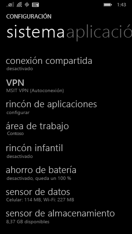
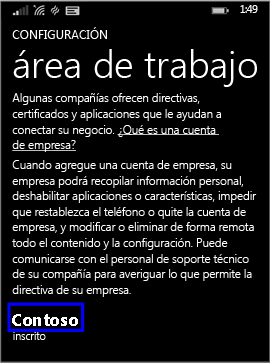

---
# required metadata

title: Sincronizar el dispositivo manualmente | Microsoft Intune
description:
keywords:
author: Staciebarker
manager: jeffgilb
ms.date: 04/28/2016
ms.topic: article
ms.prod:
ms.service: microsoft-intune
ms.technology:
ms.assetid: 443c6de7-5187-4dc4-b844-6085a0c659bd

# optional metadata

#ROBOTS:
#audience:
#ms.devlang:
ms.reviewer: jeffgilb
ms.suite: ems
#ms.tgt_pltfrm:
#ms.custom:

---

# Sincronizar el dispositivo manualmente
Si la instalación de la aplicación tarda demasiado, siga estas instrucciones para sincronizar manualmente el dispositivo Windows, ya que esto puede ayudarle a acelerar la instalación. Siga las instrucciones que coincidan con el tipo de dispositivo que tenga:

* [Windows 10 Mobile](#windows-10-mobile)
* [Windows 10 Escritorio](#windows-10-desktop)
* [Windows Phone 8,1](#windows-phone-8-1)

## Windows 10 Mobile
Para sincronizar manualmente el dispositivo de Windows 10 Mobile de modo que se acelere la instalación de una aplicación lenta:

1. Vaya a **Todas las aplicaciones** > **Configuración** > **Cuentas**..

    
    
2. Pulse **Acceso al trabajo**..

    
    
3. En **Enroll in to device management** (Inscribirse en la administración de dispositivos), pulse el nombre de su empresa, como se muestra abajo.

    
    
4. Pulse el icono **Sincronizar**.

    
    
    Aparece el mensaje "We’re synching your account" (Estamos sincronizando su cuenta) en la parte superior de la pantalla. El botón Sincronizar aparecerá atenuado hasta que el dispositivo finalice la sincronización.

## Windows 10 Escritorio
Para sincronizar manualmente el dispositivo de Windows 10 Escritorio de modo que se acelere la instalación de una aplicación lenta:

1. Seleccione el botón **Iniciar**, tal como se muestra abajo, y seleccione **Configuración**..

    
    
2. En la página **Configuración**, seleccione **Cuentas**..
 
    
    
3. En la página **Cuentas**, seleccione **Acceso al trabajo**..
    
    
    
4. En la sección **Enroll in to device management** (Inscribirse en la administración de dispositivos), haga clic en el nombre de su empresa, como se muestra resaltado en azul más abajo.
    
    
   
5. Seleccione el botón **Sincronizar**.
    
    
   
   El botón se atenúa hasta que se complete la sincronización.

## Windows Phone 8,1
Para sincronizar manualmente el dispositivo de Windows Phone 8.1 de modo que se acelere la instalación de una aplicación lenta:

1. Vaya a **Todas las aplicaciones** > **Configuración** > **Área de trabajo**..

    
    
2. Pulse el nombre de su empresa, como se indica resaltado en azul más abajo.

    
   
3. Pulse el icono **Sincronizar**.

    
    
   Aparece el mensaje "We’re synching your account" (Estamos sincronizando su cuenta) en la parte superior de la pantalla hasta que el dispositivo acabe de sincronizarse.

### Consulte también
[Usar un dispositivo Windows con Intune](using-your-windows-device-with-intune.md)

<!--HONumber=May16_HO1-->

