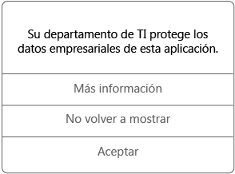

# Usar aplicaciones administradas en el dispositivo iOS

Las aplicaciones administradas son aplicaciones que el administrador de TI puede configurar para ayudar a proteger los datos de la empresa a los que se puede acceder en esa aplicación. Al acceder a los datos de la empresa en una aplicación administrada en el dispositivo iOS, es posible que observe que funciona de una forma un poco diferente a la esperada. Por ejemplo, es posible que no pueda copiar y pegar los datos protegidos de la compañía o no pueda guardar dichos datos en determinadas ubicaciones.

Las distintas aplicaciones administradas también pueden trabajar juntas en el dispositivo para que pueda realizar las tareas diarias, a la vez que mantiene los datos corporativos protegidos. Por ejemplo, si abre un archivo de la empresa en una aplicación administrada y se requiere otra aplicación administrada para ver ese archivo, la aplicación administrada que le permite ver el archivo se abre automáticamente. Si una aplicación requerida no está disponible, ciertas operaciones, como la apertura de un documento o el acceso a un vínculo web desde dentro de un documento administrado, pueden no estar disponibles.

Cuando accede a datos de la empresa en una aplicación administrada, verá un mensaje como el siguiente, que le permite saber que la aplicación que está abriendo está administrada.

### ¿Cómo se pueden obtener aplicaciones administradas?
Las aplicaciones administradas se obtienen de dos maneras distintas:

-   Cuando el dispositivo está inscrito en Microsoft Intune, puede instalar la aplicación desde la aplicación Portal de empresa o un sitio web del Portal de empresa, o bien el administrador de TI puede instalarla en el dispositivo. Para más información sobre la inscripción, vea [Enroll your iOS device in Intune](enroll-your-device-in-intune-ios.md) (Inscribir el dispositivo iOS en Intune) o [Enroll your Mac OS X device in Intune](enroll-your-device-in-intune-mac-os-x.md) (Inscribir el dispositivo Mac OS X en Intune).

-   Instale una aplicación desde App Store y después inicie sesión con la cuenta de usuario corporativo que administra Intune.

### ¿Qué puede administrar el administrador de TI en una aplicación?
Estos son algunos ejemplos de opciones que el administrador de TI puede administrar en una aplicación y que pueden afectar a las interacciones con los datos de la empresa en el dispositivo:

-   Acceso a sitios Web específicos

-   Transferencias de datos entre las aplicaciones

-   Almacenamiento de archivos

-   Operaciones de copiado y pegado

-   Requisitos de acceso PIN

-   El inicio de sesión con credenciales corporativas

-   La capacidad de realizar una copia de seguridad en la nube

-   La capacidad de realizar capturas de pantalla

-   Requisitos de cifrado de datos

Para obtener más información sobre las aplicaciones administradas en el dispositivo, póngase en contacto con el administrador de TI. Para averiguar su información de contacto, vaya al [sitio web del portal de empresa](http://portal.manage.microsoft.com).

<!--HONumber=Oct16_HO2-->

