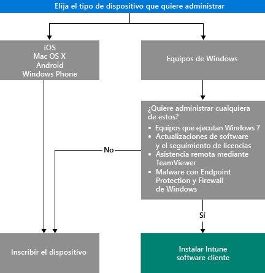

# Elegir cómo administrar dispositivos

Para sacar provecho de las distintas características que ofrece Intune, como la implementación de aplicaciones y el control de la configuración de los dispositivos, los dispositivos deben estar *administrados*. La manera en que administre los dispositivos dependerá de las capacidades de Intune que quiera usar.
Este tema le ayudará a elegir el método que satisfaga sus necesidades.

Para administrar los dispositivos que ejecutan iOS, Mac OS X, Android o Windows Phone, primero debe *inscribirlos*.

Para administrar equipos con Windows, tiene dos opciones:

1. Inscribir el dispositivo **o**
2. Instalar el *cliente de software de Intune*.

## Decidir qué método usar
Use este flujo de decisiones para decidir cómo administrar los dispositivos.

Inscriba equipos con Windows para obtener la máxima funcionalidad, aunque el cliente de software de Intune podría ajustarse más a sus necesidades en los siguientes casos:

- El equipo ejecuta Windows 7
- Quiere administrar las actualizaciones de software de Windows y el uso de licencias
- Quiere administrar el malware con Endpoint Protection y Firewall de Windows
- Quiere proporcionar asistencia remota a los usuarios con el software de TeamViewer

Para obtener una lista detallada de las capacidades de administración que obtendrá con cada método, consulte [Funcionalidades de administración de dispositivos inscritos en Microsoft Intune](mobile-device-management-capabilities-in-microsoft-intune.md) y [Capacidades de administración de PC de Windows cuando se utiliza el cliente de software de Intune](windows-pc-management-capabilities-in-microsoft-intune.md).
Para obtener información sobre los dispositivos y los equipos compatibles con Intune, consulte [Equipos y dispositivos móviles compatibles](/intune/get-started/supported-mobile-devices-and-computers)

## Administración de Exchange ActiveSync
Además de inscribir un dispositivo o instalar el cliente de software de Intune, también puede administrar los dispositivos con [Exchange ActiveSync](/intune/deploy-use/mobile-device-management-with-exchange-activesync-and-microsoft-intune). Con este método es necesario instalar On-Premises Connector o usar Service-to-Service Connector integrado para conectarse a su servidor Exchange Server.
Aunque se trata de una tercera opción para administrar los dispositivos, ofrece un conjunto limitado de capacidades de administración, si lo comparamos con los otros métodos.

## Pasos siguientes

- [Elegir cómo inscribir dispositivos móviles](/intune/get-started/choose-how-to-enroll-devices1)
- [Administrar un equipo con Windows con el software cliente de equipos de Intune](/intune/deploy-use/manage-windows-pcs-with-microsoft-intune)

- [Administración de dispositivos móviles de Exchange ActiveSync con Microsoft Intune](/intune/deploy-use/mobile-device-management-with-exchange-activesync-and-microsoft-intune).

<!--HONumber=Nov16_HO4-->

