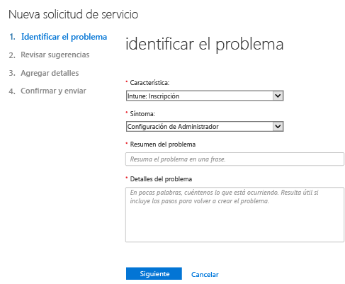
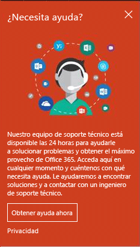
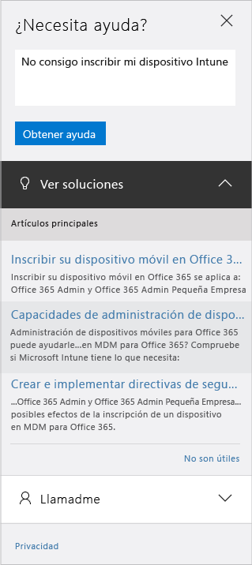

# Cómo obtener asistencia de administración para Microsoft Intune

Microsoft proporciona servicios globales de soporte técnico, preventa, facturación y suscripción para Microsoft Intune. El soporte técnico está disponible tanto en línea como por teléfono para las suscripciones de pago y de prueba. El soporte técnico en línea está disponible en inglés y japonés. La asistencia telefónica y la asistencia de facturación en línea están disponibles en idiomas adicionales.

La asistencia con Intune, y con Intune cuando se utiliza con Configuration Manager, es gratuita. Los clientes del soporte técnico Premier incurrirán en un cargo por cuestiones de procedimiento, como es el caso de configurar una función de Intune.

## Crear una solicitud de servicio en línea

1.  Inicie sesión en el [Centro de administradores de Office 365](https://portal.office.com) con las credenciales de Intune. 
    >[!NOTE]
    >
    >Los clientes del soporte técnico Premier pueden abrir una incidencia de soporte técnico de Intune en la [página de soporte técnico Premier](https://support.microsoft.com/en-us/premier/contacts).

2.  Seleccione el icono de administración.
3.  A la izquierda, en **Soporte técnico**, elija **Soporte técnico** para abrir la incidencia. Probablemente verá lo siguiente:

    

    >[!NOTE]
    >
    >  Los clientes que tienen o han tenido una cuenta de Office 365 con 100 licencias o menos, verán esto, de modo que conviene consultar [Método alternativo para abrir una incidencia de soporte técnico](#alternate-method-to-open-a-support-ticket).
    >  
    > 

    -   Para problemas de facturación, licencias y cuentas, seleccione **Billing and product info** (Información de facturación y productos).

    -   Para todos los demás problemas de Intune, seleccione **Administración de dispositivos móviles**.

    > [!NOTE]
    > Puede que tenga que elegir **más**, en la parte inferior de la lista, para ver todas las categorías.

3.  Siga las instrucciones para abrir la solicitud. 

### Método alternativo para abrir una incidencia de soporte técnico

Si su página de soporte técnico tiene el siguiente aspecto, siga este procedimiento:

1. Elija **Necesito ayuda**.
2. En el cuadro de texto, proporcione una descripción del problema y elija **Obtener ayuda**.

    

3. Revise los recursos en línea sugeridos de autoayuda o elija **Permita que le llamemos** para recibir una llamada de soporte técnico de Microsoft.

## Soporte por teléfono
Consulte [Asistencia telefónica para Microsoft Intune](contact-assisted-phone-support-for-microsoft-intune.md) para obtener una lista de números de teléfono de soporte técnico por país y región, horario de soporte técnico e idiomas admitidos para cada región.

## Realizar un seguimiento de las solicitudes de servicio
1.  Inicie sesión en el [Centro de administradores de Office 365](https://portal.office.com) con las credenciales de Intune. 
2.  Seleccione el icono de administración.
3.  A la izquierda, en **Soporte técnico**, elija **Solicitudes de servicio** para revisar sus incidencias. 

Nuestras respuestas iniciales a las solicitudes de servicio dependen de la gravedad del problema. En el caso de los problemas más graves, nuestra primera respuesta para los clientes profesionales tendrá lugar en el plazo de dos horas. Para los clientes de soporte técnico Premier, la respuesta variará según el contrato de soporte. Se pueden dar dos casos:

- Uno o más servicios no son accesibles o no se pueden utilizar. 
- Los plazos de producción, operaciones o implementación se ven gravemente afectados, o habrá graves repercusiones en la producción o rentabilidad. 
- Varios usuarios o servicios se ven afectados.

En el caso de los problemas moderadamente graves, nuestra primera respuesta para los clientes profesionales tendrá lugar en el plazo de cuatro horas. Para los clientes de soporte técnico Premier, la respuesta variará según el contrato de soporte.  Se pueden dar dos casos:

- El servicio se puede utilizar, pero su funcionamiento es deficiente. 
- La situación tiene repercusiones moderadas para el negocio y se puede solucionar en horario laboral. 
- Afecta parcialmente a un solo usuario, cliente o servicio.

En otros problemas, nuestra primera respuesta para los clientes profesionales tendrá lugar en el plazo de ocho horas. Para los clientes de soporte técnico Premier, la respuesta variará según el contrato de soporte.  Se pueden dar dos casos:

- La situación tiene un impacto mínimo en la empresa. 
- El problema es importante pero no tiene repercusiones importantes para el cliente en cuanto al servicio actual o la productividad. 
- Un solo usuario ve su actividad parcialmente interrumpida, pero existe una solución aceptable.

> [!NOTE]
> **Si usa Microsoft System Center Configuration Manager** o **Microsoft System Center Endpoint Protection:** para obtener soporte técnico con Configuration Manager o Endpoint Protection, póngase en contacto con su partner o visite el [Centro de soluciones de Microsoft System Center Configuration Manager y System Center Endpoint Protection](http://www.microsoft.com/en-us/server-cloud/products/system-center-2012-r2/resources.aspx), donde encontrará abundante material de autoayuda y tendrá la posibilidad de abrir una solicitud de soporte en línea o por teléfono.
>
> El soporte técnico de System Center Configuration Manager o System Center Endpoint Protection requiere realizar un pago o se descuenta bien de la licencia existente, bien de los contratos de soporte técnico Premier.

## Autoayuda

Es posible que pueda resolver el problema sin tener que abrir una incidencia de soporte técnico.

Para buscar autoayuda para Intune, consulte [Solución de problemas de Microsoft Intune](general-troubleshooting-tips-for-microsoft-intune.md) o cualquiera de los temas de solución de problemas específicos. También puede buscar una solución o publicar su pregunta en el [foro de Intune](https://social.technet.microsoft.com/Forums/en-US/home?forum=microsoftintuneprod). 

## Asistencia para clientes de licencias por volumen
Si ya ha adquirido licencias de Microsoft a través de un programa de licencias por volumen, haga lo siguiente para obtener soporte técnico:

-   Para obtener soporte relacionado con licencias y localización de claves, consulte [Centro de servicios de licencias por volumen](http://go.microsoft.com/fwlink/p/?LinkID=282016).

-   Para preguntas sobre facturación, consulte [Soporte de administración de suscripciones y facturación](http://support.microsoft.com/oas/default.aspx?prid=15371).

-   Para obtener información general sobre licencias por volumen, consulte [Licencias por volumen](http://go.microsoft.com/fwlink/p/?LinkID=282015).

<!--HONumber=Nov16_HO3-->

