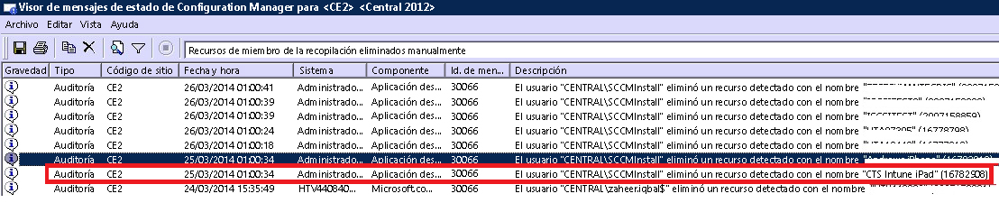

# Solución de problemas con la inscripción de dispositivos en Intune

[!INCLUDE[classic-portal](../includes/classic-portal.md)]

En este tema se proporcionan sugerencias para solucionar problemas de inscripción de dispositivos. Si esta información no soluciona el problema, vea [How to get support for Microsoft Intune](how-to-get-support-for-microsoft-intune.md) (Cómo obtener soporte técnico para Microsoft Intune) para conocer otras formas de obtener ayuda.

## Pasos iniciales de solución de problemas

Antes de empezar a solucionar problemas, compruebe que ha configurado Intune correctamente para habilitar la inscripción. Puede leer sobre estos requisitos de configuración en:

-    [Preparar la inscripción de dispositivos en Microsoft Intune](/intune/deploy-use/prerequisites-for-enrollment)
-    [Configurar la administración de dispositivos iOS y Mac](/intune/deploy-use/set-up-ios-and-mac-management-with-microsoft-intune)
-    [Configurar la administración de dispositivos Windows](/intune/deploy-use/set-up-windows-device-management-with-microsoft-intune)
-    [Configurar la administración de dispositivos Android](/intune/deploy-use/set-up-android-management-with-microsoft-intune). No se necesitan más pasos.
-    [Configurar la administración de dispositivos Android for Work](/intune/deploy-use/set-up-android-for-work)

Los usuarios de dispositivos administrados pueden recopilar registros de inscripción y diagnóstico para que usted pueda revisarlos. Aquí se proporcionan instrucciones de usuario para recopilar registros:

- [Enviar errores de inscripción de Android al administrador de TI](https://docs.microsoft.com/intune/enduser/send-enrollment-errors-to-your-it-admin-android)
- [Enviar errores de iOS al administrador de TI](https://docs.microsoft.com/intune/enduser/send-errors-to-your-it-admin-ios)

## Problemas generales de inscripción
Los siguientes problemas pueden producirse en cualquiera de las plataformas de dispositivo.

### Se alcanzó el límite de dispositivos
**Problema:** un usuario recibió un error en su dispositivo de iOS durante la inscripción (como por ejemplo, **El Portal de empresa no está disponible temporalmente**) y el registro DMPdownloader.log que se encuentra en Configuration Manager contiene el error **DeviceCapReached**.

**Solución:**

#### Compruebe el número de dispositivos inscritos y permitidos

1.  En el Portal de administración de Intune, valide que el usuario no tenga más de 15 dispositivos asignados, que es el número máximo permitido.

2.  En **Administrador** > **Administración de dispositivos móviles** > **Reglas de inscripción**, compruebe que el límite de inscripción de dispositivos esté establecido en 15.

<!--- Mobile device users can delete devices at the following URL: [https://byodtestservice.azurewebsites.net/](https://byodtestservice.azurewebsites.net/). --->

Los administradores pueden eliminar dispositivos en el portal de Azure Active Directory.

#### Eliminar dispositivos en el portal de Azure Active Directory

1.  Vaya a [http://aka.ms/accessaad](http://aka.ms/accessaad) o seleccione **Administración** &gt; **Azure AD** en [https://portal.office.com](https://portal.office.com).

2.  Inicie sesión con su identificador de organización mediante el vínculo que encontrará en el lado izquierdo de la página.

3.  Si todavía no tiene uno, cree una suscripción de Azure seleccionando el vínculo de suscripción **Registrar Azure Active Directory gratis**. Si tiene una cuenta de pago, no debería necesitar tarjeta de crédito ni realizar ningún pago.

4.  Seleccione **Active Directory** y, a continuación, seleccione su empresa.

5.  Seleccione la pestaña **Usuarios** .

6.  Seleccione el usuario cuyos dispositivos desea eliminar.

7.  Seleccione **Dispositivos**.

8.  Quite los dispositivos que crea oportunos, como por ejemplo aquellos que ya no estén en uso o que tienen definiciones inexactas.

> [!NOTE]

> Puede evitar llegar al límite de inscripciones de dispositivos mediante el uso de l cuenta de administradores de inscripción de dispositivos, tal como se describe en [Enroll corporate-owned devices with the Device Enrollment Manager in Microsoft Intune](/intune/deploy-use/enroll-corporate-owned-devices-with-the-device-enrollment-manager-in-microsoft-intune) (Inscribir dispositivos propiedad de la empresa con el administrador de inscripción de dispositivos de Microsoft Intune).
>
> Si agrega una cuenta de usuario a la cuenta de administradores de inscripción de dispositivos, esta no podrá realizar la inscripción al aplicarse la directiva de acceso condicional cuando ese usuario en cuestión inicie sesión.

### El Portal de empresa no está disponible temporalmente
**Problema:** los usuarios reciben en su dispositivo el error **El Portal de empresa no está disponible temporalmente**.

**Solución:**

1.  Quite la aplicación Portal de empresa de Intune del dispositivo.

2.  En el dispositivo, abra el explorador, vaya a [https://portal.manage.microsoft.com](https://portal.manage.microsoft.com), e intente un inicio de sesión de usuario.

3.  Si el usuario no puede iniciar sesión, debe intentar usar otra red.

4.  Si ello produce un error, compruebe que las credenciales del usuario se han sincronizado correctamente con Azure Active Directory.

5.  Si el usuario inicia sesión correctamente, el dispositivo iOS le pedirá que instale la aplicación Portal de empresa de Intune y que se inscriba. En un dispositivo Android, debe instalar manualmente la aplicación Portal de empresa de Intune y, a continuación, puede volver a intentar inscribirse.

### Entidad de MDM no definida
**Problema:** un usuario recibió el error **Entidad de MDM no definida**.

**Solución:**

1.  Compruebe que la entidad de MDM se ha establecido correctamente para el tipo de servicio Intune que usa; esto es, para Intune, Office 365 y System Center Configuration Manager con Intune. Para Intune, la entidad de MDM se establece en **Administración** &gt; **Administración de dispositivos móviles**. Para Configuration Manager con Intune, deberá establecerla al configurar Intune Connector. En Office 365 es una opción denominada **Dispositivos móviles**.

    > [!NOTE]
    > Una vez establecida la entidad de MDM, solo podrá cambiarla si se pone en contacto con el servicio de soporte técnico, como se explica en [Cómo obtener asistencia para Microsoft Intune](how-to-get-support-for-microsoft-intune.md).

2.  Compruebe que las credenciales del usuario se han sincronizado correctamente con Azure Active Directory; para ello, asegúrese de que los UPN del usuario coinciden con la información de Active Directory en el Portal de Office 365.
    Si el UPN no coincide con la información de Active Directory:

    1.  Desactive DirSync en el servidor local.

    2.  Elimine el usuario que no coincida de la lista de usuarios **Portal de cuentas de Intune** .

    3.  Espere aproximadamente una hora para permitir que el servicio de Azure pueda quitar los datos incorrectos.

    4.  Vuelva a activar DirSync y compruebe si el usuario ya se ha sincronizado correctamente.

3.  Si usa System Center Configuration Manager con Intune, compruebe que el usuario tiene un identificador válido de usuario en la nube:

    1.  Abra SQL Management Studio.

    2.  Conéctese a la base de datos adecuada.

    3.  Abra la carpeta de bases de datos y busque y abra la carpeta **CM_DBName**, donde DBName es el nombre de la base de datos de cliente.

    4.  En la parte superior, seleccione **Nueva consulta** y ejecute las siguientes consultas:

        -   Para ver todos los usuarios: `select * from [CM_ DBName].[dbo].[User_DISC]`

        -   Para ver usuarios específicos, use la siguiente consulta, donde %testuser1% representa el elemento username@domain.com referente al usuario que quiera buscar: `select * from [CM_ DBName].[dbo].[User_DISC] where User_Principal_Name0 like '%testuser1%'`

        Una vez escrita la consulta, seleccione **!Execute**.
        Cuando obtenga los resultados, busque el identificador clouduser.  Si no encuentra ningún identificador, esto quiere decir que el usuario no tiene licencia para usar Intune.

### No se puede crear la directiva o inscribir dispositivos si el nombre de la empresa contiene caracteres especiales
**Problema:** no se puede crear la directiva o inscribir dispositivos.

**Solución:** en el [Centro de administración de Office 365](https://portal.office.com/), quite los caracteres especiales del nombre de la empresa y guarde la información de la empresa.

### No se puede iniciar sesión o inscribir dispositivos cuando se tienen varios dominios comprobados
**Problema:** es posible que, al agregar un segundo dominio comprobado a AD FS, los usuarios con el sufijo del nombre principal de usuario (UPN) del segundo dominio no puedan iniciar sesión en los portales o inscribir dispositivos.

**Solución:** los clientes de Microsoft Office 365 que usan el inicio de sesión único (SSO) a través de AD FS 2.0 y que tienen varios dominios de nivel superior para los sufijos UPN de los usuarios de su organización (por ejemplo, @contoso.com o @fabrikam.com) deben implementar una instancia independiente del servicio de federación de AD FS 2.0 para cada sufijo. Ahora hay una [acumulación para AD FS 2.0](http://support.microsoft.com/kb/2607496) que funciona con el conmutador **SupportMultipleDomain** para permitir que el servidor de AD FS admita este escenario sin necesidad de servidores de AD FS 2.0 adicionales. Vea [este blog](https://blogs.technet.microsoft.com/abizerh/2013/02/05/supportmultipledomain-switch-when-managing-sso-to-office-365/) para más información.

## Problemas de Android
### Los dispositivos no se pueden registrar con el servicio Intune y se muestran con un estado "Incorrecto" en la consola de administración de Intune.
**Problema:** algunos dispositivos Samsung que ejecutan las versiones de Android 4.4.x y 5.x podrían dejar de registrarse con el servicio de Intune. Si los servicios no se registran:

- No pueden recibir directivas, aplicaciones y comandos remotos del servicio de Intune.
- Muestran un estado de administración de **Incorrecto** en la consola del administrador.
- Los usuarios que están protegidos por directivas de acceso condicional pueden perder el acceso a los recursos corporativos.

Samsung ha confirmado que el software Smart Manager de Samsung, que se distribuye en determinados dispositivos de Samsung, puede desactivar el Portal de empresa de Intune y sus componentes. Cuando el Portal de empresa está en estado desactivado, no se puede ejecutar en segundo plano y, por tanto, no puede establecer comunicación con el servicio de Intune.

**Solución 1:**

Indique a los usuarios que inicien la aplicación del Portal de empresa manualmente. Una vez que la aplicación se reinicia, el dispositivo se registra con el servicio de Intune.

> [!IMPORTANT]
> La solución de abrir la aplicación del Portal de empresa manualmente es temporal, ya que Smart Manager de Samsung puede volver a desactivarla.

**Solución 2:**

Indique a los usuarios que intenten actualizar a Android 6.0. El problema de desactivación no se produce en dispositivos Android 6.0. Para comprobar si hay una actualización disponible, los usuarios pueden ir a **Settings** (Configuración)  > **About device** >  (Acerca del dispositivo) **Download updates manually** (Descargar actualizaciones manualmente) y seguir las indicaciones que aparecen en el dispositivo.

**Solución 3:**

Si no funciona la solución 2, pida a los usuarios que sigan estos pasos para que Smart Manager excluya la aplicación del Portal de empresa:

1. Inicie la aplicación Smart Manager en el dispositivo.

  

2. Elija el icono **Battery** (Batería).

  

3. En **App power saving** (Ahorro de energía de aplicaciones) o **App optimization** (Optimización de aplicaciones), seleccione **Detail** (Detalle).

  

4. Elija **Company Portal** (Portal de empresa) en la lista de aplicaciones.

  

5. Elija **Turned off** (Desactivado).

  

6. En **App power saving** (Ahorro de energía de aplicaciones) o **App optimization** (Optimización de aplicaciones), confirme que el Portal de empresa está desactivado.

  

### Error de instalación de perfil
**Problema:** un usuario recibió un **error en la instalación del perfil** en un dispositivo Android.

**Solución:**

1.  Confirme que el usuario tiene asignada una licencia adecuada para la versión del servicio Intune que usa.

2.  Confirme que el dispositivo no esté inscrito en otro proveedor MDM o que no tenga ya instalado un perfil de administración.

3.  Confirme que Chrome para Android es el explorador predeterminado y que las cookies están habilitadas.

### Problemas de certificados Android

**Problema**: los usuarios reciben el siguiente mensaje en su dispositivo: *No puede iniciar sesión porque falta un certificado necesario en su dispositivo*.

**Solución 1**:

Pídale a los usuarios que sigan las instrucciones que aparecen en [El dispositivo no tiene un certificado necesario](/intune/enduser/your-device-is-missing-a-required-certificate-android#your-device-is-missing-a-certificate-required-by-your-it-administrator). Si el error sigue apareciendo después de que los usuarios siguen las instrucciones, intente con la solución 2.

**Solución 2**:

Si los usuarios siguen viendo el error de certificado faltante después de ingresar las credenciales corporativas y de ser redirigido a la experiencia de inicio de sesión federado, es posible que falte un certificado intermedio en el servidor de Servicios de federación de Active Directory (AD FS).

El error de certificado se genera porque los dispositivos Android requieren incluir certificados intermedios en un script [hello de SSL de servidor](https://technet.microsoft.com/library/cc783349.aspx), pero actualmente una instalación de servidor Proxy de AD FS o un servidor AD FS predeterminado solo envía el certificado SSL del servicio de AD FS en la respuesta del script hello del servidor SSL a un script hello de cliente de SSL.

Para corregir el problema, importe los certificados a los certificados personales de equipos en los servidores proxy o el servidor AD FS de la manera siguiente:

1.    En los servidores proxy y ADFS, inicie la consola de Administración de certificados del equipo local; para ello, haga clic con el botón derecho en el botón **Inicio**, haga clic en **Ejecutar** y escriba **certlm.msc**.
2.    Expanda **Personal** y seleccione **Certificados**.
3.    Busque el certificado correspondiente a la comunicación del servicio AD FS (un certificado firmado públicamente) y haga doble clic para ver sus propiedades.
4.    Seleccione la pestaña **Ruta de certificación** para ver los certificados primarios del certificado.
5.    En cada certificado primario, seleccione **Ver certificado**.
6.    Seleccione la pestaña **Detalles** y elija **Copiar en archivo...**.
7.    Siga las instrucciones del asistente para exportar o guardar la clave pública del certificado en la ubicación de archivo deseada.
8.    Importe los certificados primarios que se exportaron en el paso 3 a la carpeta Equipo local\Personal\Certificados; para ello, haga clic con el botón derecho en **Certificados**, seleccione **Todas las tareas** > **Importar** y, luego, siga las instrucciones del asistente para importar los certificados.
9.    Reinicie los servidores AD FS.
10.    Repita los pasos anteriores en todos los servidores proxy y de AD FS.
Ahora, el usuario podrá iniciar sesión en el Portal de empresa en el dispositivo Android.

**Para validar que el certificado se instaló correctamente**:

Los pasos siguientes describen solo uno de los muchos métodos y herramientas que se pueden usar para validar que el certificado se instaló correctamente.

1. Vaya a la [herramienta gratuita Digicert](ttps://www.digicert.com/help/).
2. Escriba el nombre de dominio completo del servidor AD FS (por ejemplo, sts.contoso.com) y seleccione **CHECK SERVER** (Comprobar servidor).

Si el certificado de servidor se instaló correctamente, verá marcas de verificación en los resultados. Si existe el problema anterior, verá una X roja en las secciones "Certificate Name Matches" ("El nombre de certificado coincide") y "SSL Certificate is correctly Installed" ("El certificado SSL se instaló correctamente") del informe.

## Problemas de iOS

### Los dispositivos están inactivos o la consola de administración no puede comunicarse con ellos
**Problema:** los dispositivos iOS no se están registrando con el servicio Intune. Los dispositivos deben registrarse periódicamente con el servicio para mantener el acceso a recursos corporativos protegidos. Si los servicios no se registran:

- No pueden recibir directivas, aplicaciones y comandos remotos del servicio de Intune.
- Muestran un estado de administración de **Incorrecto** en la consola del administrador.
- Los usuarios que están protegidos por directivas de acceso condicional pueden perder el acceso a los recursos corporativos.

**Resolución:** comparta las soluciones siguientes con los usuarios finales para ayudarles a recuperar el acceso a recursos corporativos.

Cuando los usuarios inician la aplicación de Portal de empresa de iOS, puede indicar si el dispositivo ha perdido el contacto con Intune. Si detecta que no hay ningún contacto, intenta automáticamente sincronizar con Intune para volver a conectar y los usuarios verán la notificación en línea **Intentando sincronizar...** en línea Intentando sincronizar…

  

Si la sincronización se realiza correctamente, verá la notificación en línea **Sincronización correcta** en la aplicación del Portal de empresa, que indica que el dispositivo está en un estado correcto.

  

Si la sincronización es incorrecta, los usuarios verán una notificación en línea **No se puede sincronizar** en la aplicación del Portal de empresa de iOS.

  

Para corregir el problema, los usuarios deben seleccionar el botón **Configurar**, que está a la derecha de la notificación **No se puede sincronizar**. El botón Configurar lleva a los usuarios a la pantalla de flujo de Configuración de acceso de la empresa, donde pueden seguir las indicaciones para inscribir su dispositivo.

  

Una vez inscrito, los dispositivos vuelven a un estado correcto y recuperan el acceso a recursos de la empresa.

### Comprobar que WS-Trust 1.3 está habilitado
**Problema** Los dispositivos iOS del Programa de inscripción de dispositivos (DEP) no se pueden inscribir

Inscribir dispositivos del Programa de inscripción de dispositivos con afinidad de usuario requiere un punto de conexión de nombre de usuario/mixto WS-Trust 1.3 para que se habilite para solicitar tokens de usuario. Active Directory permite este punto de conexión de forma predeterminada. Para obtener una lista de puntos de conexión habilitados, use el cmdlet Get-AdfsEndpoint PowerShell y busque el punto de conexión de trust/13/UsernameMixed. Por ejemplo:

      Get-AdfsEndpoint -AddressPath “/adfs/services/trust/13/UsernameMixed”

Para obtener más información, consulte la [documentación de Get-AdfsEndpoint](https://technet.microsoft.com/itpro/powershell/windows/adfs/get-adfsendpoint).

Para obtener más información, consulte los [procedimientos recomendados para proteger los Servicios de federación de Active Directory](https://technet.microsoft.com/windows-server-docs/identity/ad-fs/operations/best-practices-securing-ad-fs). Si necesita ayuda adicional para determinar si el nombre de usuario o mixto WS-Trust 1.3 está habilitado en el proveedor de federación de identidades, póngase en contacto con el soporte técnico de Microsoft si usa ADFS, o con su proveedor externo de identidades.

### Error de instalación de perfil
**Problema:** un usuario recibe un **error en la instalación del perfil** en un dispositivo iOS.

### Pasos para solucionar problemas con la instalación del perfil

1.  Confirme que el usuario tiene asignada una licencia adecuada para la versión del servicio Intune que usa.

2.  Confirme que el dispositivo no esté inscrito en otro proveedor MDM o que no tenga ya instalado un perfil de administración.

3.  Vaya a [https://portal.manage.microsoft.com](https://portal.manage.microsoft.com) e intente instalar el perfil cuando se le solicite.

4.  Confirme que Safari para iOS es el explorador predeterminado y que las cookies están habilitadas.

### El dispositivo iOS inscrito no aparece en la consola cuando se usa System Center Configuration Manager con Intune
**Problema:** el usuario inscribe el dispositivo iOS, pero no aparece en la consola de administración de Configuration Manager. El dispositivo no indica que se ha inscrito. Posibles causas:

- Microsoft Intune Connector en el sitio de Configuration Manager no se comunica con el servicio Intune.
- El componente Data Discovery Manager (ddm) o el componente State Manager (statmgr) no está procesando mensajes desde el servicio Intune.
- Puede que haya descargado el certificado MDM de una cuenta y que lo haya usado en otra cuenta.

**Resolución:** revise los siguientes archivos de registro para ver si contienen errores:

- dmpdownloader.log
- ddm.log
- statmgr.log

Se agregarán pronto ejemplos sobre lo que debe buscar en estos archivos de registro.

## Problemas al usar System Center Configuration Manager con Intune
### Los dispositivos móviles desaparecen
**Problema:** después de inscribir correctamente un dispositivo móvil a Configuration Manager, este desaparece de la colección de dispositivos móviles, pero el dispositivo aún tiene el perfil de administración y aparece en la puerta de enlace de CSS.

**Solución:** esto puede ocurrir si tiene un proceso personalizado que quita dispositivos que no estén unidos al dominio o porque el usuario ha retirado la suscripción del dispositivo. Para validar y comprobar qué proceso o cuenta de usuario ha quitado el dispositivo de la consola de Configuration Manager, siga los pasos siguientes.

#### Compruebe cómo se quitó el dispositivo

1.  En la consola de administración de Configuration Manager, seleccione **Supervisión** &gt; **Estado del sistema** &gt; **Consultas de mensaje de estado**.

2.  Haga clic con el botón derecho en **Recursos de miembro de la recopilación eliminados manualmente** y seleccione **Mostrar mensajes**.

3.  Seleccione la fecha y hora apropiadas o las últimas 12 horas.

4.  Busque el dispositivo en cuestión y compruebe cómo se quitó el dispositivo. En el ejemplo siguiente se muestra que la cuenta SCCMInstall eliminó el dispositivo a través de una aplicación desconocida.

    

5.  Compruebe que Configuration Manager no tenga ninguna tarea, script u otro proceso programado que pudiera estar purgando de forma automática dispositivos móviles que no pertenezcan al dominio u otros dispositivos relacionados.

### Otros errores de inscripción de iOS
Encontrará una lista de errores de inscripción de iOS en la documentación de usuario del dispositivo, en [You see errors while trying to enroll your device in Intune](/intune/enduser/using-your-iOS-or-macOS-device-with-intune) (Ve errores al intentar inscribir su dispositivo en Intune).

## Problemas del equipo

### El equipo ya está inscrito. Error hr 0x8007064c
**Problema:** la inscripción produce un error con el mensaje **The machine is already enrolled** (El equipo ya está inscrito). El registro de inscripción muestra el error **hr 0x8007064c**.

Esto puede deberse a que el equipo se inscribió anteriormente o a que tiene la imagen clonada de un equipo ya inscrito. El certificado de cuenta de la cuenta anterior sigue estando presente en el equipo.

**Solución:**

1. En el menú **Inicio**, escriba **Ejecutar** -> **MMC**.
1. Seleccione **Archivo** > **Agregar o quitar complementos**.
1. Haga doble clic en **Certificados**, seleccione **Cuenta de equipo** > **Siguiente** y, luego, **Equipo local**.
1. Haga doble clic en **Certificados (equipo local)** y seleccione **Certificados personales**.
1. Busque el certificado de Intune emitido por Sc_Online_Issuing y elimínelo si está presente.
1. Elimine esta clave del Registro si existe: **HKEY_LOCAL_MACHINE\SOFTWARE\Microsoft\OnlineManagement regkey** y todas las subclaves.
1. Intente volver a realizar la inscripción.
1. Si todavía no puede inscribir el PC, busque y elimine esta clave, si existe: **KEY_CLASSES_ROOT\Installer\Products\6985F0077D3EEB44AB6849B5D7913E95**.
1. Intente volver a realizar la inscripción.

    > [!IMPORTANT]
    > Esta sección, método o tarea contiene pasos que indican cómo modificar el Registro. Pero pueden producirse problemas graves si modifica incorrectamente el Registro. Por lo tanto, asegúrese de que sigue estos pasos cuidadosamente. Como protección adicional, haga una copia de seguridad del Registro antes de modificarlo. Y así, si se produce algún problema, puede restaurarlo.
    > Para más información sobre cómo realizar copias de seguridad del Registro y cómo restaurarlo, lea [Cómo hacer copia de seguridad y restaurar el registro de Windows](https://support.microsoft.com/en-us/kb/322756).

## Códigos de error de inscripción generales

|Código de error|Posible problema|Solución recomendada|
|--------------|--------------------|----------------------------------------|
|0x80CF0437 |El reloj del equipo cliente no está configurado en la hora correcta.|Asegúrese de que el reloj y la zona horaria del equipo cliente se hayan configurado en la hora y la zona horaria correctas.|
|0x80240438, 0x80CF0438, 0x80CF402C|No se puede conectar con el servicio de Intune. Compruebe la configuración del proxy del cliente.|Compruebe que la configuración del proxy del equipo cliente sea compatible con Intune y que el equipo cliente tenga acceso a Internet.|
|0x80240438, 0x80CF0438|La configuración del proxy en Internet Explorer y el sistema local no se ha establecido.|No se puede conectar con el servicio de Intune. Compruebe la configuración del proxy del cliente y confirme que la configuración del proxy en el equipo cliente sea compatible con Intune y que el equipo cliente tiene acceso a Internet.|
|0x80043001, 0x80CF3001, 0x80043004, 0x80CF3004|El paquete de inscripción no está actualizado.|Descargue e instale el paquete de software cliente actual del área de trabajo Administración.|
|0x80043002, 0x80CF3002|La cuenta está en modo de mantenimiento.|No es posible inscribir nuevos equipos cliente cuando la cuenta está en modo de mantenimiento. Para ver la configuración de la cuenta, inicie sesión en la cuenta.|
|0x80043003, 0x80CF3003|Se ha eliminado la cuenta.|Compruebe que su cuenta y la suscripción a Intune todavía están activas. Para ver la configuración de la cuenta, inicie sesión en la cuenta.|
|0x80043005, 0x80CF3005|El equipo cliente se ha retirado.|Espere unas pocas horas, quite cualquier versión anterior del software cliente del equipo y, a continuación, intente instalar de nuevo el software cliente.|
|0x80043006, 0x80CF3006|Se ha alcanzado el máximo número de puestos permitido para la cuenta.|Su organización debe adquirir puestos adicionales antes de inscribir más equipos cliente en el servicio.|
|0x80043007, 0x80CF3007|No se encontró el archivo de certificado en la misma carpeta que el programa de instalación.|Extraiga todos los archivos antes de iniciar la instalación. No cambie el nombre ni la ubicación de los archivos extraídos: todos los archivos deben existir en la misma carpeta o de lo contrario, la instalación será errónea.|
|0x8024D015, 0x00240005, 0x80070BC2, 0x80070BC9, 0x80CFD015|No se puede instalar el software porque el equipo cliente está pendiente de reiniciarse.|Reinicie el equipo y, a continuación, intente instalar de nuevo el software cliente.|
|0x80070032|No se encontró uno o más requisitos previos para instalar el software cliente en el equipo cliente.|Asegúrese de que las actualizaciones necesarias están instaladas en el equipo cliente y, a continuación, intente instalar de nuevo el software cliente.|
|0x80043008, 0x80CF3008|No se pudo iniciar el servicio de actualización de Microsoft Online Management.|Póngase en contacto con el servicio de soporte técnico de Microsoft como se indica en [How to get support for Microsoft Intune](how-to-get-support-for-microsoft-intune.md) (Cómo obtener soporte técnico de Microsoft Intune).|
|0x80043009, 0x80CF3009|El equipo cliente ya está inscrito en el servicio.|Debe retirar el equipo cliente para poder volver a inscribirlo en el servicio.|
|0x8004300B, 0x80CF300B|No se puede ejecutar el paquete de instalación del software cliente porque no se admite la versión de Windows que se está ejecutando en el cliente.|Intune no es compatible con la versión de Windows que se está ejecutando en el equipo cliente.|
|0xAB2|Windows Installer no pudo tener acceso al tiempo de ejecución de VBScript para una acción personalizada.|Este error está causado por una acción personalizada basada en Bibliotecas de vínculos dinámicos (DLL). Cuando solucione problemas de DLL, quizás deba usar las herramientas que se describen en [INFO: Herramientas útiles para el paquete y los problemas de implementación ](https://support.microsoft.com/en-us/kb/198038).|
|0x80cf0440|Se terminó la conexión al extremo de servicio.|La cuenta de prueba o de pago está suspendida. Cree una nueva cuenta de prueba o de pago y vuelva a realizar la inscripción.|

### Pasos siguientes
Si esta información para solucionar problemas no le ha ayudado, póngase en contacto con el servicio de soporte técnico de Microsoft como se indica en [How to get support for Microsoft Intune](how-to-get-support-for-microsoft-intune.md) (Cómo obtener soporte técnico de Microsoft Intune).

