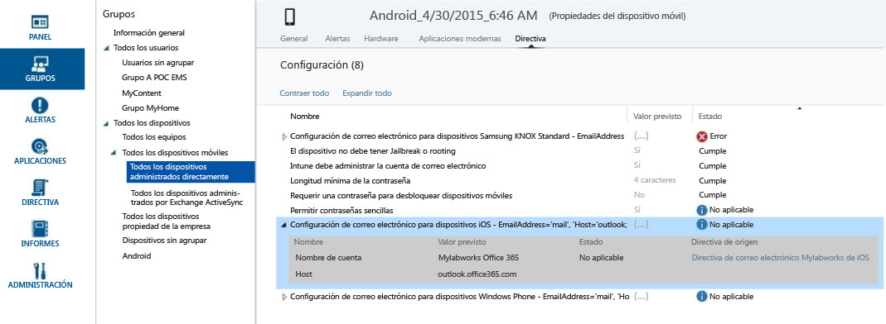

---
# required metadata

title: Directivas de solución de problemas | Microsoft Intune
description:
keywords:
author: Nbigman
manager: jeffgilb
ms.date: 04/28/2016
ms.topic: article
ms.prod:
ms.service: microsoft-intune
ms.technology:
ms.assetid: 99fb6db6-21c5-46cd-980d-50f063ab8ab8

# optional metadata

#ROBOTS:
#audience:
#ms.devlang:
ms.reviewer: jeffgilb
ms.suite: ems
#ms.tgt_pltfrm:
#ms.custom:

---

# Directivas de solución de problemas en Microsoft Intune

Aquí verá enumerados algunos problemas que pueden surgir durante la configuración de directiva de Microsoft Intune y las recomendaciones para solucionar esos problemas.

Si esta información no soluciona el problema, vea [How to get support for Microsoft Intune](how-to-get-support-for-microsoft-intune.md) (Cómo obtener soporte técnico para Microsoft Intune) para conocer otras formas de obtener ayuda.

## ¿Está la directiva aplicada al dispositivo?
**Problema:** no está claro si es una directiva concreta la que se aplica a un dispositivo o si el dispositivo se comporta de forma contraria a la directiva.

Compruebe la información de directivas que tiene disponible en cada dispositivo para obtener información acerca de cómo puede afectar una directiva a un dispositivo determinado.

En la consola de administración de Intune, cada dispositivo tiene una pestaña de directivas en **Propiedades del dispositivo**. Si no es así, probablemente el dispositivo todavía esté por inscribirse o no tenga directivas aplicadas. Cada directiva tiene un **Valor previsto** y un **Estado**. El valor previsto es lo que tenía pensado lograr al asignar la directiva. El estado es lo que se logra realmente cuando todas las directivas aplicables al dispositivo, así como las restricciones y los requisitos del hardware y el sistema operativo, se consideran conjuntamente. Los estados posibles son:

-   **Cumple**: el dispositivo ha recibido la directiva e indica al servicio que se ajusta a la configuración.

-   **No es aplicable**: la configuración de directiva no es aplicable. Por ejemplo, la configuración de correo electrónico para dispositivos iOS no se aplicaría a un dispositivo Android.

-   **Pendiente**: la directiva se ha enviado al dispositivo, pero no se ha informado de su estado al servicio. Por ejemplo, el cifrado en Android requiere que el usuario final lo habilite y, por tanto, la directiva puede estar pendiente.

En la captura de pantalla que tiene a continuación se pueden ver dos ejemplos claros:

-   **Permitir contraseñas sencillas** está establecido en **Sí**, como se muestra en la columna **Valor previsto** , pero su **Estado** es **No aplicable**. Esto es porque no se admiten contraseñas sencillas para dispositivos Android.

-   De forma similar, el elemento de directiva expandido**Configuración de correo electrónico para dispositivos iOS** no se aplica a este dispositivo, ya que es un dispositivo Android.

> [!NOTE]
> Recuerde que cuando dos directivas con distintos niveles de restricción se aplican al mismo dispositivo o usuario, la directiva más restrictiva se aplica en la práctica.

## Actualización de directivas e intervalos de actualización
Tenga en cuenta que las directivas se actualizan a intervalos regulares. En general, las directivas se deben registrar en los dispositivos durante los 15 minutos posteriores a la realización de un cambio. Aquí encontrará más detalles acerca de los intervalos regulares de actualización de directivas:

-   **Dispositivos Windows inscritos en MDM**: se desencadena con una tarea programada a las 3:00 a. m. hora local del dispositivo y se lleva a cabo cada día.

-   **Windows Phone**: la directiva se actualiza cada 8 horas. Se puede forzar mediante una actualización en el Portal de empresa en **Configuración**..

-   **iOS**: la directiva se actualiza una vez al día con un intervalo de tiempo aleatorio. Para forzarla también se puede abrir el Portal de empresa, seleccionar el dispositivo y hacer clic en **Sincronizar**..

-   **Android**: la directiva se actualiza una vez al día con un intervalo de tiempo aleatorio. Para forzarla también se puede abrir el Portal de empresa, seleccionar el dispositivo y hacer clic en **Sincronizar**..

## Errores relacionados con las directivas de Microsoft Intune en policyplatform.log
Para los dispositivos de Windows que no sean de MDM, los errores de directivas del archivo policyplatform.log pueden ser el resultado de opciones de configuración no predeterminadas en el Control de cuentas de usuario (UAC) de Windows en el dispositivo. Algunas opciones de configuración de UAC no predeterminadas pueden afectar a las instalaciones de cliente de Microsoft Intune y a la ejecución de directivas.

### Para resolver problemas de UAC

1.  Retire el equipo, como se describe en [Retire devices from Microsoft Intune management](/intune/deploy-use/retire-devices-from-microsoft-intune-management) (Retirar dispositivos de la administración de Microsoft Intune)..

2.  Espere 20 minutos a que se quite el software de cliente.

    > [!NOTE]
    > No intente quitar el cliente desde Programas y características.

3.  En el menú Inicio, escriba **UAC** para abrir Configuración del Control de cuentas de usuario.

4.  Mueva el control deslizante de la notificación a la opción de configuración predeterminada.

## Error 0x87D1FDE8 del dispositivo KNOX
**Problema**: después de crear e implementar un perfil de correo electrónico Exchange Active Sync de Samsung KNOX para varios dispositivos Android, estos informan del error **0x87D1FDE8** o del **error de corrección** en las propiedades del dispositivo &gt; pestaña de directivas.

Revise la configuración de su perfil EAS de Samsung KNOX y la directiva de origen. Ya no se admite la opción de sincronización de notas de Samsung y no debe estar seleccionada en el perfil. Asegúrese de que los dispositivos han tenido tiempo suficiente para procesar la directiva (hasta 24 horas).

## Alerta: error al guardar las reglas de acceso en Exchange
**Problema**: recibe la alerta **Error al guardar las reglas de acceso en Exchange**  en la consola de administración.

Si creó directivas en el área de trabajo de la directiva local de Exchange en la consola de administración pero usa O365, Intune no aplica las opciones configuradas de la directiva. Tenga en cuenta el origen de la directiva de la alerta.  En el área de trabajo de la directiva local de Exchange, elimine las reglas heredadas ya que son reglas de Exchange globales que se encuentran en el servicio Intune dedicado a Exchange local y no son relevantes para Office 365. A continuación, cree una directiva nueva para Office 365.

## ERROR: No se puede obtener el valor del equipo, 0x80041013
Esto puede ocurrir si la hora del sistema local está desfasada cinco minutos o más. Si el tiempo en el equipo local no está sincronizado, no se podrán llevar a cabo transacciones seguras porque las marcas de tiempo no serán válidas.

Para resolver este problema, establezca la hora del sistema local lo más cercana posible a la hora de Internet o la hora establecida en los controladores de dominio en la red.

## No se puede cambiar la directiva de seguridad de varios dispositivos MDM
Una vez establecidas las directivas de seguridad a través de MSM o EAS, los dispositivos Windows Phone y Windows RT no permiten que se reduzca el nivel de seguridad de las mismas. Por ejemplo, si establece una **contraseña con un número mínimo de 8 caracteres** no podrá reducirla a 4. Esto es debido a que ya se ha aplicado la directiva más restrictiva en el dispositivo.

Dependiendo de la plataforma del dispositivo, si desea cambiar la directiva a un valor de menos seguro debe restablecer las directivas de seguridad.
Por ejemplo, en el escritorio de Windows RT, deslice el dedo desde la derecha para abrir la barra de **Accesos** y haga clic en **Configuración** &gt; **Panel de Control**.  Seleccione el applet **Cuentas de usuario** .
En el menú de navegación izquierdo, hay un vínculo denominado **Restablecer las directivas de seguridad** en la parte inferior. Haga clic en él y, a continuación, haga clic en el botón **Restablecer directivas** .
En otros dispositivos MDM como Android, Windows Phone 8.1 y posteriores e iOS, es posible que tenga que eliminar la inscripción y volver a hacerla para que pueda aplicar una directiva menos restrictiva.

## Los dispositivos Android no aplican los cambios en las directivas de seguridad sin que el usuario final haya dado su consentimiento
La MDM de Android no permite que el servicio fuerce cambios en las directivas iniciales de los dispositivos, tal y como hacen otras plataformas Esto es debido a la funcionalidad de Android y no está relacionado con el servicio Intune. Los dispositivos Android le pedirán permiso al usuario final a través de la ventana de notificación para así poder realizar el cambio de la directiva en cuestión (es decir, contraseñas, cifrado, etc.).  El usuario final debe responder a esta solicitud y, una vez aceptada, se aplicará la directiva.

## No se puede crear la directiva o inscribir clientes si el nombre de la empresa contiene caracteres especiales
**Problema:** no se puede crear la directiva o inscribir clientes.

**Solución:** en el [Centro de administración de Office 365](https://portal.office.com/), quite los caracteres especiales del nombre de la empresa y guarde la información de la empresa.

### Pasos siguientes
Si esta información para solucionar problemas no le ha ayudado, póngase en contacto con el soporte técnico de Microsoft como se indica en [How to get support for Microsoft Intune](how-to-get-support-for-microsoft-intune.md) (Cómo obtener soporte técnico de Microsoft Intune)..

<!--HONumber=May16_HO1-->

