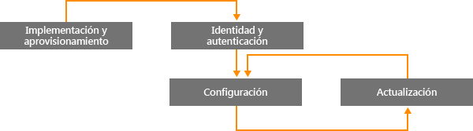
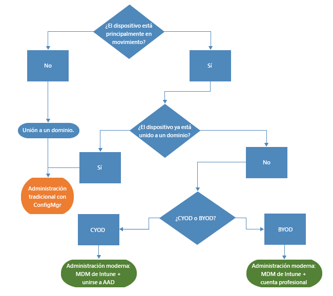
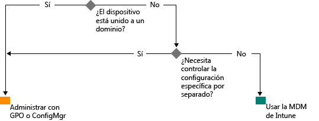

# Ruta a la administración moderna de Windows con Microsoft Intune

El empleo de dispositivos personales para el trabajo, unido al hecho de que los empleados puedan trabajar desde fuera de la oficina, está cambiando la forma en que las organizaciones administran los dispositivos. Aunque determinadas funciones de algunas organizaciones puedan exigir un control estricto y pormenorizado de los dispositivos, otras organizaciones están adoptando una administración más laxa y basada en escenarios que potencia a los empleados modernos.

Windows 10 continúa con la tradición de Windows de ofrecer el sistema operativo mejor administrado para las organizaciones. Windows facilita una manejabilidad y seguridad exhaustivas por medio de tecnologías como directiva de grupo, Active Directory y System Center Configuration Manager. También ofrece un enfoque que prioriza la movilidad y la nube de administración simplificada y moderna mediante soluciones de administración de dispositivos basadas en la nube como Microsoft Enterprise Mobility Suite (EMS). Las futuras innovaciones de Windows, ofrecidas a través de Windows como servicio, se complementan con servicios de nube que avanzan rápidamente, como Microsoft Intune, Azure Active Directory, Azure Rights Management Service, Office 365 y la Tienda Windows para empresas.

Las organizaciones de TI tienen una mayor flexibilidad con oportunidades de beneficiarse de la innovación y el ahorro de costos. En este documento se ofrece orientación sobre las estrategias para implementar y administrar Windows 10. También se proporciona una visión general del planteamiento estratégico de Microsoft sobre las herramientas de administración de dispositivos. Cuando piense en las bases de la administración y en cómo quiere aplicarlas a distintos dispositivos, tenga en cuenta las siguientes cuatro etapas del ciclo de vida de un dispositivo:

## Implementación y aprovisionamiento

A diferencia de la implementación del sistema operativo tradicional, que exige operaciones complejas de TI, la administración moderna de dispositivos abre la puerta a la "administración de fábrica". El departamento de TI quiere transformar fácilmente nuevos dispositivos en dispositivos totalmente configurados y completamente administrados, sin restablecer la imagen inicial.  El aprovisionamiento dinámico es más sencillo que nunca gracias a servicios de administración de dispositivos basados en la nube como Microsoft Intune. También puede crear paquetes de aprovisionamiento independientes con el Diseñador de imágenes y configuraciones de Windows (ICD). Por supuesto, todavía se admiten técnicas tradicionales de creación de imágenes, por lo que las organizaciones pueden implementar imágenes personalizadas con System Center Configuration Manager.

## Identidad y autenticación

Windows 10 y servicios como Azure Active Directory abren nuevas posibilidades para la identidad, la autenticación y la administración basadas en la nube. Escenarios como BYOD y CYOD permiten a las empresas replantearse cómo acceden los usuarios a las aplicaciones y los recursos corporativos. Puede considerar que la administración de usuarios y dispositivos se encuadra en estas dos categorías:

- Dispositivos corporativos (CYOD) o personales (BYOD) usados por los usuarios móviles para aplicaciones SaaS como Office 365.

  Windows 10 permite a los empleados aprovisionar automáticamente los dispositivos. Los dispositivos corporativos pueden configurar fácilmente el acceso corporativo con Azure AD Join. Del mismo modo, una nueva experiencia BYOD simplificada permite a los usuarios agregar su cuenta profesional a Windows y acceder a los recursos de trabajo en dispositivos personales. La combinación de Azure AD Join e inscripción automática de MDM de Intune pone a los dispositivos en un estado administrado corporativo con [un solo paso sencillo](https://blogs.technet.microsoft.com/ad/2015/08/14/windows-10-azure-ad-and-microsoft-intune-automatic-mdm-enrollment-powered-by-the-cloud/), todo desde la nube. Azure AD Join también es una excelente solución para los empleados temporales, los socios u otro personal a tiempo parcial. Estas cuentas se pueden mantener separadas del dominio local de AD, aunque con acceso a los recursos corporativos necesarios.
- Equipos y tabletas unidos a dominios con aplicaciones y recursos tradicionales que requieren autenticación o que acceden a recursos locales altamente confidenciales o clasificados

  Los dispositivos de Windows 10 unidos a un dominio local de Active Directory se registrarán automáticamente en Azure AD, así que los usuarios podrán disfrutar de las ventajas adicionales de diversas experiencias de Windows 10 como el inicio de sesión único en recursos de nube y locales desde cualquier ubicación, la itinerancia empresarial de configuración, Microsoft Passport for Work y Windows Hello. Los equipos y las tabletas unidos a un dominio deben seguir administrándose con el cliente de System Center Configuration Manager o la directiva de grupo.

Revise los roles de la organización. Identifique a los usuarios o dispositivos que necesitan unirse a dominio y considere la posibilidad de cambiar otros a Azure AD. Puede leer más información en [este artículo](https://azure.microsoft.com/en-us/documentation/articles/active-directory-azureadjoin-windows10-devices/) sobre cómo Windows 10 y Azure AD optimizan el acceso a los recursos de trabajo a través de una combinación de escenarios y dispositivos.

Este es el aspecto que podría tener un árbol de decisión generalizado. Es evidente que se aplicarán excepciones en algunos casos.

## Configuración y opciones

El nivel de administración necesario, los dispositivos y datos administrados, y los requisitos del sector pueden definir los requisitos de configuración. Por su parte, a los empleados suele preocuparles que el departamento de TI aplique directivas estrictas a sus dispositivos personales, aunque quieren acceder a documentos y al correo electrónico corporativo. Windows 10 proporciona un conjunto coherente de configuraciones entre equipos, tabletas y teléfonos a través de una capa común de MDM. El enfoque de MDM busca configuraciones que hagan realidad la intención del administrador sin exponer todas las opciones posibles. En cambio, directiva de grupo expone valores específicos que el administrador controla individualmente. Una ventaja de MDM es que permite a los administradores aplicar una configuración de administración más amplia de la privacidad, la seguridad y las aplicaciones a través de herramientas más claras y eficaces. Esto hace que la mejor opción para los dispositivos que están constantemente en movimiento sea MDM.

Muchas organizaciones todavía necesitan administrar equipos unidos a dominios en un nivel específico, como las 1.500 opciones de configuración de directiva de grupo de Internet Explorer o reglas de Firewall de Windows muy concretas. En estos casos, directiva de grupo y System Center Configuration Manager siguen siendo excelentes opciones de administración. Directiva de grupo es la mejor manera de configurar específicamente equipos y tabletas de Windows unidos a dominios y conectados a la red corporativa mediante herramientas basadas en Windows. Microsoft continúa agregando opciones de configuración de directiva de grupo con cada nueva versión de Windows. Para una configuración específica con una implementación de software eficaz, actualizaciones de Windows e implementación de sistema operativo, Configuration Manager sigue siendo la solución recomendada.

## Actualización de dispositivos Windows

Con Windows como servicio, las organizaciones de TI ya no necesitan realizar complicados procesos de creación de imágenes (barrido y carga) con cada nueva versión de Windows. Tanto si están en la rama actual (CB) como en la rama actual para empresas (CBB), los dispositivos reciben las actualizaciones más recientes de características y calidad a través de procesos de aplicación de revisiones sencillos y, con frecuencia, automáticos. MDM con Intune proporciona herramientas para aplicar actualizaciones de Windows a equipos cliente de la empresa. Configuration Manager ofrece eficaces capacidades de administración y seguimiento de estas actualizaciones, incluidas ventanas de mantenimiento y reglas de implementación automáticas.

## Resumen

Cuando piense en el camino que debe seguir para lograr una administración moderna de los dispositivos de su organización, tenga en cuenta las medidas que puede tomar para empezar el proceso.

1. **Hay inversiones que se pueden realizar en el momento.** ¿Qué componentes de la administración tradicional de dispositivos necesita conservar y dónde puede modernizar? Si toma medidas para minimizar la creación de imágenes personalizada, reevaluar la administración de la configuración o reevaluar la autenticación y el cumplimiento, las ventajas pueden ser inmediatas.

2. **Evalúe los distintos casos de uso en su entorno.** ¿Hay grupos de dispositivos que puedan beneficiarse de una administración simplificada más clara? Los dispositivos BYOD, por ejemplo, son candidatos naturales para la administración basada en la nube. Es posible que los usuarios o dispositivos que controlan datos más regulados necesiten un dominio local de AD para la autenticación. Configuration Manager y EMS proporcionan la flexibilidad de escalonar la implementación de los escenarios de administración moderna a la vez que se dirigen a los distintos dispositivos de la forma más adecuada a sus necesidades empresariales. La decisión depende de usted.

## Qué hacer a continuación

- **Evalúe las necesidades de administración en su entorno.** Es posible que un tamaño no se ajuste a todas sus necesidades en función de las personas, su movilidad, los dispositivos y los datos a los que acceden.
- **Considere los requisitos.** Con Windows 10, Configuration Manager y Enterprise Mobility Suite, tiene la flexibilidad de controlar las herramientas de creación de imágenes, autenticación, configuración y administración para cualquier escenario.
- **Dé pequeños pasos.** El paso a una administración moderna de dispositivos no tiene que ser una transformación súbita.
- **Optimice las inversiones existentes.** En su viaje de la administración tradicional local a la administración moderna basada en la nube, aproveche la arquitectura híbrida flexible de Configuration Manager e Intune. A medida que haya capacidades adicionales disponibles en el modelo de identidad de nube/MDM, Microsoft se compromete a proporcionar una ruta clara de administración tradicional a moderna.

<!--HONumber=Sep16_HO2-->

