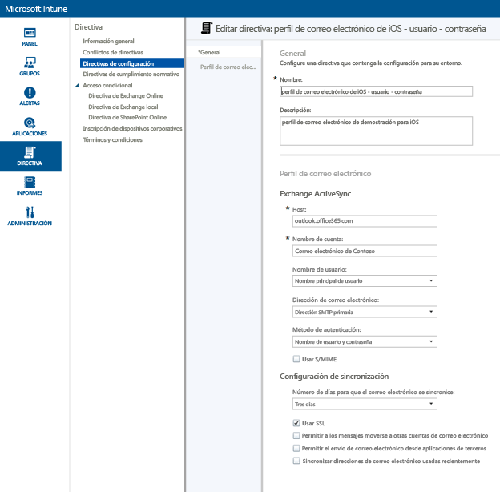
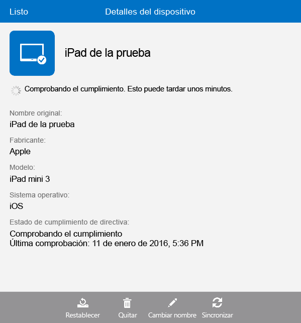

---
# required metadata

title: Configurar el acceso a correo electrónico de dispositivos iOS mediante Microsoft Intune | Microsoft Intune
description:
keywords:
author: Staciebarker
manager: jeffgilb
ms.date: 04/28/2016
ms.topic: article
ms.prod:
ms.service: microsoft-intune
ms.technology:
ms.assetid: 3853673d-290a-400f-8e45-d55e39d42acd

# optional metadata

#ROBOTS:
#audience:
#ms.devlang:
ms.reviewer: jeffgilb
ms.suite: ems
#ms.tgt_pltfrm:
#ms.custom:

---

# Configurar el acceso a correo electrónico de dispositivos iOS mediante Microsoft Intune
Cuando los dispositivos se inscriben con Intune, puede configurarlos de modo que los usuarios puedan tener acceso al correo electrónico de la empresa. Una manera de hacerlo para los tipos de dispositivo específicos consiste en crear e implementar un **perfil de correo electrónico**. Los perfiles de correo electrónico son un tipo de directiva de Intune que configura y conecta el dispositivo de un usuario con el servicio de correo electrónico de la empresa.
El uso de un perfil de correo electrónico hace que el acceso al correo electrónico sea automático para los dispositivos inscritos, lo que evitará tener que configurar manualmente el dispositivo. Un perfil de correo electrónico también garantiza que todos los usuarios finales configuren el acceso de la misma manera y con las mismas opciones básicas.

## Objetivos de este tutorial

- Crear e implementar un perfil de correo electrónico para dispositivos iOS
- Comprobar que se ha aplicado correctamente la directiva de perfil de correo electrónico

## Qué necesita antes de empezar este tutorial

- Un servidor de Exchange, ya sea local u hospedado en Azure como parte de su suscripción de Office/E3.
- El nombre de host del servidor de Exchange de la empresa. Este es el nombre de dominio completo (FQDN), por ejemplo, **contosodemo55.onmicrosoft.com**..
- Un grupo de usuarios en el que se va a implementar el perfil de correo electrónico. Si completó el tutorial [Iniciar una prueba de Microsoft Intune e implementar la directiva de PIN de iOS](start-a-microsoft-intune-trial-and-deploy-ios-pin-policy.md), puede usar el grupo de usuarios **GroupDemo** que creó para él.
- Dispositivos iOS inscritos en los que va a implementar el perfil. Si completó el tutorial [Iniciar una prueba de Microsoft Intune e implementar la directiva de PIN de iOS](start-a-microsoft-intune-trial-and-deploy-ios-pin-policy.md), habrá inscrito algunos dispositivos iOS.

## Pasos para crear e implementar un perfil de correo electrónico para dispositivos iOS

En este tutorial vamos a usar el servidor de Exchange hospedado que viene con una suscripción de prueba.
1. En la consola de Intune, haga clic en **Directiva** y en **Agregar directiva**..

2. En el cuadro de diálogo **Crear una nueva directiva**, expanda **iOS**, seleccione **Perfil de correo electrónico** y haga clic en **Crear directiva**..

3. En la página Crear directiva, escriba un nombre para la directiva, como **iOS email profile - user-password** (Perfil de correo electrónico de iOS - Contraseña de usuario) y una descripción. Podría tener varios perfiles de correo electrónico para diferentes tipos de dispositivos y diferentes métodos de autenticación, por lo que puede usar el nombre para mostrar para qué es el perfil.
4. Escriba el nombre de host de Exchange. Dado que usamos el servidor de Exchange hospedado en Azure, para el nombre de host simplemente escriba **outlook.office365.com**.

5. Escriba el nombre de cuenta que se mostrará a los usuarios del dispositivo para ayudarles a identificar el servicio de correo electrónico. Por ejemplo, **Contoso Email** (Correo electrónico de Contoso)..
6. Dado que usamos un nombre de usuario y una contraseña para autenticar al usuario para el servicio de Exchange, deje la configuración de nombre de usuario y contraseña tal cual están.
7. Ajuste la configuración de sincronización de modo que satisfaga sus necesidades. Por el momento use los valores predeterminados, a menos que haya uno en concreto que quiera cambiar.  
8. Haga clic en **Guardar directiva**..
9. Aparece un cuadro de diálogo que le pregunta si quiere implementar ahora la directiva. Haga clic en **Sí**..

10. En la ventana de abajo, seleccione el grupo de usuarios en el que quiere implementar el perfil de correo electrónico, haga clic en **Agregar** y luego en **Aceptar**..

Tras hacer clic en **Aceptar**, la directiva empezará a aplicarse en los dispositivos inscritos al cabo de un minuto o dos.

## Pasos para comprobar que el perfil se ha aplicado correctamente

Para comprobar que se ha aplicado el perfil, necesitará tener acceso a uno de los dispositivos en los que se implementó el perfil de correo electrónico.
1. En el dispositivo iOS, abra la aplicación de correo.
La aplicación le pedirá el nombre de usuario y la contraseña del correo electrónico.

2. Escriba el nombre de usuario y la contraseña de la cuenta de correo electrónico de Exchange del usuario y pulse **Aceptar**..
 La aplicación de correo se abre en la cuenta de Exchange y el correo electrónico empieza a sincronizarse en el dispositivo.

3. Compruebe la configuración de la cuenta en la aplicación de correo para asegurarse de que el nombre de cuenta es el mismo que el que especificó en el perfil de correo electrónico (por ejemplo, **Contoso Email** [Correo electrónico de Contoso]) y que la configuración de sincronización está establecida correctamente.

  Si comprueba que el perfil de correo electrónico no se ha aplicado automáticamente al dispositivo, puede aplicar manualmente la directiva mediante la aplicación de portal de empresa en el dispositivo.
1. Abra la aplicación del portal de empresa.
2. Pulse **Mis dispositivos**..
3. Pulse el nombre del dispositivo.

4. Pulse **Sincronizar** > **Comprobar cumplimiento**..

Transcurridos unos instantes, el perfil de correo electrónico se aplica al dispositivo. Después, puede seguir los pasos de comprobación para asegurarse de que el perfil se ha aplicado correctamente.

## Véase también
[Guía de evaluación de Intune](get-started-with-a-30-day-trial-of-microsoft-intune.md)

<!--HONumber=May16_HO1-->

