---
# required metadata

title: Iniciar una prueba de Microsoft Intune e implementar la directiva de PIN de iOS | Microsoft Intune
description:
keywords:
author: Staciebarker
manager: jeffgilb
ms.date: 04/28/2016
ms.topic: article
ms.prod:
ms.service: microsoft-intune
ms.technology:
ms.assetid: 06cb9a73-0f17-44b3-b334-86c98020316e

# optional metadata

#ROBOTS:
#audience:
#ms.devlang:
ms.reviewer: jeffgilb
ms.suite: ems
#ms.tgt_pltfrm:
#ms.custom:

---

# Iniciar una prueba de Microsoft Intune e implementar la directiva de PIN de iOS
Estas instrucciones paso a paso le ayudarán a configurar una prueba de Intune y una directiva de PIN para los dispositivos iOS. Para obtener una lista de otras tareas de evaluación de Intune comunes que puede probar, vea [Common Microsoft Intune evaluation tasks](common-microsoft-intune-evaluation-tasks.md) (Tareas de evaluación comunes de Microsoft Intune)..

## Revisar los requisitos previos de esta tarea.

-   PC Windows con Internet Explorer para realizar tareas administrativas.

-   Dispositivo iOS 7.1 o una versión posterior para probar la validación de directivas de usuario.

-   Teléfono para autenticarse durante la suscripción a la prueba.

## Crear una cuenta de prueba gratuita de Intune.
> [!NOTE]
> Si ya tiene una suscripción a Intune, omita esta sección y vaya a la siguiente.

1.  Con un equipo Windows, haga clic con el botón derecho en **Internet Explorer** (IE) y seleccione **Exploración de InPrivate**..

    

2.  Vaya al [portal de suscripción a Intune](https://portal.office.com/Signup/Signup.aspx?OfferId=40BE278A-DFD1-470a-9EF7-9F2596EA7FF9&dl=INTUNE_A&ali=1), proporcione la información pedida y haga clic en **Siguiente**..

    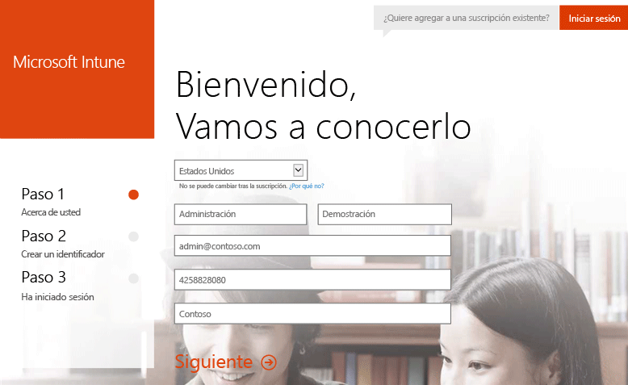

3.  Escriba un identificador de usuario y una contraseña para la cuenta de administrador y haga clic en **Siguiente**. Usará este identificador para iniciar sesión en el portal de Intune y realizar tareas de administración.

    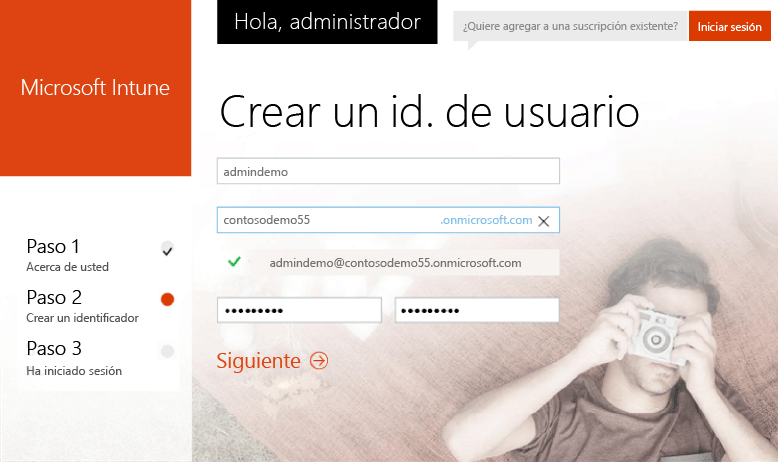

4.  Escriba su número de teléfono móvil y haga clic en **Envíame un mensaje** para validarlo.

    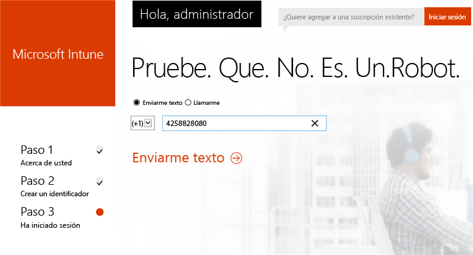

5.  Guarde la información que se muestra en la pantalla y, después, haga clic en **You're ready to go...** (Ya está listo)..

    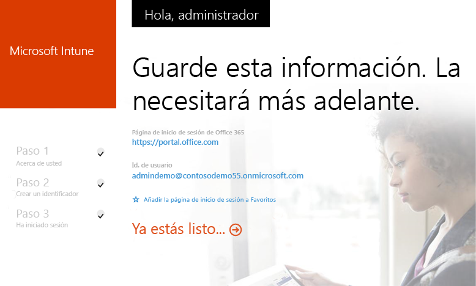

## Crear un usuario de prueba.

1.  En un equipo Windows, haga clic en **Inicio** para ir a la página de administración de usuarios.

    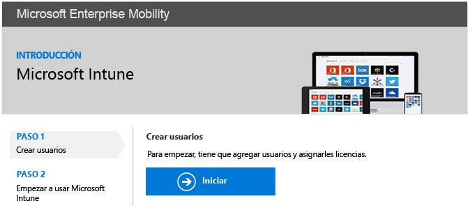

2.  Haga clic en el botón **+** para agregar un usuario.

    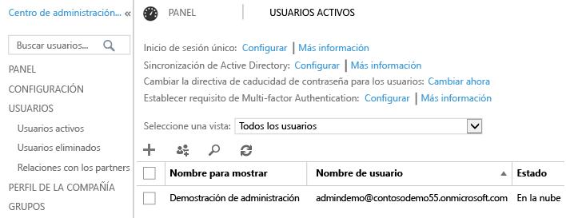

3.  En la página **Crear nueva cuenta de usuario**:

    1.  Proporcione la información del usuario de la prueba.

    2.  Seleccione la opción **Escribir contraseña**.

    3.  Desactive la casilla **Hacer que este usuario cambie su contraseña la próxima vez que inicie sesión**.

    4.  Haga clic en **Crear**..

    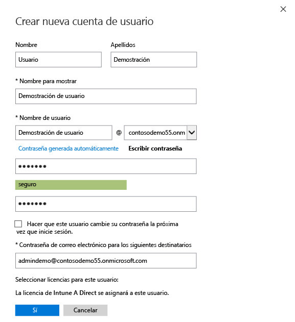

4.  En la página de confirmación de creación del usuario, haga clic en **Cerrar**..

    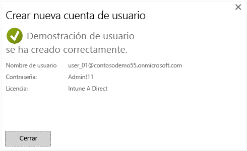

5.  Haga clic en el botón **Actualizar** para ver el usuario de prueba creado.

    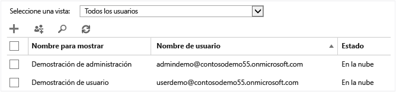

## Configurar una directiva de PIN de iOS para el usuario de prueba

1.  Use un equipo con Windows y establezca que la autoridad de MDM sea Intune:

    1.  Vaya a la [consola de administración de Intune](http://manage.microsoft.com/), inicie sesión con su cuenta de administrador y haga clic en **Empezar a administrar dispositivos móviles**. Se abre la página Entidad de administración de dispositivos móviles.

        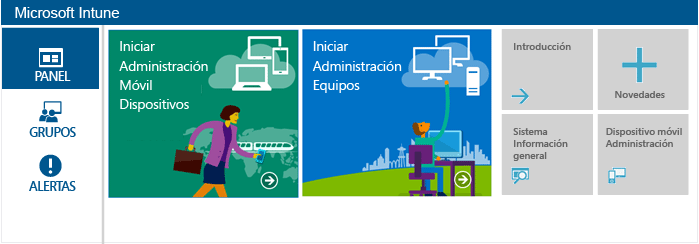

    2.  Haga clic en el vínculo **Establecer la entidad de administración de dispositivos móviles**.

        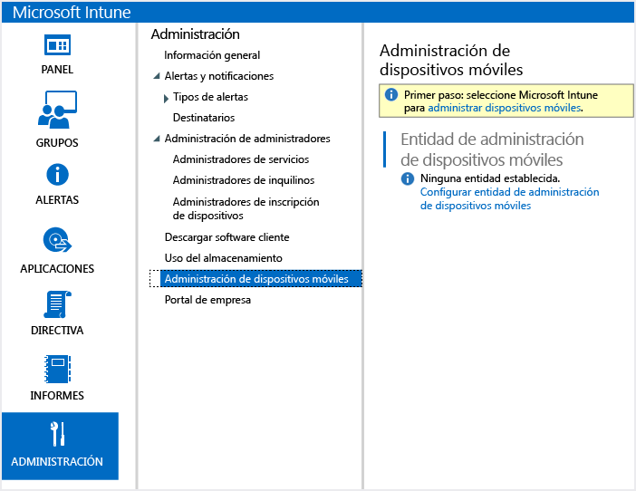

2.  Habilite los dispositivos iOS para la inscripción. Este proceso configura un certificado de confianza entre el Servicio de notificaciones push de Apple (APNs) y su suscripción a Intune.

    1.  Haga clic en **Habilitar la plataforma iOS y Mac OS X**..

        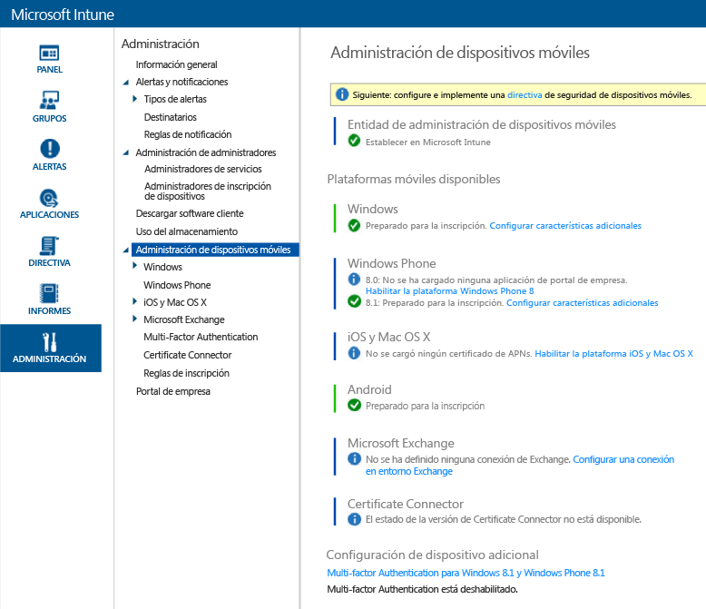

    2.  Haga clic en **Descargar la solicitud de certificado de APNs**..

        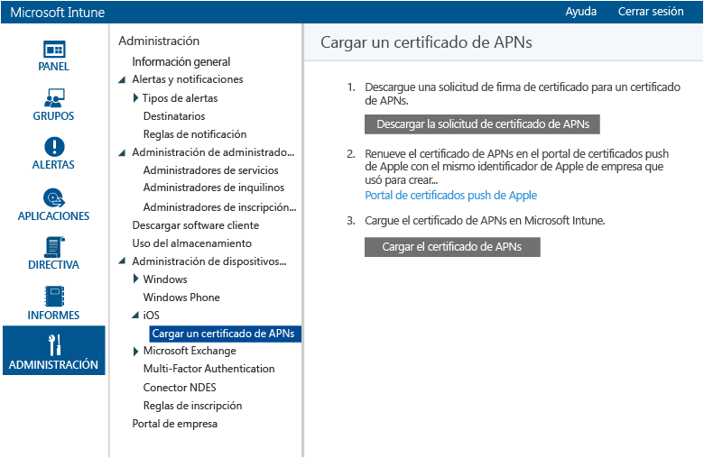

    3.  Especifique un nombre de archivo y una ubicación para la solicitud de firma de certificado (CSR) y, después, haga clic en **Guardar**. Este archivo contiene la clave pública que corresponde a una clave privada que se incluye en la suscripción a Intune.

        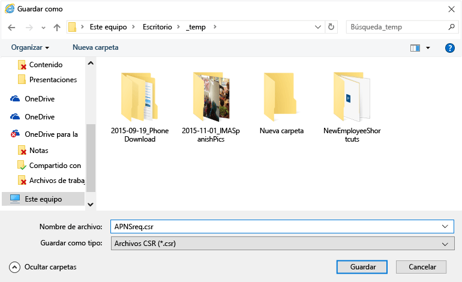

    4.  Haga clic en **Portal de certificados push de Apple** para abrir una nueva pestaña.

        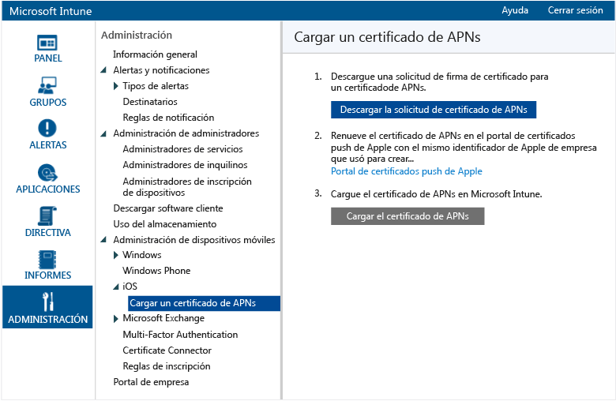

    5.  Escriba el identificador y la contraseña de Apple y haga clic en **Iniciar sesión**. Este identificador puede ser que usa en el dispositivo iOS para obtener aplicaciones desde el App Store de iOS.

        

    6.  Haga clic en **Crear un certificado**..

        

    7.  Lea las condiciones de uso de Apple, active la casilla y haga clic en **Aceptar**..

        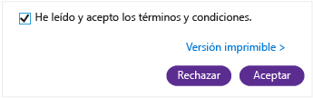

    8.  Haga clic en **Examinar**..

        

    9. Seleccione el archivo CSR que guardó anteriormente y haga clic en **Abrir**..

        

    10. Haga clic en el botón **Cargar**.

        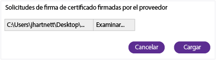

    11. Cuando se le pida que descargue un archivo JSON, haga clic en **Guardar como**..

        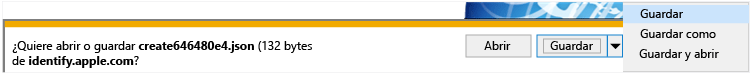

    12. Especifique una ubicación para el archivo JSON y haga clic en **Guardar**..

        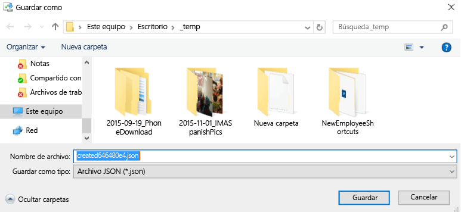

        Si la página no se redirige automáticamente después de unos segundos, haga clic en **Cancelar**..

        

    13. Para recuperar el archivo de certificado recién creado, haga clic en **Descargar**..

        

    14. Cuando se le pida que descargue un archivo PEM, haga clic en **Guardar como**..

        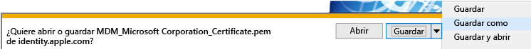

    15. Especifique una ubicación para el archivo PEM y haga clic en **Guardar**..

        

    16. Vuelva a la pestaña Consola de administración de Intune y haga clic en **Cargar el certificado de APNs**..

        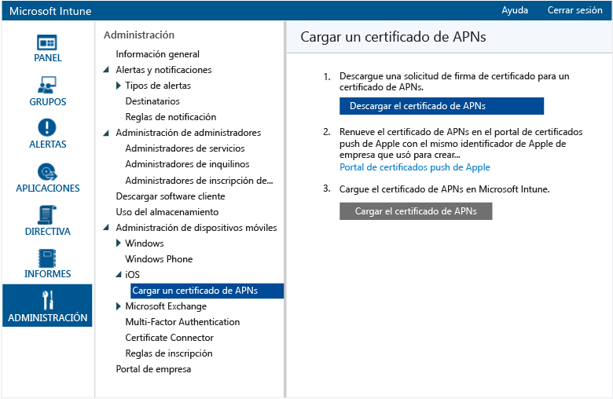

    17. Escriba su identificador de Apple y haga clic en **Examinar**..

        

    18. Seleccione el archivo PEM que acaba de guardar y haga clic en **Abrir**..

        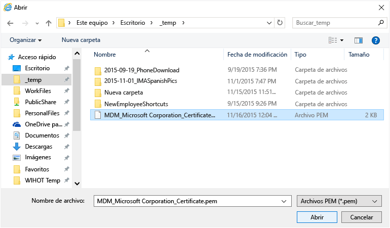

    19. Haga clic en **Cargar**..

        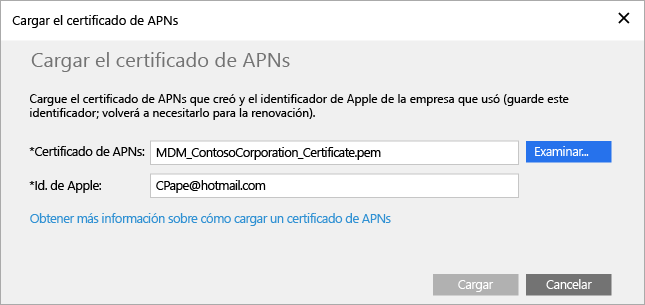

        Su certificado de APNs ya está configurado.

        

3.  Cree un grupo de usuarios de prueba al que aplicar la directiva:

    1.  En el panel de la izquierda, haga clic en **Grupos**..

        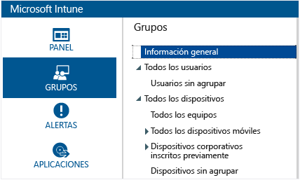

    2.  En el extremo derecho, haga clic en **Crear grupo**..

        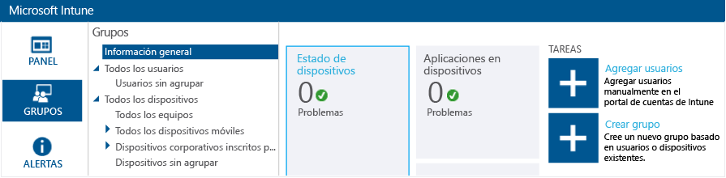

    3.  Proporcione un nombre de grupo, seleccione **Todos los usuarios** como el grupo primario y haga clic en **Siguiente**..

        

    4.  En el campo **Iniciar pertenencia a grupos con**, seleccione **Todos los usuarios del grupo primario** y haga clic en **Finalizar**..

        

4.  Cree una directiva de PIN de iOS y aplíquela al grupo de usuarios de prueba:

    1.  En el panel de la izquierda, haga clic en **Directiva**..

        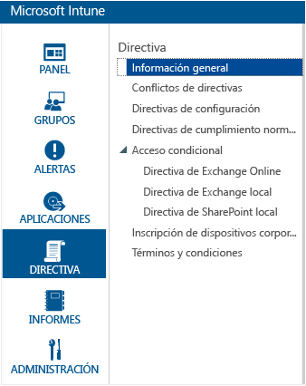

    2.  En el extremo derecho, haga clic en **Agregar directiva**..

        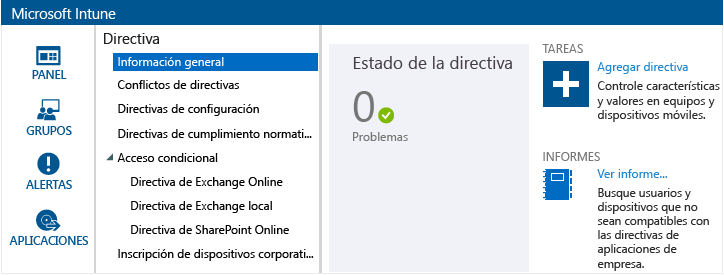

    3.  Expanda el nodo iOS, seleccione la fila **Configuración general** y haga clic en **Crear directiva**..

        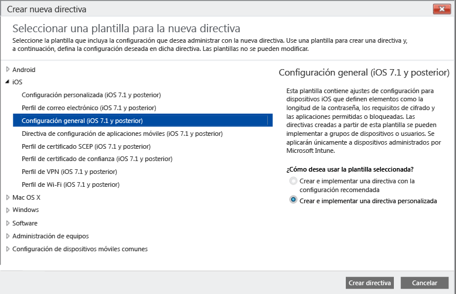

    4.  Escriba un nombre para la directiva, active la opción **Requerir una contraseña para desbloquear dispositivos móviles** y establezca **Longitud mínima de contraseña** en **4**..

        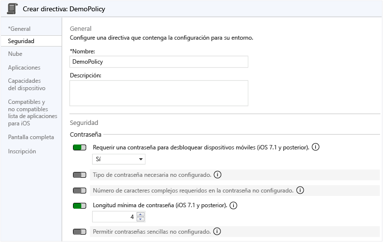

    5.  Haga clic en **Sí** para implementar la directiva.

        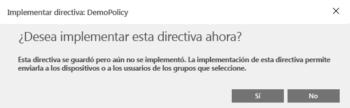

    6.  Haga clic en el grupo de usuarios creado anteriormente, en **Agregar** y en **Aceptar**..

        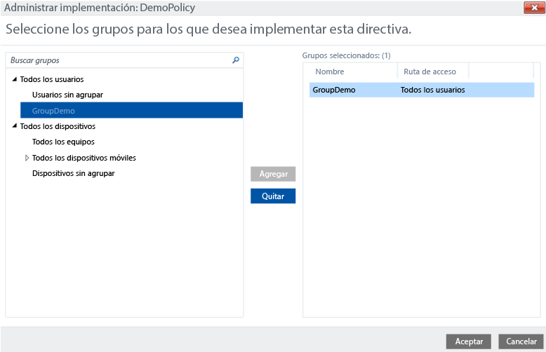

        Ahora tiene una directiva de PIN de iOS que se aplicará al grupo de usuarios de prueba.

        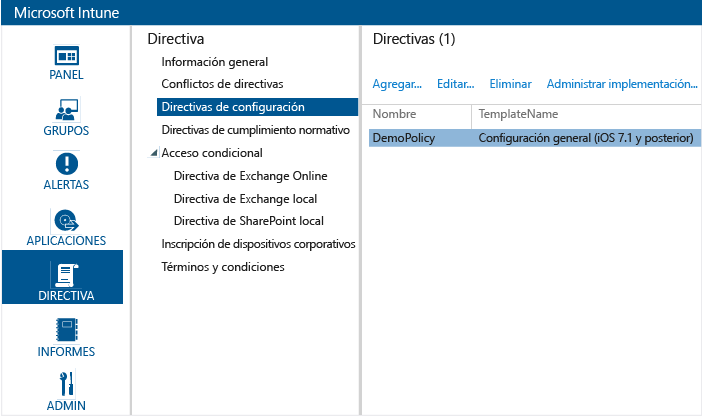

## Validar la aplicación de la directiva en un dispositivo iOS.

1.  En un iPad, inicie el App Store de iOS, instale la aplicación **Portal de empresa de Microsoft Intune** gratuita y ábrala.

    

2.  Escriba el nombre de su cuenta de usuario de prueba y la contraseña y pulse **Iniciar sesión**..

    

3.  Pulse **Inscribir** para empezar a inscribir el dispositivo en Intune.

    

4.  En la pantalla **Instalar el perfil**, pulse **Instalar**..

    

5.  En el cuadro de diálogo **Instalar el perfil**, pulse **Instalar**..

    

6.  En la pantalla **Advertencia**, pulse **Instalar**..

    

7.  En el cuadro de diálogo **Administración remota**, pulse **Confianza**..

    

8.  Cuando finalice la instalación del perfil de administración, pulse **Listo**. La inscripción está completa.

    

9. Cuando se complete la inscripción, pulse **Aceptar** y, después, cierre la aplicación Portal de empresa.

    

10. Cuando se le pida configurar un código de acceso, pulse **Continuar**..

    

11. Escriba el código de acceso, pulse **Continuar**, vuelva a escribir el código de acceso y pulse **Guardar**..

    

12. Presione el botón de encendido para bloquear el iPad, deslice para desbloquearlo y observe que ahora debe introducir el código de acceso para desbloquearlo.

### Consulte también
[Guía de evaluación de Intune](get-started-with-a-30-day-trial-of-microsoft-intune.md)

<!--HONumber=May16_HO1-->

