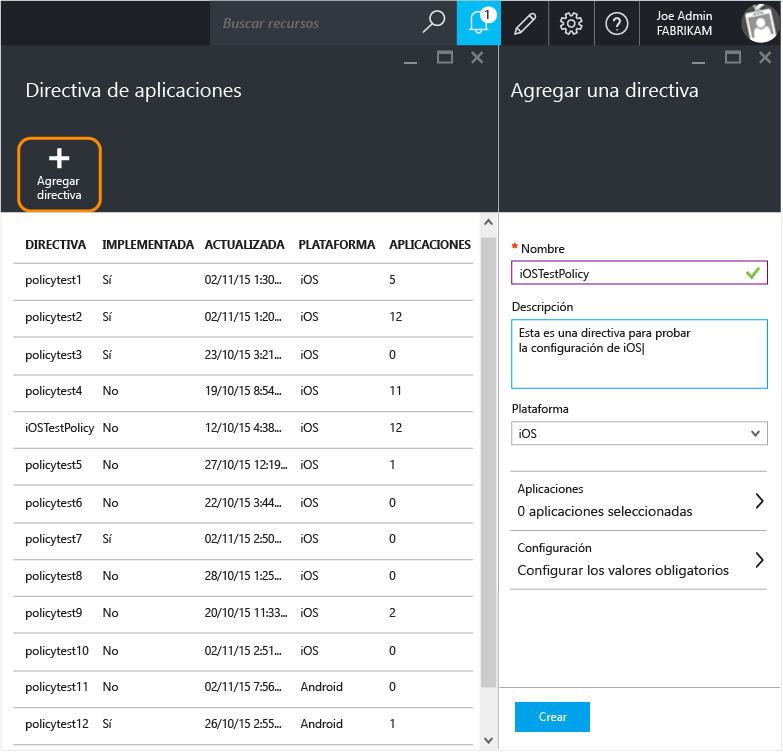
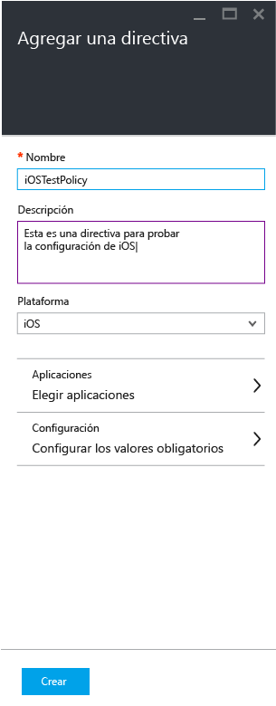
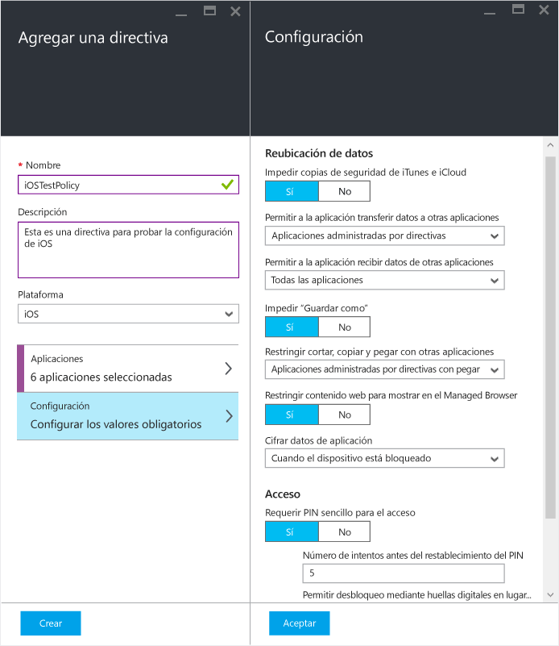
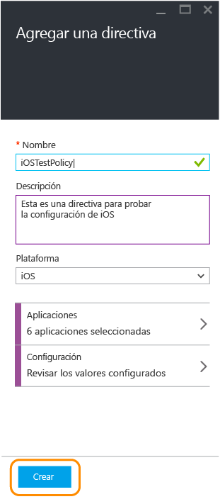
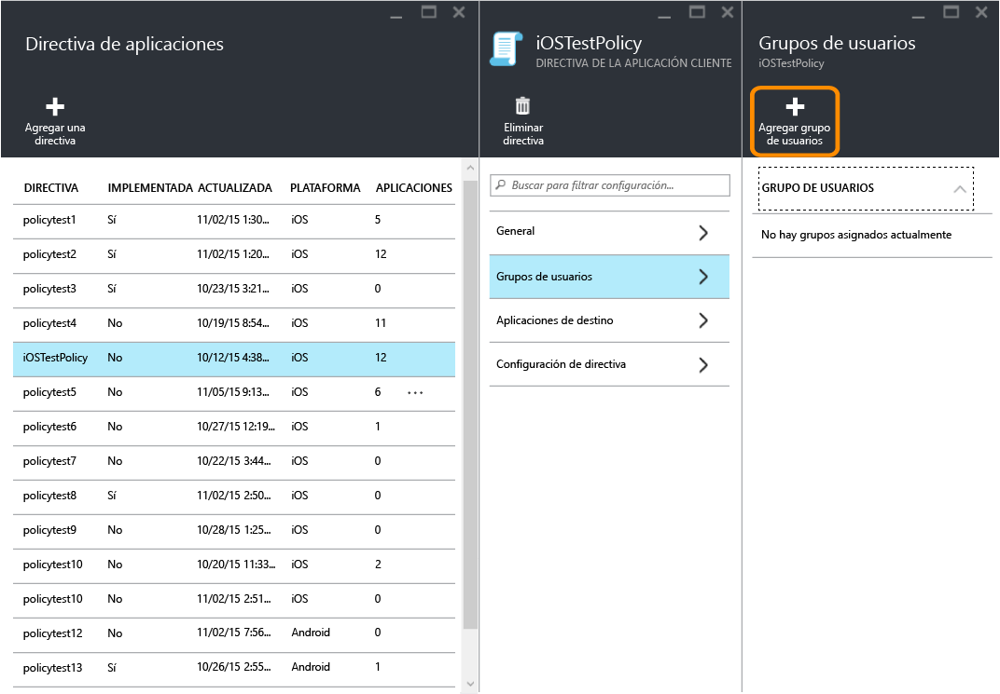
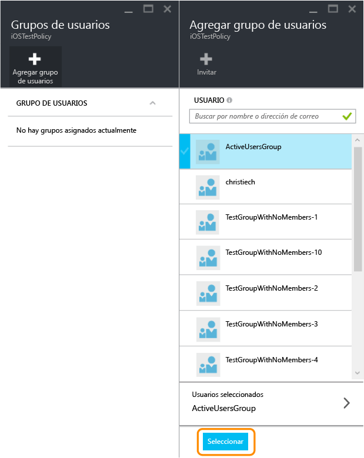
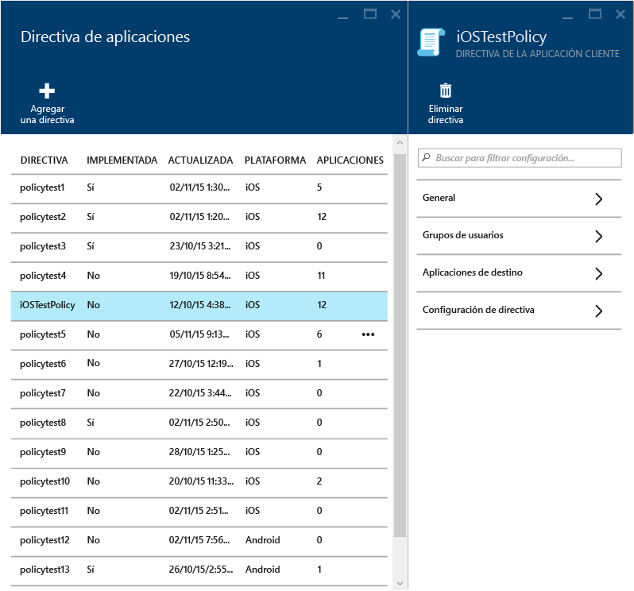
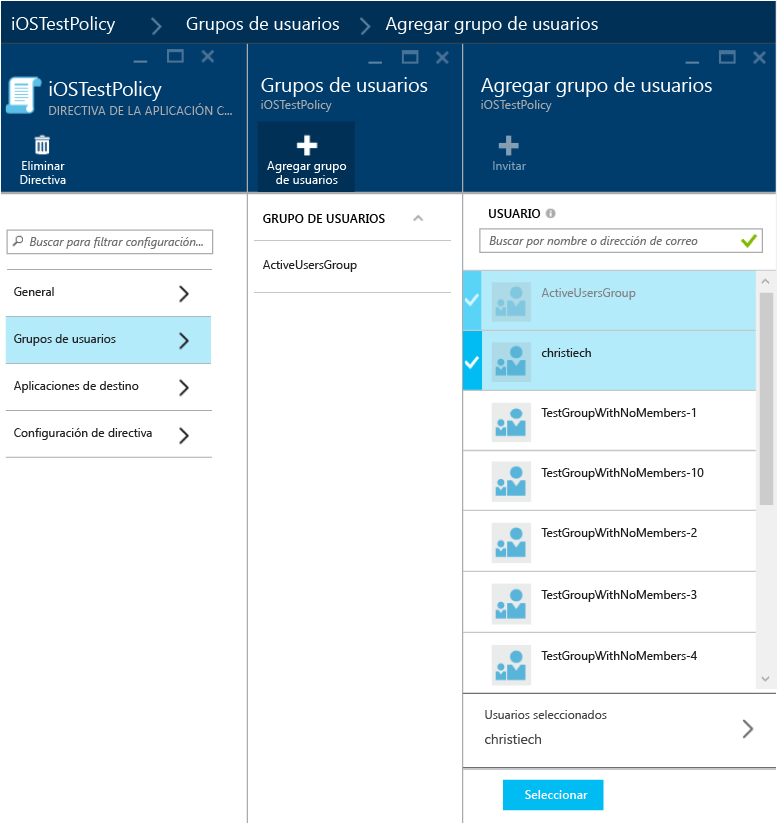
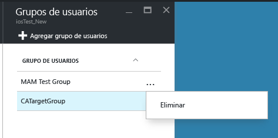
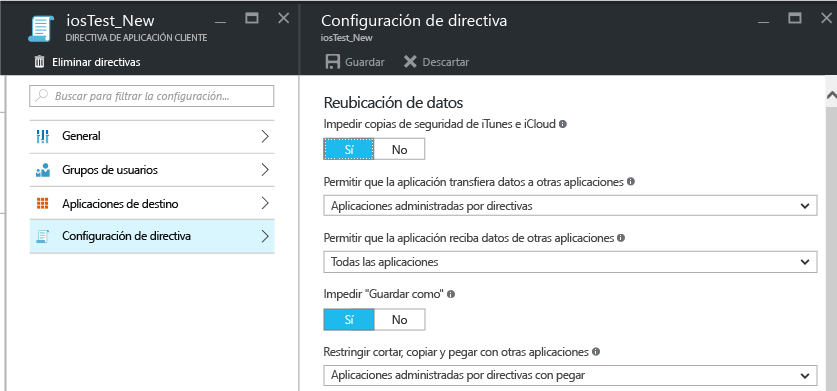

# Creación e implementación de directivas de protección de aplicaciones con Microsoft Intune

[!INCLUDE[classic-portal](../includes/classic-portal.md)]

En este tema se describe el proceso de creación de directivas de protección de aplicaciones en **Azure Portal**. Azure Portal es la nueva consola de administración para crear directivas de protección de aplicaciones. Recomendamos utilizar este portal para crear este tipo de directivas. El portal de Azure admite los siguientes escenarios de MAM:

- Dispositivos inscritos en Intune.
- Dispositivos administrados por una solución de MDM de terceros.
- Dispositivos que no están administrados por ninguna solución de MDM (BYOD).

>[!IMPORTANT]
Si está usando la **consola de administración de Intune** para administrar los dispositivos, estos son algunos aspectos que debe tener en cuenta:

> * Puede crear una directiva de protección de aplicaciones que admita aplicaciones para los dispositivos inscritos en Intune mediante la [consola de administración de Intune](configure-and-deploy-mobile-application-management-policies-in-the-microsoft-intune-console.md).
> * Las directivas de protección de aplicaciones creadas con la consola de administración de Intune no pueden importarse en Azure Portal.  Las directivas de protección de aplicaciones deben volver a crearse en Azure Portal.

> * Es posible que no vea todas las opciones de configuración de las directivas de protección de aplicaciones en la consola de administración de Intune. Azure Portal es la nueva consola de administración para crear directivas de protección de aplicaciones.

> * Para implementar aplicaciones administradas, debe crear una directiva de protección de aplicaciones en la consola de administración de Intune. En este caso, puede que quiera crear directivas de protección de aplicaciones tanto en la consola de administración de Intune como en Azure Portal: en la consola de administración de Intune para asegurarse de tener la capacidad de implementar aplicaciones administradas, y en Azure Portal porque es la nueva consola de administración que tiene todas las opciones de configuración de las directivas de protección de aplicaciones.

> * Si crea directivas de protección de aplicaciones en la consola de administración de Intune y en Azure Portal, la directiva creada en el segundo se aplicará a las aplicaciones.

Para ver una lista de las configuraciones de directiva compatibles en plataformas iOS y Android, seleccione uno de los siguientes:

> [!div class="op_single_selector"]
- [Directivas de iOS](ios-mam-policy-settings.md)
- [Directivas de Android](android-mam-policy-settings.md)

- Para obtener una descripción más detallada de cómo funcionan las directivas de protección de aplicaciones y los escenarios admitidos por las directivas de protección de aplicaciones de Intune, consulte [Proteger datos de aplicaciones mediante directivas de protección de aplicaciones](protect-app-data-using-mobile-app-management-policies-with-microsoft-intune.md).

##  Crear directivas de protección de aplicaciones
Las directivas de protección de aplicaciones se crean en Azure Portal. Si esta es la primera vez que lo usa, lea [Azure Portal para directivas de protección de aplicaciones de Microsoft Intune](azure-portal-for-microsoft-intune-mam-policies.md) para familiarizarse con él. Antes de crear una directiva de protección de aplicaciones, repase la información sobre [requisitos previos y compatibilidad](get-ready-to-configure-mobile-app-management-policies-with-microsoft-intune.md).

Siga estos pasos para crear directivas de protección de aplicaciones:

1. Vaya a [Azure Portal](http://portal.azure.com) y especifique sus credenciales.

2. Elija **Más servicios** y escriba "Intune".

3. Elija **Protección de aplicaciones de Intune**.

4. Seleccione **Administración de aplicaciones móviles de Intune &gt; Configuración** para abrir la hoja **Toda la configuración**.

    

2.  En la hoja **Toda la configuración**, elija **Directiva de aplicaciones**. De este modo se abrirá la hoja **Directiva de aplicaciones**, donde podrá crear nuevas directivas y editar las existentes. Elija **Agregar una directiva**.

    

3.  Escriba un nombre para la directiva, agregue una descripción breve y seleccione el tipo de plataforma para el que se creará la directiva (iOS o Android). Puede crear más de una directiva para cada plataforma.

    

4.  Seleccione **Aplicaciones** para abrir la hoja **Aplicaciones**, donde se muestra una lista de las aplicaciones disponibles. Seleccione una o más aplicaciones de la lista que quiera asociar a la directiva que está creando. Una vez seleccionadas las aplicaciones, elija **Seleccionar**, en la parte inferior de la hoja **Aplicaciones**, para guardar la selección.

    > [!IMPORTANT]
    > Debe seleccionar al menos una aplicación para crear una directiva.

5.  En la hoja **Agregar directiva**, elija **Configurar los valores obligatorios** para abrir la hoja de configuración de directivas.

    Existen dos categorías de configuración de directivas: **Reubicación de datos** y **Acceso**.  Las directivas de reubicación de datos son aplicables a la introducción y la extracción de datos de las aplicaciones, mientras que las directivas de acceso determinan el modo en el que el usuario final tiene acceso a las aplicaciones en un contexto de trabajo.
    Para comenzar, la configuración de directiva tiene valores predeterminados. No es necesario realizar ningún cambio si los valores predeterminados satisfacen sus necesidades.

    > [!TIP]
    > Esta configuración de directiva se aplica solo al usar aplicaciones en el contexto de trabajo.  Cuando el usuario final usa la aplicación para realizar una tarea personal, no se verá afectado por estas directivas.

    

6.  Seleccione **Aceptar** para guardar esta configuración. Ahora habrá regresado a la hoja **Agregar una directiva** . Seleccione **Crear** para crear la directiva y guardar la configuración.

    

Cuando termine de crear una directiva como se describe en el procedimiento anterior, no se implementará en ningún usuario. Para implementar una directiva, consulte la sección siguiente titulada "Implementar una directiva para los usuarios".

> [!IMPORTANT]
> Si crea una directiva de protección de aplicaciones para una aplicación con la consola de administración de Intune y otra con Azure Portal, la directiva creada con este último tendrá prioridad. Pero los informes de la consola de Intune o de Configuration Manager informarán de la configuración de directiva creada en la consola de administración de Intune. Por ejemplo:
>
> -   Ha creado una directiva de protección de aplicaciones en la consola de administración de Intune que bloquea la copia desde una aplicación.
> -   Ha creado una directiva de protección de aplicaciones en la consola de Azure que permite la copia desde una aplicación.
> -   Luego asocia ambas directivas a la misma aplicación.
> -   La directiva creada desde la consola de Azure tiene prioridad y se permite la copia.
> -   Sin embargo, el estado y los informes de la consola de Intune indicarán incorrectamente que la copia está bloqueada.

## Aplicaciones de línea de negocio (LOB) (opcional)

A partir de la versión 1703 de Intune, tiene la opción de agregar de forma general aplicaciones de LOB a Intune al crear una nueva directiva de protección de aplicaciones. Esto le permite definir directivas de protección de aplicaciones para aplicaciones de LOB mediante el SDK de MAM, sin necesidad de permisos completos de implementación de aplicaciones.

> [!TIP] 
> También puede agregar aplicaciones de LOB a Intune a través del flujo de trabajo de [Intune App SDK](https://docs.microsoft.com/intune/develop/intune-app-sdk-get-started).

> [!IMPORTANT]
> Si los usuarios solo tienen permisos específicos para implementar aplicaciones MAM y no tienen permisos completos de implementación de aplicaciones, que les permitirían implementar cualquier aplicación en Intune, no podrán pasar por el flujo de trabajo del SDK de Intune, pero podrán agregar sus aplicaciones de LOB a través del flujo de trabajo de creación de directivas de protección de aplicaciones MAM.

### Para agregar aplicaciones de LOB (iOS y Android)

1.  En la hoja Agregar directiva, elija **Aplicaciones** para abrir la hoja Aplicaciones.

    

2.  Haga clic en **Más aplicaciones** y, luego, escriba el **Id. de paquete** (para iOS) o **Id. del paquete** (para Android) y haga clic en Seleccionar para agregar las aplicaciones de LOB.

    

### Para agregar aplicaciones de LOB (Windows)

> [!IMPORTANT] 
> Debe seleccionar Windows 10 en la lista desplegable de la plataforma al crear una nueva directiva de protección de aplicaciones.

1.  En la hoja Agregar directiva, elija **Aplicaciones permitidas** o **Aplicaciones exentas** para abrir la hoja Aplicaciones permitidas o Aplicaciones exentas.

    > [!NOTE]
    > 
    - **Aplicaciones permitidas**: estas son las aplicaciones que deben cumplir esta directiva.
    - **Aplicaciones exentas**: estas aplicaciones están exentas del cumplimiento de esta directiva y pueden acceder a los datos corporativos sin restricciones.
  
2. En la hoja Aplicaciones permitidas o Aplicaciones exentas, haga clic en **Agregar aplicaciones**. Puede agregar aplicaciones recomendadas de Microsoft, o aplicaciones de escritorio o de la Tienda.

    a.  **Aplicaciones recomendadas**: una lista rellenada previamente de aplicaciones (en su mayoría de Office) que permitimos que los administradores importen fácilmente a la directiva.

    b.  **Aplicaciones de la Tienda**: el administrador puede agregar cualquier aplicación de la Tienda Windows a la directiva.

    c.  **Aplicaciones de escritorio de Windows**: el administrador puede agregar cualquier aplicación de escritorio tradicional de Windows a la directiva (por ejemplo, exe, dll, etc.).

## Implementar una directiva para los usuarios

1.  En la hoja **Directiva**, seleccione **Grupos de usuarios**, que abre la hoja **Grupos de usuarios**. Seleccione **Agregar grupo de usuarios** en la hoja **Grupos de usuarios** para abrir la hoja **Agregar grupo de usuarios**.

    

2.  Se mostrará una lista de grupos de usuarios en la hoja **Agregar grupo de usuarios** . Esta es una lista de todos los grupos de seguridad de su **Azure Active Directory**. Seleccione los grupos de usuarios a los que quiera aplicar esta directiva y, después, elija **Seleccionar**. Al ****hacerlo, la directiva se implementa en los usuarios.

    

    Ahora ha creado una directiva y la ha implementado en los usuarios.

Solo se ven afectados por la directiva los usuarios que tengan asignadas licencias de [!INCLUDE[wit_nextref](../includes/wit_nextref_md.md)]. Los usuarios pertenecientes al grupo de seguridad seleccionado que no tengan asignada una licencia de [!INCLUDE[wit_nextref](../includes/wit_nextref_md.md)] no se verán afectados.

>[!IMPORTANT]
> Si usa Intune con Administrador de configuración para administrar los dispositivos iOS y Android, la directiva solo se aplica a los usuarios directamente en el grupo seleccionado. No se ven afectados los miembros de los grupos secundarios anidados en el grupo seleccionado.

Los usuarios finales pueden descargar las aplicaciones desde App Store o Google Play. Para obtener más información, vea:
* [What to expect when your Android app is managed by app protection policies](user-experience-for-mam-enabled-android-apps-with-microsoft-intune.md) (Qué esperar cuando la aplicación Android se administra con directivas de protección de aplicaciones)
* [What to expect when your iOS app is managed by app protection policies](user-experience-for-mam-enabled-ios-apps-with-microsoft-intune.md) (Qué esperar cuando la aplicación iOS se administra con directivas de protección de aplicaciones)

##  Cambiar las directivas existentes
Puede editar una directiva existente y aplicarla a los usuarios objetivo. Con todo, al cambiar las directivas existentes, los usuarios que ya han iniciado sesión en las aplicaciones no verán los cambios durante un período de 8 horas.

Para ver el efecto de los cambios inmediatamente, el usuario final tendrá que salir de la aplicación y volver a iniciar sesión.

### Para cambiar la lista de aplicaciones asociadas con la directiva

1.  En la hoja **Directiva de aplicaciones**, elija la directiva que quiera cambiar. De este modo se abrirá una hoja específica de la directiva que acaba de seleccionar.

    

2.  En la hoja de la directiva, seleccione **Aplicaciones de destino** para abrir la lista de aplicaciones.

3.  Quite o agregue aplicaciones de la lista y seleccione el icono **Guardar** para guardar los cambios.

### Para cambiar la lista de grupos de usuarios

1.  En la hoja **Directiva de aplicaciones**, elija la directiva que quiera cambiar. De este modo se abrirá la hoja específica de la directiva que ha seleccionado.

2.  En la hoja de la directiva, seleccione **Grupos de usuarios** para abrir la hoja **Grupo de usuarios** en la que se muestra la lista de grupos de usuarios actuales regidos por esta directiva.

3.  Para agregar un nuevo grupo de usuarios a la directiva, elija **Agregar grupo de usuarios** y seleccione el grupo de usuarios en cuestión. Elija **Seleccionar** para implementar la directiva en el grupo seleccionado.

    

4.  Para eliminar un grupo de usuarios, resalte el grupo que quiere quitar. Después, elija el botón de puntos suspensivos (…) y seleccione **Eliminar** para quitar el grupo de usuarios.

    

### Para cambiar la configuración de directiva

1.  En la hoja **Directiva de aplicaciones**, elija la directiva que quiera cambiar. De este modo se abrirá una hoja específica de la directiva que acaba de seleccionar.

    

2.  Seleccione **Configuración de directiva** para abrir la hoja **Configuración de directiva**.

3.  Cambie la configuración y elija el icono **Guardar** para guardar los cambios.

    

## Configuraciones de directiva
Para ver una lista completa de las configuraciones de directiva para iOS y Android, seleccione una opción a continuación:

> [!div class="op_single_selector"]
- [Directivas de iOS](ios-mam-policy-settings.md)
- [Directivas de Android](android-mam-policy-settings.md)

## Pasos siguientes
[Supervisar el estado del cumplimiento y del usuario](monitor-mobile-app-management-policies-with-microsoft-intune.md)

### Consulte también
* [What to expect when your Android app is managed by app protection policies](user-experience-for-mam-enabled-android-apps-with-microsoft-intune.md) (Qué esperar cuando la aplicación Android se administra con directivas de protección de aplicaciones)
* [What to expect when your iOS app is managed by app protection policies](user-experience-for-mam-enabled-ios-apps-with-microsoft-intune.md) (Qué esperar cuando la aplicación iOS se administra con directivas de protección de aplicaciones)

