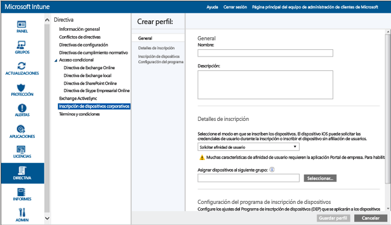

# Inscribir directamente dispositivos iOS mediante Apple Configurator

[!INCLUDE[classic-portal](../includes/classic-portal.md)]

Intune permite inscribir dispositivos iOS corporativos con la herramienta [Apple Configurator](http://go.microsoft.com/fwlink/?LinkId=518017) que se ejecuta desde un equipo Mac. Este proceso no restablece los valores de fábrica del dispositivo e inscribe el dispositivo con una directiva predefinida. Este método está destinado a dispositivos **Sin afinidad de usuario** y requiere una conexión USB entre el dispositivo iOS y un equipo Mac para configurar la inscripción corporativa.

Cuando inscribe dispositivos iOS directamente, puede inscribir un dispositivo sin adquirir su número de serie. También puede nombrar el dispositivo con fines de identificación antes de que Intune capture el nombre del dispositivo durante la inscripción. No se admite la aplicación de portal de empresa para dispositivos inscritos directamente. Esta guía supone que se usa Apple Configurator 2.0 en un equipo Mac.

1.  Si aún no lo tiene, cree un perfil de inscripción de dispositivo para los dispositivos iOS inscritos mediante Apple Configurator. Un perfil de inscripción de dispositivo define la configuración que se aplica a los dispositivos.

    1.  En la [consola de administración de Microsoft Intune](http://manage.microsoft.com), vaya a **Directiva** &gt; **Inscripción de dispositivos corporativos** y, después, elija **Agregar**.

        

    2.  Especifique los detalles de los perfiles de dispositivo:

        -   **Nombre**: nombre del perfil de inscripción de dispositivo. No es visible para los usuarios.

        -   **Descripción**: descripción del perfil de inscripción de dispositivo. No es visible para los usuarios.

        -   **Afiliación de usuario**: especifica cómo se inscriben los dispositivos. Para la inscripción directa, elija **Sin afinidad usuario**.

        -   **Asignación previa de grupo de dispositivos**: todos los dispositivos que tengan este perfil pertenecerán inicialmente a este grupo. Puede reasignar los dispositivos después de la inscripción.

            [!INCLUDE[groups deprecated](../includes/group-deprecation.md)]

    3.  Elija **Guardar perfil** para agregar el perfil.

5.  Exporte un perfil como .mobileconfig para implementarlo en dispositivos iOS:

    1.   Seleccione el perfil de dispositivo que ha creado.

    2.   Elija **Exportar** en la barra de tareas.

    3.   Elija **Descargar perfil** y guarde el archivo .mobileconfig descargado.

6.  Transfiera el archivo copiando el archivo .mobileconfig descargado en un equipo Mac.
    > [!NOTE]
    > La URL del perfil de inscripción es válida durante dos semanas de cuando se exporta. Después de dos semanas, debe exportar una nueva URL de perfil de inscripción para inscribir dispositivos iOS con el Asistente de configuración.

7.  Prepare el dispositivo con Apple Configurator. Los dispositivos iOS están conectados al equipo Mac e inscritos para la administración de dispositivos móviles.

    1.  En un equipo Mac, abra **Apple Configurator 2.0**.

    2.  Conecte el dispositivo iOS al equipo Mac con un cable USB. Cierre **Fotos**, **iTunes** y otras aplicaciones que se abran en el dispositivo cuando se detecte el dispositivo.

    3.  En Apple Configurator, elija el dispositivo iOS conectado y, después, elija el botón **Agregar**. Las opciones que se pueden agregar al dispositivo aparecen en la lista desplegable. Elija **Perfiles**.

    4.  Use el selector de archivos para seleccionar el archivo .mobileconfig que ha exportado desde Intune y, después, elija **Agregar**. El perfil se agrega al dispositivo.  Si el dispositivo es **No supervisado**, la instalación requerirá la aceptación en el dispositivo.

8.  Todo está listo para instalar el perfil en el dispositivo iOS. El dispositivo debe haber completado el Asistente de configuración y estar listo para usarse. Si la inscripción implica implementaciones de aplicaciones, el dispositivo debe tener un identificador de Apple configurado, porque las implementaciones de aplicaciones requerirán que disponga de un identificador de Apple con la sesión iniciada en App Store.

    1.  Desbloquee el dispositivo iOS.

    2.  En el cuadro de diálogo **Instalar el perfil** de **Perfil de administración**, elija **Instalar**.

    3.  Facilite el **Código de acceso del dispositivo** o el **Id. de Apple**, si es necesario.

    4.  Acepte la **advertencia** y elija **Instalar**.

    5.  Acepte la **advertencia remota** y elija **Confiar**.

    6.  Cuando el cuadro **Perfil instalado** confirme el perfil como **Instalado**, elija **Listo**.

9.  En el dispositivo iOS, abra **Configuración** y vaya a **General** &gt; **Administración de dispositivos** &gt; **Perfil de administración**. Confirme que aparece la instalación del perfil y compruebe las restricciones de directivas de iOS y las aplicaciones instaladas. Las aplicaciones y las restricciones de directivas pueden tardar hasta 10 minutos en aparecer en el dispositivo.

10.  Distribuya los dispositivos. Ahora el dispositivo iOS está inscrito con Intune y administrado.

<!--HONumber=Dec16_HO2-->

