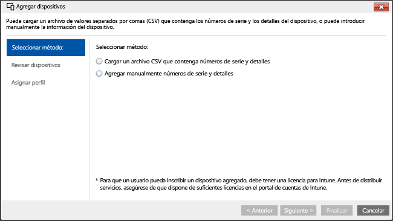

# <a name="enroll-ios-devices-with-apple-configurator-by-using-setup-assistant"></a>Inscripción de dispositivos iOS con Apple Configurator mediante el Asistente de configuración

[!INCLUDE[classic-portal](../includes/classic-portal.md)]

Intune permite la inscripción de dispositivos iOS corporativos con la herramienta [Apple Configurator](http://go.microsoft.com/fwlink/?LinkId=518017) desde un equipo Mac. Este proceso restablece el dispositivo a la configuración de fábrica y lo prepara para ejecutar el Asistente de configuración, que instala las directivas de la empresa para el nuevo usuario del dispositivo.

## <a name="setup-assistant-enrollment-for-ios-devices-with-microsoft-intune"></a>Inscripción mediante Asistente de configuración para dispositivos iOS con Microsoft Intune
Apple Configurator puede restablecer un dispositivo iOS a la configuración de fábrica y prepararlo para que lo configure el nuevo usuario del dispositivo. Este método requiere conectar el dispositivo iOS a un equipo Mac a través de una conexión USB para configurar la inscripción corporativa. Además, se supone que está usando Apple Configurator 2.0. En la mayoría de los casos será necesario que la directiva aplicada al dispositivo iOS incluya **afinidad de usuario** para habilitar la aplicación Portal de empresa de Intune.

**Requisitos previos**
* [Inscripción de iOS habilitada](set-up-ios-and-mac-management-with-microsoft-intune.md) mediante la instalación de un certificado de APNs
* Acceso físico a dispositivos iOS; los dispositivos se deben restablecer a la configuración de fábrica sin protección con contraseña
* Números de serie del dispositivo. Consulte [cómo encontrar el número de serie de un producto de Apple](https://support.apple.com/en-us/HT204308)
* Cables de conexión USB
* Equipo Mac con [Apple Configurator 2.0](https://itunes.apple.com/us/app/apple-configurator-2/id1037126344?mt=12)


1.  **Crear grupos de dispositivos móviles** (opcional)
    Si su empresa requiere grupos de dispositivos móviles para ayudar a administrar los dispositivos, cree los grupos. Para aprender más, consulte [Usar grupos para administrar usuarios y dispositivos en Microsoft Intune](use-groups-to-manage-users-and-devices-with-microsoft-intune.md).

2.  **Crear un perfil para dispositivos**
    Un perfil de inscripción de dispositivo define la configuración que se aplica a un grupo de dispositivos. Los siguientes pasos muestran cómo crear un perfil de inscripción de dispositivos para dispositivos iOS inscritos mediante Apple Configurator.

    1.  En la [consola de administración de Microsoft Intune](http://manage.microsoft.com), vaya a **Directiva** &gt; **Inscripción de dispositivos corporativos** y, después, elija **Agregar**.
    

    2.  Especifique los detalles de los perfiles de dispositivo:

        -   **Nombre**: el nombre del perfil de inscripción de dispositivos (no es visible para los usuarios).

        -   **Descripción**: una descripción del perfil de inscripción de dispositivos (no es visible para los usuarios).

        -   **Detalles de inscripción**: especifica cómo se inscriben los dispositivos.

            -   **Solicitar afinidad de usuario**: el dispositivo se debe afiliar a un usuario durante la configuración inicial y luego se le puede permitir el acceso a los datos y al correo electrónico de la empresa. La **afinidad de usuario** debe configurarse para dispositivos administrados por DEP que pertenezcan a usuarios y necesiten usar el portal de empresa para hacer uso de servicios, como instalar aplicaciones.

            -   **Sin afinidad de usuario**: el dispositivo no está afiliado a ningún usuario. Utilice esta afiliación para dispositivos que realizan tareas sin tener acceso a datos de usuario local. Las aplicaciones que requieren la afiliación de un usuario no funcionarán, incluida la aplicación Portal de empresa cuando se usa para instalar aplicaciones de línea de negocio.

        -   **Asignación previa de grupo de dispositivos**: todos los dispositivos que implementan este perfil pertenecerán inicialmente a este grupo. Puede reasignar los dispositivos después de la inscripción.

            [!INCLUDE[groups deprecated](../includes/group-deprecation.md)]

        -  **Programa de inscripción de dispositivos**: el programa de inscripción de dispositivos de Apple (DEP) no se puede usar con la inscripción del Asistente de configuración. Asegúrese de que el botón de alternancia está establecido en **desactivado**.

    3.  Elija **Guardar perfil** para agregar el perfil.

3.  **Agregar dispositivos iOS para inscribirse con el Asistente de configuración**.
    En la [consola de administración de Microsoft Intune](http://manage.microsoft.com), vaya a **Grupos** &gt; **Todos los dispositivos** &gt; **Todos los dispositivos corporativos** &gt; **Todos los dispositivos** y luego elija **Agregar dispositivos**. Puede agregar dispositivos de dos maneras:

    

    -   **Cargar un archivo CSV que contiene números de serie**: cree una lista de valores separados por comas (.csv) con dos columnas sin encabezado, limitada a 5000 dispositivos o 5 MB por archivo .csv.

        |||
        |-|-|
        |&lt;Serie 1&gt;|&lt;Detalles del dispositivo n.º 1&gt;|
        |&lt;Serie 2&gt;|&lt;Detalles del dispositivo n.º 2&gt;|
        Este archivo .csv, cuando se ve en un editor de texto, aparece como:

        ```
        0000000,PO 1234
        111111111,PO 1234
        ```

    -   **Agregar manualmente los detalles del dispositivo**&mdash;: especifique el número de serie y los detalles de hasta 15 dispositivos.

    > [!NOTE]
    > Si posteriormente necesita quitar dispositivos corporativos de la administración de Intune, es posible que tenga que quitar el número de serie del dispositivo de Intune del grupo de dispositivos **Mediante número de serie de iOS** en **Dispositivos corporativos inscritos previamente** para deshabilitar la inscripción de dispositivos. Si Intune realiza un procedimiento de recuperación ante desastres en el momento en que se quitan los números de serie o en torno a este momento, se deberá comprobar que solo los números de serie de los dispositivos activos están presentes en ese grupo.

    Seleccione **Siguiente**.

4.  **Seleccionar dispositivos para inscribir**.
    Confirme los dispositivos que se van a inscribir. No se pueden importar los números de serie ya inscritos o inscritos por otros medios. Elija **Siguiente** para continuar.

5.  **Asignar un perfil**.
    Especifique el perfil que se va a asignar a los dispositivos agregados desde la lista de perfiles disponibles, consulte los **detalles del perfil de inscripción**y, después, haga clic en **Finalizar**. Los dispositivos agregados manualmente se pueden asignar a cualquier perfil de inscripción.

6.  **Exportar un perfil para implementarlo en dispositivos iOS**.
    En la [consola de administración de Microsoft Intune](http://manage.microsoft.com), vaya a **Directiva** &gt; **Inscripción de dispositivos corporativos** y luego seleccione el perfil de dispositivo para implementar en dispositivos móviles. Elija **Exportar** en la barra de tareas. Copie y guarde el valor de **Dirección URL del perfil**. Se cargará en Apple Configurator más tarde para definir el perfil de Intune utilizado por los dispositivos iOS.
    Para admitir Apple Configurator 2, se debe editar URL de perfil 2.0. Para ello, reemplace este código:
    ```
    https://manage.microsoft.com/EnrollmentServer/Discovery.svc/iOS/ESProxy?id=
    ```
    por este código:

    ```
    https://appleconfigurator2.manage.microsoft.com/MDMServiceConfig?id=
    ```

   En el procedimiento siguiente, esta dirección URL de perfil se carga en el servicio DEP de Apple mediante la herramienta Apple Configurator para definir el perfil de Intune utilizado por dispositivos iOS.


7.  **Preparar el dispositivo con Apple Configurator**.
    Los dispositivos iOS están conectados al equipo Mac e inscritos para la administración de dispositivos móviles.

    1.  En un equipo Mac, abra **Apple Configurator 2**. En la barra de menús, elija **Apple Configurator 2** y, después, elija **Preferencias**.

         > [!WARNING]
         > Los dispositivos se restablecerán en la configuración de fábrica durante el proceso de inscripción. Como procedimiento recomendado, restablezca el dispositivo y enciéndalo. Los dispositivos deberían estar en la pantalla **Hola** cuando conecte el dispositivo.

    2. En el panel de preferencias, seleccione **Servidores** y elija el símbolo más (+) para iniciar el asistente del servidor MDM. Seleccione **Siguiente**.

    3. Escriba el **nombre** y la **dirección URL de inscripción** para el servidor MDM del paso 6 en el Asistente de configuración para la inscripción de dispositivos de iOS con Microsoft Intune. Para la dirección URL de inscripción, escriba la dirección URL del perfil de inscripción exportada desde Intune. Seleccione **Siguiente**.  

       Puede omitir de forma segura una advertencia que indica "no se comprueba la dirección URL del servidor". Para continuar, elija **Siguiente** hasta que finalice el asistente.

    4.  Conecte los dispositivos móviles iOS al equipo Mac con un adaptador USB.

        > [!WARNING]
        > Los dispositivos se restablecerán en la configuración de fábrica durante el proceso de inscripción. Como procedimiento recomendado, restablezca el dispositivo y enciéndalo. Los dispositivos deberían estar en la pantalla **Hola** cuando inicia el Asistente de configuración.

    5.  Elija **Preparar**. En el panel de preparación del dispositivo iOS, seleccione **Manual**y luego elija **Siguiente**.

    6. En el panel Enroll in MDM Server (Inscribir en servidor MDM), seleccione el nuevo servidor y elija **Siguiente**.

    7. En el panel Supervise Devices (Supervisar dispositivos), seleccione el nivel de supervisión y luego elija **Siguiente**.

    8. En el panel Create an Organization (Crear una organización), seleccione la **organización** o cree una nueva y luego elija **Siguiente**.

    9. En el panel Configure iOS Setup Assistant (Configurar el Asistente de configuración de iOS), elija los pasos que se presentan al usuario y, después, elija **Preparar**. Si se le solicita, autentíquese para actualizar la configuración de confianza.  

    10. Cuando el dispositivo iOS termine la preparación, desconecte el cable USB.  

8.  **Distribuir los dispositivos**.
    Los dispositivos ya están listos para la inscripción corporativa. Apague los dispositivos y distribúyalos a los usuarios. Cuando los usuarios enciendan sus dispositivos, se iniciará el Asistente de configuración.


### <a name="see-also"></a>Consulte también
[Requisitos previos para la inscripción de dispositivos](prerequisites-for-enrollment.md)


<!--HONumber=Dec16_HO2-->


