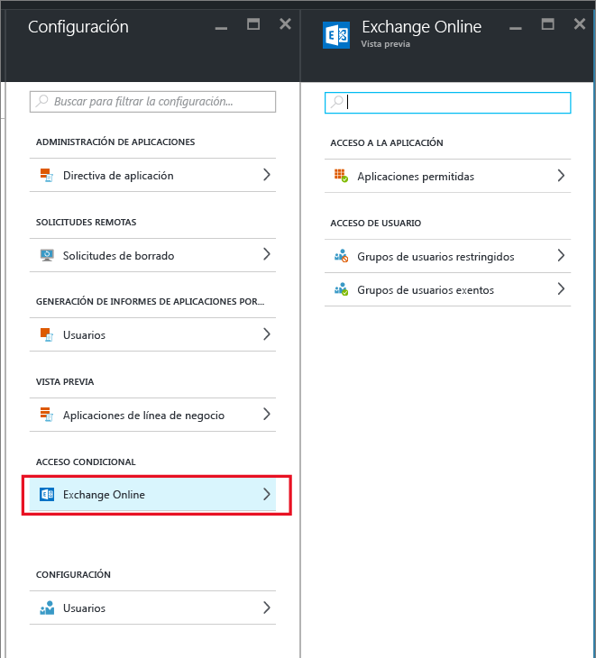
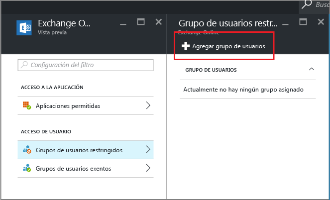

# Creación de un acceso condicional de Exchange Online para permitir solo las aplicaciones compatibles con MAM

[!INCLUDE[classic-portal](../includes/classic-portal.md)]

En este tema se indican instrucciones paso a paso sobre cómo configurar el acceso condicional para que Exchange Online solo permita aplicaciones móviles que admiten las directivas de administración de aplicaciones móviles (MAM) de Intune.

## Creación de una directiva de Exchange Online
1.  Inicie sesión en [Azure Portal](https://portal.azure.com) que incluye la característica de acceso de la aplicación. Si no está familiarizado con la experiencia de Azure Portal, consulte el tema [Azure Portal para directivas de MAM](azure-portal-for-microsoft-intune-mam-policies.md).

2.  Elija **Examinar > Intune > Hoja Administración de aplicaciones móviles de Intune > Configuración** y, en la sección de **acceso condicional**, elija **Exchange Online**.

  

3.  En la hoja **Aplicaciones permitidas**, elija la opción que **permite las aplicaciones que admiten las directivas de aplicación de Intune** para que solo las aplicaciones que sean compatibles con las directivas MAM de Intune tengan la capacidad de acceder a Exchange Online. Cuando se selecciona esta opción, se muestra la lista de aplicaciones admitidas.

  >[!NOTE]
  >Ningún cliente de correo de Exchange Active Sync, incluidos los clientes de correo electrónico integrados en iOS y Android que se conectan a Exchange Online, podrá enviar o recibir correo electrónico. En su lugar, los usuarios recibirán un solo correo electrónico que les informa que necesitan usar la aplicación de correo de Outlook. 
4.   Para aplicar esta directiva a los usuarios, abra la hoja **Grupos de usuarios restringidos** y elija **Agregar grupo de usuarios**. Seleccione uno o más grupos de usuarios a los que se aplicará esta directiva.

  

5.  Puede que algunos usuarios del grupo de usuarios seleccionado en el paso anterior no se vean afectados por esta directiva. En estos casos, agregue el grupo de usuarios a la lista de grupos de usuarios exentos. En la hoja **Exchange Online**, elija **Grupos de usuarios exentos**. Elija **Agregar grupo de usuarios** para abrir la lista de grupos de usuarios. Seleccione los grupos que desea excluir de la directiva.  

## Modificación de una directiva existente
### Adición o eliminación de grupos de usuarios

Para **eliminar un grupo de usuarios** de la lista **grupos de usuarios restringidos**, abra la hoja **Grupos de usuarios restringidos**, resalte el grupo de usuarios que desea eliminar y haga clic en el signo de **puntos suspensivos (...)** para ver la opción **Eliminar**. Elija **Eliminar** para quitar el grupo de usuarios de la lista. Puede seguir el mismo procedimiento para quitar un grupo de usuarios de la lista de **grupos de usuarios exentos**.

## Pasos siguientes
[Bloqueo de aplicaciones que no usan la autenticación moderna](block-apps-with-no-modern-authentication.md)
### Consulte también
[Proteger datos de aplicaciones mediante las directivas de MAM](protect-app-data-using-mobile-app-management-policies-with-microsoft-intune.md)

<!--HONumber=Dec16_HO2-->

